# 动态规划


## 0-1背包

### 仅考虑重量

对于一组不同重量、**不可分割**的物品，我们需要选择一些装入背包，在满足背包**最大重量限制**的前提下，背包中物品**总重量的最大值**是多少呢？

可以用回溯法穷举搜索所有可能的装法，然后找出满足条件的最大值。不过，回溯算法的复杂度比较高，是指数级别的。

假设背包的最大承载重量是9。有5个不同的物品，每个物品的重量分别是2，2，4，6，3。用递归树展示这个例子的回溯求解过程（`f(i, j)`：i表示第i个物品，j表示当前背包重量）：

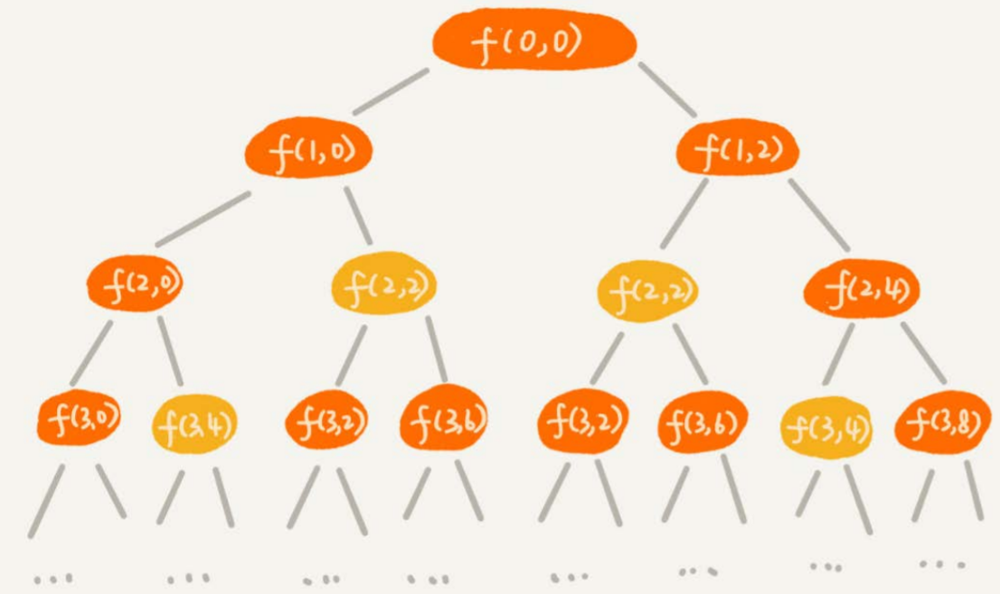

连接左右子树的边分别表示是否将第i个物品装入背包。比如，`(2, 2)`表示我们将要决策第2个物品是否装入背包，在决策前，背包中物品的总重量是2。

递归树中，有些子问题的求解是重复的，比如图中`f(2, 2)`和`f(3, 4)`都被重复计算了两次。可以将求解过程已计算出来的值保存起来，当再次计算到重复的子问题时，就可以直接使用之前计算的结果，避免冗余计算。

```
n := 5 // 物品个数
w := 9 // 背包最大承重
weight := []int{2, 2, 4, 6, 3}
maxW := math.MinInt32
cal := [5][10]bool // 记录是否已计算

func f(i, cw int) { // f(0, 0)
	if cw == w || i == n {
		if cw > maxW {
			maxW = cw
		}
		return
	}
	
	if cal[i][cw] {  // 重复状态
		return
	}
	cal[i][cw] = true
	f(i + 1, cw)
	if cw + weight[i] <= w {
		f(i + 1, cw + weight[i])
	}
}
```

上面这种方法已经避免了冗余计算，可以发现，每个物品有两种状态：放入或者不放入，可以利用动态规划的思想加速计算过程。

把整个求解过程分为n个阶段（n为物品数量），每个阶段会决策一个物品是否放到背包中。每个物品决策（放入或者不放入背包）完之后，背包中的物品的重量会有多种情况，也就是说，会达到多种不同的状态，对应到递归树中，就是有很多不同的节点。

我们把每一层重复的状态（节点）合并，只记录不同的状态，然后基于上一层的状态集合，来推导下一层的状态集合。我们可以通过合并每一层重复的状态，这样就**保证每一层不同状态的个数都不会超过w个**（w表示背包的承载重量）。于是，我们就成功避免了每层状态个数的指数级增长。

用一个二维数组`states[n][w+1]`，来记录每层可以达到的不同状态。第0个（下标从0开始编号）物品的重量是2，要么装入背包，要么不装入背包，决策完之后，会对应背包的两种状态，背包中物品的总重量是0或者2。我们用`states[0][0]=true`和`states[0][2]=true`来表示这两种状态。

第1个物品的重量也是2，基于之前的背包状态，在这个物品决策完之后，不同的状态有3个，背包中物品总重量分别是0(0+0)，2(0+2 or 2+0)，4(2+2)。我们用`states[1][0]=true，states[1][2]=true，states[1][4]=true`来表示这三种状态。

以此类推，直到考察完所有的物品后，整个`states`状态数组就都计算好了。下图中0表示false，1表示true。

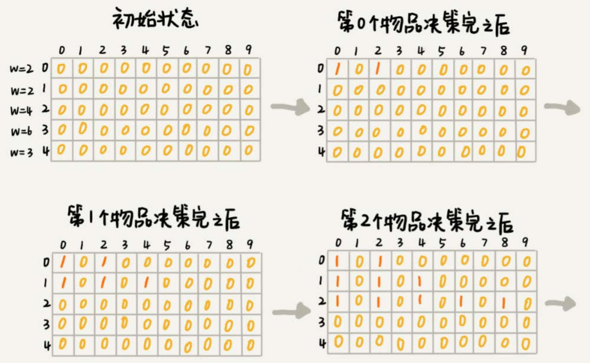

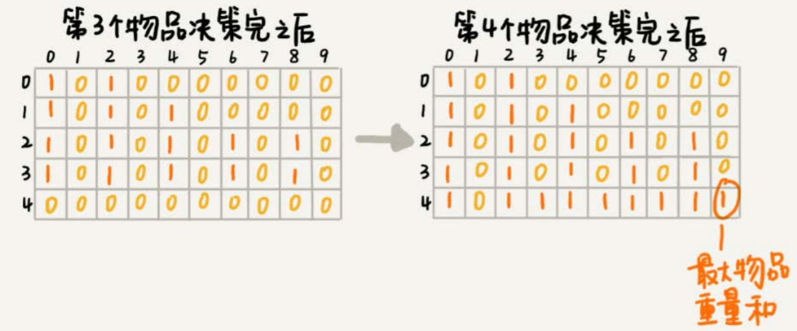

我们只需要在最后一层，找一个值为true的最接近w（这里是9）的值，就是背包中物品总重量的最大值。

```
// weight:物品重量，n:物品个数，w:背包可承载重量
func knapsack(weight []int, n, w int) int {
	states := make([][]bool, n)
	for i := range states {
		states[i] = make([]bool, w)
	}
	
	// 第一行的数据要特殊处理
	states[0][0] = true
	states[0][weight[0]] = true
	for i := 1; i < n; i++ {
		// 不考虑第i个物品
		for j := 0; j <= w; j++ {
			if states[i-1][j] {
				states[i][j] = true
			}
		}
		// 考虑第i个物品
		for j := w - weight[i]; j >= 0; j-- {
			if states[i-1][j] {
				states[i][j + weight[i]] = true
			}
		}
	}
	
	for i := w; i >= 0; i-- {
		if states[n-1][i] {
			return i
		}
	}
	
	return 0
}
```

这就是一种用动态规划解决问题的思路。我们把问题分解为多个阶段，每个阶段对应一个决策。我们**记录每一个阶段可达的状态集合**（去掉重复的），然后**通过当前阶段的状态集合，来推导下一个阶段的状态集合**，动态地往前推进。

用回溯算法解决这个问题的时间复杂度是$O(2^n)$，而动态规划中，耗时最多的部分就是代码中的两层for循环，所以时间复杂度是$O(n*w)$（n表示物品个数，w表示背包可以承载的总重量）。

实际上，上面的代码还可以继续优化，并不需要`n*w`的二维数组，只要用一个大小为`w`的一维数组记录可达状态就可以了。

```
// weight:物品重量，n:物品个数，w:背包可承载重量
func knapsack(weight []int, n, w int) int {
	states := [w]bool
	// 第一行的数据要特殊处理
	states[0] = true
	states[weight[0]] = true
	for i := 1; i < n; i++ {
		// 考虑第i个物品
		// j必须从大到下，否则会出现重复计算
		// 例如当前有一个重量为2的物品，states[1]为true时，states[3]为false
		// 如果从小到大，就会造成states[3]、states[5]都为true
		for j := w - weight[i]; j >= 0; j-- {
			if states[j] {
				states[j + weight[i]] = true
			}
		}
	}
	
	for i := w; i >= 0; i-- {
		if states[i] {
			return i
		}
	}
	
	return 0
}
```

如果要求出选中了哪些物品，也可以借助**二维的**`states`实现。

状态`(i, j)`只有可能从`(i-1, j)`或者`(i-1, j - weight[i])`两个状态推导过来。所以，我们就检查这两个状态是否是可达的，也就是`states[i-1][j]`或者`states[i-1][j - weight[i]]`是否是true。

如果`states[i-1][j]`可达，就说明我们没有选择购买第i个物品，如果`states[i-1][j - weight[i]]`可达，那就说明我们选择了购买第`i`个物品。我们从中选择一个可达的状态（如果两个都可达，就随意选择一个），然后，继续迭代地考察其他物品是否有选择。


### 考虑重量和价值

对于一组**不同重量、不同价值、不可分割**的物品，我们选择将某些物品装入背包，在满足**背包最大重量限制**的前提下，背包中**可装入物品的总价值最大**是多少呢？

先使用回溯算法解决：

```
n := 5 // 物品个数
w := 9 // 背包最大承重
weight := []int{2, 2, 4, 6, 3}
value := []int{3，4，8，9，6}
maxV := math.MinInt32

// i表示即将要决策第i个物品是否装入背包
// cw表示当前背包中物品的总重量
// cv表示当前背包中物品的总价值
func f(i, cw, cv int) { // f(0, 0, 0)
	if cw == w || i == n {
		if cv > maxV {
			maxV = cv
		}
		return
	}

	f(i + 1, cw, cv)
	if cw + weight[i] <= w {
		f(i + 1, cw + weight[i], cv + value[i])
	}
}
```

上面的回溯代码的递归树如下：

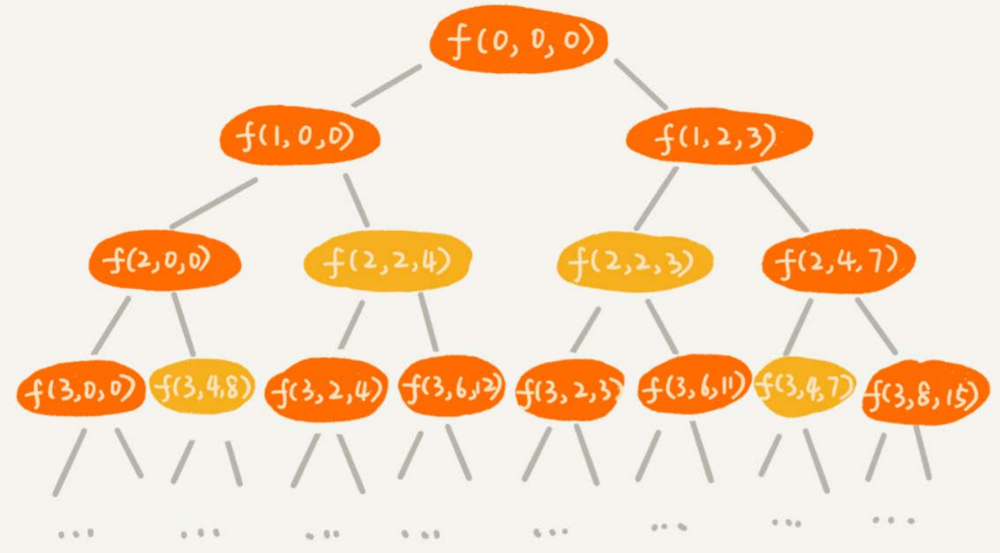

在递归树中，有几个节点的`i`和`cw`是完全相同的，比如`f(2,2,4)`和`f(2,2,3)`。在背包中物品总重量一样的情况下，`f(2,2,4)`这种状态对应的物品总价值更大，我们可以舍弃`f(2,2,3)`这种状态，只需要沿着`f(2,2,4)`这条决策路线继续往下决策就可以。

也就是说，对于`(i, cw)`相同的不同状态，那我们只需要保留cv值最大的那个，继续递归处理，其他状态不予考虑。

利用动态规划的思想，我们还是把整个求解过程分为n个阶段，每个阶段会决策一个物品是否放到背包中。每个阶段决策完之后，背包中的物品的总重量以及总价值，会有多种情况，也就是会达到多种不同的状态。

用一个二维数组`states[n][w+1]`，来记录每层可以达到的不同状态。不过这里数组存储的值不再是boolean类型的了，而是当前状态对应的最大总价值。我们把每一层中`(i, cw)`重复的状态（节点）合并，只记录`cv`值最大的那个状态，然后基于这些状态来推导下一层的状态。

```
func knapsack3(weight, value []int, n, w int) int {
	states := make([][]int, n)
	for i := range states {
		states[i] = make([]int, w + 1)
	}
	
	states[0][0] = 0
	states[0][weight[0]] = value[0]
	
	for i := 1; i < n; i++ {
		for j := 0; j <= w; j++ {
			if states[i-1][j] { // 不选择第i个物品
				states[i][j] = states[i-1][j]
			}
			
			// 选择第i个物品
			for j := 0; j <= w-weight[i]; j++ {
				v := states[i-1][j] + value[i]
				if v > states[i][j+weight[i]] {
					states[i][j+weight[i]] = v
				}
			}
		}
	}
	
	maxValue := -1
	for i := w; i >= 0; i-- {
		if states[n - 1][i] > maxValue {
			maxValue = states[n - 1][i]
		}
	}
	return maxValue
}
```

同样可以进行空间复杂度上的优化：

```
func knapsack3(weight, value []int, n, w int) int {
	states := make([]int, w + 1)
	states[0] = 0
	states[weight[0]] = value[0]
	
	for i := 1; i < n; i++ {
		// 选择第i个物品，使用一维数组时，一定要从大到小，从小到大的话，先计算的结果会影响到后面
		for j := w - weight[i]; j >= 0; j-- {
			v := states[j] + value[i]
			if v > states[j + weight[i]] {
				states[j + weight[i]] = v
			}
		}
	}
	
	maxValue := -1
	for i := w; i >= 0; i-- {
		if states[i] > maxValue {
			maxValue = states[i]
		}
	}
	return maxValue
}
```


## 一个模型三个特征

“一个模型”指的是动态规划适合解决的问题的模型，即“**多阶段决策最优解模型”**。

动态规划解决问题的过程，需要经历多个决策阶段。每个决策阶段都对应着一组状态。然后我们寻找一组决策序列，经过这组决策序列，能够产生最终期望求解的最优值。

“三个特征”：

- **最优子结构**：问题的最优解包含子问题的最优解。反过来说就是，我们**可以通过子问题的最优解，推导出问题的最优解**。如果我们把最优子结构，对应到前面定义的动态规划问题模型上，也可以理解为，后面阶段的状态可以通过前面阶段的状态推导出来。
- **无后效性**：无后效性有两层含义，第一层含义是，在推导后面阶段的状态的时候，我们**只关心前面阶段的状态值**，不关心这个状态是怎么一步一步推导出来的。第二层含义是，某阶段状态一旦确定，就不受之后阶段的决策影响。
- **重复子问题**：不同的决策序列，到达某个相同的阶段时，可能会产生重复的状态


### 例子

假设我们有一个`n X n`的矩阵`w[n][n]`。矩阵存储的都是正整数。棋子起始位置在左上角，终止位置在右下角。我们将棋子从左上角移动到右下角。每次只能向右或者向下移动一位。从左上角到右下角，会有很多不同的路径可以走。把每条路径经过的数字加起来看作路径的长度。那从左上角移动到右下角的**最短路径**长度是多少呢？

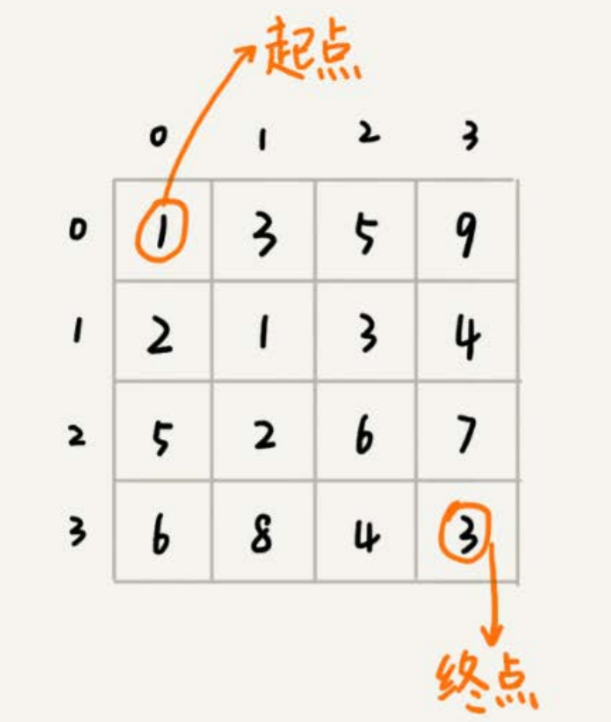

从`(0, 0)`走到`(n-1, n-1)`，总共要走`2*(n-1)`步，也就对应着`2*(n-1)`个阶段。**每个阶段都有向右走或者向下走两种决策，并且每个阶段都会对应一个状态集合。**

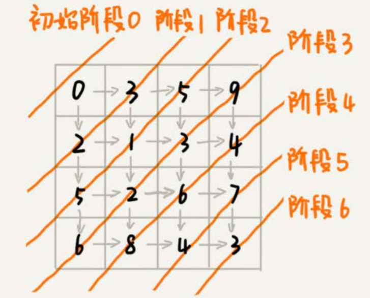

把状态定义为`min_dist(i, j)`，其中i表示行，j表示列。`min_dist`表达式的值表示从`(0, 0)`到达`(i, j)`的最短路径长度。所以，这个问题是一个多阶段决策最优解问题，符合动态规划的模型。

如果我们走到`(i, j)`这个位置，我们只能通过`(i-1, j)，(i, j-1)`这两个位置移动过来，也就是说，我们想要计算`(i, j)`位置对应的状态，只需要关心`(i-1, j)，(i, j-1)`两个位置对应的状态，并不关心棋子是通过什么样的路线到达这两个位置的。而且，我们仅仅允许往下和往右移动，不允许后退，所以，前面阶段的状态确定之后，不会被后面阶段的决策所改变，所以，这个问题符合“**无后效性**”这一特征。

因为我们只能往右或往下移动，所以，只有可能从`(i, j-1)`或者`(i-1, j)`两个位置到达`(i, j)`。也就是说，到达`(i, j)`的最短路径要么经过`(i, j - 1)`，要么经过`(i - 1, j)`，而且到达`(i, j)`的最短路径肯定包含到达这两个位置的最短路径之一。换句话说就是，`min_dist(i, j)`可以通过`min_dist(i, j-1)`和`min_dist(i-1, j)`两个状态推导出来。这就说明，这个问题符合“**最优子结构**”。

状态转移方程：`min_dist(i, j) = w[i][j] + min(min_dist(i, j-1), min_dist(i-1, j))`


### 解题思路

#### 状态转移表

一般能用动态规划解决的问题，都可以使用回溯算法的暴力搜索解决。所以，当我们拿到问题的时候，我们可以先用简单的回溯算法解决，然后定义状态，每个状态表示一个节点，然后对应画出递归树。从递归树中，我们很容易可以看出来，是否存在重复子问题，以及重复子问题是如何产生的。以此来寻找规律，看是否能用动态规划解决。

找到重复子问题之后，接下来，我们有两种处理思路：

- 直接用**回溯加“备忘录”**的方法，来避免重复子问题。从执行效率上来讲，这跟动态规划的解决思路没有差别
- 状态转移表法

先画出一个状态表。状态表一般都是二维的，所以可以把它想象成二维数组。其中，每个状态包含三个变量，**行、列、数组值**。根据决策的先后过程，从前往后，根据递推关系，分阶段填充状态表中的每个状态。最后，我们将这个递推填表的过程，翻译成代码，就是动态规划代码了。

尽管大部分状态表都是二维的，但是如果问题的状态比较复杂，需要很多变量来表示，那对应的状态表可能就是高维的，比如三维、四维。那这个时候，我们就不适合用状态转移表法来解决了。一方面是因为高维状态转移表不好画图表示，另一方面是因为人脑确实很不擅长思考高维的东西。

接下来先用回溯算法实现，再根据代码画递归树，以此来寻找重复子问题。

```
minDist = math.MinInt32
func minDistBT(n, i, j, dist int, w [][]int) { // minDistBT(n, 0, 0, 0, w)
	if i == n && j == n {
		if dist < minDist {
			minDist = dist
		}
		return
	}
	
	if i < n { // 往下走
		minDistBT(n, i + 1, j, dist + w[i][j], w)
	}
	if j < n { // 往右走
		minDistBT(n, i, j + 1, dist + w[i][j], w)
	}
}
```

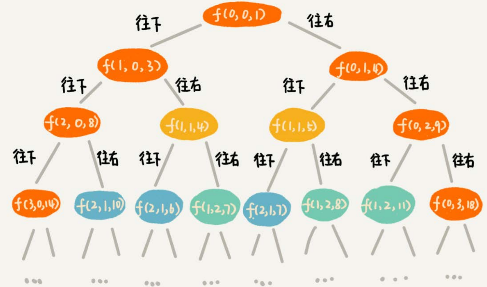

在递归树中，一个状态（也就是一个节点）包含三个变量`(i, j, dist)`，其中`i，j`分别表示行和列，`dist`表示从起点到达`(i, j)`的路径长度。从图中可以发现，尽管`(i, j, dist)`不存在重复的，但是`(i, j)`重复的有很多。**对于`(i, j)`重复的节点，我们只需要选择`dist`最小的节点**，继续递归求解，其他节点就可以舍弃了。

既然存在重复子问题，那就可以尝试是否可以用动态规划来解决。

先画出一个二维状态表，表中的行、列表示棋子所在的位置，表中的数值表示**从起点到这个位置的最短路径**。我们按照决策过程，通过不断状态递推演进，将状态表填好，下面按行填写。

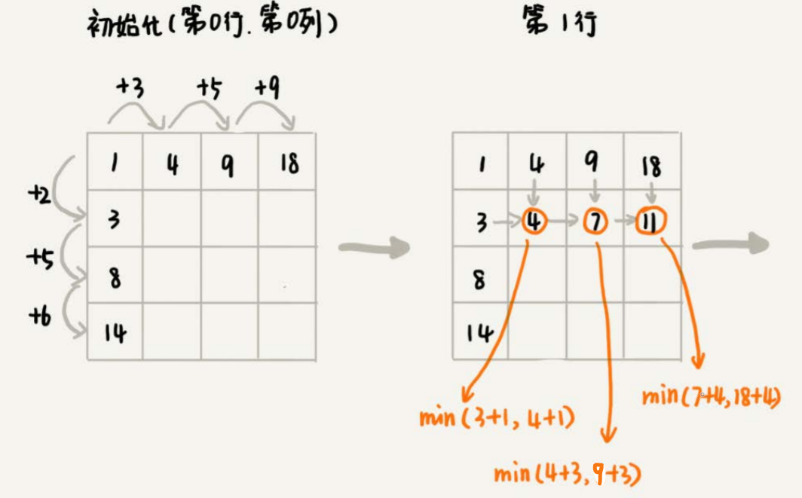

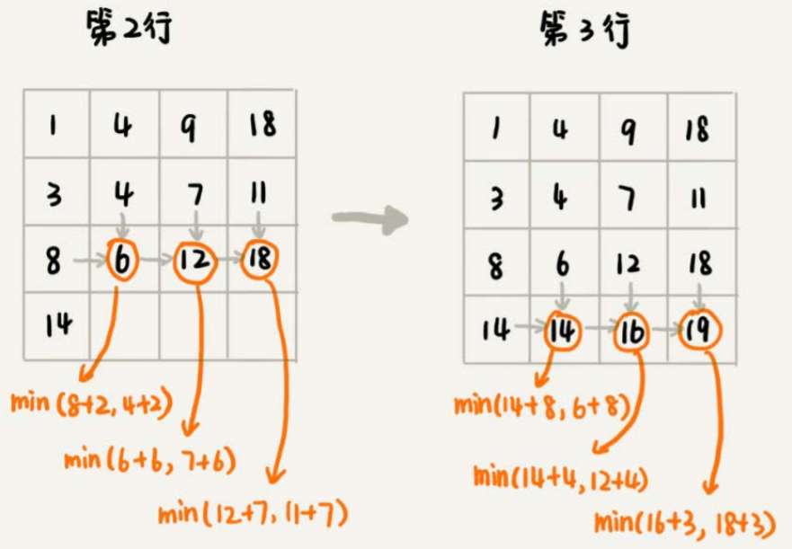

```
func minDistDP(matrix [][]int, n int) int {
	states := make([][]int, n)
	for i := range states {
		states[i] = make([]int, n)
	}
	
	sum := 0
	for i := 0; i < n; i++ { // 初始化第一行
		sum += states[0][i]
		states[0][i] = sum
	}
	
	sum := states[0][1]
	for i := 1; i < n; i++ { // 初始化第一列
		sum += states[i][0]
		states[i][0] = sum
	}
	
	for i := 1; i < n; i++ {
		for j := 1; j < n; j++ {
			min := states[i-1][j]
			if states[i][j-1] < min {
				min = states[i][j-1]
			}
			states[i][j] = matrix[i][j] + min
		}
	}
	return states[n-1][n-1]
}
```


#### 状态转移方程

状态转移方程法有点类似递归的解题思路。我们需要分析，某个问题**如何通过子问题来递归求解**，也就是所谓的**最优子结构**。根据最优子结构，写出递归公式，也就是所谓的状态转移方程。

一般情况下，有两种代码实现方法，一种是**递归加“备忘录”**，另一种是**迭代递推**。

`min_dist(i, j) = w[i][j] + min(min_dist(i, j-1), min_dist(i-1, j))`

递归加“备忘录”的方式：

```
matrix := [][]int{ {...}, {...}, ...}
n := 4
mem := make([][]int, n)
for i := range mem {
	mem[i] = make([]int, n)
}

func minDist(i, j int) { // minDist(n - 1, n - 1)
	if i == 0 && j == 0 {
		return matrix[0][0]
	}
	if mem[i][j] > 0 {
		return mem[i][j]
	}
	
	minLeft := math.MaxInt32
	if j > 0 {
		minLeft = minDist(i, j - 1)
	}
	
	minUp := math.MaxInt32
	if i > 0 {
		minUp = minDist(i - 1, j)
	}
	
	min := minLeft
	if minUp < min {
		min = minUp
	}
	mem[i][j] := matrix[i][j] + min
	return mem[i][j]
}
```


## 贪心、分治、回溯、动态规划的比较

贪心、回溯、动态规划可以归为一类，而分治单独可以作为一类，因为它跟其他三个都不大一样。前三个算法解决问题的模型，都可以抽象成多阶段决策最优解模型，而分治算法解决的问题尽管大部分也是最优解问题，但是，大部分都不能抽象成多阶段决策模型。

回溯算法是个“万金油”。基本上能用的动态规划、贪心解决的问题，都可以用回溯算法解决。**回溯算法相当于穷举搜索。**穷举所有的情况，然后对比得到最优解。不过，**回溯算法的时间复杂度非常高，是指数级别的**，只能用来解决小规模数据的问题。对于大规模数据的问题，用回溯算法解决的执行效率就很低了。

尽管动态规划比回溯算法高效，但是，并不是所有问题，都可以用动态规划来解决。能用动态规划解决的问题，需要满足三个特征，**最优子结构、无后效性和重复子问题**。在重复子问题这一点上，动态规划和分治算法的区分非常明显。**分治算法要求分割成的子问题，不能有重复子问题，而动态规划正好相反，动态规划之所以高效，就是因为回溯算法实现中存在大量的重复子问题。**

贪心算法实际上是动态规划算法的一种特殊情况。它解决问题起来更加高效，代码实现也更加简洁。不过，它可以解决的问题也更加有限。它能解决的问题需要满足三个条件，最优子结构、无后效性和贪心选择性。其中，最优子结构、无后效性跟动态规划中的无异。“贪心选择性”的意思是，通过局部最优的选择，能产生全局的最优选择。每一个阶段，我们都选择当前看起来最优的决策，所有阶段的决策完成之后，最终由这些局部最优解构成全局最优解。


## 找零问题

假设我们有几种不同币值的硬币`v1，v2，……，vn`（单位是元）。如果我们要支付`w`元，求**最少**需要多少个硬币。比如，我们有3种不同的硬币，1元、3元、5元，我们要支付9元，最少需要3个硬币（3个3元的硬币）。

```
func f(values []int, w int) int {
	states := make([]bool, w + 1)
	states[0] = true
	types := len(values)
	
	i := 0 // 记录硬币数量
	for {
		i++
		change := false // 是否有改变，可用于判断是否能实现找零
		for k := w; k >= 0; k-- {
			if states[k] {
                for j := range values {
					if k + values[j] <= w && !states[k + values[j]] {
						change = true
						states[k + values[j]] = true
					}
                }
			}
		}

		if states[w] {
			return i
		}
		
		if !change { // 无法实现找零，退出防止死循环
			return -1
		}
	}
}
```


## 字符串距离

计算字符串间的距离可以用于搜索引擎中的拼写纠错，比较著名的编辑距离有有莱文斯坦距离（Levenshtein distance）和最长公共子串长度（Longest common substring length）。其中，莱文斯坦距离允许**增加、删除、替换字符**这三个编辑操作，最长公共子串长度只允许**增加、删除字符**这两个编辑操作。

莱文斯坦距离和最长公共子串长度，从两个截然相反的角度，分析字符串的相似程度。莱文斯坦距离的大小，表示两个字符串差异的大小；而最长公共子串的大小，表示两个字符串相似程度的大小。

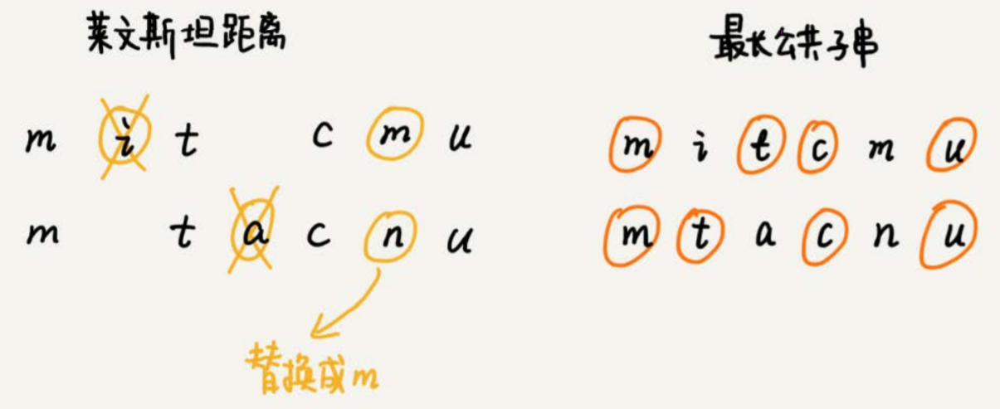


### 莱文斯坦距离

要求把一个字符串变成另一个字符串，需要的最少编辑次数。整个求解过程，涉及多个决策阶段，我们需要依次考察一个字符串中的每个字符，跟另一个字符串中的字符是否匹配，匹配的话如何处理，不匹配的话又如何处理。所以，这个问题符合多阶段决策最优解模型。

先看看回溯算法的处理过程，如果`a[i]`与`b[j]`匹配，我们递归考察`a[i+1]`和`b[j+1]`。如果`a[i]`与`b[j]`不匹配，那我们有多种处理方式可选：

- 可以删除`a[i]`，然后递归考察`a[i+1]`和`b[j]`
- 可以删除`b[j]`，然后递归考察`a[i]`和`b[j+1]`
- 可以在`a[i]`前面添加一个跟`b[j]`相同的字符，然后递归考察`a[i]`和`b[j+1]`
- 可以在`b[j]`前面添加一个跟`a[i]`相同的字符，然后递归考察`a[i+1]`和`b[j]`
- 可以将`a[i]`替换成`b[j]`，或者将`b[j]`替换成`a[i]`，然后递归考察`a[i+1]`和`b[j+1]`

```
a := "mitcmu"
n := 6 // len(a)
b := "mtacnu"
m := 6 // len(b)
minDist := math.MaxInt32
func lwstBT(i, j, dist int) {
	if i == n || j == m {
		if i < n {
			dist += n - i
		}
		if j < m {
			dist += m - j
		}
		if dist < minDist {
			minDist = dist
		}
		return
	}
	
	if a[i] == b[j] {
		lwstBT(i + 1, j + 1, dist)
	} else {
		lwstBT(i + 1, j, dist + 1) // 删除a[i]或b[j]前添加a[i]
		lwstBT(i, j + 1, dist + 1)
		lwstBT(i + 1, j + 1, dist + 1) // 替换为相同字符
	}
}
```

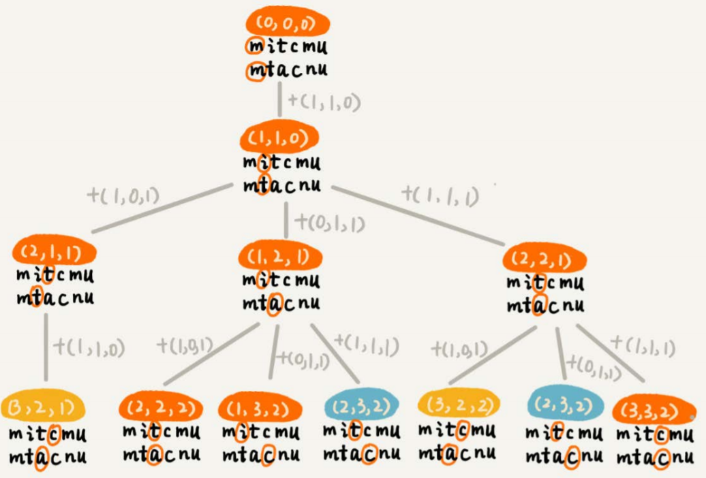

如果不存在重复子问题，那回溯就是最好的解决方法。

在递归树中，每个节点代表一个状态，状态包含三个变量`(i, j, edist)`，其中，`edist`表示处理到`a[i]`和`b[j]`时，已经执行的编辑操作的次数。

在递归树中，`(i, j)`两个变量重复的节点很多，比如`(3, 2)`和`(2, 3)`。**对于`(i, j)`相同的节点，我们只需要保留`edist`最小的**，继续递归处理就可以了，剩下的节点都可以舍弃。所以，状态就从`(i, j, edist)`变成了`(i, j, min_edist)`，其中`min_edist`表示处理到`a[i]`和`b[j]`，已经执行的最少编辑次数。

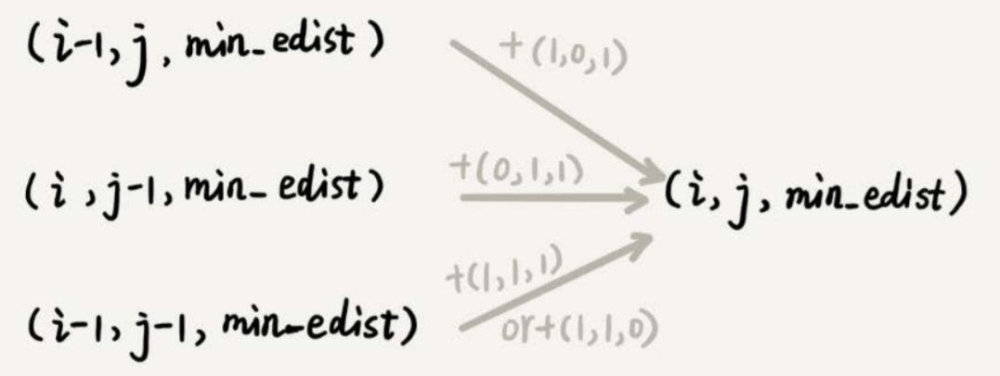

基于上述，可以得出状态转移方程：

- 如果：`a[i] != b[j]`，那么`min_edist(i, j)`就等于：
  `min(min_edist(i-1, j)+1, min_edist(i, j-1)+1, min_edist(i-1, j-1)+1)`
- 如果：`a[i] == b[j]`，那么`min_edist(i, j)`就等于：
  `min(min_edist(i-1, j)+1, min_edist(i, j-1)+1，min_edist(i-1, j-1))`

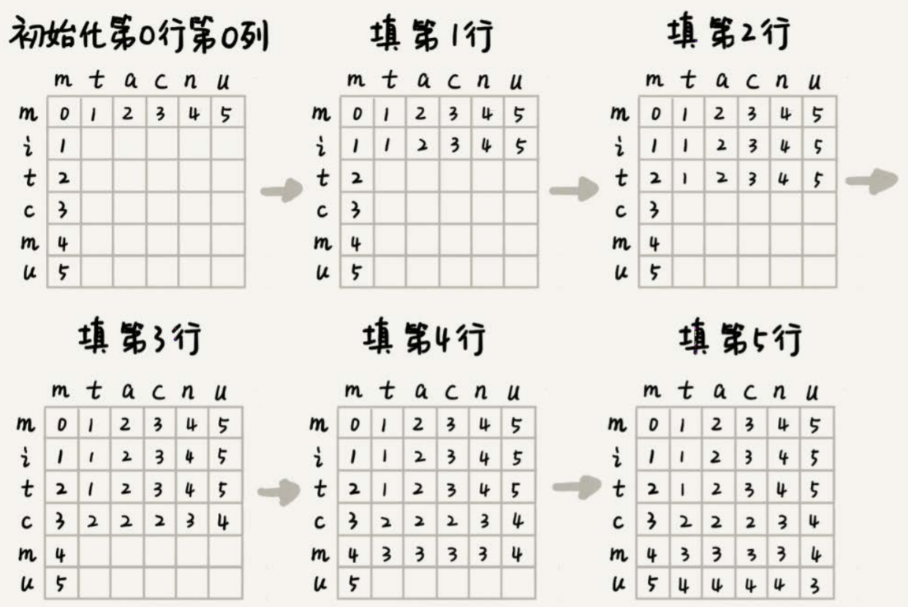

```
func lwstDP(a string, b string) int {
	n := len(a)
	m := len(b)
	minDist := make([][]int, n)
	for i := range minDist {
		minDist[i] = make([]int, m)
	}
	
	for i := 0; i < m; i++ { // 初始化a[0]与b[0...i]的编辑距离
		if a[0] == b[i] {
			minDist[0][i] = i
		} else if i > 0 {
			minDist[0][i] = minDist[0][i-1] + 1
		} else {
			minDist[0][0] = 1
		}
	}
	
	for i := 0; i < n; i++ { // 初始化b[0]与a[0...i]的编辑距离
		if b[0] == a[i] {
			minDist[i][0] = i
		} else if i > 0 {
			minDist[i][0] = minDist[i-1][0] + 1
		} else {
			minDist[0][0] = 1
		}
	}
	
	for i := 1; i < n; i++ { // 按行填表
		for j := 1; j < m; j++ {
			if a[i] == b[j] {
				minDist[i][j] = min(minDist[i-1][j-1], minDist[i][j-1] + 1, minDist[i-1][j] + 1)
			} else {
				minDist[i][j] = min(minDist[i-1][j-1] + 1, minDist[i][j-1] + 1, minDist[i-1][j] + 1)
			}
		}
	}
	return minDist[n-1][m-1]
}

func min(x, y, z int) int {
	min := x
	if y < min {
		min = y
	}
	if z < min {
		min = z
	}
	return min
}
```


### 最长公共子串长度

最长公共子串作为编辑距离中的一种，只允许增加、删除字符两种编辑操作。从本质上来说，它表征的也是两个字符串之间的**相似程度**。

每个状态还是包括三个变量`(i, j, max_lcs)`，`max_lcs`表示`a[0…i]`和`b[0…j]`的最长公共子串长度。通过回溯看看`(i, j)`这个状态可以由哪些状态转移过来：

从`a[0]`和`b[0]`开始，依次考察两个字符串中的字符是否匹配

- 如果`a[i]`与`b[j]`互相匹配，将最大公共子串长度加一，并且继续考察`a[i+1]`和`b[j+1]`
- 如果`a[i]`与`b[j]`不匹配，最长公共子串长度不变，这个时候，有两个不同的决策路线
  - 删除`a[i]`，或者在`b[j]`前面加上一个字符`a[i]`，然后继续考察`a[i+1]`和`b[j]`
  - 删除`b[j]`，或者在`a[i]`前面加上一个字符`b[j]`，然后继续考察`a[i]`和`b[j+1]`

也就是说，如果我们要求`a[0…i]`和`b[0…j]`的最长公共长度`max_lcs(i, j)`，我们只有可能通过下面三个状态转移过来：

- `(i-1, j-1, max_lcs)`，其中`max_lcs`表示`a[0…i-1]`和`b[0…j-1]`的最长公共子串长度
- `(i-1, j, max_lcs)`，其中`max_lcs`表示`a[0…i-1]`和`b[0…j]`的最长公共子串长度
- `(i, j-1, max_lcs)`，其中`max_lcs`表示`a[0…i]`和`b[0…j-1]`的最长公共子串长度

因此可以得到状态转移方程：

- 如果：`a[i] == b[j]`，那么：`max_lcs(i, j)`就等于：
  `max(max_lcs(i-1, j-1) + 1, max_lcs(i-1, j), max_lcs(i, j-1))`
- 如果：`a[i] != b[j]`，那么：`max_lcs(i, j)`就等于：
  `max(max_lcs(i-1, j-1), max_lcs(i-1, j), max_lcs(i, j-1))`

```
func lcs(a, b string) int {
	n := len(a)
	m := len(b)
	maxlcs := make([][]int, n)
	for i := range maxlcs {
		maxlcs[i] = make([]int, m)
	}
	
	for i := 0; i < m; i++ { // a[0] b[0...i]
		if a[0] == b[i] {
			maxlcs[0][i] = 1
		} else if i != 0 {
			maxlcs[0][i] = maxlcs[0][i-1]
		} else {
			maxlcs[0][0] = 0
		}
	}
	
	for i := 0; i < n; i++ { // a[0...n] b[0]
		if b[0] == a[i] {
			maxlcs[i][0] = 1
		} else if i != 0 {
			maxlcs[i][0] = maxlcs[i-1][0]
		} else {
			maxlcs[0][0] = 0
		}
	}
	
	for i := 1; i < n; i++ {
		for j := 1; j < m; j++ {
			if a[i] == b[j] {
				maxlcs[i][j] = max(maxlcs[i-1][j-1] + 1, maxlcs[i-1][j], maxlcs[i][j-1])
			} else {
				maxlcs[i][j] = max(maxlcs[i-1][j-1], maxlcs[i-1][j], maxlcs[i][j-1])
			}
		}
	}
	
	return maxlcs[n-1][m-1]
}

func max(x, y, z int) int {
	max := x
	if y > max {
		max = y
	}
	if z > max {
		max = z
	}
	return max
}
```


## 最长递增子序列

有一个数字序列包含n个不同的数字，如何求出这个序列中的最长递增子序列长度？比如2, 9, 3, 6, 5, 1, 7这样一组数字序列，它的最长递增子序列就是2, 3, 5, 7，所以最长递增子序列的长度是4。

先用回溯算法实现：

```
maxLen := math.MinInt32
nums := []int{2, 9, 3, 6, 5, 1, 7}
n := len(nums)
// curLen：已选数字序列的长度
// last：上一个选择的数字的值
func longestAscBT(i, curLen, last int) { // longestAscBT(0, 0, math.MinInt32)
	if i == n {
		if curLen > maxLen {
			maxLen = curLen
		}
		return
	}
	
	longestAscBT(i + 1, curLen, last) // 不选择
	if nums[i] > last {
		longestAscBT(i + 1, curLen + 1, nums[i])
	}
}
```

`a[0...i]` 的最长子序列为的长度是：` a[i] `之前所有比它小的元素中子序列长度最大的 + 1

```
func longestAsc(nums []int) int {
	size := len(nums)
	if size == 0 {
		return 0
	}
	
	states := make([]int, size)
	for i := range states {
		states[i] = 1
	}
	
	for i := 1; i < size; i++ {
		for j := i - 1; j >= 0; j-- {
			if nums[i] > nums[j] && states[i] < states[j] + 1 {
				states[i] = states[j] + 1
			}
		}
	}
	return states[size - 1]
}
```

