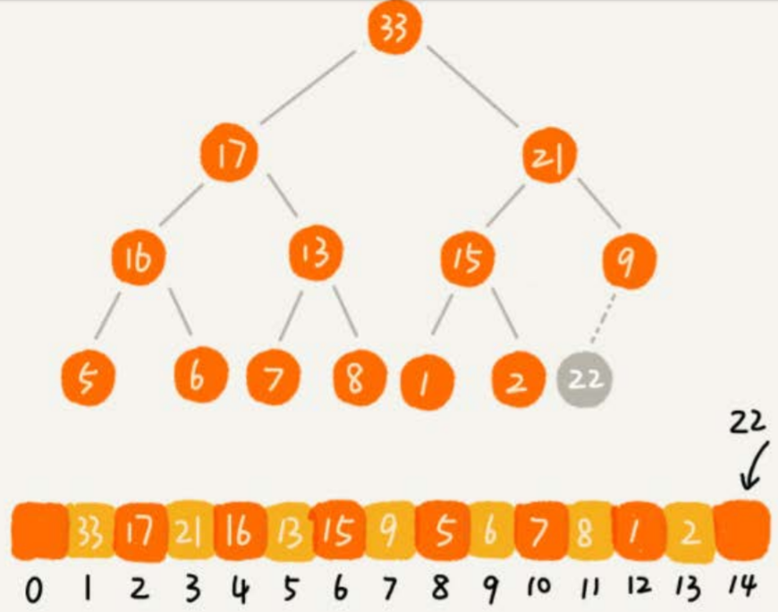

# 堆

## 定义

- 堆是一个**完全二叉树**
- 堆中每一个节点的值都必须大于等于（或小于等于）其子树中每个节点的值，或者说，堆中每个节点的值都大于等于（或者小于等于）其左右子节点的值。
  - **大顶堆**：每个节点的值都**大于等于**子树中每个节点值的堆
  - **小顶堆**：每个节点的值都**小于等于**子树中每个节点值的堆


上图中，1、2是大顶堆，3是小顶堆，4不是堆（不是完全二叉树）。


## 实现

完全二叉树适合用数组来存储，不仅可以节省存储空间，还可以快速地访问子节点或父节点。


### 插入元素

往堆中插入一个元素后，需要继续满足堆的两个特性。

所以，我们可以先把新插入的元素放到堆的最后，然后判断是否符合堆的特性。如果不符合，就进行调整，使其重新满足堆的特性，这个操作称为**堆化**（heapify）。

堆化有两种实现，从下往上和从上往下。以从下往上为例，往堆中插入22时，顺着节点所在的路径，向上对比，如果不满足子节点小于等于父节点的大小关系，就交换两个节点，一直重复该过程，直到父子节点间满足大小关系。




```
type Heap struct {
	Data []int	// 从下标1开始存储数据
	Count int	// 已存储元素个数
	Capacity int	// 堆中可以存储的最大元素个数
}

func NewHeap(capacity int) *Heap {
	return &Heap{
		Data: make([]int, capacity + 1),
		Count: 0,
		Capacity: capacity,
	}
}

func(this *Heap) Insert(data int) {
	if this.Count >= this.Capacity {
		return
	}
	
	this.Count++
	this.Data[this.Count] = data
	for i := this.Count; i/2 > 0 && this.Data[i] > this.Data[i/2]; {
		this.Data[i], this.Data[i/2] = this.Data[i/2], this.Data[i]
		i /= 2
	}
}
```


### 删除堆顶元素

堆顶元素存储的就是堆中数据的最大值或者最小值。

假设我们构造的是大顶堆，堆顶元素就是最大的元素。如果我们直接删除堆顶元素，之后就需要把第二大的元素放到堆顶，那第二大元素肯定会出现在左右子节点中。然后我们再迭代地删除第二大节点，以此类推，直到叶子节点被删除。


这种操作有个问题，堆化出来的堆并不满足完全二叉树的特性。

我们可以把最后一个元素放到堆顶，然后再从上往下进行堆化，就可以解决这个问题了。


```
func(this *Heap) RemoveMax() {
	if this.Count == 0 {
		return
	}
	this.Data[1] = this.Data[this.Count]
	this.Count--
	this.heapify(1);
}

// i：对哪个下标的元素 从上到下堆化
func(this *Heap) heapify(i int) {
	for {
		maxPos := i	// 记录当前元素与其左右子节点中最大值 下标
		if i*2 <= this.Count && this.Data[i] < this.Data[i*2] {
			maxPos = i * 2
		}
		if i*2 + 1 <= this.Count && this.Data[maxPos] < this.Data[i*2 + 1] {
			maxPos = i * 2 + 1
		}
		if maxPos == i {
			return
		}
		
		this.Data[i], this.Data[maxPos] = this.Data[maxPos], this.Data[i]
		i = maxPos
	}
}
```


## 堆排序

时间复杂度是$O(n\log n)$，同时是**原地排序**算法，但**不是稳定排序**。堆排序的过程大致分解为两个步骤，建堆和排序。

### 建堆

将数组**原地**建成一个堆，有两种方法：

- 借助往堆中插入元素的思路，一开始堆中只有1个元素，即下标为1的元素。然后借助插入操作，将下标从$2$到$n$的数据依次插入到堆中。从前往后处理数组数据，从下往上堆化。
- 从后往前处理数组，每个数据从上往下堆化。从（从后往前）第一个非叶子节点开始，与其子节点比较。


```
// data切片从下标为1开始存储数据
func(this *Heap) BuildHeap() {
	for i := this.Count / 2; i > 0; i-- { // 最后一个节点坐标/2 即第一个非叶子节点
		this.heapify(i)
	} 
}
```


#### 时间复杂度

每个节点堆化的时间复杂度是$O(\log n)$，那$\frac{n}{2}$个节点堆化的总时间复杂度是不是就是$O(n\log n)$呢？

实际上，堆排序的建堆过程的时间复杂度是$O(n)$。

因为叶子节点不需要堆化，所以需要堆化的节点从倒数第二层开始。每个节点堆化的过程中，需要比较和交换的节点个数，跟这个节点的高度$k$成正比。每一层的节点个数和对应的高度如下：


可以得到$$S_1 = 1* h + 2^1*(h-1) + 2^2*(h-2)+……+2^{h-1} * 1$$

把公式左右都乘以$2$，就得到另一个公式$S_2$，将$S_2$错位对齐，并且用$S_2$减去$S_1$，可以得到$S$。


$$S=-h+(2^h-2)+2^h=2^{h+1}-h-2$$

因为$h=\log_{2}n$，代入公式$S$，就能得到$S=O(n)$，所以，建堆的时间复杂度就是$O(n)$。


### 排序

建堆结束之后，数组中的数据已经是按照大顶堆的特性来组织的。数组中的第一个元素就是堆顶，也就是最大的元素。我们把它跟最后一个元素交换，那最大元素就放到了下标为$n$的位置。

这个过程有点类似上面讲的“删除堆顶元素”的操作，当堆顶元素移除之后，我们把下标为$n$的元素放到堆顶，然后再通过堆化的方法，将剩下的$n-1$个元素重新构建成堆。堆化完成之后，我们再取堆顶的元素，放到下标是$n-1$的位置，一直重复这个过程，直到最后堆中只剩下标为$1$的一个元素，排序工作就完成了。


```
func (this *Heap) Sort() {
	this.BuildHeap()
	for count > 1 {
		data[1], data[count] = data[count], data[1]
		this.Count--	// 对剩下元素堆化
		this.heapify(1)
	}
}
```

堆排序包括建堆和排序两个操作，建堆过程的时间复杂度是$O(n)$，排序过程的时间复杂度是$O(n\log n)$，所以，堆排序整体的时间复杂度是$O(n\log n)$。

堆排序不是稳定的排序算法，因为在排序的过程，存在将堆的最后一个节点跟堆顶节点互换的操作，所以就有可能改变值相同数据的原始相对顺序。


### 性能没有快排好

- 堆排序数据访问的方式没有快速排序友好。对于快速排序来说，数据是顺序访问的。而对于堆排序来说，数据是跳着访问的，对CPU缓存不友好。

- 对于同样的数据，在排序过程中，堆排序算法的数据交换次数要多于快速排序。

  堆排序的第一步是建堆，建堆的过程会打乱数据原有的相对先后顺序，导致原数据的有序度降低。比如，对于一组已经有序的数据来说，经过建堆之后，数据反而变得更无序了。

  

  可以用一个记录交换次数的变量，在代码中，每次交换的时候，就对这个变量加一，然后比较两种排序的交换次数。


## 优先级队列

在优先级队列中，数据的出队顺序不是先进先出，而是按照优先级来，优先级最高的，最先出队。

用堆来实现优先级队列是最直接、最高效的。往优先级队列中插入一个元素，就相当于往堆中插入一个元素；从优先级队列中取出优先级最高的元素，就相当于取出堆顶元素。

### 合并有序小文件

假设我们有100个小文件，每个文件的大小是100MB，每个文件中存储的都是有序的字符串。我们希望将这些100个小文件合并成一个有序的大文件。

每次从这100个文件中，各取第一个字符串，比较大小，取最小的字符串放入合并后的大文件中，然后从该字符串所属小文件再取一个字符串进行下一轮比较。

如果将各个文件的字符串用数组存储，则每次从数组中取最小字符串，都需要循环遍历整个数组，效率不高。

如果使用优先级队列，也就是堆，将从小文件中取出来的字符串放入到小顶堆中，堆顶的元素就是优先级队列队首的元素，就是最小的字符串。我们将这个字符串放入到大文件中，并将其从堆中删除。然后再从小文件中取出下一个字符串，放入到堆中。循环这个过程，就可以将100个小文件中的数据依次放入到大文件中。

删除堆顶数据和往堆中插入数据的时间复杂度都是$O(logn)$，n表示堆中的数据个数，这里就是100。也可以直接取一个新的字符串替换堆顶元素，并进行从上往下的堆化。


### 定时器

假设我们有一个定时器，定时器中维护了很多定时任务，每个任务都设定了一个要触发执行的时间点。定时器每过一个很小的单位时间（比如1秒），就扫描一遍任务，看是否有任务到达设定的执行时间。如果到达了，就拿出来执行。

这种每过1秒就扫描一遍任务列表的做法比较低效，主要原因有两点：

- 任务的约定执行时间离当前时间可能还有很久，这样前面很多次扫描其实都是徒劳的
- 每次都要扫描整个任务列表，如果任务列表很大的话，势必会比较耗时

可以用优先级队列存储这些任务，队列首部（也就是小顶堆的堆顶）存储的是最先执行的任务。

这样，定时器就不需要每隔1秒就扫描一遍任务列表了。它拿队首任务的执行时间点，与当前时间点相减，得到一个时间间隔T。这个时间间隔T就是，从当前时间开始，需要等待多久，才会有第一个任务需要被执行。这样，定时器就可以设定在T秒之后，再来执行任务。从当前时间点到（T-1）秒这段时间里，定时器都不需要做任何事情。假设不会动态添加新的定时任务。

当T秒时间过去之后，定时器取优先级队列中队首的任务执行。然后再计算新的队首任务的执行时间点与当前时间点的差值，把这个值作为定时器执行下一个任务需要等待的时间。

这样，定时器既不用间隔1秒就轮询一次（不会动态添加新的定时任务的前提下），也不用遍历整个任务列表，性能也就提高了。


## Top K

针对**静态数据集合**，即数据集合事先确定，不会再变。维护一个大小为K的**小顶堆**，顺序遍历数组，从数组中取出取数据与堆顶元素比较。如果比堆顶元素大，我们就把堆顶元素删除，并且将这个元素插入到堆中；如果比堆顶元素小，则不做处理，继续遍历数组。这样等数组中的数据都遍历完之后，堆中的数据就是前K大数据了。

遍历数组需要$O(n)$的时间复杂度，一次堆化操作需要$O(logK)$的时间复杂度，所以最坏情况下，n个元素都入堆一次，所以时间复杂度就是$O(nlogK)$。

针对**动态数据集合**，即数据集合事先并不确定，有数据动态地加入到集合中。可以用静态数据集合相同的做法。


### 例子

假设有一个包含10亿个搜索关键词的日志文件，如何快速获取到Top10最热门的搜索关键词呢？

**处理的场景限定为单机，可以使用的内存为1GB。**


因为用户搜索的关键词，有很多可能都是重复的，所以我们首先要统计每个搜索关键词出现的频率，可以通过散列表记录关键词及其出现的次数。

以关键字为key，出现次数为value扫描所有关键词并添加到散列表中。然后建立一个大小为10的**小顶堆**，遍历散列表，依次取出每个搜索关键词及对应出现的次数，然后与堆顶的搜索关键词对比。如果出现次数比堆顶搜索关键词的次数多，那就删除堆顶的关键词，将这个出现次数更多的关键词加入到堆中。

以此类推，当遍历完整个散列表中的搜索关键词之后，堆中的搜索关键词就是出现次数最多的Top 10搜索关键词了。

但是这种思路占用的内存可能不止1GB，假设10亿条搜索关键词中不重复的有1亿条，如果每个搜索关键词的平均长度是50个字节，那存储1亿个关键词起码需要5GB的内存空间，而散列表因为要避免频繁冲突，不会选择太大的装载因子，所以消耗的内存空间就更多了。

可以借助分片的思路，创建10个空文件00，01，02，……，09。遍历这10亿个关键词，并且通过某个哈希算法对其求哈希值并与10取模，得到的结果就是这个搜索关键词应该被分到的文件编号。

对这10亿个关键词分片之后，每个文件平均只有1亿的关键词，去除掉重复的，可能就只有1000万个，每个关键词平均50个字节，所以总的大小就是500MB。1GB的内存完全可以放得下。

针对每个包含1亿条搜索关键词的文件，利用散列表和堆，分别求出Top 10，然后把这10个Top 10放在一块，然后取这100个关键词中，出现次数最多的10个关键词，这就是这10亿数据中的Top 10最频繁的搜索关键词了。


## 中位数

如果数据的个数是奇数，把数据从小到大排列，那第$\frac{n}{2}+1$个数据就是中位数；如果数据的个数是偶数的话，那处于中间位置的数据有两个，第$\frac{n}{2}$个和第$\frac{n}{2}+1$个数据，这个时候，我们可以随意取一个作为中位数，比如取两个数中靠前的那个，就是第$\frac{n}{2}$个数据。

对于一组**静态数据**，中位数是固定的，我们可以先排序，第$\frac{n}{2}$个数据就是中位数。每次询问中位数的时候，我们直接返回这个固定的值就好了。所以，尽管排序的代价比较大，但是边际成本会很小。

但是，如果我们面对的是**动态数据集合**，中位数在不停地变动，如果再用先排序的方法，每次询问中位数的时候，都要先进行排序，那效率就不高了。

可以维护两个堆，一个大顶堆，一个小顶堆。**大顶堆中存储前半部分数据，小顶堆中存储后半部分数据，且小顶堆中的数据都大于大顶堆中的数据。**

也就是说，如果有n个数据，n是偶数，我们从小到大排序，那前$\frac{n}{2}$个数据存储在大顶堆中，后$\frac{n}{2}$个数据存储在小顶堆中。这样，大顶堆中的堆顶元素就是我们要找的中位数。如果n是奇数，情况是类似的，大顶堆就存储$\frac{n}{2}+1$个数据，小顶堆中就存储$\frac{n}{2}$个数据。


当新添加一个数据的时候，要如何调整两个堆，让大顶堆中的堆顶元素继续是中位数呢？

- 如果新加入的数据小于等于大顶堆的堆顶元素，就将这个新数据插入到大顶堆
- 否则，就将这个新数据插入到小顶堆

这个时候就有可能出现，两个堆中的数据个数不符合前面约定的情况：如果n是偶数，两个堆中的数据个数都是$\frac{n}{2}$；如果n是奇数，大顶堆有$\frac{n}{2}+1$个数据，小顶堆有$\frac{n}{2}$个数据。

这个时候，我们可以从一个堆中不停地将堆顶元素移动到另一个堆，通过这样的调整，来让两个堆中的数据满足上面的约定。


插入数据因为需要涉及堆化，所以时间复杂度变成了$O(logn)$，但是求中位数我们只需要返回大顶堆的堆顶元素就可以了，所以时间复杂度就是$O(1)$。


求出其他百分位的数据的原理也是类似的，例如求99%分位。

维护两个堆，一个大顶堆，一个小顶堆。假设当前总数据的个数是n，大顶堆中保存$n*99\%$个数据，小顶堆中保存$n*1\%$个数据。大顶堆堆顶的数据就是我们要找的99%分位数。

每次插入一个数据的时候，我们要判断这个数据跟大顶堆和小顶堆**堆顶数据**的大小关系，然后决定插入到哪个堆中。如果这个新插入的数据比大顶堆的堆顶数据小，那就插入大顶堆；如果这个新插入的数据比小顶堆的堆顶数据大，那就插入小顶堆。

为了保持大顶堆中的数据占99%，小顶堆中的数据占1%，在每次新插入数据之后，我们都要重新计算，这个时候大顶堆和小顶堆中的数据个数，是否还符合99:1这个比例。如果不符合，我们就将一个堆中的数据移动到另一个堆，直到满足这个比例。


## 