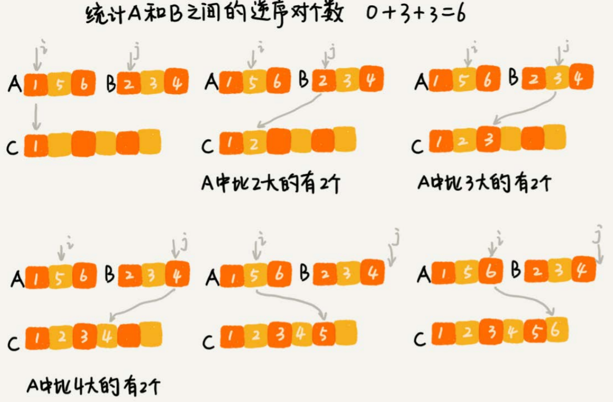
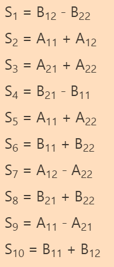
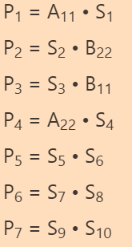
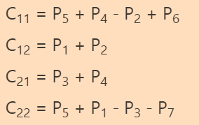

# 分治算法

分治算法（divide and conquer）的核心思想就是分而治之 ，也就是**将原问题划分成n个规模较小，并且结构与原问题相似的子问题，递归地解决这些子问题，然后再合并其结果，就得到原问题的解**。

分治算法能解决的问题，一般需要满足下面这几个条件：

- 原问题与分解成的小问题具有相同的模式
- 原问题分解成的子问题可以独立求解，**子问题之间没有相关性**，这一点是分治算法跟动态规划的明显区别
- 具有分解终止条件，也就是说，当问题足够小时，可以直接求解
- 可以将子问题合并成原问题，而这个合并操作的复杂度不能太高，否则就起不到减小算法总体复杂度的效果了


## 排序问题中的逆序度

在排序算法中，可以用**有序度来表示一组数据的有序程度**，用**逆序度表示一组数据的无序程度**。

假设我们有`n`个数据，我们期望数据从小到大排列，那完全有序的数据的有序度就是`n(n-1)/2`，逆序度等于`0`；相反，倒序排列的数据的有序度就是`0`，逆序度是`n(n-1)/2`。除了这两种极端情况外，我们通过计算有序对或者逆序对的个数，来表示数据的有序度或逆序度。

> 2, 4, 3, 1, 5, 6 逆序对个数：4
>
> (2, 1) (4, 3) (4, 1) (3, 1)

**如何编程求出一组数据的有序对个数或者逆序对个数呢？**

因为有序对个数和逆序对个数的求解方式是类似的，所以只考虑逆序对个数的求解方法。

最笨的方法是，拿每个数字跟它后面的数字比较，看有几个比它小的。我们把比它小的数字个数记作k，通过这样的方式，把每个数字都考察一遍之后，然后对每个数字对应的k值求和，最后得到的总和就是逆序对个数。不过，这样操作的时间复杂度是$O(n^2)$。

使用分治的思想来求数组A的逆序对个数。我们可以将数组分成前后两半`A1`和`A2`，分别计算`A1`和`A2`的逆序对个数`K1`和`K2`，然后再计算`A1`与`A2`之间的逆序对个数`K3`。那数组A的逆序对个数就等于`K1+K2+K3`。

因为要快速计算出两个子问题`A1`与`A2`之间的逆序对个数，我们可以让`A1`和`A2`处于升序状态，可以借助归并排序求两个子问题的逆序对个数。



```
num := 0 // 用全局变量存储逆序对数量

func CountReverse(nums []int) int {
	num = 0
	size := len(nums)
	mergeSortCounting(nums, 0 , size - 1)
	return num
}

func mergeSortCounting(nums []int, start, end) {
	if start >= end {
		return
	}
	
	mid := start + (end - start) >> 1
	mergeSortCounting(nums, start, mid)
	mergeSortCounting(nums, mid + 1, end)
	merge(nums, start, mid, end)
}

func merge(nums []int, left, mid, right) {
	i := left
	j := mid + 1
	k := 0
	tmp := make([]int, right - left + 1) // 临时数组存储排序结果
	
	for i <= mid && j <= right {
		if nums[i] <= nums[j] {
			tmp[k] = nums[i]
			k++
			i++
		} else {
			tmp[k] = nums[j]
			k++
			j++
			num += mid - i + 1 // 左半部分比nums[j]大的数
		}
	}
	
	for i <= mid {
		tmp[k] = nums[i]
		i++
		k++
	}
	
	for j <= right {
		tmp[k] = nums[j]
		j++
		k++
	}
	
	for i := range tmp { // 拷贝回原数组
		nums[i+left] = tmp[i]
	}
}
```


## 海量数据处理

给10GB的订单文件按照金额排序这样一个需求，看似是一个简单的排序问题，但是因为数据量大，有10GB，而我们的机器的内存可能只有2、3GB这样子，无法一次性加载到内存，也就无法通过单纯地使用快排、归并等基础算法来解决了。

要解决这种数据量大到内存装不下的问题，我们就可以利用分治的思想。我们可以将海量的数据集合根据某种方法，划分为几个小的数据集合，每个小的数据集合单独加载到内存来解决，然后再将小数据集合合并成大数据集合。实际上，利用这种分治的处理思路，不仅仅能克服内存的限制，还能利用多线程或者多机处理，加快处理的速度。

给10GB的订单排序，我们就可以先扫描一遍订单，根据订单的金额，将10GB的文件划分为几个金额区间。比如订单金额为1到100元的放到一个小文件，101到200之间的放到另一个文件，以此类推。这样每个小文件都可以单独加载到内存排序，最后将这些有序的小文件合并，就是最终有序的10GB订单数据了。


例如MapReduce框架，它是一个任务调度器，底层依赖GFS来存储数据，依赖Borg管理机器。它从GFS中拿数据，交给Borg中的机器执行，并且时刻监控机器执行的进度，一旦出现机器宕机、进度卡壳等，就重新从Borg中调度一台机器执行。

例如统计文件中单词出现的频率。除此之外，它还可以用来处理**数据与数据之间没有关系**的任务，比如对网页分析、分词等，每个网页可以独立的分析、分词，而这两个网页之间并没有关系。网页几十亿、上百亿，如果单机处理，效率低下，我们就可以利用MapReduce提供的高可靠、高性能、高容错的并行计算框架，并行地处理这几十亿、上百亿的网页。


## 求最近点对

二维平面上有n个点，如何快速计算出两个距离最近的点对？

1. 分成两块， 单独求其中一块点对最小距离
2. 求这两块之间点对的最小距离 

通过一些排序和删除，可以减少到6个点之间比较。


## Strassen矩阵乘积

有两个`n x n`的矩阵A，B，如何快速求解两个矩阵的乘积`C=A*B`？

每个` n x n `的矩阵都可以分割为四个 `n/2 x n/2` 的矩阵：


`C=A * B`改写为


$C_{11} = A_{11} • B_{11} + A_{12} • B_{21}$

$C_{12} = A_{11} • B_{12} + A_{12} • B_{22}$

$C_{21} = A_{21} • B_{11} + A_{22} • B_{21}$

$C_{22} = A_{21} • B_{12} + A_{22} • B_{22}$

每个公式需要计算两次矩阵乘法和一次矩阵加法，使用$T(n)$表示`n x n`矩阵乘法的时间复杂度，那么我们可以根据上面的分解得到一个递推公式。

$T(n) = 8T(n/2) + Θ(n^2)$

$8T(n/2)$表示8次矩阵乘法，而且相乘的矩阵规模降到了$n/2$。$Θ(n^2)$表示4次矩阵加法的时间复杂度以及合并C矩阵的时间复杂度。

通过递归树的方式计算得到$T(n) = Θ(n^3)$，即简单的分治策略并没有起到加速运算的效果。


Strassen算法减少了矩阵相乘的次数，取而代之的是矩阵相加的次数增加。

仍然把每个矩阵分割为4份，然后创建如下10个中间矩阵：



然后计算7次矩阵乘法：



最后，根据这7个结果就可以计算出C矩阵：




该算法的时间复杂度 的递推公式：$T(n) = 7T(n/2) + Θ(n^2)$

$T(n) = Θ(nlg7) ≈ Θ(n^{2.81})$

