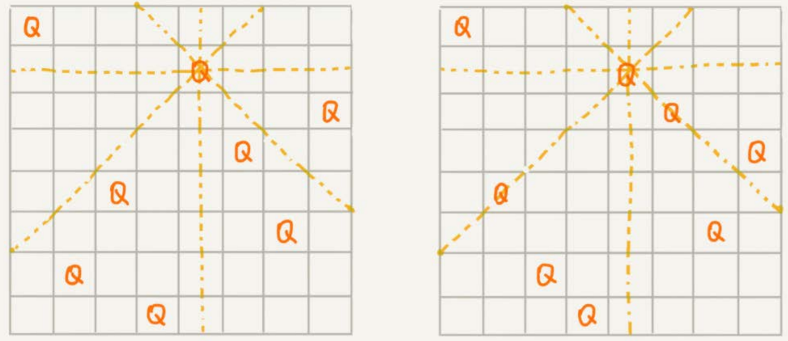

# 回溯算法

DFS利用的就是回溯算法思想，还有很多经典的数学问题都可以用回溯算法解决，比如数独、八皇后、0-1背包、图的着色、旅行商问题、全排列等等。

回溯的处理思想，有点类似枚举搜索。我们枚举所有的解，找到满足期望的解。为了有规律地枚举所有可能的解，避免遗漏和重复，我们**把问题求解的过程分为多个阶段。每个阶段，我们都会面对一个岔路口，我们先随意选一条路走，当发现这条路走不通的时候（不符合期望的解），就回退到上一个岔路口，另选一种走法继续走。**


## 八皇后问题

有一个8x8的棋盘，希望往里放8个棋子（皇后），每个棋子所在的**行、列、对角线**都不能有另一个棋子。左图是满足条件的一种方法，右图则不满足条件。



八皇后问题就是期望找到**所有**满足这种要求的放棋子方式。

把这个问题划分成8个阶段，依次将8个棋子放到第一行、第二行、第三行……第八行。在放置的过程中，我们不停地检查当前的方法，是否满足要求。如果满足，则跳到下一行继续放置棋子；如果不满足，那就再换一种方法，继续尝试。

```
var result [8]int
func Cal8Queens(row int) {
	if row == 8 {
		printQueens()
		return
	}
	
	for col := 0; col < 8; col++ {
		if isOk(row, col) {
			result[row] = col
			Cal8Queens(row + 1)
		}
	}
}

func isOk(row, col int) bool {
	leftup := col - 1 // 左上对角线的列
	rightup := col + 1 // 右上对角线的列
	for i := row - 1; i >= 0; i-- {	// 逐行往上考察
		if result[i] == col { // 垂直列上已有棋子
			return false
		}
		
		if leftup >= 0 && result[i] == leftup {
			return false
		}
		
		if rightup < 8 && result[i] == rightup {
			return fasle
		}
		leftup--
		rightup++
	}
	return true
}

func printQueens() {
	for row := 0; row < 8; row++ {
		for col := 0; col < 8; col++ {
			if result[row] == col {
				fmt.Print("Q ")
			} else {
				fmt.Print("* ")
			}
		}
		fmt.Println()
	}
}
```


## 0-1背包

0-1背包问题的经典解法是动态规划，回溯算法虽然不那么高效，但容易理解。

最简单的0-1背包问题：有一个背包，背包总的承载重量是`W kg`。现在我们有`n`个物品，每个物品的重量不等，并且**不可分割**。我们现在期望选择几件物品，装载到背包中。**在不超过背包所能装载重量的前提下，如何让背包中物品的总重量最大？**

对于每个物品来说，都有两种选择，装进背包或者不装进背包。对于`n`个物品来说，总的装法就有$2^n$种，去掉总重量超过`W kg`的，从剩下的装法中选择总重量最接近`W kg`的。

我们可以把物品依次排列，整个问题就分解为了`n`个阶段，每个阶段对应一个物品怎么选择。先对第一个物品进行处理，选择装进去或者不装进去，然后再递归地处理剩下的物品。

结合搜索剪枝的技巧减少一些不必要的计算，当发现已经选择的物品的重量超过`W kg`之后，我们就停止继续探测剩下的物品。

```
curMax := math.Minint32

// items 待选择的物品的质量
// curWeight当前背包承重
// index 考察第i个物品
// count 总共有多少个物品
// limit 背包最大承重
func Backpack(items []int, curWeight, index, count, limit int) {
	if curWeight == limit || index == count { // 装满了 or 处理完所有物品
		if curWeight > curMax {
			curMax = curWeight
		}
		return
	}
	
	Backpack(items, curWeight, index + 1, count, limit)
	if items[index] + curWeight <= limit {
		Backpack(items, curWeight + items[index], index + 1, count, limit)
	}
}
```


## 正则表达式

假设正表达式中只包含`*`和`?`这两种通配符，如何用回溯算法，**判断一个给定的文本，能否跟给定的正则表达式匹配？**

依次考察正则表达式中的每个字符，当是非通配符时，我们就直接跟文本的字符进行匹配，如果相同，则继续往下处理；如果不同，则回溯。

如果遇到特殊字符的时候，我们就有多种处理方式了，也就是所谓的岔路口，比如`*`有多种匹配方案，可以匹配任意个文本串中的字符，我们就先随意的选择一种匹配方案，然后继续考察剩下的字符。如果中途发现无法继续匹配下去了，我们就回到这个岔路口，重新选择一种匹配方案，然后再继续匹配剩下的字符。

```
type Pattern struct {
	Matched bool // 是否已匹配
	Plen int // 正则表达式长度
	Pattern []byte // 正则表达式
}

func NewPattern(pattern []byte) *Pattern {
	return &Pattern{
		Pattern: pattern,
		Matched: false,
		Plen: len(pattern),
	}
}

func(this *Pattern) Match(text []byte) {
	this.Match = false
	this.rmatch(0, 0, text, len(text))
	return this.Match
}

// ti, pi 当前匹配到文本和模式串的下标
func (this *Pattern) rmatch(ti, pi int, text []byte, tlen int) {
	if this.Matched {
		return
	}
	
	if pi == this.Plen {
		if ti == tlen {
			this.Matched = true
		}
		return
	}
	
	if this.Pattern[pi] == '*' {
		for k := 0; k <= tlen - ti; k++ {
			rmatch(ti + k, pi + 1, text, tlen)
		} 
	} else if this.Pattern[pi] == '?' {
		rmatch(ti, pi + 1, text, tlen)
		rmatch(ti + 1, pi + 1, text, tlen)
	} else if ti < tlen && this.Pattern[pi] == text[ti] { // 纯字符匹配
		rmatch(ti + 1, pi + 1, text, tlen)
	}
}
```


