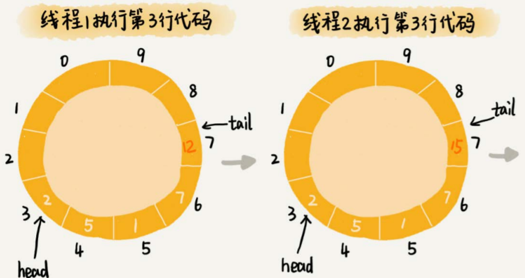

# 高性能队列

## Disruptor

Disruptor是**线程之间**用于消息传递的队列，它比Java中另外一个非常常用的内存消息队列ArrayBlockingQueue（ABS）的性能，要高一个数量级，可以算得上是最快的内存消息队列（“生产者-消费者模型））了。

### 基于循环队列的“生产者-消费者模型”

在这个模型中，“生产者”生产数据，并且将数据放到一个中心存储容器中。之后，“消费者”从中心存储容器中，取出数据消费。

存储数据的中心存储容器通常会使用队列实现，因为队列支持数据的先进先出，使得数据被消费的顺序性可以得到保证，即早生产的数据就会早被消费。

队列有两种实现思路。一种是基于链表实现的链式队列，另一种是基于数组实现的顺序队列。

如果要实现一个**无界队列**，也就是说，队列的大小事先不确定，理论上可以支持无限大。这种情况下，适合选用链表来实现队列，因为链表支持快速地动态扩容。但是，机器内存是有限的。而无界队列占用的内存数量是不可控的。对于实际的软件开发来说，这种不可控的因素，就会有潜在的风险。在某些极端情况下，无界队列就有可能因为内存持续增长，而导致OOM（Out of Memory）错误。

如果我们要实现一个**有界队列**，也就是说，队列的大小事先确定，当队列中数据满了之后，生产者就需要等待。直到消费者消费了数据，队列有空闲位置的时候，生产者才能将数据放入。

**非循环的顺序队列**在添加、删除数据的工程中，会涉及数据的搬移操作，导致性能变差。而**循环队列**正好可以解决这个数据搬移的问题，所以，性能更加好。所以，大部分用到顺序队列的场景中，我们都选择用顺序队列中的循环队列。

```
type Queue struct {
	data []int
	size int
	head int
	tail int
}

func NewQueue(size int) *Queue {
	return &Queue{
		size: size,
		head: 0,
		tail: 0,
		data: make([]int, size),
	}
}

func(this Queue) Add(element int) bool {
	if (this.tail + 1) % this.size == head {
		return false
	}
	this.data[this.tail] = element
	this.tail = (this.tail + 1) % this.size
	return true
}

func(this Queue) Poll() int, err {
	if head == tail {
		return 0, err.New("empty queue")
	}
	
	data := this.data[this.head]
	this.head = (this.head + 1) % this.size
	return data, nil
}

type Producer struct {
	queue *Queue
}

func NewProducer(queue *Queue) *Producer {
	return &Producer {
		queue: queue,
	}
}

func(this *Producer) Produce(data int) {
	for !this.queue.Add(data) {
		time.Sleep(time.Second)
	}
} 

type Consumer struct {
	queue *Queue
}

func NewConsumer(queue *Queue) *Consumer {
	return &Consumer {
		queue: queue,
	}
}

func(this *Consumer) Consume(data int) {
    for {
		data, err := this.queue.Poll()
		if err != nil {
			time.Sleep(time.Second)
		} else {
			// 处理业务
		}
    }
} 
```


### 基于加锁的并发“生产者-消费者模型”

上面实现的简单循环队列，还不能用于生产系统中，因为没有实现线程安全。

当有多个生产者在**并发地**往队列中写入数据，或者多个消费者并发地从队列中消费数据，可能会有下面两个问题：

- 多个生产者写入的数据可能会互相覆盖
- 多个消费者可能会读取重复的数据

这两个问题的原理是一样的，以第一个问题为例，两个线程同时往队列中添加数据，也就相当于两个线程同时执行类`Queue`中的`Add()`函数。我们假设队列的大小`size`是10，当前的`tail`指向下标7，`head`指向下标3，也就是说，队列中还有空闲空间。这个时候，线程1调用`Add()`函数，往队列中添加一个值为12的数据；线程2调用`Add()`函数，往队列中添加一个值为15的数据。在极端情况下，本来是往队列中添加了两个数据（12和15），**最终可能只有一个数据添加成功，另一个数据会被覆盖。**


```
func(this Queue) Add(element int) bool {
	if (this.tail + 1) % this.size == head {
		return false
	}
	this.data[this.tail] = element
	this.tail = (this.tail + 1) % this.size
	return true
}
```

`Add`函数中，第5行给`this.data[this.tail]`赋值，然后第6行才给`this.tail`的值加一。赋值和tail加一两个操作，并非原子操作。这就会导致这样的情况发生：

当线程1和线程2同时执行`Add()`函数的时候，线程1先执行完了第5行语句，将`data[7]`（`tail`等于7）的值设置为12。在线程1还未将`tail`加一之前，线程2执行了第5行语句，又将`data[7]`的值设置为15，也就是说，那线程2插入的数据覆盖了线程1插入的数据。原本应该插入两个数据（12和15）的，现在只插入了一个数据（15）。




这个问题最简单的处理方法就是给这段代码加锁，同一时间只允许一个线程执行`Add()`函数。这就相当于将这段代码的执行，由并行改成了串行，这会导致多个生产者同时生产数据的时候，执行效率的下降。

也可以用[CAS](https://en.wikipedia.org/wiki/Compare-and-swap)（compare and swap，比较并交换）操作减少加锁的粒度。


### 基于无锁的并发“生产者-消费者模型”

这是Disruptor的处理方法。

对于生产者来说，它往队列中添加数据之前，**先申请可用空闲存储单元，并且是批量地申请连续的n个（`n≥1`）存储单元。**当申请到这组连续的存储单元之后，后续往队列中添加元素，就可以不用加锁了，因为这组存储单元是这个线程独享的。不过，**申请存储单元的过程是需要加锁的**。

对于消费者来说，处理的过程跟生产者是类似的。它**先申请一批连续可读的存储单元（这个申请的过程也是需要加锁的）**，当申请到这批存储单元之后，后续的读取操作就可以不用加锁了。

不过，还有一个需要特别注意的地方，那就是，如果生产者A申请到了一组连续的存储单元，假设是下标为3到6的存储单元，生产者B紧跟着申请到了下标是7到9的存储单元，那在3到6没有完全写入数据之前，7到9的数据是无法读取的。这个也是Disruptor实现思路的一个弊端。


实际上，Disruptor采用的是`RingBuffer`和`AvailableBuffer`这两个结构。