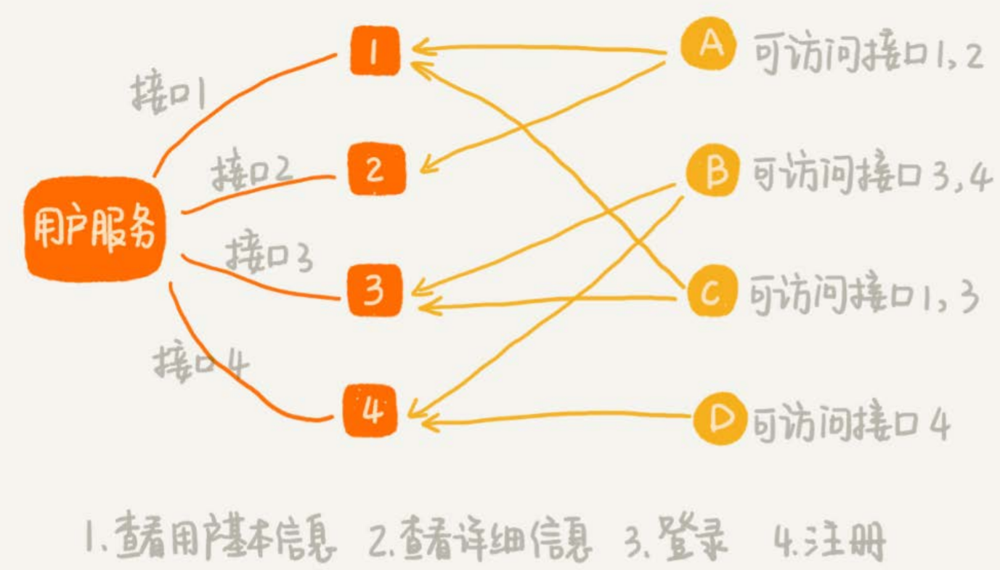
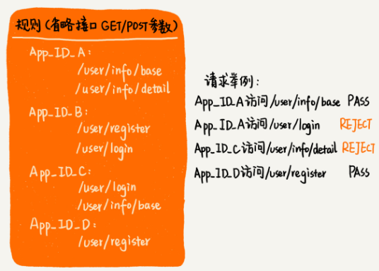
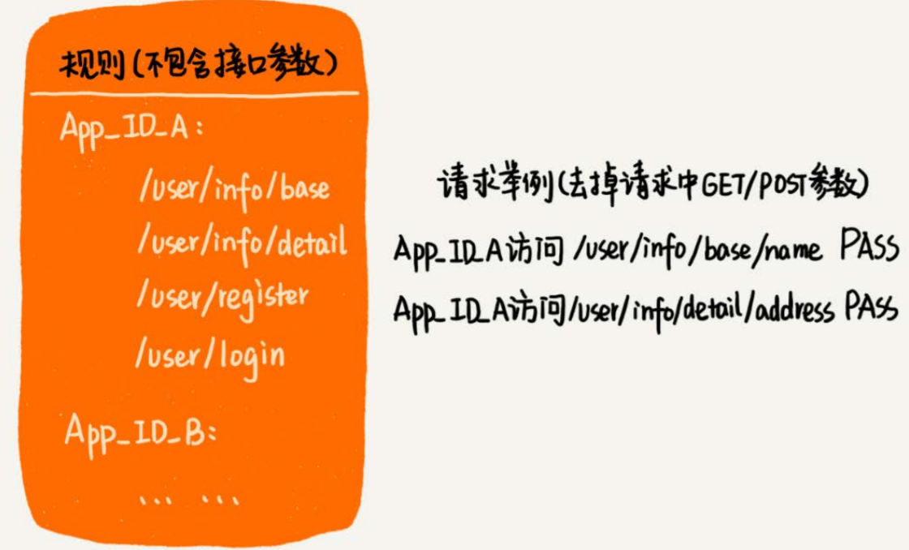
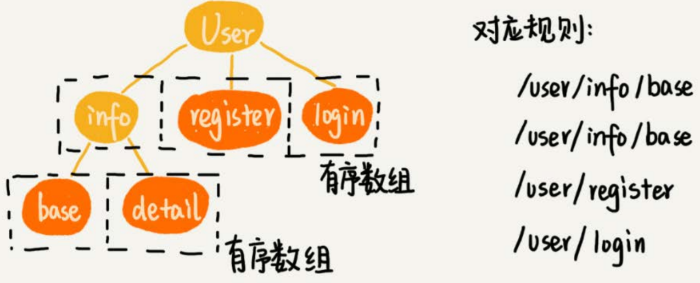
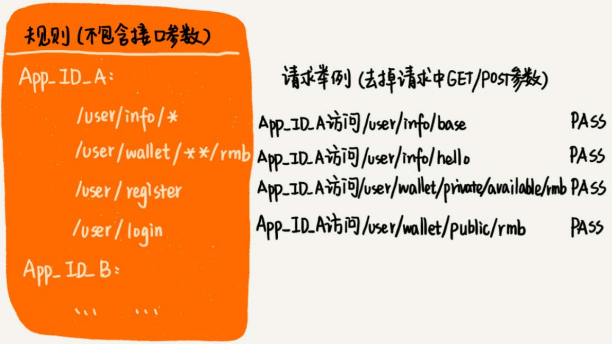
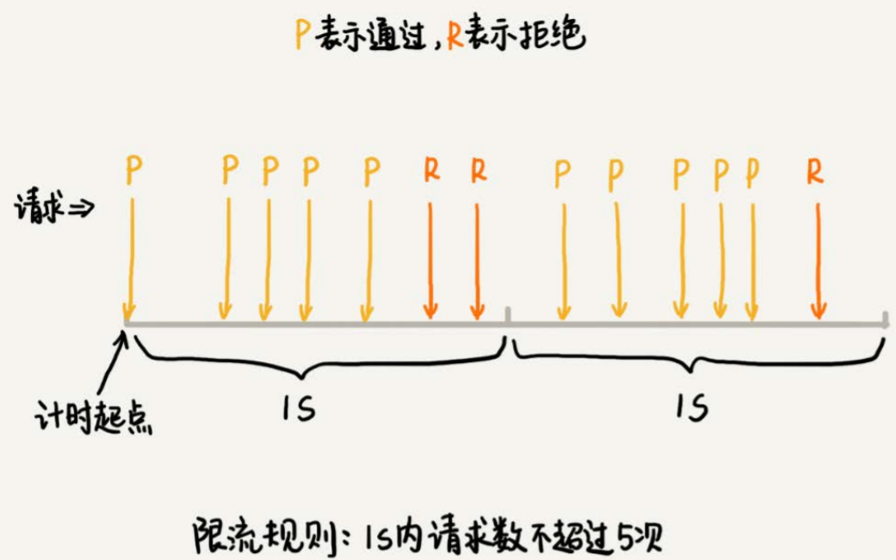
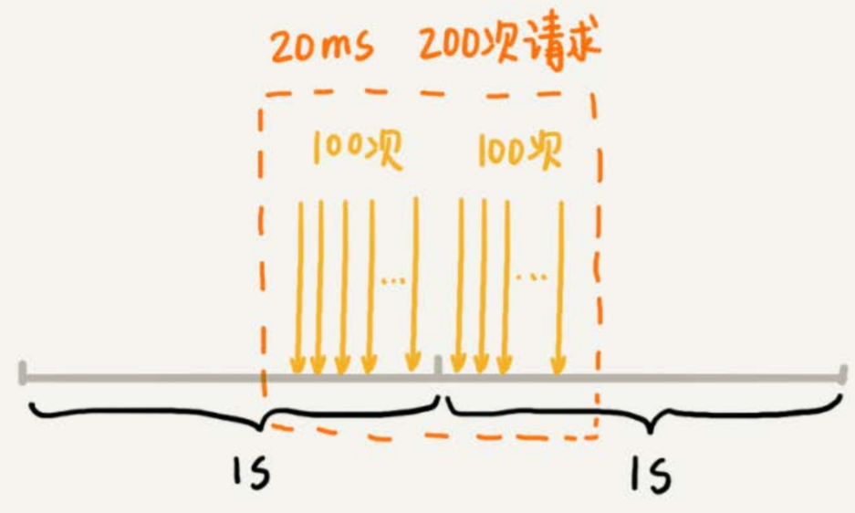

# 微服务接口鉴权限流

大应用拆分成微服务之后，服务之间的调用关系变得更复杂，平台的整体复杂度升高，出错的概率、debug问题的难度都高了好几个数量级。所以，为了解决这些问题，**服务治理**便成了微服务的一个技术重点。

所谓服务治理，简单点讲，就是管理微服务，保证平台整体正常、平稳地运行。服务治理涉及的内容比较多，比如鉴权、限流、降级、熔断、监控告警等等。这些服务治理功能的实现，底层依赖大量的数据结构和算法。

## 鉴权

假设有一个微服务叫用户服务（User Service）。它提供很多用户相关的接口，比如获取用户信息、注册、登录等，给公司内部的其他应用使用。但是，并不是公司内部所有应用，都可以访问这个用户服务，也并不是每个有访问权限的应用，都可以访问用户服务的所有接口。

只有A、B、C、D四个应用可以访问用户服务，并且，每个应用只能访问用户服务的**部分接口**。

要实现接口鉴权功能，我们需要事先将应用对接口的访问权限规则设置好。当某个应用访问其中一个接口的时候，我们就可以拿应用的请求URL，在规则中进行匹配。如果匹配成功，就说明允许访问；如果没有可以匹配的规则，那就说明这个应用没有这个接口的访问权限，我们就拒绝服务。

鉴权的原理比较简单、好理解。具体到实现层面，该用什么数据结构来存储规则呢？用户请求URL在规则中快速匹配，又该用什么样的算法呢？

不同的规则和匹配模式，对应的数据结构和匹配算法也是不一样的。

### 精确匹配

只有当请求URL跟规则中配置的某个接口精确匹配时，这个请求才会被接受、处理。

不同的应用对应不同的规则集合，可以采用散列表来存储这种对应关系。

**规则集合的存储和匹配**

针对这种匹配模式，我们可以将每个应用对应的权限规则，存储在一个**字符串数组**中。当用户请求到来时，我们拿用户的请求URL，在这个字符串数组中逐一匹配（比如KMP、BM、BF等）。

**规则不会经常变动**，所以，为了加快匹配速度，我们可以**按照字符串的大小给规则排序**，把它组织成有序数组这种数据结构。当要查找某个URL能否匹配其中某条规则的时候，我们可以采用二分查找算法，在有序数组中进行匹配。

而二分查找算法的时间复杂度是$O(\log n)$（n表示规则的个数），这比起时间复杂度是$O(n)$的顺序遍历快了很多。对于规则中接口长度比较长，并且鉴权功能调用量非常大的情况，这种优化方法带来的性能提升还是非常可观的 。

### 前缀匹配

Trie树非常适合用来做前缀匹配，可以将每个用户的规则集合，组织成Trie树这种数据结构。

不过，Trie树中的每个节点不是存储单个字符，而是**存储接口路径被“/”分割之后的子目录**（比如`“/user/name”`被分割为`“user” “name”`两个子目录）。因为规则并不会经常变动，所以，在Trie树中，我们可以**把每个节点的子节点们，组织成有序数组这种数据结构**。当在匹配的过程中，我们可以利用二分查找算法，决定从一个节点应该跳到哪一个子节点。

### 模糊匹配

(`**`表示匹配任意多个子目录，`*`表示匹配任意一个子目录)

不同的应用对应不同的规则集合，所以还是采用散列表来存储这种对应关系。每个用户对应的规则集合，可以分为两部分：**不包含通配符**和**包含通配符**的。

把不包含通配符的规则，组织成有序数组或者Trie树（具体组织成什么结构，视具体的需求而定，是精确匹配，就组织成有序数组，是前缀匹配，就组织成Trie树），而这一部分匹配就会非常高效。

剩下的是少数包含通配符的规则，只要把它们简单存储在一个数组中就可以了。尽管匹配起来会比较慢，但是毕竟这种规则比较少，所以这种方法也是可以接受的。

当接收到一个请求URL之后，我们可以先在不包含通配符的有序数组或者Trie树中查找。如果能够匹配，就不需要继续在通配符规则中匹配了；如果不能匹配，就继续在通配符规则中查找匹配。

## 限流

对接口调用的频率进行限制，比如每秒钟不能超过100次调用，超过之后，我们就拒绝服务。

按照不同的限流粒度，限流可以分为很多种类型。比如：

- 每个接口限制不同的访问频率
- 给所有接口限制总的访问频率
- 更细粒度地限制某个应用对某个接口的访问频率
- 

针对限制所有接口总的访问频率，如何实现精准限流？

### 固定时间窗口限流

首先选定一个时间起点，之后每当有接口请求到来，我们就将计数器加一。如果在当前时间窗口内，根据限流规则（比如每秒钟最大允许100次访问请求），出现累加访问次数超过限流值的情况时，我们就拒绝后续的访问请求。当进入下一个时间窗口之后，计数器就清零重新计数。

这种基于固定时间窗口的限流算法的缺点是，限流策略过于粗略，**无法应对两个时间窗口临界时间内的突发流量**。

假设限流规则是，每秒钟不能超过100次接口请求。第一个1s时间窗口内，100次接口请求都集中在最后10ms内。在第二个1s的时间窗口内，100次接口请求都集中在最开始的10ms内。虽然两个时间窗口内流量都符合限流要求（≤100个请求），但在两个时间窗口临界的20ms内，会集中有200次接口请求。固定时间窗口限流算法并不能对这种情况做限制，所以，集中在这20ms内的200次请求就有可能压垮系统。

### 滑动时间窗口限流

**任意时间窗口**（比如1s）内，接口请求数都不能超过某个阈值（ 比如100次）。

假设限流的规则是，在任意1s内，接口的请求次数都不能大于`K`次。我们就维护一个大小为`K+1`的循环队列，用来记录1s内到来的请求。

> 注意，这里循环队列的大小等于限流次数加一，因为循环队列存储数据时会浪费一个存储单元。

当有新的请求到来时，我们将把与这个新请求的时间间隔超过1s的请求，从队列中删除。然后，再看循环队列中是否有空闲位置。如果有，则把新请求存储在队列尾部（tail指针所指的位置）；如果没有，则说明这1秒内的请求次数已经超过了限流值K，所以这个请求被拒绝服务。

即便滑动时间窗口限流算法可以保证任意时间窗口内，接口请求次数都不会超过最大限流值，但是仍然不能防止，在细时间粒度上访问过于集中的问题。

比如在一个1s的时间窗口内，100次请求都集中在最后10ms中，也就是说，基于时间窗口的限流算法，不管是固定时间窗口还是滑动时间窗口，只能在选定的时间粒度上限流，对选定时间粒度内的更加细粒度的访问频率不做限制。

