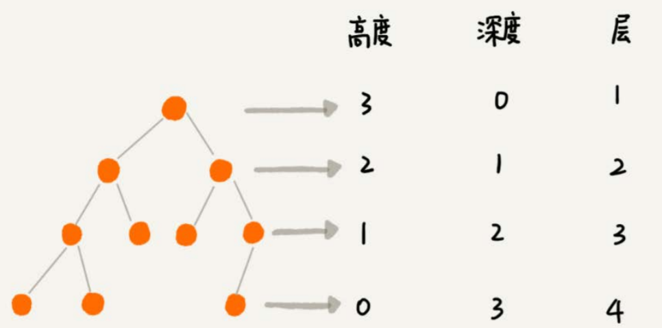
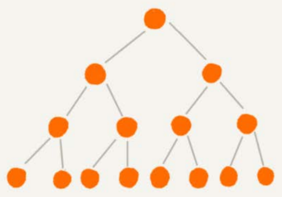
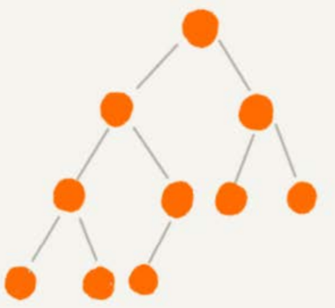
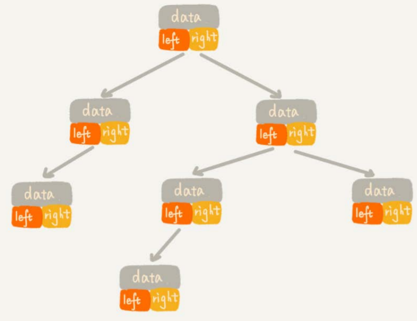
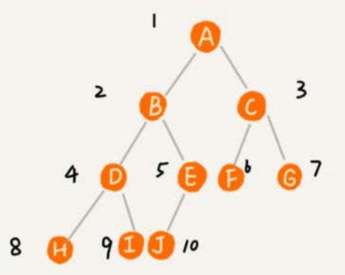
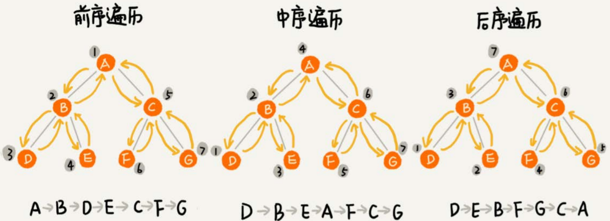

# 树

## 基本概念

- **节点的高度**：某个节点到叶子节点的**最长**路径（边数）。从下往上
- **节点的深度**：根结点到该节点所经历的边数。从上往下
- **节点的层数**：节点深度+1
- **树的高度**：根节点的高度

## 二叉树

**满二叉树**：叶子节点全都在最底层，除了叶子节点之外，每个节点都有左右两个子节点

**完全二叉树**：叶子节点都在最底下两层，最后一层的叶子节点都靠左排列，并且除了最后一层，其他层的节点个数都要达到最大

### 二叉树的存储

- 链表：
  

- 数组：如果节点X存储在数组中下标为$i$的位置，下标为$2 * i $的位置存储的就是左子节点，下标为$2 * i + 1$的位置存储的就是右子节点。反过来，下标为$i/2$的位置存储就是它的父节点。一般会把根节点存储在下标为1的位置。**这种方法适合存储完全二叉树**，空间浪费少。*堆就是一种完全二叉树，最常用的存储方式就是数组。*

  

  

### 二叉树的遍历

- **前序遍历**：对于树中的任意节点来说，先打印这个节点，然后再打印它的左子树，最后打印它的右子树
- **中序遍历**：对于树中的任意节点来说，先打印它的左子树，然后再打印它本身，最后打印它的右子树
- **后序遍历**：对于树中的任意节点来说，先打印它的左子树，然后再打印它的右子树，最后打印这个节点本身
- **层次遍历**：通过队列实现

