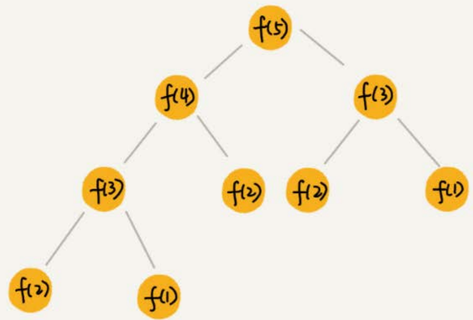

# 递归树

递归代码的时间复杂度分析，可以用递推公式法，也可以用递归树。

将递归 一层一层的分解过程画成图，就是一棵树。以斐波那契数列为例，它的递归树如下，节点里的数字表示数据规模。




## 归并排序分析


因为每次分解都是一分为二，所以代价很低，把时间上的消耗记作常量$1$。归并算法中比较耗时的是归并操作，即把两个子数组合并为大数组。从图中可以看出，每一层归并操作消耗的时间总和是一样的，跟要排序的数据规模有关。把每一层归并操作消耗的时间记作$n$。

只需要知道这棵树的高度$h$，用高度$h$乘以每一层的时间消耗$n$，就可以得到总的时间复杂度$O(n*h)$。

归并排序递归树是一棵满二叉树，满二叉树的高度大约是$\log_{2}n$，所以，归并排序递归实现的时间复杂度就是$O(n\log n)$。这里的时间复杂度都是估算的，对树的高度的计算也没有那么精确，但是这并不影响复杂度的计算结果。


## 快速排序分析

使用递推公式法分析快排比较复杂，因为每一次分区不一定能一分为二，两个分区大小不同，导致求解复杂。

假设每次分区之后，两个分区的大小比例为$1:k$。当$k=9$时，如果用递推公式的方法来求解时间复杂度的话，递推公式就写成$T(n)=T(\frac{n}{10})+T(\frac{9n}{10})+n$。

用递归树表示如下：


快速排序的过程中，每次分区都要遍历待分区区间的所有数据，所以，每一层分区操作所遍历的数据的个数之和就是$n$。只要求出递归树的高度$h$，这个快排过程遍历的数据个数就是 $h * n$ ，也就是说，时间复杂度就是$O(h * n)$。

因为每次分区并不是均匀地一分为二，所以递归树并不是满二叉树。这样一个递归树的高度是多少呢？

快速排序结束的条件就是待排序的小区间，大小为$1$，也就是说叶子节点里的数据规模是$1$。从根节点$n$到叶子节点$1$，递归树中最短的一个路径每次都乘以$\frac{1}{10}$，最长的一个路径每次都乘以$\frac{9}{10}$。通过计算，我们可以得到，从根节点到叶子节点的最短路径是$\log_{10}n$，最长的路径是$\log_{\frac{10}{9}}n$。


所以，遍历数据的个数总和就介于$n\log_{10}n$和$n\log_{\frac{10}{9}}n$之间。根据复杂度的大O表示法，对数复杂度的底数不管是少，我们统一写成$\log
n$，所以，当分区大小比例是$1:9$时，快速排序的时间复杂度仍然是$O(n\log n)$。

如果$k=99$，也就是说，每次分区极其不平均，两个区间大小是$1:99$，这个时候的时间复杂度是多少呢？

可以类比上面$k=9$的分析过程。当$k=99$的时候，树的最短路径就是$\log_{100}n$，最长路径是$\log_{\frac{100}{99}}n$，所以总遍历数据个数介于$n\log_{100}n$和$n\log_{\frac{100}{99}}n$之间。尽管底数变了，但是时间复杂度也仍然是$O(n\log n)$。

也就是说，对于$k$等于$9$，$99$，甚至是$999$，$9999$……，只要$k$的值不随$n$变化，是一个事先确定的常量，那快排的时间复杂度就是$O(n\log n)$。所以，从概率论的角度来说，快排的平均时间复杂度就是$O(n\log n)$。


## 爬楼梯问题分析

https://leetcode.com/problems/climbing-stairs/

这个问题实际上就是一个斐波那契数列，代码如下：

```
func f(n int) int {
	if n <= 2 {
		return n
	}
	return f(n-1) + f(n-2)
}
```

递归树如下：


每一层数据规模的变化都是$-1$或$-2$，叶子节点的数据规模是$1$或$2$。从根节点走到叶子节点，每条路径长短不一。如
果每次都是$-1$，那最长路径大约就是$n$；如果每次都是$-2$，那最短路径大约就是$\frac{n}{2}$。

每次分解后会做合并操作（一次加法运算，时间消耗记为$1$）。从上往下，第一层的总时间消耗是$1$，第二层的总时间消耗是$2$，第三层的总时间消耗就是$2^{2}$。依次类推，第$k$层的时间消耗就是$2^{k-1}$，那整个算法的总的时间消耗就是每一层时间消耗之和。

如果路径长度都为$n$，那这个总和就是$2^{n}-1$。

> $1 + 2 + …… + 2^{n-1} = 2^n - 1$

如果路径长度都是$\frac{n}{2}$ ，那整个算法的总的时间消耗就是$2^{\frac{n}{2}}-1$。

所以，这个算法的时间复杂度就介于$O(2^{n})$和$O(2^{\frac{n}{2}})$之间。虽然这样得到的结果还不够精确，只是一个范围，但是我们也基本上知道了上面算法的时间复杂度是指数级的，非常高。


## 全排列分析

如果我们确定了最后一位数据，那全排列问题就变成了求解剩下$n-1$个数据的全排列问题。而最后一位数据可以是$n$个数据中的任意一个，因此它的取值就有$n$种情况。所以，“$n$个数据的排列”问题，就可以分解成$n$个“$n-1$个数据的列”的子问题。

递推公式：假设数组中存储的是1，2， 3...n。$$f(1,2,...n) = {最后一位是1, f(n-1)} + {最后一位是2, f(n-1)} +...+{最后一位是n, f(n-1)}。$$

代码如下：

```
// k 表示data切片还有几位数字待处理
func Permutations(data []int, n, k int) {
	if k == 1 {
		for _, v := range data {
			fmt.Print(v, " ")
		}
		fmt.Println()
	}
	
	for i := 0; i < k; i++ {
		// 交换元素
		tmp := data[i]
		data[i] = data[k - 1]
		data[k - 1] = tmp
		
		Permutations(data, n, k - 1)
		
		// 进行新的交换前复原
		tmp = data[i]
		data[i] = data[k - 1]
		data[k - 1] = tmp
	}
}

// a:=[]int{1, 2, 3, 4}; printPermutations(a, 4, 4);
```


第一层分解有$n$次交换操作，第二层有$n$个节点，每个节点分解需要$n-1$次交换，所以第二层总的交换次数是$n*(n-1)$。第三层有$n*(n-1)$个节点，每个节点分解需要$n-2$次交换，所以第三层总的交换次数是$n*(n-1)*(n-2)$。

以此类推，第$k$层总的交换次数就是$n * (n-1) * (n-2) * … * (n-k+1)$。最后一层的交换次数就是$n * (n-1) * (n-2) * … * 2 * 1$。每一层的交换次数之和就是总的交换次数。

$$n + n*(n-1) + n*(n-1)*(n-2) +... + n*(n-1)*(n-2)*...*2*1$$

这个公式的求和比较复杂，看最后一个数，$n * (n-1) * (n-2) * … * 2 * 1$等于$n!$，而前面的$n-1$个数都小于最后一个数，所以，总和肯定小于$n * n!$，也就是说，全排列的递归算法的时间复杂度大于$O(n!)$，小于$O(n * n!)$，虽然我们没法知道非常精确的时间复杂度，但是这样一个范围已经让我们知道，全排列的时间复杂度是非常高的。


## 细胞分裂

$1$个细胞的生命周期是$3$小时，$1$小时分裂一次。求$n$小时后，容器内有多少细胞？

(假设细胞到了第三个小时是先分裂完再死亡)

`f(0) = 1`

`f(1) = 2`

`f(2) = 4`

`f(3) = 2f(2) - f(0) = 7`

$$f(n) = f(n-1)*2 - f(n-3)$$

最高的树有n层，最短有$n/3$层。因为每层操作数都是指数增长，因此时间复杂度为$O(2^n)$。

