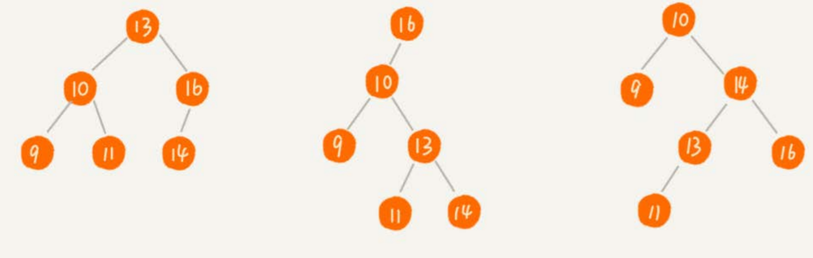
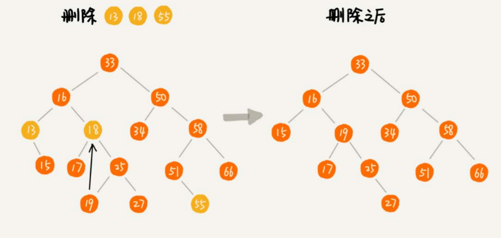
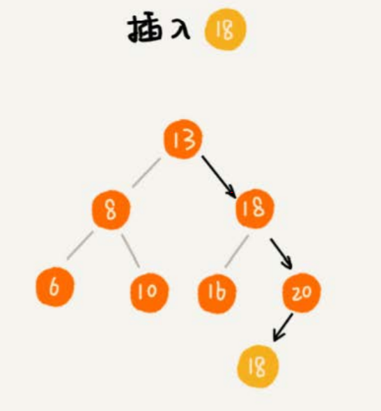
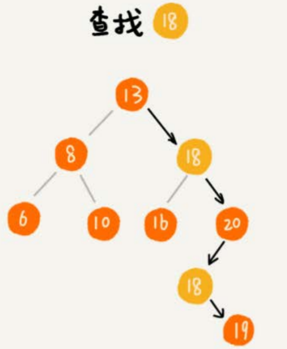

# 二叉搜索树

支持**动态**数据集合的快速插入、删除、查找操作。

特点：在树中的任意一个节点，其左子树中的每个节点的值，都要小于这个节点的值，而右子树节点的值都大于这个节点的值。




假设二叉搜索树结构体定义如下：

```
type Node struct {
	left, right *Node
	data int
}

type BinarySearchTree struct {
	tree *Node
}
```


## 查找

```
func (this *BinarySearchTree) Search(val int) *Node {
	cur := this.tree
	for cur != nil {
		if cur.data == val {
			return cur
		} else if cur.data > val {
			cur = cur.left
		} else {
			cur = cur.right
		}
	}
	return nil
}
```


## 插入

二叉搜索树的插入过程有点类似查找操作。新插入的数据一般都是在叶子节点上，所以我们只需要从根节点开始，依次比较要插入的数据和节点的大小关系。

- 如果要插入的数据比节点的数据大
  - 节点的右子树为空，将新数据直接插到右子节点的位置
  - 如果不为空，就再递归遍历右子树，查找插入位置
- 如果要插入的数据比节点数值小
  - 节点的左子树为空，将新数据插入到左子节点的位置
  - 如果不为空，就再递归遍历左子树，查找插入位置。

```
func (this *BinarySearchTree) Insert(val int)  {
	if this.tree == nil {
		this.tree = NewNode(val)
		return
	}
	
	cur := this.tree
	for cur != nil {
		if cur.data > val {
			if cur.left == nil {
				cur.left = NewNode(val)
				return
			}
			cur = cur.left
		} else {
			if cur.right == nil {
				cur.right = NewNode(val)
				return
			}
			cur = cur.right
		}
	}

	return 
}
```


## 删除

针对要删除节点的子节点个数的不同，需要分三种情况来处理：

- 如果要删除的节点没有子节点，只需要直接将父节点中，指向要删除节点的指针置为null。比如图中的删除节点55。
- 如果要删除的节点只有一个子节点（只有左子节点或者右子节点），只需要更新父节点中，将指向要删除节点的指针，变为指向要删除节点的子节点就可以了。比如图中的删除节点13。
- 第三种情况是，如果要删除的节点有两个子节点，这就比较复杂了。需要找到这个节点的右子树中的最小节点，把它替换到要删除的节点上。然后再删除掉这个最小节点，因为最小节点肯定没有左子节点（如果有左子结点，那就不是最小节点了），所以，我们可以应用上面两条规则来删除这个最小节点。比如图中的删除节点18。



```
func  (this *BinarySearchTree) Delete(val int)  {
	cur := this.tree
	var parent *Node
	// 先找到要删除的节点和其父节点
	for cur != nil && cur.data != val {
		parent = cur
		if cur.data > val {
			cur = cur.left
		} else {
			cur = cur.right
		}
	}
	if cur == nil {
		return
	}
	
	// 要删除的节点有左右子节点
	if cur.left != nil && cur.right != nil {
		// 在右子树中找最小节点
		minNode := cur.right
		minNodeParent := cur
		for minNode.left != nil {
			minNodeParent = minNode
			minNode = minNode.left
		}
		cur.data = minNode.data
		parent = minNodeParent
		cur = minNode
	}
	
	// 到这里时，删除节点是叶子节点或只有一个子节点
	var child *Node
    if cur.left != nil {
    	child = cur.left
    } else if cur.right != nil {
    	child = cur.right
    } else {
    	child = nil
    }
    
    // 删除只有两个节点的树的根节点
    if parent == nil {
    	this.tree = child
    } else if parent.left == cur {
    	parent.left = child
    } else {
    	parent.right = child
    }
}
```


除了这种删除方法，还可以单纯将要删除的节点标记为“已删除”，但是并不真正从树中将这个节点去掉。这样原本删除的节点还需要存储在内存中，比较浪费内存空间，但是删除操作就变得简单了很多。而且，这种处理方法也并没有增加插入、查找操作代码实现的难度。


## 支持重复数据的二叉搜索树

在实际的软件开发中，二叉搜索树中存储的，可能是一个包含很多字段的对象，利用对象的某个字段作为键值（key）来构建二叉搜索树。把对象中的其他字段叫作卫星数据。

如果两个对象的键值相同，怎么处理呢？

- 二叉搜索树中**每一个节点不仅会存储一个数据**，因此通过链表和支持动态扩容的数组等数据结构，把值相同的数据都存储在同一个节点上。

- 每个节点仍然只存储一个数据。在查找插入位置的过程中，如果碰到一个节点的值，与要插入数据的值相同，就将这个要插入的数据放到这个节点的右子树，也就是说，把这个新插入的数据当作大于这个节点的值来处理。

  

  当要查找数据的时候，遇到值相同的节点，我们并不停止查找操作，而是继续在右子树中查找，直到遇到叶子节点，才停止。这样就可以把键值等于要查找值的所有节点都找出来。

  

  对于删除操作，我们也需要先查找到每个要删除的节点，然后再按前面讲的删除操作的方法，依次删除。


## VS 散列表

散列表的插入、删除、查找操作的时间复杂度可以做到常量级的$O(1)$，非常高效。而二叉查找树在比较平衡的情况下，插入、删除、查找操作时间复杂度才是$O(logn)$，那为什么还要使用二叉搜索树呢

- 散列表中的数据是无序存储的，如果要输出有序的数据，需要先进行排序。而对于二叉查找树来说，我们只需要中序遍历，就可以在$O(n)$的时间复杂度内，输出有序的数据序列。
- 散列表扩容耗时很多，而且当遇到散列冲突时，性能不稳定，尽管二叉查找树的性能不稳定，但是在工程中，我们最常用的平衡二叉查找树的性能非常稳定，时间复杂度稳定在$O(logn)$。
- 尽管散列表的查找等操作的时间复杂度是常量级的，但因为哈希冲突的存在，这个常量不一定比$logn$小，所以实际的查找速度可能不一定比$O(logn)$快。加上哈希函数的耗时，也不一定就比平衡二叉查找树的效率高。
- 散列表的构造比二叉查找树要复杂，需要考虑很多东西，比如散列函数的设计、冲突解决办法、扩容、缩容等。平衡二叉查找树只需要考虑平衡性这一个问题，而这个问题的解决方案比较成熟、固定。
- 为了避免过多的散列冲突，散列表装载因子不能太大，特别是基于开放寻址法解决冲突的散列表，因此会浪费一定的存储空间。