# 平衡二叉搜索树

## 定义

二叉搜索树在频繁的动态更新过程中，可能会出现树的高度远大于$\log_2n$的情况，从而导致各个操作的效率下降。极端情况下，二叉树会退化为链表，时间复杂度会退化到$O(n)$。

对于这些情况，需要设计一种平滑二叉搜索树。“平衡”的意思，就是让整棵树左右看起来比较“对称”、比较“平衡”，不要出现左子树很高、右子树很矮的情况。

平衡二叉树的**严格定义**：二叉树中任意一个节点的左右子树的高度相差不能大于1。从这个定义来看，完全二叉树、满二叉树其实都是平衡二叉树，但是非完全二叉树也有可能是平衡二叉树。

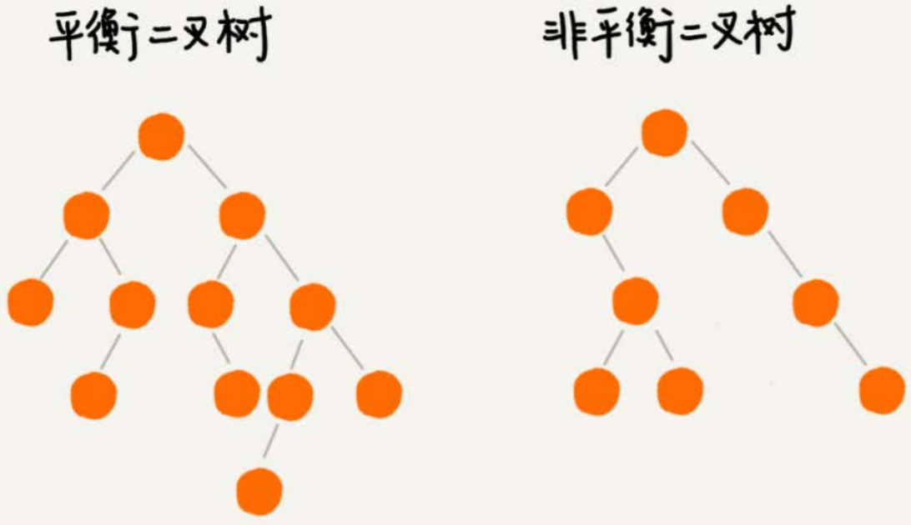

最先被发明的平衡二叉查找树是[AVL树]([https://zh.wikipedia.org/wiki/AVL%E6%A0%91](https://zh.wikipedia.org/wiki/AVL树))，它严格符合平衡二叉查找树的定义，即任何节点的左右子树高度相差不超过1，是一种高度平衡的二叉查找树。

但是很多平衡二叉查找树其实并没有严格符合上面的定义（树中任意一个节点的左右子树的高度相差不能大于1），比如红黑树，它从根节点到各个叶子节点的最长路径，有可能会比最短路径大一倍。

平衡二叉查找树很多种，比如，Splay Tree（伸展树）、Treap（树堆）等，但是日常使用中红黑树用得最多，为什么呢？

- 对于Treap、Splay Tree，绝大部分情况下，它们操作的效率都很高，但是也无法避免极端情况下时间复杂度的退化。尽管这种情况出现的概率不大，但是对于单次操作时间非常敏感的场景来说，它们并不适用。

- AVL树是一种高度平衡的二叉树，所以查找的效率非常高，但是，有利就有弊，AVL树为了维持这种高度的平衡，就要付出更多的代价。每次插入、删除都要做调整，就比较复杂、耗时。所以，对于有频繁的插入、删除操作的数据集合，使用AVL树的代价就有点高了。

  红黑树只是做到了近似平衡，并不是严格的平衡，所以在维护平衡的成本上，要比AVL树要低。

红黑树的插入、删除、查找各种操作性能都比较稳定。对于工程应用来说，要面对各种异常情况，为了支撑这种工业级的应用，更倾向于这种性能稳定的平衡二叉查找树。

## 红黑树

### 定义

Red-Black Tree，简称R-B Tree。红黑树中的节点，一类被标记为黑色，一类被标记为红色。除此之外，一棵红黑树还需要满足这样几个要求：

1. 根节点是黑色的
2. 每个叶子节点都是黑色的空节点（NIL），也就是说，叶子节点不存储数据 （此条是为了简化实现）
3. 任何相邻的节点都不能同时为红色，也就是说，红色节点是被黑色节点隔开的
4. 每个节点，从该节点到达其可达叶子节点的所有路径，都包含相同数目的黑色节点

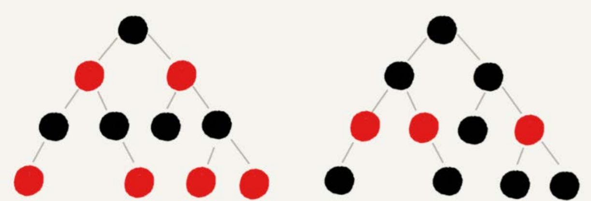

（忽略第二点要求）

### 近似平衡

平衡二叉搜索树的初衷，是为了解决二叉搜索树因为动态更新导致的性能退化问题。所以，“平衡”的意思可以等价为性能不退化。“近似平衡”就等价为性能不会退化的太严重。

二叉搜索树很多操作的性能都跟树的高度成正比。一棵极其平衡的二叉树（满二叉树或完全二叉树）的高度大约是$\log_2n$，所以如果要证明红黑树是近似平衡的，我们只需要分析，红黑树的高度是否比较稳定地趋近$\log_2n$就好了。

如果我们将红色节点从红黑树中去掉，那单纯包含黑色节点的红黑树的高度是多少呢？

红色节点删除之后，有些节点就没有父节点了，它们会直接拿这些节点的祖父节点（父节点的父节点）作为父节点。所以，之前的二叉树就变成了四叉树。

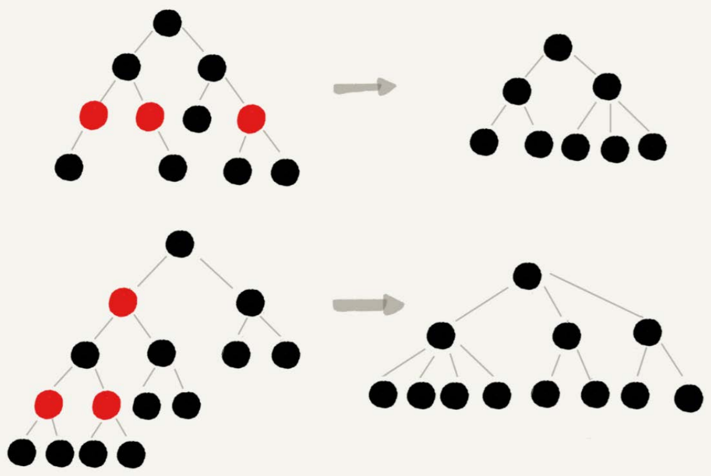

红黑树的定义里有这么一条：从任意节点到可达的叶子节点的每个路径包含相同数目的黑色节点。

我们从四叉树中取出某些节点，放到叶节点位置，四叉树就变成了完全二叉树。所以，仅包含黑色节点的四叉树的高度，比包含相同节点个数的完全二叉树的高度还要小。

完全二叉树的高度近似$\log_2n$，这里的四叉“黑树”的高度要低于完全二叉树，所以去掉红色节点的“黑树”的高度也不会超过$\log_2n$。

现在知道只包含黑色节点的“黑树”的高度，那现在把红色节点加回去，高度会变成多少呢？

在红黑树中，红色节点不能相邻，也就是说，有一个红色节点就要至少有一个黑色节点，将它跟其他红色节点隔开。红黑树中包含最多黑色节点的路径不会超过$\log_2n$，所以加入红色节点之后，最长路径不会超过$2\log_2n$，也就是说，红黑树的高度近似$2\log_2n$。

所以，红黑树的高度只比高度平衡的AVL树的高度（$\log_2n$）仅仅大了一倍，在性能上，下降得并不多。这样推导出来的结果不够精确，实际上红黑树的性能更好。

### 实现

平滑过程的思路：遇到什么样的节点排布，就对应怎么去调整。只要按照这些固定的调整规则来操作，就能将一个非平衡的红黑树调整成平衡的。

在插入、删除节点的过程中，第三*（任何相邻的节点都不能同时为红色）*、第四点*（每个节点，从该节点到达其可达叶子节点的所有路径，都包含相同数目的黑色节点）*要求可能会被破坏，而“平衡调整”，实际上就是要把被破坏的第三、第四点恢复过来。

#### 左旋、右旋

- 左旋：围绕某个节点的左旋
- 右旋：围绕某个节点的右旋

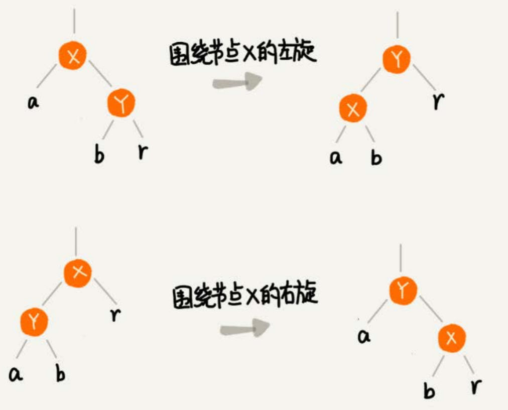

（a、b、r可以是子树，也可以为空）

#### 插入操作的平衡调整

**红黑树规定，插入的节点必须是红色的。**而且，二叉搜索树中新插入的节点都是放在叶子节点上。所以，关于插入操作的平衡调整，有这样两种特殊情况，但是也都非常好处理。

- 如果插入节点的父节点是黑色的，那什么都不用做，它仍然满足红黑树的定义。
- 如果插入的节点是根节点，那就直接改变它的颜色，把它变成黑色就可以了。

除此之外，其他情况都会违背红黑树的定义，于是我们就需要进行调整，调整的过程包含两种基础的操作：**左右旋转和改变颜色**。

红黑树的平衡调整过程是一个迭代的过程。把正在处理的节点叫作**关注节点**。关注节点会随着不停地迭代处理，而不断发生变化。最开始的关注节点就是新插入的节点。

新节点插入之后，如果红黑树的平衡被打破，那一般会有下面三种情况。我们只需要根据每种情况的特点，不停地调整，就可以让红黑树继续符合定义，也就是继续保持平衡。

> 把父节点的兄弟节点叫作**叔叔节点**，父节点的父节点叫作**祖父节点**

**Case 1**：如果关注节点是a，它的叔叔节点d是红色，就依次执行下面的操作：

1. 将关注节点a的父节点b、叔叔节点d的颜色都设置成黑色；
2. 将关注节点a的祖父节点c的颜色设置成红色；
3. 关注节点变成a的祖父节点c；
4. 跳到CASE 2或者CASE 3。

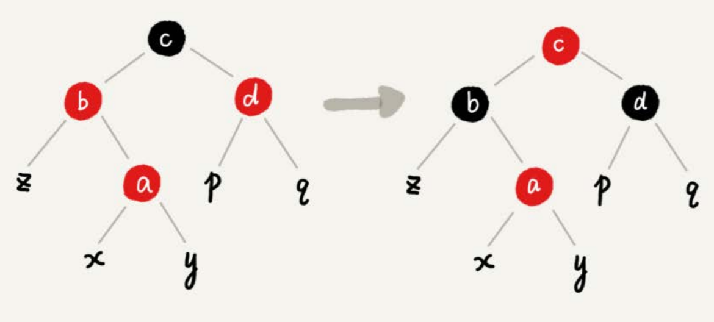

**Case 2**：如果关注节点是a，它的叔叔节点d是黑色，关注节点a是其父节点b的**右子节点**，就依次执行下面的操作：

1. 关注节点变成节点a的父节点b
2. 围绕新的关注节点b左旋
3. 跳到CASE 3

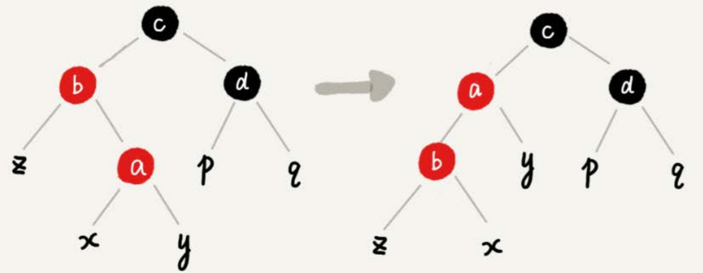

**Case 3**：如果关注节点是a，它的叔叔节点d是黑色，关注节点a是其父节点b的左子节点，就依次执行下面的操作：

1. 围绕关注节点a的**祖父节点**c右旋
2. 将关注节点a的父节点b、兄弟节点c的颜色互换
3. 调整结束

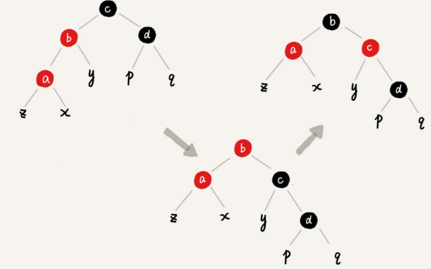

#### 删除操作的平衡调整

删除操作的平衡调整分为两步：

- 第一步是针对删除节点初步调整。初步调整只是保证整棵红黑树在一个节点删除之后，仍然满足最后一条定义的要求，也就是说，每个节点，从该节点到达其可达叶子节点的所有路径，都包含相同数目的黑色节点
- 第二步是针对关注节点进行二次调整，让它满足红黑树的第三条定义，即不存在相邻的两个红色节点。

##### 1.针对删除节点初步调整

> 经过初步调整之后，为了保证满足红黑树定义的最后一条要求，有些节点会被标记成两种颜色，“红-黑”或者“黑-黑”。如果一个节点被标记为了“黑-黑”，那在计算黑色节点个数的时候，要算成两个黑色节点。
>
> 如果一个节点既可以是红色，也可以是黑色，在画图的时候，使用一半红色一半黑色来表示。
>
> 如果一个节点是“红-黑”或者“黑-黑”，使用左上角的一个小黑点来表示额外的黑色。

**CASE 1**：如果要删除的节点是a，它只有一个子节点b，就依次进行下面的操作：

1. 删除节点a，并且把节点b替换到节点a的位置，这一部分操作跟普通的二叉查找树的删除操作一样
2. 节点a只能是黑色，节点b也只能是红色，其他情况均不符合红黑树的定义（ab都是红色，明显不行；ab都是黑色，则从节点a到b的兄弟节点，即黑NIL节点，包含两个黑色节点，而a到b的叶子节点，则包含了3个黑色节点，因为所有叶子节点都是黑色NIL节点；a红b黑，也违反了定义第四条）。这种情况下，需要把节点b改为黑色
3. 调整结束，不需要进行二次调整

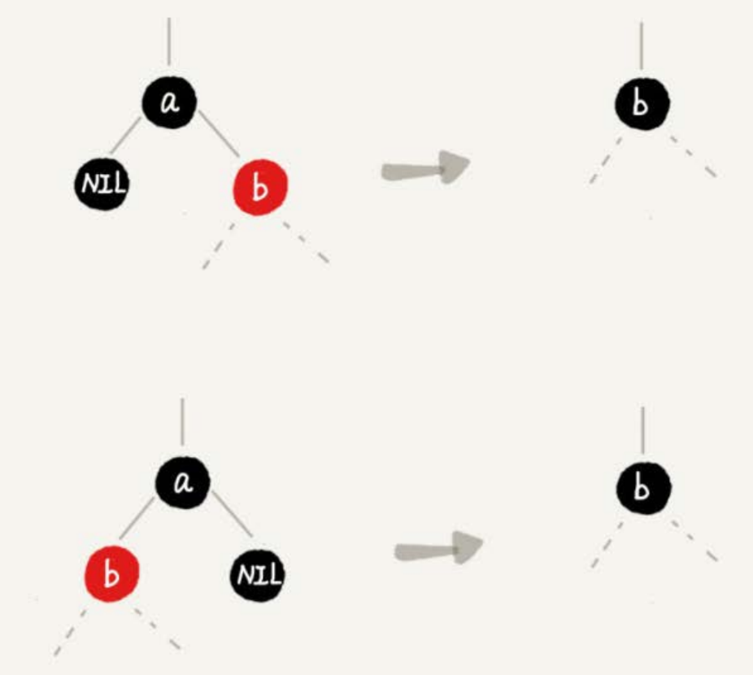

**CASE 2**：如果要删除的节点a有两个非空子节点（*找到右子树的最小值进行替换*），并且它的后继节点（按排序规则下一个节点）就是节点a的右子节点c。依次进行下面的操作：

1. 既然节点a的后继节点就是右子节点c，那右子节点c肯定没有左子树（因为没有比a大、比c小的元素）。我们把节点a删除，并且将节点c替换到节点a的位置。这一部分操作跟普通的二叉查找树的删除操作无异
2. 然后把节点c的颜色设置为跟节点a相同的颜色
3. 如果节点c是黑色，为了不违反红黑树的最后一条定义（因为从原本a的右子树拿走了一个黑的），我们给节点c的右子节点d多加一个黑色，这个时候节点d就成了“红-黑”或者“黑-黑”
4. 这个时候，关注节点变成了节点d，第二步的调整操作就会针对关注节点来做。

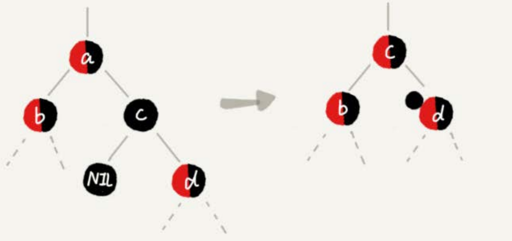

**CASE 3**：如果要删除的是节点a，它有两个非空子节点，并且节点a的后继节点不是右子节点，依次进行下面的操作

1. 找到后继节点d，并将它删除，删除后继节点d的过程参照CASE 1
2. 将节点a替换成后继节点d
3. 把节点d的颜色设置为跟节点a相同的颜色
4. 如果节点d是黑色，为了不违反红黑树的最后一条定义，我们给节点d的右子节点c多加一个黑色，这个时候节点c就成了“红-黑”或者“黑-黑”
5. 这个时候，关注节点变成了节点c，第二步的调整操作就会针对关注节点来做。

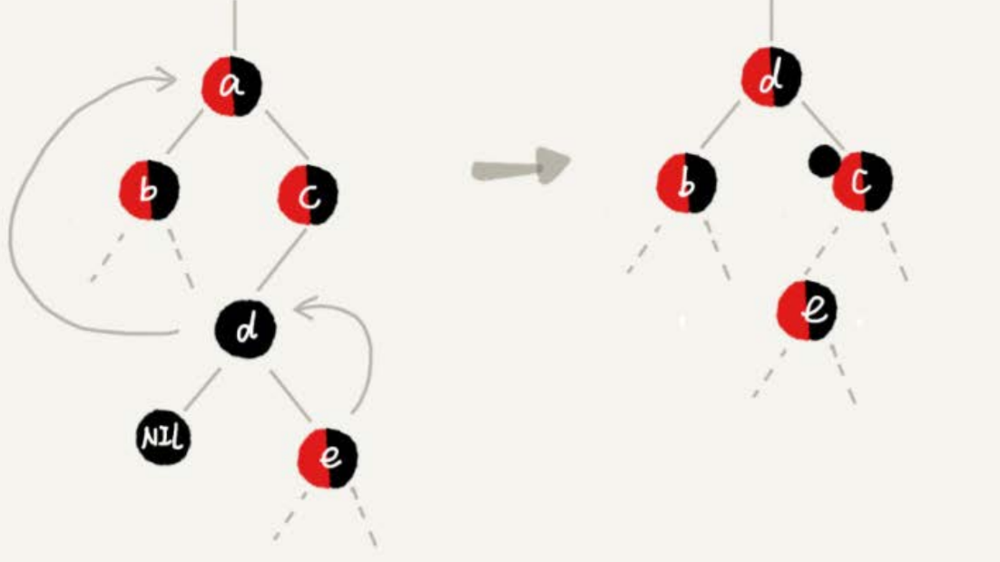

##### 2.针对关注节点进行二次调整

经过初步调整之后，关注节点变成了“红-黑”或者“黑-黑”节点。针对这个关注节点，再分四种情况来进行二次调整。二次调整是为了**让红黑树中不存在相邻的红色节点**。

**CASE 1**：如果关注节点是a，它的兄弟节点c是红色的，就依次进行下面的操作：

1. 围绕关注节点a的父节点b左旋
2. 关注节点a的父节点b和祖父节点c交换颜色
3. 关注节点不变
4. 继续从四种情况中选择适合的规则来调整

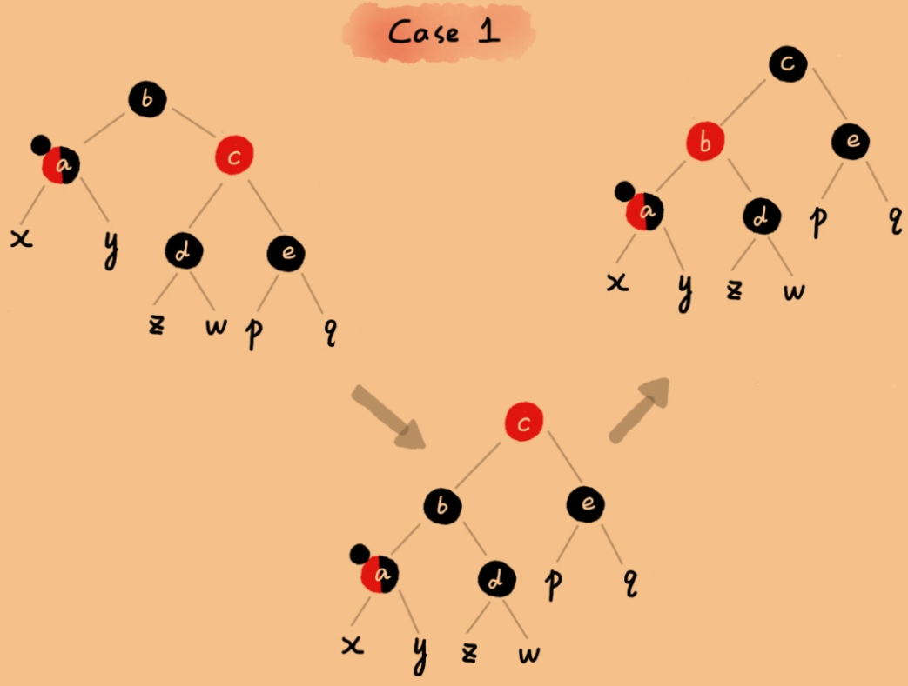

**CASE 2**：如果关注节点是a，它的兄弟节点c是黑色的，并且节点c的左右子节点d、e都是黑色的，就依次进行下面的操作：

1. 将关注节点a的兄弟节点c的颜色变成红色
2. 从关注节点a中去掉一个黑色，这个时候节点a就是单纯的红色或者黑色
3. 给关注节点a的父节点b添加一个黑色，这个时候节点b就变成了“红-黑”或者“黑-黑”
4. 关注节点从a变成其父节点b
5. 继续从四种情况中选择符合的规则来调整。

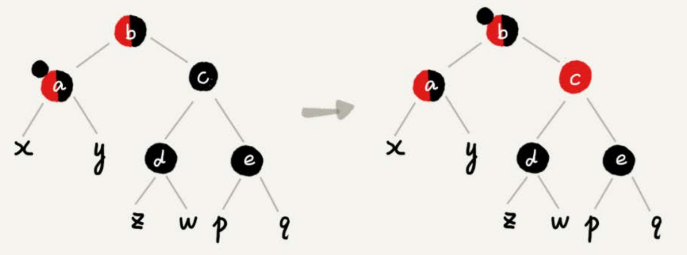

**CASE 3**：如果关注节点是a，它的兄弟节点c是黑色，c的左子节点d是红色，c的右子节点e是黑色，就依次进行下面的操作：

1. 围绕关注节点a的兄弟节点c右旋
2. 节点c和节点d交换颜色
3. 关注节点不变
4. 跳转到CASE 4，继续调整。

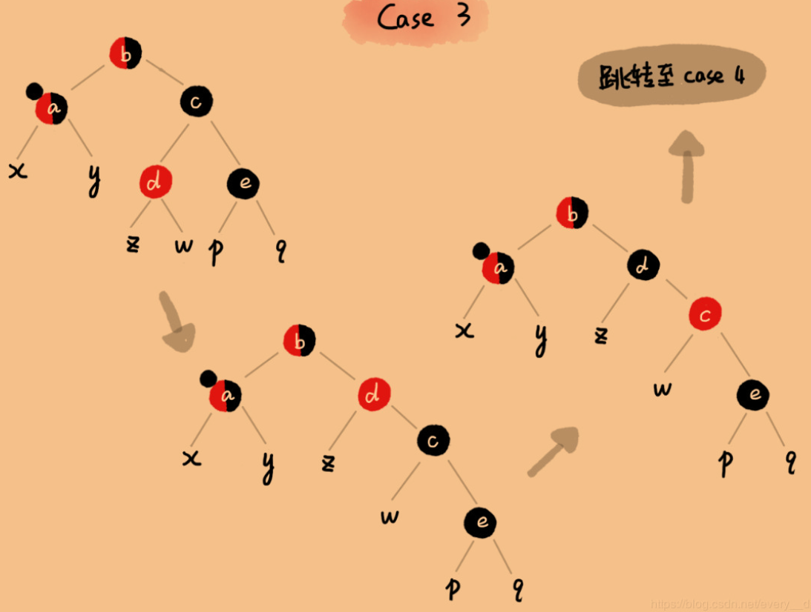

**CASE 4**：如果关注节点a的兄弟节点c是黑色的，并且c的右子节点是红色的，就依次进行下面的操作：

1. 围绕关注节点a的父节点b左旋
2. 将关注节点a的兄弟节点c的颜色，跟关注节点a的父节点b设置成相同的颜色
3. 将关注节点a的父节点b的颜色设置为黑色
4. 从关注节点a中去掉一个黑色，节点a就变成了单纯的红色或者黑色
5. 将关注节点a的叔叔节点e设置为黑色
6. 调整结束。

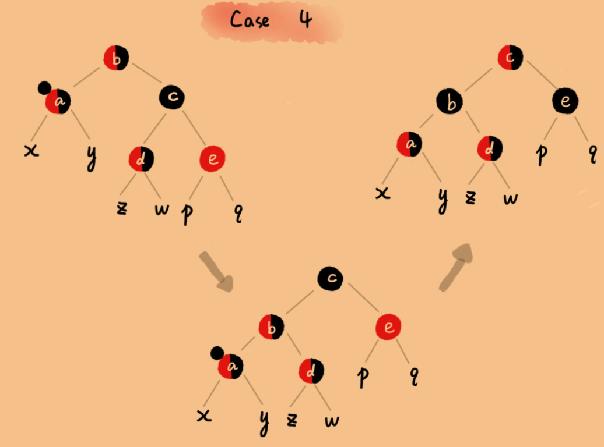

### 叶子节点为黑色空节点的解释

为了实现起来方便，因为只要满足这一条要求，那在任何时刻，红黑树的平衡操作都可以归结为上面几种情况。

假设红黑树的定义中不包含“叶子节点必须是黑色的空节点”，我们往一棵红黑树中插入一个数据，新插入节点的父节点也是红色的，两个红色的节点相邻，这个时候，红黑树的定义就被破坏了。那我们应该如何调整呢？

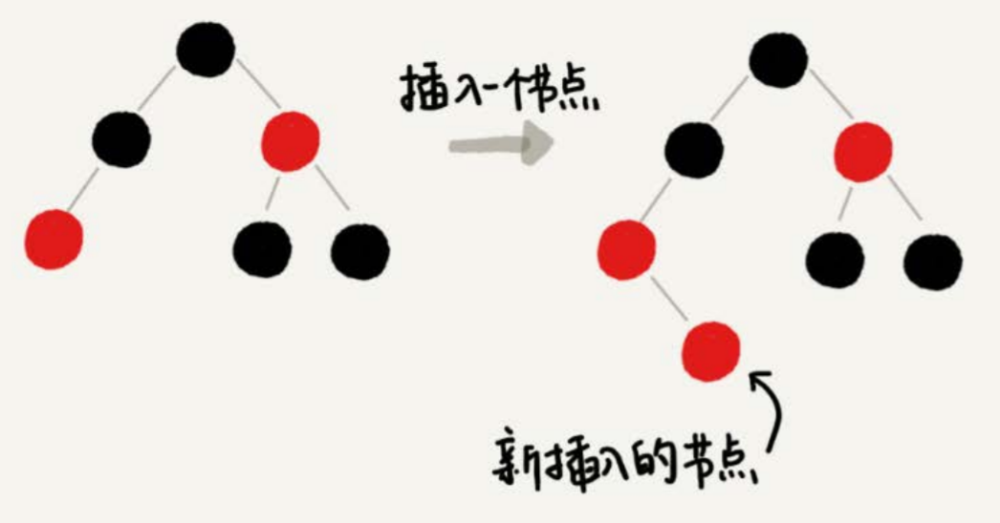

上面插入的几个case下的平衡调整规则，没有一种是适用的。但是，如果我们把黑色的空节点都给它加上，变成下面这样，它满足CASE 2了。

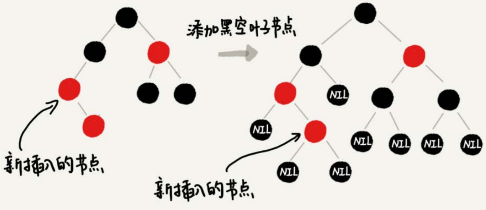

你可能会说，可以调整一下平衡调整规则啊。比如把CASE 2改为“如果关注节点a的叔叔节点b是黑色或者不存在，a是父节点的右子节点，就进行某某操作”。当然可以，但是这样的话规则就没有原来简洁了。

或者说给红黑树添加黑色的空的叶子节点，会不会比较浪费存储空间呢？

答案是不会的。虽然画图的时候，每个黑色的、空的叶子节点都是独立画出来的。实际上，在具体实现的时候，只需要像下面这样，共用一个黑色的、空的叶子节点就行了。

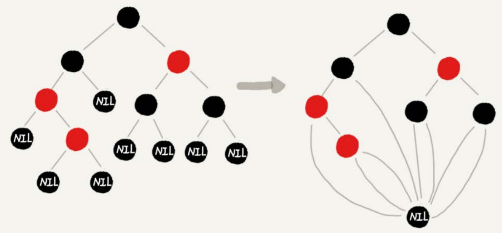