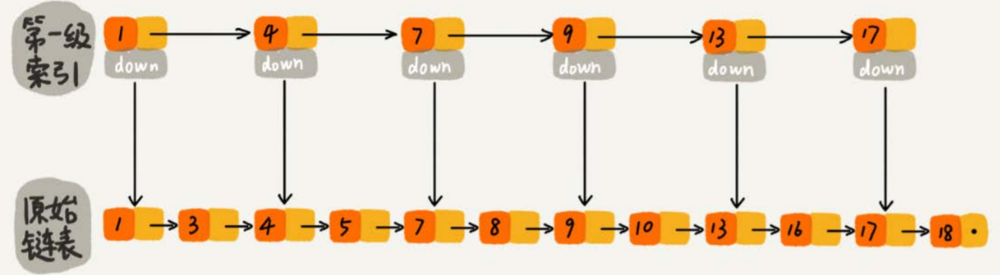
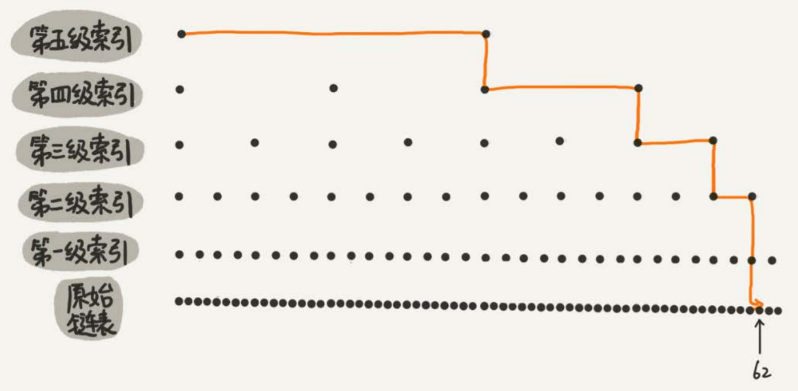
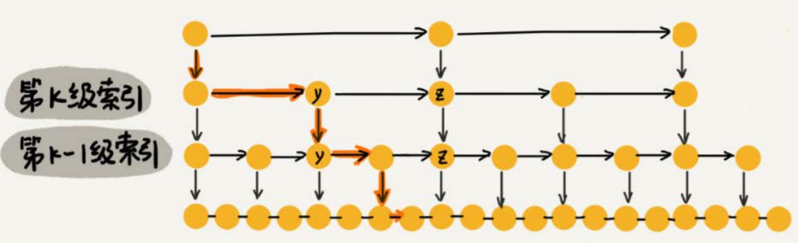

# 跳表

对链表进行改造，使其支持二分查找，改造得到的数据结构称为跳表(skip list)。Redis中的有序集合（Sorted Set）就是用跳表来实现的。

对于一个单链表来讲，即便链表中存储的**数据是有序的**，如果我们要想在其中查找某个数据，也只能从头到尾遍历链表。这样查找效率就会很低，时间复杂度会很高，是$O(n)$。

可以对链表建立索引：每两个结点提取一个结点到上一级，把抽出来的那一级叫作索引或索引层。

*图中的down表示down指针，指向下一级结点。*

要查找数据时，先遍历索引层，找到最后一个小于等于目标值的索引节点，然后下沉。

还可以在第一级索引的基础上，每两个结点抽出一个结点到第二级索引。

以64个元素为例，建立的索引如下：

原来没有索引的时候，查找62需要遍历62个结点，现在只需要遍历11个结点。

所以，当链表的长度n比较大时，比如1000、10000的时候，在构建索引之后，查找效率的提升就会非常明显。

## 时间复杂度

如果链表里有n个结点，会有多少级索引呢？

按照每两个结点会抽出一个结点作为上一级索引的结点，那第一级索引的结点个数大约就是$n/2$，第二级索引的结点个数大约就是$n/4$，第三级索引的结点个数大约就是$n/8$，依次类推，也就是说，第k级索引的结点个数是第k-1级索引的结点个数的1/2，那第k级索引结点的个数就是$n/(2^k)$。

假设索引有h级，最高级的索引有2个结点。通过上面的公式，可以得到$n/(2^h)=2$，从而求得$h=log_2n - 1$。如果包含原始链表这一层，整个跳表的高度就是$log_2n$。

我们在跳表中查询某个数据的时候，如果每一层都要遍历m个结点，那在跳表中查询一个数据的时间复杂度就是$O(m*logn)$。

假设我们要查找的数据是x，在第k级索引中，我们遍历到y结点之后，发现x大于y，小于后面的结点z，所以我们通过y的down指针，从第k级索引下降到第k-1级索引。在第k-1级索引中，y和z之间只有3个结点（包含y和z），所以，我们在K-1级索引中最多只需要遍历3个结点，依次类推，每一级索引都最多只需要遍历3个结点。

在这里$m=3$，所以时间复杂度是$O(log n)$。

## 空间复杂度

假设原始链表大小为n，那第一级索引大约有n/2个结点，第二级索引大约有n/4个结点，以此类推，每上升一级就减少一半，直到剩下2个结点。

即`[n/2, n/4, ……, 2]`，这是一个等比数列，求和得$n-2$，所以，跳表的空间复杂度是$O(n)$。

如果每三个结点，抽一个结点到上级索引，则每一层的额外节点数量为`[n/3, n/9, ……, 9, 3, 1]`，求和得$n/2$，尽管空间复杂度还是$O(n)$，但比每两个结点抽一个结点的索引构建方法，要减少了一半的索引结点存储空间。

实际使用中，原始链表中存储的有可能是很大的对象，而索引结点只需要存储关键值和几个指针，并不需要存储对象，所以当对象比索引结点大很多时，那索引占用的额外空间就可以忽略了。

## 高效的动态插入和删除

实际上，跳表不仅支持查找操作，还支持动态的插入、删除操作，而且插入、删除操作的时间复杂度也是$O(logn)$。

在单链表中，一旦定位好要插入的位置，插入结点的时间复杂度是很低的，就是$O(1)$。但是，这里为了保证原始链表中数据的有序性，我们需要先找到要插入的位置，这个查找操作就会比较耗时。

对于跳表，查找某个结点的的时间复杂度是$O(logn)$，所以插入的时间复杂度也是$O(logn)$。

删除也类似，但要注意，如果这个结点在索引中也有出现，除了要删除原始链表中的结点，还要删除索引中的。

## 动态更新索引

当我们不停地往跳表中插入数据时，如果不更新索引，就有可能出现某2个索引结点之间数据非常多的情况。极端情况下，跳表还会退化成单链表。

跳表通过**随机函数**维护“平衡性”。

当我们往跳表中插入数据的时候，可以选择同时将这个数据插入到部分索引层中。如何选择加入哪些索引层呢？

通过一个随机函数，来决定将这个结点插入到哪几级索引中，比如随机函数生成了值K，那我们就将这个结点添加到 第一级 到 第K级 这K级索引中。

## 实现

