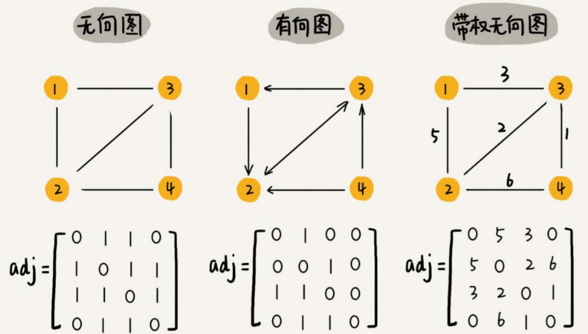

# 图

## 基本概念

例如社交网络中人与人之间的关系，每个用户可以看作一个顶点，用户间有关系则有边相连。

微信中，两个人互加好友，则类似连接**无向图**中两个顶点的边；微博中，A关注B，则类似在**有向图**中添加一条从A顶点指向B顶点的边。

无向图中有**度**的概念，表示一个顶点有多少条边。

有向图中，则把度分为**入度**（In-degree，有多少条边指向这个顶点）和**出度**（Out-degree，有多少条边是以这个顶点为起点指向其他顶点）。对应到微博的例子，入度就表示有多少粉丝，出度就表示关注了多少人。

**带权图**：边有权重


### 存储方法

#### 邻接矩阵

Adjacency Matrix，底层使用二维数组。

- 对于无向图来说，如果顶点$i$与顶点$j$之间有边，就将$A[i][j]$和$A[j][i]$标记为1
- 对于有向图来说，如果顶点$i$到顶点$j$之间，有一条箭头从顶点$i$指向顶点$j$的边，就将$A[i][j]$标记为1
- 对于带权图，数组中就存储相应的权重。



用邻接矩阵来表示一个图，优点是简单、直观，方便使用矩阵运算实现图的运算，缺点是比较浪费存储空间。

对于无向图来说，如果$A[i][j]$等于1，那$A[j][i]$也肯定等于1。实际上，我们只需要存储一个就可以了。也就是说，无向图的二维数组中，如果我们将其用对角线划分为上下两部分，那我们只需要利用上面或者下面这样一半的空间就足够了，另外一半白白浪费掉了。

如果我们存储的是**稀疏图**（Sparse Matrix），即有很多顶点，但每个顶点的边并不多，那邻接矩阵的存储方法就更加浪费空间了。比如微信有好几亿的用户，对应到图上就是好几亿的顶点。但是每个用户的好友并不会很多，一般也就三五百个而已。如果我们用邻接矩阵来存储，那绝大部分的存储空间都被浪费了。


#### 邻接表

Adjacency List，每个顶点对应一条链表，链表中存储的是与这个顶点相连接的其他顶点。


邻接表与邻接矩阵相比，就是用时间换空间。

就像图中的例子，如果我们要确定，是否存在一条从顶点2到顶点4的边，那我们就要遍历顶点2对应的那条链表，看链表中是否存在顶点4。而且，链表的存储方式对缓存不友好。所以，比起邻接矩阵的存储方式，在邻接表中查询两个顶点之间的关系就没那么高效了。

不过，我们也可以将链表换成高效的数据结构，例如平衡二叉搜索树、跳表等。


## 搜索

图上的搜索算法，最直接的理解就是，在图中找出从一个顶点出发，到另一个顶点的路径。具体方法有很多，比如两种最简单、最“暴力”的深度优先、广度优先搜索，还有A\*、IDA\*等启发式搜索算法。

以无向图为例，演示搜索算法。

```
type Graph struct {
	Count int // 顶点个数
	Adj [][]int // 邻接表
}

func NewGraph(count int) *Graph {
	return &Graph{	
		Count: count,
		Adj: make([][]int, count),
	}
}

func(this *Graph) AddEdge(a, b int) {
	if a >= this.Count || b >= this.Count {
		return
	}
	this.Adj[a] = append(this.Adj[a], b)
	this.Adj[b] = append(this.Adj[b], a)
}
```


### 广度优先BFS

**层层推进**，先查找离起始顶点最近的，然后是次近的，依次往外搜索。


```
func(this *Graph) BFS(a, b int) {
	if a == b {
		return
	}
	
	visited := [this.Count]bool // 记录顶点是否被访问
	visited[a] = true
	
	queue := []int{s} // 队列实现广度优先
	prev := [this.Count]int	// 记录每个顶点的前驱顶点
	for i := range prev {
		prev[i] = -1
	}
	
	for len(queue) != 0 {
		cur := queue[0]
		queue = queue[1:]
		for i := 0; i < len(this.Adj[cur]); i++ {
			next := this.Adj[cur][i]
			if !visited[next] {
				queue = append(queue, next)
				prev[next] = cur
				visited[next] = true
				if next == b {
					print(prev, a, b)
					return
				}
			}
		}
	}
}

func print(prev []int, a, b int) {
	if prev[b] != -1 && a != b {
		print(prev, a, prev[b])
	}
	fmt.Printf("%+v ", b)
}
```


### 深度优先DFS


（实线箭头表示遍历，虚线箭头表示回退。）

从图中可以看出，深度优先搜索找出来的路径，并不是顶点s到顶点t的最短路径。

```
var found bool
func(this *Graph) DFS(a, b int) {
	if a == b {
		return
	}
	
	found := false // 记录是否找到b
	visited := make([]bool, this.Count)
	prev := make([]int, this.Count)
	for i := range prev {
		prev[i] = -1
	}
	recurDFS(a, b, visited, prev)
	print(prev, a, b)
}

func(this *Graph) recurDFS(a, b int, visited []bool, prev []int) {
	visited[a] = true
	
	for i := 0; i < len(this.Adj[a]); i++ {
		next := this.Adj[a][i]
		if !visited[next] {
			prev[next] = a
			if b == next {
				found = true
				return
			}
			recurDFS(next, b, visited, prev)
		}
		if found {
			return
		}
	}
}
```


## 应用

### 微博用户关系

假设需要支持下列操作：

- 判断用户A是否关注了用户B
- 判断用户A是否被B关注
- 用户A关注用户B
- 用户A取消关注用户B
- 根据用户名称的首字母排序，分页获取用户的粉丝列表
- 根据用户名称的首字母排序，分页获取用户的关注列表

因为社交网络是一张稀疏图，使用邻接矩阵存储比较浪费存储空间，所以采用邻接表来存储。

但是仅用一个邻接表是不够的，查找某个用户关注了哪些用户非常容易，但是如果要想知道某个用户都被哪些用户关注了，即用户的粉丝列表，是非常困难的。

所以可以再用一个逆邻接表。

- 邻接表中存储了用户的关注关系，逆邻接表中存储的是用户的被关注关系。

- 对应到图上，邻接表中，每个顶点的链表中，存储的就是这个顶点指向的顶点。

  逆邻接表中，每个顶点的链表中，存储的是指向这个顶点的顶点。

- 如果要查找某个用户关注了哪些用户，可以在邻接表中查找；

  如果要查找某个用户被哪些用户关注了，从逆邻接表中查找。

基础的邻接表不适合**快速**判断两个用户之间是否是关注与被关注的关系，因为还需要按照用户名称的首字母排序，分页来获取用户的粉丝列表或者关注列表，用跳表这种结构再合适不过了。因为，跳表插入、删除、查找都非常高效，时间复杂度是$O(logn)$，空间复杂度上稍高，是$O(n)$。最重要的一点，跳表中存储的数据本来就是有序的了，分页获取粉丝列表或关注列表，就非常高效。


对于小规模的数据，比如社交网络中只有几万、几十万个用户，我们可以将整个社交关系存储在内存中。

但是如果像微博那样有上亿的用户，数据规模太大，我们就无法全部存储在内存中了。可以通过哈希算法等数据分片方式，将邻接表存储在不同的机器上。

例如下图，在机器1上存储顶点1，2，3的邻接表，在机器2上，存储顶点4，5的邻接表。逆邻接表的处理方式也一样。


当要查询顶点与顶点关系的时候，就利用同样的哈希算法，先定位顶点所在的机器，然后再在相应的机器上查找。

也可以使用硬盘存储，或者图数据库。


