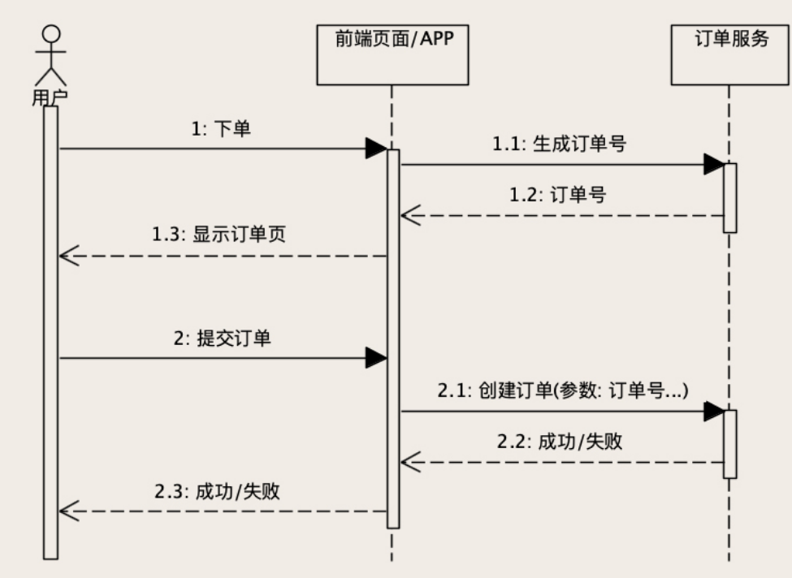

# 订单模块

## 功能

1. 创建订单
2. 随着购物流程更新订单状态
3. 查询订单，包括用订单数据生成各种报表


## 数据库

1. 订单主表：也叫订单表，保存订单的基本信息
2. 订单商品表：保存订单中的商品信息，存储每个商品的实际支付金额（折扣过后的，方便单一商品退款等操作）
3. 订单支付表：保存订单的支付和退款信息
4. 订单优惠表：保存订单使用的所有优惠信息

主表和其他表构成一对多的关系，主表的主键（订单号）作为关联外键。


## 挑战

**数据不能错**是订单系统最基本的要求，一个购物流程，从下单开始、支付、发货，直到收货，这么长的一个流程中，每一个环节，都少不了更新订单数据，每一次更新操作又需要同时更新好几张表。这些操作可能被随机分布到很多台服务器上执行，服务器有可能故障，网络有可能出问题。

为了保证订单数据的正确性，可以利用数据库事务，在同一个事务中操作多张表。


### 避免重复下单

订单系统提供创建订单的 HTTP 接口，用户在页面上通过“下单”进入订单确认页，然后点击“提交订单”按钮，浏览器就会给订单系统发一个创建订单的请求，订单系统的后端服务，在收到请求之后，往数据库的订单表插入一条订单数据，创建订单成功。

假如用户点击“提交订单”的按钮时手抖点了两下，浏览器发了两个 HTTP 请求，导致创建了两条一模一样的订单。这样肯定不行，需要做防重。可以在前端做防重，但是除了用户操作，网络错误也会导致重传，例如RPC框架的自动重试机制。

避免重复下单的方法是：**让订单服务具备幂等性**，无论提交订单的请求发送多少次，正确的结果是，数据库只有一条新创建的订单记录。这就需要让订单服务知道，接收的创建订单请求是不是重复的。不能简单的通过 订单用户、商品、价格 这些信息查询数据库是否有相同记录来判断，因为用户可能连续下两个相同的订单。

**订单号**是订单主表的主键，可以利用主键的**唯一约束**性质来解决这个问题。如果插入的数据不带主键，数据库会自动生成一个主键；而如果插入的数据带有主键，且该主键已存在，插入就会失败。

订单系统提供“生成订单号”的服务，当用户点击“下单”按钮进入订单确认页时，就访问该服务获取一个全局唯一的订单号，在提交订单时带上这个订单号作为主键。数据库的唯一约束就可以保证，只有一次 INSERT 语句是执行成功的，这样就实现了创建订单服务幂等性。



> 如果因为重复订单导致插入订单表失败，订单服务不要把这个错误返回给前端页面。否则，就有可能出现这样的情况：用户点击创建订单按钮后，页面提示创建订单失败，而实际上订单却创建成功了。正确的做法是，遇到这种情况，订单服务直接返回订单创建成功就可以了。


### ABA问题

ABA问题是指，先后有A、B两个对同一数据的修改请求，且AB两个操作都成功了，但由于网络原因，A修改的响应信息丢失了，触发重试，又向服务器发送A请求，又对数据进行修改，导致数据的状态与期望不一致。

> 比如说，订单支付之后，小二要发货，发货完成后要填个快递单号。假设小二填了一个单号 666，刚填完，发现填错了，赶紧再修改成 888。对订单服务来说，这就是 2 个更新订单的请求。
>
> 正常情况下，订单中的快递单号会先更新成 666，再更新成 888，这是没问题的。
>
> 那不正常情况呢？666 请求到了，单号更新成 666，然后 888 请求到了，单号又更新成 888，但是 666 更新成功的响应丢了，调用方没收到成功响应，自动重试，再次发起 666 请求，单号又被更新成 666 了，这数据显然就错了。


订单系统各种**更新订单**的服务一样也要具备**幂等性**。这可以通过类似乐观锁的思想实现，为订单主表增加`version`字段，每次查询订单的时候，`version`需要随着订单数据返回给页面。页面在更新数据的请求中，需要把`version`作为更新请求的参数，带回给订单更新服务。

订单服务在更新数据的时候，需要比较订单当前数据的版本号，是否和消息中的版本号一致，如果不一致就拒绝更新数据。如果版本号一致，还需要在更新数据的同时，把版本号 +1。“比较版本号、更新数据和版本号 +1”，这个过程必须在同一个事务里面执行。

```
UPDATE orders set tracking_number = 666, version = version + 1
WHERE version = 8;
```

通过`version`，就可以保证，从打开这条订单记录开始，一直到更新这条订单记录成功，这个期间没有其他人修改过这条订单数据。因为，如果有其他人修改过，数据库中的版本号就会改变，那当前的更新操作就不会执行成功，只能重新查询新版本的订单数据，然后再尝试更新。


