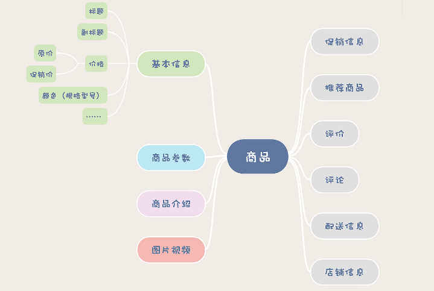
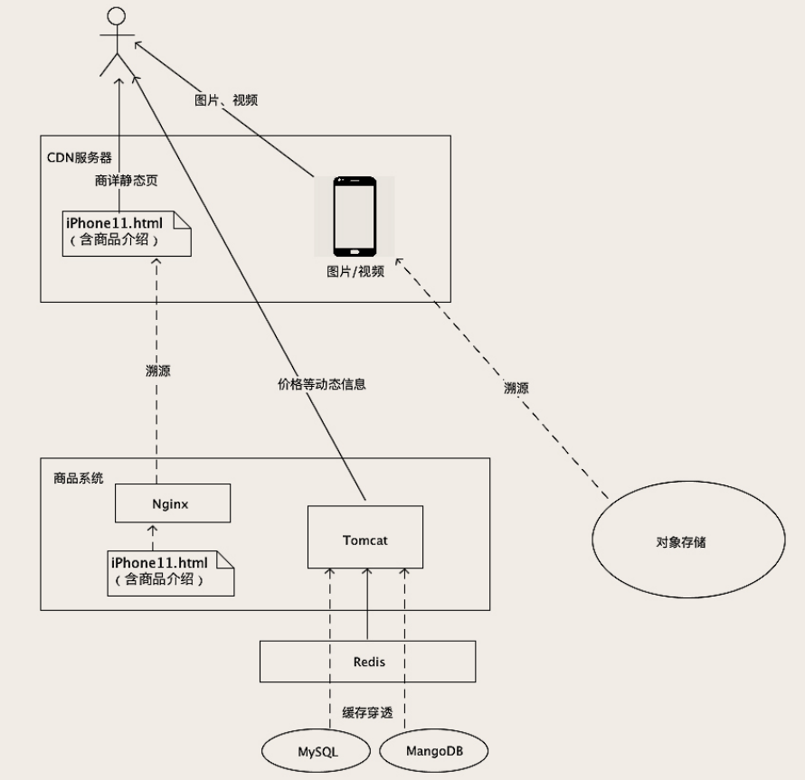

# 商品模块

商品模块主要功能是对商品信息的增删改查，主要是商品详情页（商详）。主要的挑战是高并发和数据规模。商品数量多，SKU可能在大约在几亿到几十亿这个量级，并且每个商品详情页的内容很丰富，不光有大量文字，还会有图片和视频。

## 保存的数据种类

> 只考虑左边的信息，右边部分来自电商的其他系统

直接把所有的信息都存到MySQL的一个或多个表中，虽然可行，但应对不了高并发和大规模的数据。应该根据每种信息的特点选择最合适的存储方式。

### 基本信息

包括商品的主副标题、价格、颜色等一些商品最基本、主要的属性。这些属性都是固定的，不太可能会因为需求或者不同的商品而变化，而且，这部分数据也不会太大。

可以考虑使用MySQL的一张表存这些信息，并加一个缓存抵挡绝大部分的读请求。更新基本信息后，也要把缓存中的数据删掉，即Cache Aside。

设计商品基本信息表的时候，**一定要记得保留商品数据的每一个历史版本**。因为商品数据是随时变化的，但是订单中关联的商品数据，必须是下单那个时刻的商品数据，这一点很重要。你可以为每一个历史版本的商品数据保存一个快照，可以创建一个历史表保存到 MySQL 中，也可以保存到一些 KV 存储中。

### 商品参数

商品参数是商品的特征，比如电脑的内存大小、手机的屏幕尺寸、酒的度数、口红的色号等等。和商品的基本属性一样，都是结构化的数据。但是不同类型的商品，它的参数也是不同的。

如果为每种类型的商品设计一个参数表，虽然可行但是灵活性差。

可以考虑使用NoSQL技术，例如MongoDB，用来存储属性不固定的结构化数据很方便。MongoDB 中的每一行数据，在存储层就是简单地被转化成 BSON 格式后存起来， BSON 就是一种更紧凑的 JSON。所以，即使在同一张表里面，它每一行数据的结构都可以是不一样的。当然，这样的灵活性也是有代价的，MongoDB 不支持 SQL，多表联查和复杂事务比较孱弱，不太适合存储一般的数据。不过在商品参数的业务场景下，也不需要这些功能。

### 商品介绍

商品介绍在商详页中占得比重是最大的，包含了大量的带格式文字、图片和视频。其中图片和视频自然要存放在对象存储里面，商品介绍的文本，一般都是随着商详页一起**静态化**，保存在 HTML 文件中。

静态化即：提前为每个商品生成好商详页，保存在一个HTML文件中，因为商品介绍内容很少发生改变，而商详页里的动态信息（例如价格、库存）在加载页面时通过异步请求获取即可。

静态化之后，这些HTML文件也可以存放在对象存储中。

### 图片视频

图片和视频一般会占用比较大的存储空间，所以在数据库中存放它们的ID或者URL，实际内容存放在对象存储中。一般对象存储还支持CDN，响应时间更快。

并且访问对象存储的文件，不需要经过后端服务，速度快还减轻了服务器的压力。

对象存储针对图片和视频还做了一些优化，例如缩放图片和视频转码，只要把图片和视频丢到对象存储中，就可以随时获得任意尺寸大小的图片，视频也会自动转码成各种格式和码率的版本，适配各种 App 和场景。

## 总体结构

> 实线表示每访问一次商详页，需要真正传输的数据。
>
> 虚线表示当商详页数据发生变化的时候才需要进行一次数据传输。

## 调价问题

用户下单这个时刻，正好赶上商品调价，就有可能出现这样的情况：我明明在商详页看到的价格是 10 块钱，下单后，怎么变成 15 块了？

用户体验不好，并且这不是小概率事件，因为当系统的用户足够多的时候，每时每刻都有人在下单，这几乎是个必然出现的事件。要怎么解决这个问题呢？

对商品信息的历史数据也进行保存，并对每一次变更记录一个自增的版本号。在下单的请求中，除了带上商品的ID，还要带上版本号。订单服务以**请求中的商品版本号对应的价格**创建订单，就可以避免下单时突然变价的问题。

但有一个限制，请求中的版本号必须是当前版本号或者上一个版本号。如果是上一个版本号，还会有时间限制，例如调价5秒后，就不接受上一个版本的请求。

