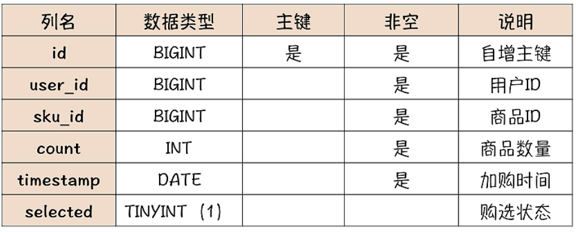

# 购物车模块

购物车对数据可靠性要求不高，性能也没有特别的要求。

功能主要就三个：把商品加入购物车（“加购”）、购物车列表页、发起结算下单。

购物车需要存储的数据主要有商品ID、数量、加购时间、勾选状态等。

> “勾选状态”属性，就是在购物车界面中，每件商品前面的那个小对号，表示在结算下单时，是不是要包含这件商品。至于商品价格和总价、商品介绍等等这些信息，都可以实时从其他系统中获取，不需要购物车系统来保存。


## 设计原则

1. 用户没登录，在浏览器中加购，关闭浏览器再打开，刚才加购的商品还在不在？

   > 如果用户没登录，加购的商品也会被保存在用户的电脑里，这样即使关闭浏览器再打开，购物车的商品仍然存在。

2. 用户没登录，在浏览器中加购，然后登录，刚才加购的商品还在不在？

   > 登录前加购的商品就会被自动合并到用户名下，所以登录后购物车中仍然有登录前加购的商品。

3. 关闭浏览器再打开，上一步加购的商品在不在？

   > 关闭浏览器再打开，这时又变为未登录状态，但是之前未登录时加购的商品已经被合并到刚刚登录的用户名下了，所以购物车是空的。

4. 再打开手机，用相同的用户登录，第二步加购的商品还在不在呢？

   > 使用手机登录相同的用户，看到的就是该用户的购物车，这时无论你在手机 App、电脑还是微信中登录，只要是相同的用户，看到是同一个购物车，所以第二步加购的商品是存在的。

可以得出以下原则：

1. 如果未登录，需要临时**暂存购物车的商品**；
2. 用户登录时，把暂存购物车的商品合并到用户购物车中，并且清除暂存购物车；
3. 用户登陆后，购物车中的商品，需要在浏览器、手机 APP 和微信等等这些终端中都保持同步。

因此，购物车系统需要保存两类购物车：未登录情况下的“暂存购物车”，登录后的“用户购物车”。


## 暂存购物车

暂存购物车只需要保存在客户端即可，例如浏览器的Cookie或者LocalStorage，Session并不合适，因为它的保留时间短，并且Session的数据是存在服务端的。

使用 Cookie 和 LocalStorage 最关键的区别是，客户端和服务端的每次交互，都会自动带着 Cookie 数据往返，这样服务端可以读写客户端 Cookie 中的数据，而 LocalStorage 里的数据，只能由客户端来访问。

使用 Cookie 存储，实现起来比较简单，加减购物车、合并购物车的过程中，由于服务端可以读写 Cookie，这样全部逻辑都可以在服务端实现，并且客户端和服务端请求的次数也相对少一些。

但是Cookie的存储容量只有4KB，而LocalStorage 支持大得多的存储容量，并且不会像Cookie一样，在每次请求时都被带上，可以节省带宽。

选择 Cookie 或者是 LocalStorage 来存储暂存购物车都没问题，可以根据它俩各自的优劣势来选择。对于小型电商，用 Cookie 存储实现起来更简单。如果电商是面向批发的行业用户，用户需要加购大量的不同商品，那 Cookie 可能容量不够用，选择 LocalStorage 就更合适。

不管使用哪种存储，暂存购物车保存的数据格式都是一样的：

```
{
    "cart": [
        {
            "SKUID": 8888,
            "timestamp": 1578721136,
            "count": 1,
            "selected": true
        }, {
            "SKUID": 6666,
            "timestamp": 1578721138,
            "count": 2,
            "selected": false
        }
    ]
}
```


## 用户购物车

因为用户购物车必须要保证多端的数据同步，所以数据必须保存在服务端。



> 需要在 `user_id` 上建一个索引，因为查询购物车表时，都是以 `user_id `作为查询条件来查询的。

也可以使用Redis存储，创建一个购物车哈希表，以用户ID作为key，value为购物车的内容。


### MySQL vs Redis

- 使用 Redis 性能要比 MySQL 高出至少一个量级，响应时间更短，可以支撑更多的并发请求。
- MySQL 的数据可靠性是要好于 Redis 的，因为 Redis 是异步刷盘，如果出现服务器掉电等异常情况，Redis 是有可能会丢数据的。但考虑到购物车里的数据，对可靠性要求也没那么苛刻，丢少量数据的后果也就是，个别用户的购物车少了几件商品，问题也不大。
- MySQL支持丰富的查询方式和事务机制，这两个特性对购物车场景可能没什么用。但是，每一个电商系统都有它个性化的需求，如果需要以其他方式访问购物车的数据，比如统计一下今天加购的商品总数，这时，使用 MySQL 存储数据，就很容易实现，而使用 Redis 存储，查询起来就非常麻烦而且低效。

综合比较下来，考虑到需求总是不断变化，还是更推荐使用 MySQL 来存储购物车数据。

如果不考虑需求变化这个因素，牺牲一点点数据可靠性，换取大幅性能提升，选择 Redis 才是最优解。


### Redis + MySQL ？

把购物车数据存在 MySQL 中，并且用 Redis 来做缓存，不就可以兼顾两者的优势了。


考虑购物车的场景，读写比例差距不大，如果以Cache Aside方式使用缓存，就需要经常删除缓存，数据库压力并没有减轻多少。并且，每个用户只能访问自己的购物车，每次访问网站也不会打开很多次购物车，缓存这么多用户的购物车成本高，而缓存命中率并不高。

缓存命中率不高，且引入缓存还会增大系统的复杂度，因此没必要设置缓存，除非是超大规模的系统。

