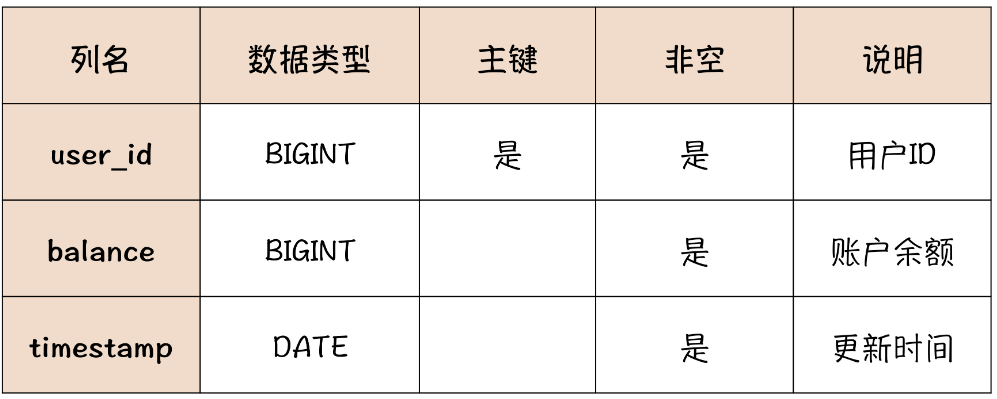
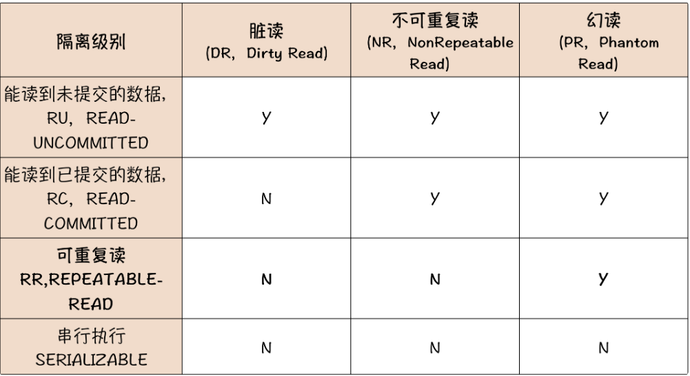

# 账户模块

账户系统负责记录和管理用户账户的**余额**，下图是一个最小化的账户系统数据模型：




## 对不上账

虽然账户表的结构很简单，但账户模块经常要和其他模块打交道，例如财务、订单、交易等。理想情况下，账户系统内的数据应该是自洽的。所有用户的账户余额加起来，应该等于这个电商公司在银行专用账户的总余额。账户系统的数据也应该和其他系统的数据能对的上。比如说，每个用户的余额应该能和交易系统中充值记录，以及订单系统中的订单对的上。

但由于业务和系统的复杂性，比如业务变化、人为修改了数据、系统之间数据交换失败等等，导致对不上账，所以，稍微大型一点儿的系统，都会有一个专门的对账系统，来核对、矫正账户系统和其他系统之间的数据差异。

我们只关注技术原因导致的对不上账，例如网络请求错误，服务器宕机、系统 Bug 等。“对不上账”的本质问题是，**冗余数据的一致性问题**。

这里面的冗余数据并不是多余或者重复的数据，而是多份**含有相同信息**的数据。比如，我们完全可以通过用户的每一笔充值交易数据、消费的订单数据，来计算出这个用户当前的账户余额是多少。也就是说，账户余额数据和这些账户相关的交易记录，都含有“账户余额”这个信息，那它们之间就互为冗余数据。

在设计系统的存储时，原则上不应该存储冗余数据，一是浪费存储空间，二是让这些冗余数据保持一致是一件非常麻烦的事儿。但有些场景下存储冗余数据是必要的，比如用户账户的余额这个数据。

这个数据在交易过程中会被非常频繁地用到，总不能每次交易之前，先通过所有历史交易记录计算一下当前账户的余额，这样做速度太慢了，性能满足不了交易的需求。所以账户系统保存了每个用户的账户余额，这实际上是一种用**存储空间换计算时间**的设计。

如果说只是满足功能需求，账户系统只记录余额，每次交易的时候更新账户余额就够了。但是这样做有一个问题，如果账户余额被篡改，是没有办法追查的，所以在**记录余额的同时，还需要记录每一笔交易记录，也就是账户的流水**。流水的数据模型至少需要包含：流水 ID、交易金额、交易时间戳以及交易双方的系统、账户、交易单号等信息。

虽然说，流水和余额也是互为冗余数据，但是记录流水，可以有效地修正由于系统 Bug 或者人为篡改导致的账户余额错误的问题，也便于账户系统与其他外部系统进行对账，所以账户系统记录流水是非常必要的。

在设计账户流水时，有几个重要的原则必须遵守，最好是用技术手段加以限制。

1. **流水记录只能新增，一旦记录成功不允许修改和删除**。即使是由于正当原因需要取消一笔已经完成的交易，也不应该去删除交易流水。正确的做法是再记录一笔“取消交易”的流水。
2. 流水号必须是递增的，方便用流水号确定交易的先后顺序。

> 在对账的时候，一旦出现了流水和余额不一致，并且无法通过业务手段来确定到底是哪儿记错了的情况，一般的处理原则是以交易流水为准来修正余额数据，这样才能保证后续的交易能“对上账”。


## 数据库事务

为了保证账户系统中流水和余额数据一致，在设计对外提供的服务接口时，不能提供单独更新余额或者流水的功能，只提供交易功能。在实现交易功能的时候，同时记录流水并修改余额，并且要尽可能保证，在任何情况下，记录流水和修改余额这两个操作，要么都成功，要么都失败。这可以通过数据库事务实现。

- Atomic：记录流水和更新余额这两个操作，要么都成功，要么都失败，即使是在数据库宕机、应用程序退出等等这些异常情况下，也不会出现，只更新了一个表而另一个表没更新的情况
- Consistency：数据库中的数据总是从一个一致性状态转换到另外一个一致性状态。对于其他事务来说，不存在任何中间状态。
- Isolation：由于事务执行需要时间，在执行时，一定存在某个时刻，流水更新了，但余额还没有更新，即处于中间状态。隔离性保证中间状态对其他事务不可见。
- Durability：只要事务提交成功，数据一定会被持久化到磁盘中，后续即使发生数据库宕机，也不会改变事务的结果。


### 隔离级别

要严格实现ACID，就只能串行执行所有事务了，导致性能很差，因此MySQL提供了四个隔离级别，供我们进行性能和ACID的权衡。对账户系统和其他大多数交易系统来说，事务的原子性和持久性是必须要保证的，否则就失去了使用事务的意义，而一致性和隔离性其实可以做适当牺牲，来换取性能。



- 脏读：读到未提交的数据
- 不可重复读：在一个事务中，由于其他事务对数据进行修改并提交，导致先后对这个数据的查询返回不同的结果
- 幻读：由于事务的隔离性，看不见其他事务新增的数据（假设主键为A），但如果要去插入一行主键为A的数据，就会报主键冲突错误

一般情况下，RC或者RR的隔离级别就够用了。


## 解决方案

为账户余额表新增一个`log_id`字段，记录最后一笔交易的流水号。

每当发生一笔交易时：

1. 首先开启事务，查询并记录当前账户的余额和最后一笔交易的流水号。

2. 然后写入流水记录。

3. 再更新账户余额，需要在更新语句的 WHERE 条件中限定，**只有流水号等于之前查询出的流水号时才更新**（类似乐观锁）。同时要判断余额是否会被扣为负数。

   > 更新账户余额后，不能只检查更新语句是不是执行成功了，还需要检查**返回值中变更的行数是不是等于 1**。因为即使流水号不相等，余额没有更新，这条更新语句的执行结果仍然是成功的，只是更新了 0 条记录。

4. 然后检查更新余额的返回值，如果更新成功就提交事务，否则回滚事务。

```
CREATE TABLE `account_log` (
  `log_id` int NOT NULL AUTO_INCREMENT COMMENT '流水号',
  `amount` int NOT NULL COMMENT '交易金额',
  `timestamp` datetime NOT NULL COMMENT '时间戳',
  `from_system` int NOT NULL COMMENT '转出系统编码',
  `from_system_transaction_number` int DEFAULT NULL COMMENT '转出系统的交易号',
  `from_account` int DEFAULT NULL COMMENT '转出账户',
  `to_system` int NOT NULL COMMENT '转入系统编码',
  `to_system_transaction_number` int DEFAULT NULL COMMENT '转入系统的交易号',
  `to_account` int DEFAULT NULL COMMENT '转入账户',
  `transaction_type` int NOT NULL COMMENT '交易类型编码',
  PRIMARY KEY (`log_id`)
);

CREATE TABLE `account_balance` (
  `user_id` int NOT NULL COMMENT '用户ID',
  `balance` int NOT NULL COMMENT '余额',
  `timestamp` datetime NOT NULL COMMENT '时间戳',
  `log_id` int NOT NULL COMMENT '最后一笔交易的流水号',
  PRIMARY KEY (`user_id`)
);
```


