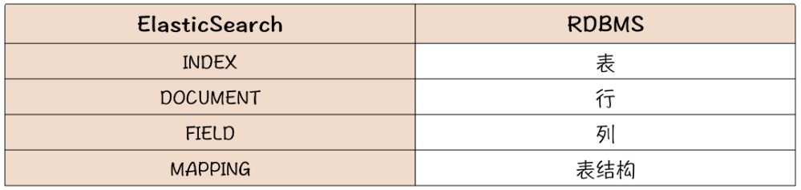

# 商品搜索模块

商品搜索的本质就是字符串匹配，可以通过SQL的`like`实现，但是需要走全表扫描，性能很差。一般会利用ElasticSearch 的**倒排索引机制**实现搜索功能。流程如下：

1. 对商品标题进行分词
2. 针对分词后的每一个单词，构建一个 <单词 -> 商品ID>的记录

倒排索引相比于一般数据库采用的 B 树索引，它的写入和更新性能都比较差，因此倒排索引也只是适合全文搜索，不适合更新频繁的交易类数据。

## ES概念

虽然 ES 是为搜索而生的，但本质上，它仍然是一个存储系统。ES 里面的一些概念，基本上都可以在关系数据库中找到对应的名词。

ES提供了RESTful接口，例如通过PUT方法创建INDEX，通过POST方法往INDEX写入数据，通过GET方法进行搜索等。

## 搜索推荐

在搜索框输入时，会有搜索提示功能，展示相关的搜索关键词。

用户每输入一个字都可能会发请求查询搜索框中的搜索推荐。所以搜索推荐的请求量远高于搜索框中的搜索。es针对这种情况提供了suggestion api，并提供专门的数据结构应对搜索推荐，性能高于match，但它应用起来也有局限性，就是只能做前缀匹配。再结合pinyin分词器可以做到输入拼音字母就提示中文。

如果想做非前缀匹配，可以考虑Ngram。不过Ngram有些复杂，需要开发者自定义分析器。比如有个网址www.geekbang.com，用户可能记不清具体网址了，只记得网址中有2个e，此时用户输入ee两个字母也是可以在搜索框提示出这个网址的。

