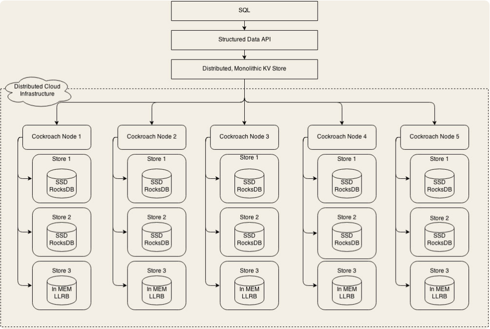
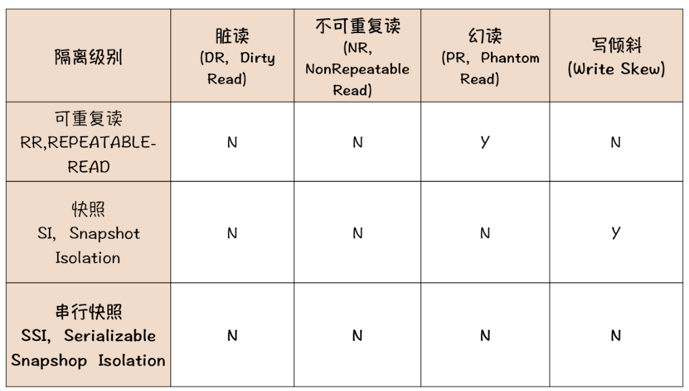
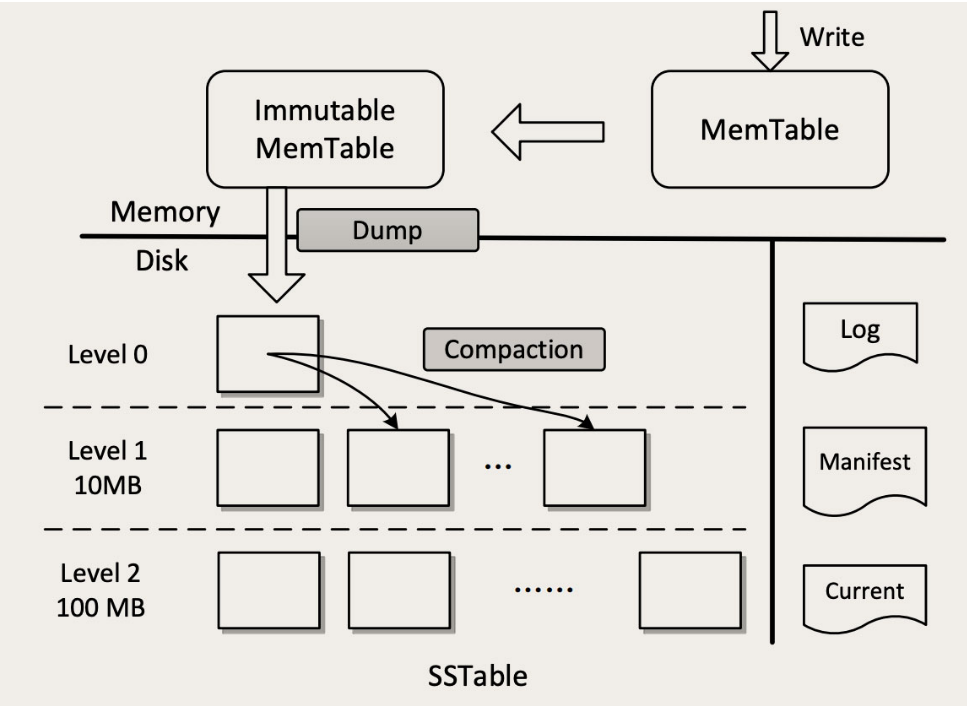

# NewSQL

早期只有像 MySQL 这样的**关系数据库**，这种关系型数据库因为支持 SQL 语言，后来被叫做 SQL 或者 Old SQL。

然后，出现了Redis 和很多 KV 存储系统，性能上各种吊打 MySQL，而且存储结构简单，比较容易组成分布式集群，并且能够做到水平扩展、高可靠、高可用。因为这些 KV 存储不支持 SQL，为了以示区分，被统称为 No SQL。但是NoSQL 牺牲了**SQL 这种强大的查询能力和 ACID 事务支持**，并不能完全取代Old SQL。

而 New SQL 就是兼顾了 Old SQL 和 NoSQL 的优点：

- 完整地支持 SQL 和 ACID，提供和 Old SQL 隔离级别相当的事务能力
- 高性能、高可靠、高可用，支持水平扩容

像 Google 的 Cloud Spanner、国产的 OceanBase 以及开源的CockroachDB都属于 New SQL 数据库。


## CockroachDB 

CockroachDB 实现了数据分片和弹性扩容，它采用了非常典型的分层架构。从上往下看，最上层是 SQL 层，SQL 层支持和关系型数据库类似的逻辑数据结构，比如库、表、行和列这些逻辑概念。SQL 层向下调用的是一个抽象的接口层 Structured Data API，实际实现这个 API 的是下面一层：Distributed, Monolithic KV Store，这就是一个分布式的 KV 存储系统。

这个架构也是大部分数据库都采用的二层架构：执行器和存储引擎。它的 SQL 层就是执行器，下面的分布式 KV 存储集群就是它的存储引擎。



CockroachDB 的分片算法采用的是范围分片，对查询是最友好的，可以很好地支持范围扫描这一类的操作，这样有利于它支撑上层的 SQL 查询。

它采用Raft一致性协议来实现每个分片的高可靠、高可用和强一致。 Raft 协议的理论基础之一，就是复制状态机，并且在复制状态机的基础上，Raft 实现了集群自我监控和自我选举来解决高可用的问题。

CockroachDB 的元数据直接分布在所有的存储节点上，依靠gossip协议来传播，和 redis cluster 一样。

在单机的存储引擎上，更是直接使用了 RocksDB 作为它的 KV 存储引擎。


### 事务支持

关系型数据库的事务隔离级别有RU、RC、RR和SERIALIZABLE，CockroachDB 提供的隔离级别则是另外两种：**Snapshot Isolation (SI)** 和 **Serializable Snapshot Isolation (SSI)**，其中 SSI 是 CockroachDB 默认的隔离级别。下图是这两种隔离级别与 RR 的对比。



> **写倾斜**
>
> 以账户余额的例子来说明。比如说，我们的账户需要支持主副卡，主卡和副卡都分别有自己的余额，并且这个余额是可以透支的，只要满足主副卡的余额之和大于 0 就行了。如果我们需要给主卡支出 100 元，那 SQL 只要这样写就可以了：
>
> ```sql
> update account
> set balance = balance - 100 -- 在主卡中扣减100元
> where id = ? and
>   (select balance from account where id = ?) -- 主卡余额
>   +
>   (select balance from account where id = ?) -- 附卡余额
>   >= 100; -- 主副卡余额之和必须大于100元
> ```
>
> 在传统的 RR 隔离级别下，由于更新数据时会对记录加锁，即使更新主副卡的两个 SQL 分别在两个事务中并发执行，也不会出现把主副卡的余额之和扣减成负数的情况。
>
> 但是在 SI 级别下，由于它没有加锁，而是采用快照的方式来实现事务的隔离，这个时候，如果并发地去更新主副卡余额，是有可能出现把主副卡余额之和扣减为负数的情况的。这种情况称为**写倾斜**，它表达的，就是**因为没有检测读写冲突，也没有加锁，导致数据写错了。**

SSI 隔离级别在 SI 的基础上，加入了冲突检测的机制，通过检测读写冲突，然后回滚事务的方式来解决写倾斜的问题，当然这种方式付出的代价是降低性能，并且冲突严重的情况下，会频繁地出现事务回滚。

从理论上来说，CockroachDB 支持的 SI 和 SSI 这两种事务隔离级别，能提供的事务隔离性，已经与传统的 RC 和 RR 隔离级别不相上下了，可以满足大多数在线交易类系统对 ACID 的要求。


## RocksDB

CockroachDB 的存储引擎是一个分布式的 KV 存储集群，它用了一系列成熟的技术来解决集群问题，但是在集群的每个节点上，还需要一个单机的 KV 存储来保存数据，这个地方 CockroachDB 直接使用 RocksDB 作为它的 KV 存储引擎。

Redis 是一个缓存，RocksDB 是数据库存储引擎。Redis 的数据都是保存在内存中的，从 Redis 官方给出的测试数据来看，它的随机读写性能大约在 50 万次 / 秒左右。而 RocksDB 相应的随机读写性能大约在 20 万次 / 秒左右，虽然性能还不如 Redis，但是已经可以算是同一个量级的水平了。

> Redis 是一个内存数据库，并不是一个可靠的存储。数据写到内存中就算成功了，它并不保证安全地保存到磁盘上。
>
> 而 RocksDB 是一个持久化的 KV 存储，它**需要保证每条数据都要安全地写到磁盘上**，这也是很多数据库产品的基本要求。而磁盘的读写性能和内存读写性能差着一两个数量级，读写磁盘的 RocksDB，能和读写内存的 Redis 做到相近的性能，这就是 RocksDB 的价值所在了。

一个存储系统，它的读写性能主要取决于它的存储结构，也就是数据是如何组织的。RocksDB 采用了一个非常复杂的数据存储结构，并且这个存储结构采用了内存和磁盘混合存储方式，使用磁盘来保证数据的可靠存储，并且利用速度更快的内存来提升读写性能。或者说，RocksDB 的存储结构本身就自带了内存缓存。

内存缓存可以很好地提升读性能，但是写入数据的时候，还是要写磁盘的。因为，要保证数据持久化，数据必须真正写到磁盘上才行。RocksDB 为什么能做到这么高的写入性能？还是因为它特殊的数据结构。

大多数存储系统，为了能做到快速查找，都会采用树或者哈希表这样的存储结构，数据在写入的时候，必须写入到特定的位置上。比如在往 B+ 树中写入一条数据，必须按照 B+ 树的排序方式，写入到某个固定的节点下面。哈希表也是类似，必须要写入到特定的哈希槽中去。这些都是**随机写**。

而 RocksDB 的数据结构，可以让绝大多数写入磁盘的操作都是顺序写。无论是 SSD 还是 HDD 顺序写的性能都要远远好于随机写，这就是 RocksDB 能够做到高性能写入的根本原因。


### LSM-Tree

**The Log-Structured Merge-Tree**，是一种非常复杂的复合数据结构，它包含了 WAL（Write Ahead Log）、跳表（SkipList）和一个分层的有序表（SSTable，Sorted String Table）。



#### 写

在写入数据时，当 LSM-Tree 收到一个写请求，比如`PUT foo bar`，即把 Key foo 的值设置为 bar。首先，这条操作命令会被写入到磁盘的 WAL 日志中（图中右侧的 Log），这是一个顺序写磁盘的操作，性能很好。这个日志的唯一作用就是用于故障恢复，一旦系统宕机，可以从日志中把内存中还没有来得及写入磁盘的数据恢复出来。

写完日志之后，数据可靠性的问题就解决了。然后数据会被写入到内存中的 MemTable 中，这个 MemTable 就是一个按照 Key 组织的跳表（SkipList），跳表和平衡树有着类似的查找性能，但实现起来更简单一些。写 MemTable 是个内存操作，速度也非常快。数据写入到 MemTable 之后，就可以返回写入成功了。这里面有一点需要注意的是，**LSM-Tree 在处理写入的过程中，直接就往 MemTable 里写，并不去查找这个 Key 是不是已经存在了**。

内存中的 MemTable 不能无限地往里写，一是内存的容量毕竟有限，另外，MemTable 太大了读写性能都会下降。所以，MemTable 有一个固定的上限大小，一般是 32M。MemTable 写满之后，就被转换成 Immutable MemTable，然后再创建一个空的 MemTable 继续写。这个 Immutable MemTable，也就是只读的 MemTable，它和 MemTable 的数据结构完全一样，唯一的区别就是不允许再写入了。

Immutable MemTable 也不能在内存中无限地占地方，会有一个后台线程，不停地把 Immutable MemTable 复制到磁盘文件中，然后释放内存空间。每个 Immutable MemTable 对应一个磁盘文件，MemTable 的数据结构跳表本身就是一个有序表，写入的文件也是一个按照 Key 排序的结构，这些文件就是 SSTable。把 MemTable 写入 SSTable 这个写操作，因为它是把整块内存写入到整个文件中，这同样是一个顺序写操作。

到这里，虽然数据已经保存到磁盘上了，但还没结束，因为这些 SSTable 文件，虽然每个文件中的 Key 是有序的，但是文件之间是完全无序的，还是没法查找。这里 SSTable 采用了一个很巧妙的**分层合并机制**来解决乱序的问题。

SSTable 被分为很多层，越往上层，文件越少，越往底层，文件越多。每一层的容量都有一个固定的上限，一般来说，下一层的容量是上一层的 10 倍。当某一层写满了，就会触发后台线程往下一层合并，数据合并到下一层之后，本层的 SSTable 文件就可以删除掉了。合并的过程也是排序的过程，除了 Level 0（第 0 层，也就是 MemTable 直接 dump 出来的磁盘文件所在的那一层。）以外，每一层内的文件都是有序的，文件内的 KV 也是有序的，这样就比较便于查找了。


#### 读

查找的过程也是分层查找，先去内存中的 MemTable 和 Immutable MemTable 中找，然后再按照顺序依次在磁盘的每一层 SSTable 文件中去找，只要找到了就直接返回。这样的查找方式其实是很低效的，有可能需要多次查找内存和多个文件才能找到一个 Key，但实际的效果也没那么差，因为这样一个分层的结构，它会天然形成一个非常有利于查找的情况：**越是经常被读写的热数据，它在这个分层结构中就越靠上，对这样的 Key 查找就越快。**

比如说，最经常读写的 Key 很大概率会在内存中，这样不用读写磁盘就完成了查找。即使内存中查不到，真正能穿透很多层 SStable 一直查到最底层的请求还是很少的。另外，在工程上还会对查找做很多的优化，比如说，在内存中缓存 SSTable 文件的 Key，用布隆过滤器避免无谓的查找等来加速查找过程。这样综合优化下来，可以获得相对还不错的查找性能。


#### 删除

LSM-Tree 删除一条记录是通过追加写 tombstone 实现的，这会带来更大的读开销，并占用更大的存储空间。

在[Lethe: A Tunable Delete-Aware LSM Engine](https://cs-people.bu.edu/dstara/pdfs/Lethe.pdf) 论文中提出了一些[优化](https://zhuanlan.zhihu.com/p/291135599)， **保证 tombstone 存在的时间是 bounded 的**，尽量减少空间放大/写放大、提升吞吐。为了实现这一点，每个文件都记录了TTL。

