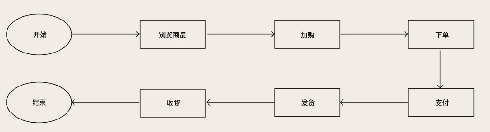
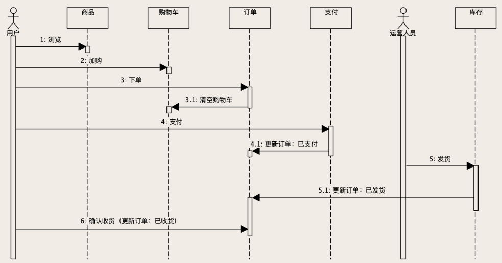

# 存储系统

以**电商平台**例子讲解存储技术的使用和挑战，在实现业务系统的时候，每个阶段的目标是不同的，面对的问题与挑战也不同。

## 电商平台背景知识

在设计功能前，需要先做好需求分析：

1. 系统的目标用户：买东西的用户、运营平台的人员、老板
2. 用户使用该系统解决什么问题：用户买东西、运营卖东西（进货发货、管理订单、维护商品信息）、老板看报表

购物流程：

根据流程划分功能模块：

商品、购物车、订单、支付、库存是核心功能模块，此外，还有促销、用户、账户、搜索推荐、报表等模块。

