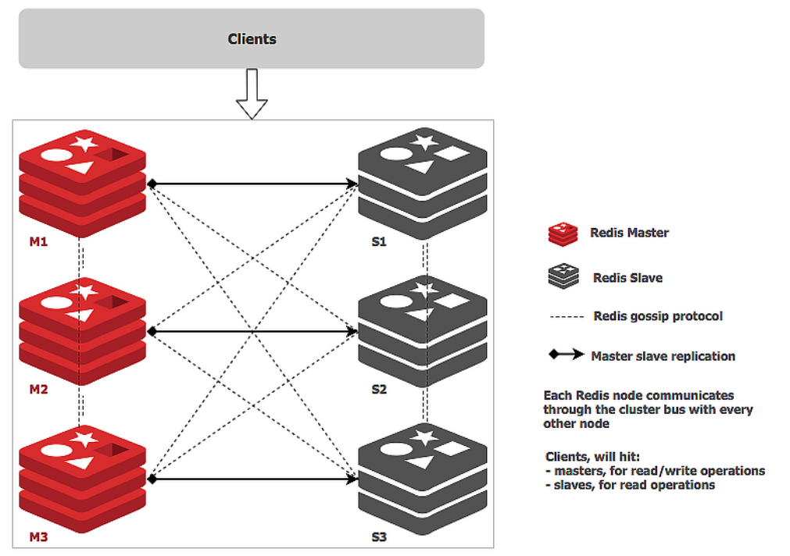
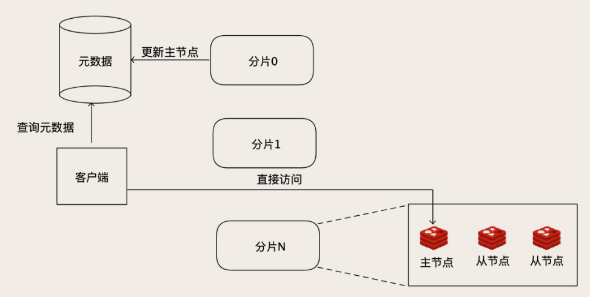

# Redis 集群

在应对存储相关的挑战时，一些通用的解决思路如下：

- 数据量太大，查询更新慢：存档历史数据或分库分表，即**数据分片**
- 并发太高：读写分离
- 高可用：主从复制，增加从节点，主节点宕机的时候用从节点顶上

## Redis Cluster

**Redis Cluster 相比于单个节点的 Redis，能保存更多的数据，支持更多的并发，并且可以做到高可用，在单个节点故障的情况下，继续提供服务。**

### 数据分片

为了能够保存更多的数据，和 MySQL 分库分表的方式类似，Redis Cluster 也是通过分片的方式，把数据分布到集群的多个节点上。

Redis Cluster引入了一个“槽（Slot）”的概念，这个槽就是哈希表中的哈希槽，槽是 Redis 分片的基本单位，每个槽里面包含一些 Key。每个集群的槽数是固定的 16384（16 * 1024）个，每个 Key 落在哪个槽中也是固定的，计算方法是：`HASH_SLOT = CRC16(key) mod 16384`。

这些槽又是如何存放到具体的 Redis 节点上的呢？这个映射关系保存在**集群的每个 Redis 节点**上，集群初始化的时候，Redis 会自动平均分配这 16384 个槽，也可以通过命令来调整。这个分槽的方法，就是查表法。

客户端可以连接集群的任意一个节点来访问集群的数据，当客户端请求一个 Key 的时候，被请求的那个 Redis 实例先进行哈希运算，计算出这个 Key 在哪个槽中，然后再查询槽和节点的映射关系，找到数据所在的真正节点，如果这个节点正好是自己，那就直接执行命令返回结果。如果数据不在当前这个节点上，那就给客户端返回一个重定向的命令，告诉客户端，应该去连哪个节点上请求这个 Key 的数据。然后客户端会再连接正确的节点来访问。

解决分片问题之后，Redis Cluster 就可以通过水平扩容来增加集群的存储容量，但是，每次往集群增加节点的时候，需要从集群的那些老节点中，搬运一些槽到新节点，可以手动指定哪些槽迁移到新节点上，也可以利用官方提供的`redis-trib.rb`脚本来自动重新分配槽，自动迁移。

### 主从复制

数据分片达到了存更多数据的目的，而主从复制则实现了高可用。

Redis Cluster 支持给每个分片增加一个或多个从节点，每个从节点在连接到主节点上之后，会先给主节点发送一个 SYNC 命令，请求一次全量复制，也就是把主节点上全部的数据都复制到从节点上。全量复制完成之后，进入同步阶段，主节点会把刚刚全量复制期间收到的命令，以及后续收到的命令持续地转发给从节点。

因为 Redis 不支持事务，所以它的复制相比 MySQL 更简单，连 Binlog 都省了，直接就是转发客户端发来的更新数据命令来实现主从同步。如果某个分片的主节点宕机了，集群中的其他节点会在这个分片的从节点中选出一个新的节点作为主节点继续提供服务。新的主节点选举出来后，集群中的所有节点都会感知到，这样，如果客户端的请求 Key 落在故障分片上，就会被重定向到新的主节点上。

### 读写分离

一般来说，Redis Cluster 进行了分片之后，每个分片都会承接一部分并发的请求，加上 Redis 本身单节点的性能就非常高，所以大部分情况下不需要再像 MySQL 那样做读写分离来解决高并发的问题。默认情况下，集群的读写请求都是由主节点负责的，从节点只是起一个热备的作用。当然了，Redis Cluster 也支持读写分离，在从节点上读取数据。

### gossip协议

Redis Cluster 的优点是易于使用。分片、主从复制、弹性扩容这些功能都可以做到自动化，通过简单的部署就可以获得一个大容量、高可靠、高可用的 Redis 集群，并且对于应用来说，近乎于是透明的。

所以，**Redis Cluster 是非常适合构建中小规模 Redis 集群**，这里的中小规模指的是，大概几个到几十个节点这样规模的 Redis 集群。

**Redis Cluster 不太适合构建超大规模集群，主要原因是，它采用了去中心化的设计。**Redis 的每个节点上，都保存了所有槽和节点的映射关系表，每当节点发生变化时，这个表是如何更新的呢？

Redis Cluster 采用 去中心化的流言 (Gossip) 协议来传播集群配置的变化，这个协议部署和维护简单，也能避免中心节点的单点故障，缺点就是**传播速度慢，并且是集群规模越大，传播的越慢**。

## 超大规模集群

- 基于代理：在客户端和 Redis 节点之间，还需要增加一层代理服务。这个代理服务有三个作用：

  - 负责在客户端和 Redis 节点之间转发请求和响应。客户端只和代理服务打交道，代理收到客户端的请求之后，再转发到对应的 Redis 节点上，节点返回的响应再经由代理转发返回给客户端。
  - 负责监控集群中所有 Redis 节点状态，如果发现有问题节点，及时进行主从切换。
  - 维护集群的元数据，这个元数据主要就是集群所有节点的主从信息，以及槽和节点关系映射表。

  开源的 Redis 集群方案twemproxy和Codis，就是基于代理的。

  这个架构最大的优点是对客户端透明，在客户端视角来看，整个集群和一个超大容量的单节点 Redis 是一样的。并且，由于分片算法是代理服务控制的，扩容也比较方便，新节点加入集群后，直接修改代理服务中的元数据就可以完成扩容。

  但因为增加了一层代理转发，每次数据访问的链路更长了，必然会带来一定的性能损失。而且，代理服务本身又是集群的一个单点，当然，也可以把代理服务也做成一个集群来解决单点问题，那样集群就更复杂了。

- 定制Redis客户端：将代理服务的寻址功能前移到客户端中去。客户端在发起请求之前，先去查询元数据，就可以知道要访问的是哪个分片和哪个节点，然后直连对应的 Redis 节点访问数据。

  客户端并不用每次都去查询元数据，因为这个元数据是不怎么变化的，客户端可以自己缓存元数据，这样访问性能基本上和单机版的 Redis 是一样的。如果某个分片的主节点宕机了，新的主节点被选举出来之后，更新元数据里面的信息。对集群的扩容操作也比较简单，除了迁移数据的工作必须要做以外，更新一下元数据就可以了。

  

  这个元数据服务仍然是一个单点，但是它的数据量不大，访问量也不大，相对就比较容易实现。

## 集群的局限

集群方案对一些类似于`KEYS`这类的多 KEY 命令，都没法做到百分百支持。因为数据被分片了之后，这种多 KEY 的命令很可能需要跨多个分片查询。当系统从单个 Redis 库升级到集群时，可能需要考虑一下这方面的兼容性问题。

