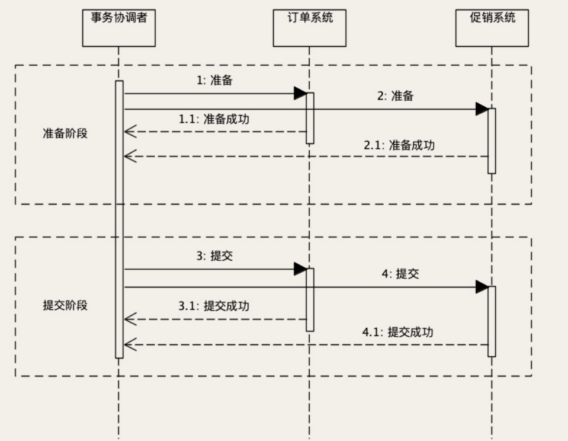
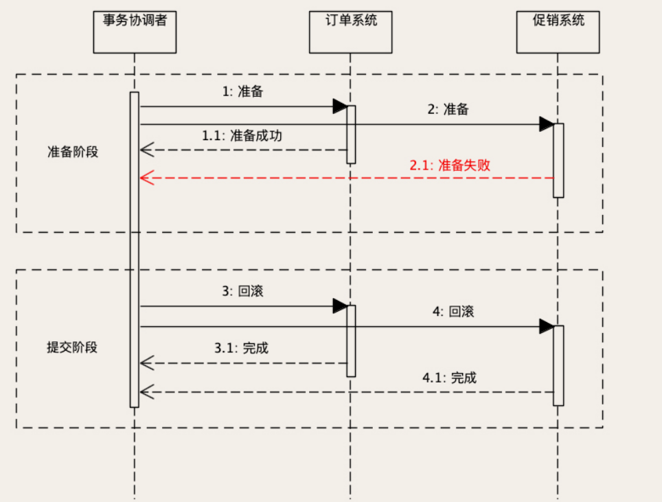

# 分布式事务

数据库事务可以保证一个系统内部的数据一致性，对于跨系统、跨数据库的交易，就不能简单的用单一的数据库事务了。在微服务时代，一个大系统被拆分成多个小的微服务，每个微服务独立部署并且拥有自己的数据库，大数据库也被打散成多个小的数据库。跨越微服务和数据库的交易就成为一种越来越普遍的情况。

为了实现跨系统、跨数据库的数据一致性问题，就需要用到分布式事务。

在分布式环境中，一个交易将会被分布到不同的系统中，多个微服务进程内执行计算，在多个数据库中执行数据更新操作，这个场景比数据库事务支持的单进程单数据库场景复杂太多了。所以，并没有什么分布式事务服务或者组件能在分布式环境下，提供接近数据库事务的数据一致性保证。

分布式事务的解决方案有很多，比如：2PC、3PC、TCC、Saga 和本地消息表等等。这些方法，它的强项和弱项都不一样，适用的场景也不一样。

## 2PC

以订单和优惠券的数据一致性问题为例，在购物下单时，如果使用了优惠券，订单系统和优惠券系统都要更新自己的数据，才能完成“在订单中使用优惠券”这个操作。

订单系统需要：

1. 在“订单优惠券表”中写入订单关联的优惠券数据；
2. 在“订单表”中写入订单数据。

订单系统内两个操作的一致性问题可以直接使用数据库事务来解决。促销系统需要操作就比较简单，把刚刚使用的那张优惠券的状态更新成“已使用”就可以了。我们需要这两个系统的数据更新操作保持一致，要么都更新成功，要么都更新失败。

2PC 引入了一个**事务协调者**的角色，来协调订单系统和促销系统，协调者对客户端提供一个完整的“使用优惠券下单”的服务，在这个服务的内部，协调者再分别调用订单和促销的相应服务。

二阶段指的是准备阶段和提交阶段。在准备阶段，协调者分别给订单系统和促销系统发送“准备”命令，订单和促销系统收到准备命令之后，开始执行准备操作，即除了提交数据库事务以外的所有工作。订单系统在准备阶段需要完成：

1. 在订单库开启一个数据库事务；
2. 在“订单优惠券表”写入这条订单的优惠券记录；
3. 在“订单表”中写入订单数据。

到这里还没有提交订单数据库的事务，最后给事务协调者返回“准备成功”。类似的，促销服务在准备阶段，需要在促销库开启一个数据库事务，更新优惠券状态，但是暂时不要提交这个数据库事务，给协调者返回“准备成功”。协调者在收到两个系统“准备成功”的响应之后，开始进入第二阶段。

等两个系统都准备好了之后，进入提交阶段。提交阶段就比较简单了，协调者再给这两个系统发送“提交”命令，每个系统提交自己的数据库事务，然后给协调者返回“提交成功”响应，协调者收到所有响应之后，给客户端返回成功响应，整个分布式事务就结束了。以下是这个过程的时序图：

在准备阶段，如果任何一步出现错误或者是超时，协调者就会给两个系统发送“回滚事务”请求。每个系统在收到请求之后，回滚自己的数据库事务，分布式事务执行失败，两个系统的数据库事务都回滚了，相关的所有数据回滚到分布式事务执行之前的状态，就像这个分布式事务没有执行一样。以下是异常情况的时序图：

如果准备阶段成功，进入提交阶段，这个时候整个分布式事务**只能成功，不能失败**。

如果发生网络传输失败的情况，需要反复重试，直到提交成功为止。如果这个阶段发生宕机，包括两个数据库宕机或者订单服务、促销服务所在的节点宕机，还是有可能出现订单库完成了提交，但促销库因为宕机自动回滚，导致数据不一致的情况。但是，因为提交的过程非常简单，执行很快，出现这种情况的概率非常小，所以，从实用的角度来说，2PC 这种分布式事务的方法，实际的数据一致性还是非常好的。

实现 2PC 的时候，没必要单独启动一个事务协调服务，这个协调服务的工作最好和订单服务或者优惠券服务放在同一个进程里面，这样做有两个好处：

1. 参与分布式事务的进程更少，故障点也就更少，稳定性更好；
2. 减少了一些远程调用，性能也更好一些。

2PC 是一种强一致的设计，它可以保证原子性和隔离性。只要 2PC 事务完成，订单库和促销库中的数据一定是一致的状态。所以 2PC 比较适合那些对数据一致性要求比较高的场景。

但是，整个事务的执行过程需要阻塞服务端的线程和数据库的会话，所以，2PC 在并发场景下的性能不会很高。并且，协调者是一个单点，一旦过程中协调者宕机，就会导致订单库或者促销库的事务会话一直卡在等待提交阶段，直到事务超时自动回滚。

卡住的这段时间内，数据库有可能会锁住一些数据，服务中会卡住一个数据库连接和线程，这些都会造成系统性能严重下降，甚至整个服务被卡住。

**所以，只有在需要强一致、并且并发量不大的场景下，才考虑使用 2PC。**

## 本地消息表

以订单和购物车的数据一致性问题为例，在购物流程中，用户在购物车界面选好商品后，点击“去结算”按钮进入订单页面创建一个新订单。这个过程系统其实做了两件事：

- 第一，**订单系统**需要创建一个新订单，订单关联的商品就是购物车中选择的那些商品。
- 第二，创建订单成功后，**购物车系统**需要把订单中的这些商品从购物车里删掉。

这也是一个分布式事务问题，创建订单和清空购物车这两个数据更新操作需要保证，要么都成功，要么都失败。但是，清空购物车这个操作，它对一致性要求就没有扣减优惠券那么高，订单创建成功后，晚几秒钟再清空购物车，完全是可以接受的。只要保证经过一个小的延迟时间后，最终订单数据和购物车数据保持一致就可以了。

本地消息表非常适合解决这种分布式**最终一致性**的问题。实现思路如下：

订单服务在收到下单请求后，正常使用订单库的事务去更新订单的数据，并且，在执行这个数据库事务过程中，在本地记录一条消息。这个消息就是一个日志，内容就是“清空购物车”这个操作。因为这个日志是记录在本地的，这里面没有分布式的问题，那这就是一个普通的单机事务，那我们就可以让订单库的事务，来保证记录本地消息和订单库的一致性。完成这一步之后，就可以给客户端返回成功响应了。

> 本地消息表，可以选择存在订单库中，也可以用文件的形式，保存在订单服务所在服务器的本地磁盘中，两种方式都是可以的，相对来说，放在订单库中更简单一些。
>
> RocketMQ 提供一种事务消息的功能，其实就是本地消息表思想的一个实现。使用事务消息可以达到和本地消息表一样的最终一致性，相比自己来实现本地消息表，使用起来更加简单。

然后再用一个异步的服务，去读取刚刚记录的清空购物车的本地消息，调用购物车系统的服务清空购物车。购物车清空之后，把本地消息的状态更新成已完成就可以了。异步清空购物车这个过程中，如果操作失败了，可以通过重试来解决。最终，可以保证订单系统和购物车系统它们的数据是一致的。

本地消息表这种方法，它只能满足 D（持久性），A（原子性）、C（一致性）、I（隔离性）都比较差，但是，它的优点非常突出。

首先，实现简单，在单机事务的基础上稍加改造就可以实现分布式事务，另外，本地消息表的性能非常好，和单机事务的性能几乎没有差别。在这个基础上，还提供了大部分情况下都能接受的“数据最终一致性”的保证，所以，本地消息表是更加实用的分布式事务实现方法。

当然，即使能接受数据最终一致，本地消息表也不是什么场景都可以适用的。它有一个前提条件就是，**异步执行的那部分操作，不能有依赖的资源。**比如说，我们下单的时候，除了要清空购物车以外，还需要锁定库存。

库存系统锁定库存这个操作，虽然可以接受数据最终一致，但是，锁定库存这个操作是有一个前提的，这个前提是：库存中得有货。这种情况就不适合使用本地消息表，不然就会出现用户下单成功后，系统的异步任务去锁定库存的时候，因为缺货导致锁定失败。这样的情况就很难处理了。

> 作为电商，可以容忍异常导致的多锁定库存，不能容忍少锁定库存（超卖）。本地消息表异步调用会导致超卖；2PC/3PC同步性能调用性能太差。
>
> 所以可以由调用方先后执行锁定库存及创建订单的接口：
>
> - 如果锁定库存成功，创建订单成功，返回成功
> - 如果锁定库存成功，创建订单失败，返回失败，由调用方重试，可能会导致多锁定库存
> - 如果锁定库存失败，则不再创建订单，返回失败，由调用方重试，可能会导致多锁定库存
>
> 那些因为异常导致的库存锁定，可以通过一些手段事后补偿，比如：找出长时间未释放的异常库存锁定，然后进行释放。

## 其他实现

**3PC**相比于2PC做了两个改进，一是事务执行器也增加了超时机制，避免因为协调者宕机，导致执行器长时间卡死的问题，另外，3PC在2PC之前增加一个询问阶段，这个阶段事务执行器可以去尝试锁定资源（但不等待），这样避免像2PC那样直接去锁定资源，而资源不可用的情况下，一直等待资源而卡住事务的情况。

**TCC**可以理解为业务层面的2PC（也有观点主张TCC和2PC是完全不同的），TCC同样分为Try和Confirm/Cancel 两个阶段，在Try阶段锁定资源，但不执行任何更新操作，Confirm阶段来执行所有更新操作并提交，如果失败进入Cancel阶段。Cancel阶段就是收拾烂摊子，把Confirm阶段做的数据更新都改回去，把Try阶段锁定的资源都释放。相比于2PC，TCC可以不依赖于本地事务，但是Cancel阶段的业务逻辑比较难实现。