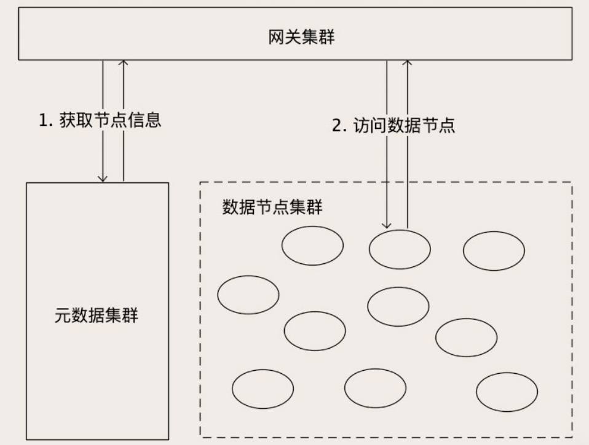
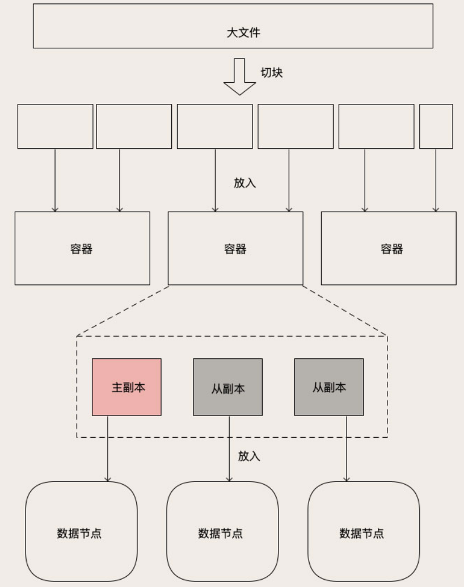

# 分布式存储

现在的分布式存储系统，如Elasticsearch、Ceph等，都具有一下特性：

- 近乎无限的存储容量
- 超高的读写性能
- 数据高可靠：节点磁盘损毁不会丢数据
- 服务高可用：节点宕机不会影响集群对外提供服务

它们实现特性的思路跟MySQL、redis等都是类似的。

## 对象存储

对象存储它的查询服务和数据结构都非常简单，是最简单的原生分布式存储系统。对象存储对外提供的服务，是一个近乎无限容量的大文件 KV 存储，所以对象存储和分布式文件系统之间，没有那么明确的界限。

### 架构

对象存储的内部，有很多的存储节点，用于保存这些大文件，这个就是**数据节点的集群**。

为了管理这些数据节点和节点中的文件，还需要一个存储系统保存**集群的节点信息、文件信息和它们的映射关系**。这些为了管理集群而存储的数据，叫做元数据 (Metadata)。

元数据对于一个存储集群来说是非常重要的，所以保存元数据的存储系统必须也是一个集群。但是**元数据集群存储的数据量比较少，数据的变动不是很频繁**，加之客户端或者网关都会缓存一部分元数据，所以元数据集群对并发要求也不高。一般使用类似ZooKeeper或者etcd这类分布式存储就可以满足要求。

存储集群为了对外提供访问服务，还需要一个**网关集群**，对外接收外部请求，对内访问元数据和数据节点。网关集群中的每个节点不需要保存任何数据，都是无状态的节点。有些对象存储没有网关，取而代之的是客户端，它们的功能和作用都是一样的。

处理读和写请求的流程是一样的，网关收到对象读写请求后，首先拿着请求中的 Key，去元数据集群查找这个 Key 在哪个数据节点上，然后再去访问对应的数据节点读写数据，最后把结果返回给客户端。

### 对象的保存

**在对象存储中，每一个大文件都会被拆成多个大小相等的块（Block）**，拆分的方法很简单，就是把文件从头到尾按照固定的大小，切成一块一块，最后一块的长度有可能不足一个块的大小，也按一块来处理。块的大小一般配置为几十 KB 到几个 MB 左右。把大文件拆分成块有这些优点：

- 提升读写性能，块可以分散到不同的数据节点上，实现并发读写
- 方便维护管理

对象拆分成块后，如果直接管理这些块，会导致元数据的数据量非常大，也没必要管理到这么细的粒度。所以一般都会再把块聚合一下，放到块的容器里面。“容器”就是存放一组块儿逻辑单元。类似数据库的分片，都是复制、迁移数据的基本单位。每个容器都会有 N 个副本，这些副本的数据都是一样的。其中有一个主副本，其他是从副本，主副本负责数据读写，从副本 去到 主副本上去复制数据，保证主从数据一致。

不过，对象存储在主从复制时，不像MySQL 复制 binlog日志，而是直接复制整块的数据，因为：

- 其实在操作日志里，就包含着数据。如果在更新时，先记录日志，在更新存储引擎中的数据，就相当于在磁盘上串行写了两次数据。对于像数据库这种，每次更新的数据都很少的存储系统，这个开销是可以接受的。但是对于对象存储来说，它每次写入的块很大，两次磁盘 IO 的开销就有些不太值得了。
- 对象存储的存储结构简单，即使没有日志，只要按照顺序，整块的复制数据，仍然可以保证主从副本的数据一致性。

对象被拆分并存储在数据节点上之后，访问对象时，即请求一个 Key 的时候，网关首先去元数据中查找这个 Key 的元数据。然后根据元数据中记录的容器信息，再去元数据中查找容器的 N 个副本都分布在哪些数据节点上。然后，网关直接访问对应的数据节点读写数据就可以了。

### 主从数据同步

对象存储并不是基于日志来进行主从复制的。如果一个对象存储系统是一主二从三个副本，采用半同步方式复制数据，也就是主副本和任意一个从副本更新成功后，就给客户端返回成功响应。主副本所在节点宕机之后，这两个从副本中，至少有一个副本上的数据是和宕机的主副本上一样的，我们需要找到这个副本作为新的主副本，才能保证宕机不丢数据。如果这两个从副本上的数据不一样，如何确定哪个上面的数据是和主副本一样新呢？

可以为对象增加”版本号“属性，在Leader上，KEY每更新一次，KEY的版本号就加1，版本号也复制到从节点上，通过比较版本号就可以知道哪个节点上的数据是最新的。

