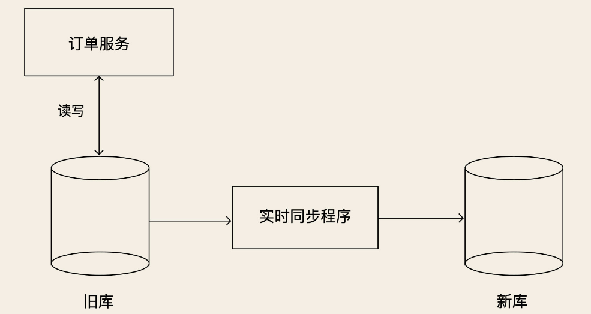
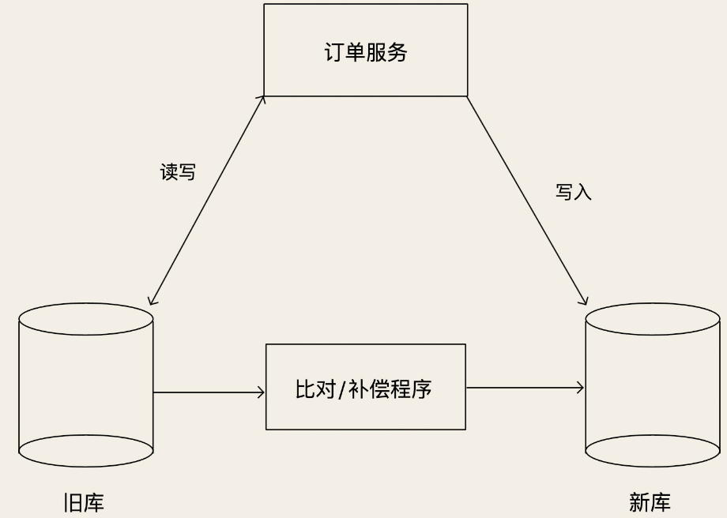

# 数据库在线迁移

随着系统规模逐渐增长，总会遇到需要更换数据库的问题，例如：

- 对 MySQL 做了分库分表之后，需要从原来的单实例数据库迁移到新的数据库集群上。
- 系统从传统部署方式向云上迁移的时候，也需要从自建的数据库迁移到云数据库上。
- 一些在线分析类的系统，MySQL 性能不够用的时候，就需要更换成一些专门的分析类数据库，比如说 HBase。

## 不停机更换数据库

> 墨菲定律：“如果事情有变坏的可能，不管这种可能性有多小，它总会发生。”

在更换数据库的过程中，只要有一点儿可能会出问题的地方，哪怕是出现问题的概率非常小，它总会出问题。所以在设计迁移方案的时候，一定要做到，每一步都是可逆的。**要保证，每执行一个步骤后，一旦出现问题，能快速地回滚到上一个步骤**。

以订单库为例子，介绍迁移方案的设计。

首先需要**把旧库的数据复制到新库中**。因为旧库还在服务线上业务，所以不断会有订单数据写入旧库，我们不仅要往新库复制数据，还要保证新旧两个库的数据是实时同步的。所以，我们需要**用一个同步程序来实现新旧两个数据库实时同步**。

我们可以使用 Binlog 实时同步数据。如果源库不是 MySQL 的话，就麻烦一点，但也可以参考复制状态机理论来实现。这一步不需要回滚，因为只增加了一个新库和一个同步程序，对系统的旧库和程序都没有任何改变。即使新上线的同步程序影响到了旧库，只要停掉同步程序就可以了。

然后需要**改造订单服务的DAO 层**：

- 支持**双写新旧两个库**，并且预留热切换开关，能通过开关控制三种写状态：只写旧库、只写新库和同步双写。
- 支持**读新旧两个库**，同样预留热切换开关，控制读旧库还是新库。

上线新版的订单服务，这个时候订单服务仍然是只读写旧库，不读写新库。让这个新版的订单服务稳定运行至少一到二周的时间，期间除了验证新版订单服务的稳定性以外，还要验证新旧两个订单库中的数据是否是一致的。这个过程中，如果新版订单服务有问题，可以立即下线新版订单服务，回滚到旧版本的订单服务。

稳定一段时间之后，就可以**开启订单服务的双写开关**了。开启双写开关的同时，需要停掉同步程序。这里面有一个问题需要注意一下，就是**这个双写的业务逻辑，一定是先写旧库，再写新库，并且以写旧库的结果为准**。

旧库写成功，新库写失败，返回写成功，但这个时候要记录日志，后续可以用这个日志来验证新库是否还有问题。旧库写失败，直接返回失败，就不写新库了。这么做的原因是，不能让新库影响到现有业务的可用性和数据准确性。上面这个过程如果出现问题，可以关闭双写，回滚到只读写旧库的状态。

切换到双写之后，新库与旧库的数据可能会存在不一致的情况，原因有两个：

- 停止同步程序和开启双写，这两个过程很难做到无缝衔接
- 双写的策略也不保证新旧库强一致，这时候需要上线一个对比和补偿的程序，这个程序对比旧库最近的数据变更，然后检查新库中的数据是否一致，如果不一致，还要进行补偿。

开启双写后，还需要至少稳定运行至少几周的时间，期间要不断地检查，确保不能有旧库写成功，新库写失败的情况出现。如果对比程序没有发现新旧两个库的数据出现不一致的情况，这个时候，我们就可以认为，新旧两个库的数据是一直保持同步的。

接下来就可以用类似灰度发布的方式，**把读请求一点儿一点儿地切到新库上**。同样，期间如果出问题的话，可以再切回旧库。全部读请求都切换到新库上之后，这个时候其实读写请求就已经都切换到新库上了，实际的切换已经完成了，但还有后续的收尾步骤。

再稳定一段时间之后，就**可以停掉对比程序，把订单服务的写状态改为只写新库。**到这里，旧库就可以下线了。注意，整个迁移过程中，只有这个步骤是不可逆的。但是，这步的主要操作就是摘掉已经不再使用的旧库，对于在用的新库并没有什么改变，实际出问题的可能性已经非常小了。

> 双写 切 新库单写这一步不可逆的主要原因是，一旦切为新库单写，旧库的数据就和新库不一致了，这时候就没法再切回旧库了。所以，问题的关键是，切到新库单写后，需要保证旧库的数据和新库保持同步。那我们的双写就要增加一种过渡状态：就是**从 双写 以旧库为准，过渡到 双写 以新库为准**。然后把比对和补偿程序反过来，用新库的数据补偿旧库的数据。这样就可以做到，一旦出问题，再切回到旧库上了。这样也可以使这个步骤可逆。

到这里，就完成了在线更换数据库的全部流程。双写版本的订单服务也就完成了它的历史使命，可以在下一次升级订单服务版本的时候，**下线双写功能**。

### 对比和补偿程序

如何实现这个对比和补偿程序，是整个这个切换设计方案中的一个难点。它的难度在于，要对比的是两个都在随时变换的数据库中的数据。**可以根据业务数据的实际情况，来针对性地实现对比和补偿**，经过一段时间，把新旧两个数据库的差异，逐渐收敛到一致。

像订单这类时效性强的数据，是比较好对比和补偿的。因为订单一旦完成之后，就几乎不会再变了，对比和补偿程序，就可以依据订单完成时间，每次只对比这个时间窗口内完成的订单。补偿的逻辑也很简单，发现不一致的情况后，直接用旧库的订单数据覆盖新库的订单数据就可以了。

这样，切换双写期间，少量不一致的订单数据，等到订单完成之后，会被补偿程序修正。后续只要不是双写的时候，新库频繁写入失败，就可以保证两个库的数据完全一致。

比较麻烦的是更一般的情况，比如像商品信息这类数据，随时都有可能会变化。如果说数据上有更新时间，那就以利用这个更新时间，每次在旧库取一个更新时间窗口内的数据，去新库上找相同主键的数据进行对比，发现数据不一致时，还要对比一下更新时间。如果新库数据的更新时间晚于旧库数据，那可能是对比期间数据发生了变化，这种情况暂时不要补偿，放到下个时间窗口去继续对比。另外，时间窗口的结束时间，不要选取当前时间，而是要比当前时间早一点儿，比如 1 分钟前，避免去对比正在写入的数据。

如果数据连时间戳也没有，那只能去旧库读取 Binlog，获取数据变化，然后去新库对比和补偿。

### 总结

1. 上线同步程序，从旧库中复制数据到新库中，并实时保持同步；
2. 上线双写订单服务，只读写旧库；
3. 开启双写，同时停止同步程序；
4. 开启对比和补偿程序，确保新旧数据库数据完全一样；
5. 逐步切量读请求到新库上；
6. 下线对比补偿程序，关闭双写，读写都切换到新库上；
7. 下线旧库和订单服务的双写功能。