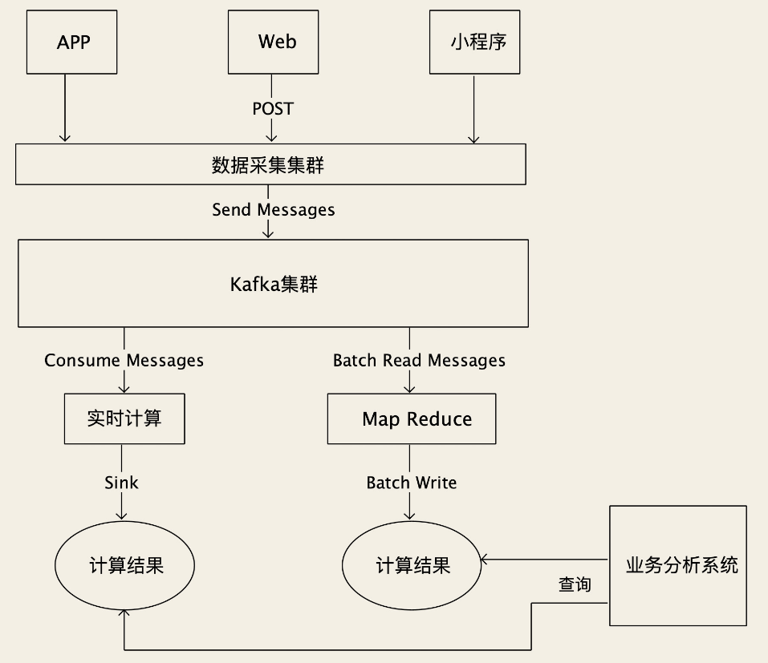

# 流数据

对于大部分互联网公司来说，数据量最大的几类数据是：点击流数据、监控数据和日志数据。

> 点击流 指的是在 App、小程序和 Web 页面上的埋点数据，这些埋点数据记录用户的行为，比如你打开了哪个页面，点击了哪个按钮，在哪个商品上停留了多久等等这些。

这类数据都是真正“海量”的数据，相比于订单、商品这类业务的数据，数据量要多出 2～3 个数量级。每天产生的数据量就可能会超过 TB（1 TB = 1024 GB）级别，经过一段时间累积下来，有些数据会达到 PB（1 PB = 1024 TB）级别。

早期对于这类海量原始数据，都倾向于**先计算再存储**。也就是，在接收原始数据的服务中，先进行一些数据过滤、聚合等初步的计算，将数据先收敛一下，再落存储。这样可以降低存储系统的写入压力，也能节省磁盘空间。

## 存储

这几年，随着存储设备越来越便宜，并且，数据的价值被不断地重新挖掘，更多的大厂都倾向于**先存储再计算**，直接保存海量的原始数据，再对数据进行实时或者批量计算。这种方案，除了成本高以外都是优点：

- 不需要二次分发就可以同时给多个流和批计算任务提供数据
- 如果计算任务出错，可以随时回滚重新计算
- 如果对数据有新的分析需求，上线后直接就可以用历史数据计算出结果，而不用去等新数据

这种方式对保存原始数据的存储系统要求就很高了：既要有足够大的容量，能水平扩容，还要读写都足够快，跟得上数据生产的写入速度，还要给下游计算提供低延迟的读服务。

### Kafka

Kafka 虽然是消息队列，不过，**现代的消息队列，本质上就是分布式的流数据存储系统。**

Kafka 的查询语言（生产和消费消息）和存储引擎的数据结构（Commit Log）比一般的存储系统要简单很多，使得 Kafka 的读写性能远远好于其他的存储系统。

Kafka 提供“无限”的消息堆积能力，具有超高的吞吐量，可以满足保存原始数据的大部分要求。写入点击流数据的时候，每个原始数据采集服务作为一个生产者，把数据发给 Kafka 就可以了。下游的计算任务，可以作为消费者订阅消息，也可以按照时间或者位点来读取数据。同时，Kafka 的生态圈比较好，很多计算平台都提供了接入 Kafka 的支持。

不过，**Kafka并不能真正提供无限的消息堆积能力**。Kafka 也支持把数据分片，这个在 Kafka 中叫 Partition，每个分片可以分布到不同的存储节点上。

写入数据的时候，可以均匀地写到这些分片上，理论上只要分片足够多，存储容量就可以是“无限”的。但是，单个分片总要落到某一个节点上，而单节点的存储容量毕竟是有限的，随着时间推移，单个分片总有写满的时候。

即使它支持扩容分片数量，也没办法像其他分布式存储系统那样，重新分配数据，把已有分片上的数据迁移一部分到新的分片上。所以扩容分片也解决不了**已有分片写满**的问题。而 Kafka 又不支持按照时间维度去分片，所以，**受制于单节点的存储容量，Kafka 实际能存储的数据容量并不是无限的**。

### HDFS

需要长时间（几个月 - 几年）保存的海量数据，就不适合用 Kafka 存储。

使用 HDFS 存储数据，就是把原始数据写成一个一个文本文件，保存到 HDFS 中。我们需要按照时间和业务属性来组织目录结构和文件名，以便于下游计算程序来读取，比如说：`click/20200808/Beijing_0001.csv`，代表 2020 年 8 月 8 日，从北京地区用户收集到的点击流数据，这个是当天的第一个文件。

对于保存海量的原始数据这个特定的场景来说，HDFS 的吞吐量是远不如 Kafka 的。按照平均到每个节点上计算，Kafka 的吞吐能力很容易达到每秒钟大几百兆，而 HDFS 只能达到百兆左右。这就意味着，要达到相同的吞吐能力，使用 HDFS 就要比使用 Kafka，多用几倍的服务器数量。

> Kafka 吞吐能力强是因为，Kafka是为顺序读写设计的，而 HDFS是为随机读写的设计的，所以在顺序写入的时候，Kafka的性能会更好。
>
> 对于磁盘来说，顺序读写的性能要远远高于随机读写，这个性能差距视不同的磁盘，大约在几十倍左右。

但 HDFS 也有它的优势，第一个优势就是，它**能提供真正无限的存储容量**，如果存储空间不够了，水平扩容就可以解决。另外一个优势是，**HDFS 能提供比 Kafka 更强的数据查询能力**。Kafka 只能按照时间或者位点来提取数据，而 HDFS 配合 Hive 直接就可以支持用 SQL 对数据进行查询，虽然说查询的性能比较差，但查询能力要比 Kafka 强大太多了。

### 时序数据库

以InfluxDB、OpenTSDB 为代表的时序数据库，不仅有非常好的读写性能，还提供很方便的查询和聚合数据的能力。专注于类似监控数据这种**有时间特征并且数据内容都是数值的数据**。

