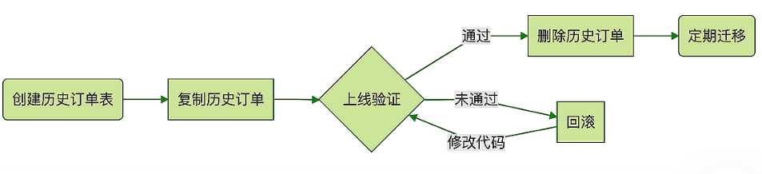
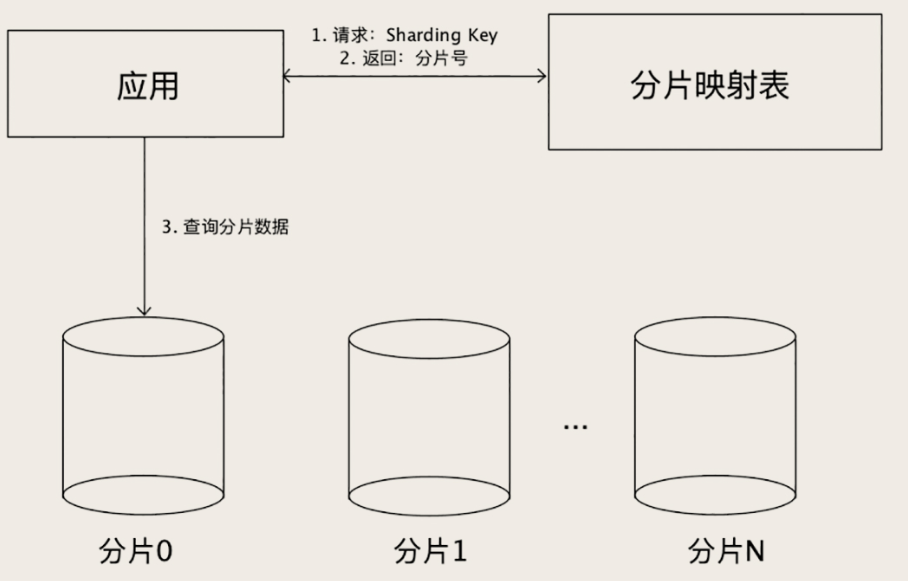

# 海量数据的存储

数据的查找速度取决于数据量的大小和存储数据用的数据结构、查找算法，对于数据库来说，后者已经是确定的了，要提高查找速度，只能从数据量大小入手，尽量减少查找需要访问的数据量。


## 归档历史数据

很多数据都是具备时间属性的，并且随着系统运行，累计增长越来越多，数据量达到一定程度就会越来越慢，比如说电商中的订单数据。**当单表的订单数据太多，多到影响性能的时候，首选的方案是，归档历史订单。**

为什么可以把把大量的历史订单移到另外一张历史订单表中呢？

因为像订单这类具有时间属性的数据，都存在**热尾效应**。大多数情况下访问的都是最近的数据，但订单表里面大量的数据都是不怎么常用的老数据。

因为新数据只占数据总量中很少的一部分，所以把新老数据分开之后，新数据的数据量就会少很多，查询速度也就会快很多。老数据虽然和之前比起来没少多少，查询速度提升不明显，但是，因为老数据访很少会被访问到，所以慢一点儿也问题不大。

这样拆分的另外一个好处是，**拆分订单时，需要改动的代码非常少**。大部分对订单表的操作都是在订单完成之前，这些业务逻辑都是完全不用修改的。即使像退货退款这类订单完成后的操作，也是有时限的，那这些业务逻辑也不需要修改，原来该怎么操作订单表还怎么操作。

基本上只有查询统计类的功能，会查到历史订单，这些需要稍微做一些调整，按照时间，选择去订单表还是历史订单表查询就可以了。

归档历史订单，大致的流程是这样的：



类似于订单商品表这类订单的相关的子表，也是需要按照同样的方式归档到各自的历史表中，由于它们都是用订单 ID 作为外键来关联到订单主表的，随着订单主表中的订单一起归档就可以了。


### 批量删除大量数据

数据复制到归档表后，需要删除订单表的历史数据了。如果直接执行下面的SQL，会提示删除失败，因为需要删除的数据量太大了：

```
delete from orders
where timestamp < SUBDATE(CURDATE(), INTERVAL 3 month);
```

因此需要分批删除，比如每批删除1000条记录：

```
delete from orders
where timestamp < SUBDATE(CURDATE(),INTERVAL 3 month)
order by id limit 1000;
```

但如果订单ID跟时间是正相关的，那就可以先查出待删除的订单中最大的订单ID，然后分批删除ID小于这个值的订单。这样子删除条件为主键判断，直接走聚簇索引，速度会更快。

```
select max(id) from orders
where timestamp < SUBDATE(CURDATE(),INTERVAL 3 month);

delete from orders where id <= ? order by id limit 1000;
```

删除语句中还有一个排序条件，这是因为ID连续的记录，在B+树中一般是存储在一起的，这样删除起来效率更高，且方便MySQL回收页。

删除完历史数据后，可能MySQL占用的磁盘空间并没有变小，这与InnoDB 的物理存储结构有关系。

虽然逻辑上每个表是一颗 B+ 树，但是物理上，每条记录都是存放在磁盘文件中的，这些记录通过一些位置指针来组织成一颗 B+ 树。当 MySQL 删除一条记录的时候，只能是找到记录所在的文件中位置，然后把文件的这块区域标记为空闲，然后再修改 B+ 树中相关的一些指针，完成删除。其实那条被删除的记录还是躺在那个文件的那个位置，所以并不会释放磁盘空间。

因为文件就是一段连续的二进制字节，类似于数组，它不支持从文件中间删除一部分数据。如果非要这么删除，只能是把这个位置之后的所有数据往前挪，这样等于是要移动大量数据，非常非常慢。所以，删除的时候，只能是标记一下，并不真正删除，后续写入新数据的时候再重用这块儿空间。

如果真的需要释放磁盘空间，可以通过`optimize table`或`alter table xxx engine=InnoDB`命令来释放空间，这会重建这个表，执行过程会一直锁表，影响服务。并且这个优化的前提是，每个表存储在一个文件中，即`innodb_file_per_table = ON`，否则并不会释放磁盘空间。


如果可以接受**暂时停止服务**，那就直接新建一个临时订单表，然后把当前订单复制到临时订单表中，再把旧的订单表改名，最后把临时订单表的表名改成正式订单表。这样就不要删除订单，速度会更快。

```
-- 新建一个临时订单表
create table orders_temp like orders;

-- 把当前订单复制到临时订单表中
insert into orders_temp
  select * from orders
  where timestamp >= SUBDATE(CURDATE(),INTERVAL 3 month);
  
-- 修改替换表名
rename table orders to orders_to_be_dropped, orders_temp to orders;

-- 删除旧表
drop table orders_to_be_dropped;
```


## 分库分表

原则：**能不拆就不拆，能少拆不多拆**。因为把数据拆分得越散，开发和维护起来就越麻烦，系统出问题的概率就越大。

### 解决的问题

数据量太大查询、更新慢，需要减少每次查询的数据量，那就**分表**。

高并发情况下，请求数量太多，单个数据库实例应付不过来，那就**分库**。

总结而言，**数据量大，就分表；并发高，就分库**。

一般情况下，都需要同时做分库分表，这时候分多少个库，多少张表，分别用预估的并发量和数据量来计算就可以了。


### Sharding Key

在订单表的归档历史数据中，是以订单完成时间作为Sharding Key，例如以三个月作为阈值，这是一个简单的按照时间范围来分片的算法。

选择合适 Sharding Key 和分片算法非常重要，直接影响了分库分表的效果。**选择 Sharding Key 最重要的参考因素是，业务是如何访问数据的**。

还是以订单表为例，如果以**订单ID作为Sharding Key**拆分订单表，之后按照订单ID查询订单时，就先根据ID和分片算法计算要查的订单在哪个分片，即哪个库的哪个表中，然后再去这个分片查询。

但对于根据用户ID查订单这个业务场景，查询条件是用户ID，没有订单ID，这时候只能把所有分片都查一遍，再合并结果，不仅麻烦，性能还差，难以分页。

而如果把**用户ID作为Sharding Key**，使用订单ID查询订单时，也不知道订单在哪个分片。不过可以在生成订单ID时，将用户ID的后几位作为订单ID的某几位（假设使用用户ID的这几位作为Sharding Key），这样在按照订单ID查询时，就可以从中取出用户ID的这几位，以确定分片。


但对于其他场景，例如商家希望看到自己店铺的订单，还有各种和订单相关的报表，就不能用上面的方式解决了。这时候可以**把订单数据同步到其他的存储系统中去**，在其他的存储系统里面解决问题。比如说，我们可以再构建一个以店铺 ID 作为 Sharding Key 的只读订单库，专门供商家来使用。或者，把订单数据同步到 HDFS 中，然后用一些大数据技术来生成订单相关的报表。

一旦做了分库分表，就会极大地限制数据库的查询能力，之前很简单的查询，分库分表之后，可能就没法实现了。**分库分表一定是，数据量和并发大到所有招数都不好使了，才使用的方法。**


### 分片算法

对于订单表，如果按时间分片，每个月一个分片，对于查询的兼容性很高，但存在热点key问题。比如现在是 5 月份，那基本上所有的查询都集中在 5 月份这个分片上，其他 11 个分片都闲着，这样不仅浪费资源，很可能 5 月那个分片根本抗不住几乎全部的并发请求。

我们希望并发请求和数据能均匀地分布到每一个分片上，尽量避免出现热点。这是选择分片算法时需要考虑的一个重要的因素。

- **基于范围分片**：容易产生热点问题，不适合作为订单的分片方法。对查询非常友好，适合数据量非常大，但并发访问量不大的 ToB 系统。

- **哈希分片**：比如要分 24 个分片，选定了 Sharding Key 是用户 ID，用 用户 ID的后几位数字 除以 24，得到的余数就是分片号。这是最简单的取模算法，也可以使用一致性哈希等算法。

  哈希分片算法能够分得足够均匀的前提条件是，用户 ID 后几位数字必须是均匀分布的。如果在生成用户 ID 的时候，自定义了一个用户 ID 的规则，最后一位 0 是男性，1 是女性，这样的用户 ID 哈希出来可能就没那么均匀，可能会出现热点。

- **查表法**：相当于没有分片算法，把Sharding Key与对应的分片编号存起来，每次执行查询的时候，去表里查一下要找的数据在哪个分片中。

  这种方法可以随时改变分片，比较灵活。比如当某个分片已经是热点了，就可以把这个分片再拆成几个分片，或者把这个分片的数据移到其他分片中去，然后修改一下分片映射表，就可以在线完成数据拆分了。

  

  但是分片映射表本身的数据不能太多，否则这个表反而成为热点和性能瓶颈了。并且这种方法需要二次查询，实现较复杂，性能也差一点。不过可以通过缓存加速查询，实际性能并不会慢很多。


### 外键依赖

拆分订单表之后，那些和订单表有外键关联的表，建议也跟订单表一起拆分，使得相同订单ID的订单和关联表分布在相同的分片上，便于查询。


