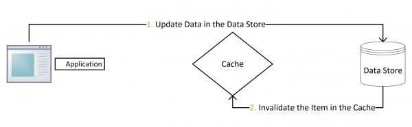

# 缓存

一般使用Redis作为缓存，Redis 在设计上天然**不保证数据的可靠性**

## 缓存更新

### Cache Aside

> 如果在修改数据时，先将缓存中的数据删除，再更新数据库，等待后续的操作再次将数据库中的信息装载到缓存中，这种做法是有问题的。
>
> 假设有两个并发操作，一个是更新，一个是查询，更新操作删除缓存后，查询操作发现没命中缓存，会去读数据库，如果这个时候更新操作还没有完成对数据的更新，那么查询操作拿到的就是老数据，并把它放到缓存里。由于缓存中存在了老数据，后续的请求还是会读到老数据，直到缓存过期或者下一次更新。

Cache Aside是最常用的模式：

- **失效**：应用程序先从cache取数据，没有得到，则从数据库中取数据，成功后，放到缓存中。

- **命中**：应用程序从cache中取数据，取到后返回。

- **更新**：先把数据存到数据库中，**成功后，再让缓存失效**。先更新，后失效

  > 后**失效**，而不是更新缓存，是为了防止两个并发的写操作导致脏数据。

这种更新策略，理论上还存在产生脏数据的概率。比如一个读操作和一个写操作，读操作没有命中缓存，去数据库里读取数据，等到写操作写完并且让缓存失效之后，读操作才用老数据更新缓存。

但是这个概率很低，因为需要在读操作时缓存失效，并且同时有一个写操作，并且在写操作完成且失效缓存后，读操作才去更新缓存，而一般情况下，写操作比读操作更耗时。让读操作在写操作之前操作数据库，晚于写操作失效缓存，所有这些条件具备的概率不大。

### Read/Write Through

Cache Aside需要维护缓存和数据库这两个数据存储，而Read/Write Through只需要操作缓存，缓存会自动去更新数据库。

#### Read Through

在查询操作中更新缓存，当缓存失效时，Cache Aside是由调用方负责把数据加载入缓存，而Read Through则用缓存服务自己来加载，从而对应用方是透明的。

#### Write Through

当有数据更新的时候：

- 如果没有命中缓存，直接更新数据库，然后返回
- 如果命中了缓存，则更新缓存，然后再由Cache自己更新数据库（这是一个同步操作）

### Write Behind Caching

Write Behind 又叫 Write Back。在更新数据的时候，只更新缓存，不更新数据库，而我们的缓存会异步地批量更新数据库。这个设计的好处就是让数据的I/O操作飞快无比（因为直接操作内存嘛 ），因为异步，write backg还可以合并对同一个数据的多次操作，所以性能的提高是相当可观的。但是数据不是强一致性的，而且可能会丢失。

Write Back实现逻辑比较复杂，因为他需要track有哪些数据是被更新了的，需要刷到持久层上。操作系统的write back会在仅当这个cache需要失效的时候，才会被真正持久起来，比如，内存不够了，或是进程退出了等情况，这又叫lazy write。

### 缓存不一致问题

同时有多个并发写请求，或者由于ABA问题，导致缓存中存储的值是老数据。

可以通过给数据加上”版本号“，更新数据库时自动加一，**更新缓存时，只允许高版本数据覆盖低版本数据。**

## 缓存穿透

在读数据的时候，没有命中缓存，请求“穿透”了缓存，直接访问后端数据库的情况。

如果查询的数据数据库确实没有，那缓存肯定也没有，这时可以用一个布隆过滤器存储所有可能存在的数据，请求到来时先判断该查询是否可能存在，如果不存在那就不用继续了。

如果是系统刚刚启动，缓存中还没有数据，请求过来势必引发穿透，这时候可以这样做：

- 预热：提前将可能访问的数据加载到缓存中
- 灰度发布：先接入少量请求，再逐步增加系统的请求数量，直到全部请求都切换完成

## 缓存击穿

对于某些热点key，当它过期时，大量的请求都会打到数据库上。相比缓存穿透，击穿强调的是**某个key和大量的请求**，穿透强调的是**缓存命中率低**。

解决思路：

利用互斥锁保证同一时刻对同一个key只有一个数据库请求。缓存去查数据库时，先获取锁，判断set中有无当前key，没有的话再判断缓存中是否有当前key，如果没有就将当前key加入set，然后释放锁，去查数据库，更新缓存，然后再获取锁，将set中当前key删除，释放锁。

## 缓存雪崩

大量的缓存在同一时刻过期，导致数据库查询压力陡增。

解决思路：

- 设置缓存过期时间时，设置为”固定值+随机数“的形式，分散过期时间。
- 通过监控线程 在缓存过期前，更新缓存。

## 超大规模系统的缓存

 Redis 集群可以水平扩容，只要集群足够大，理论上可以支持海量并发。但是，在超大规模系统中，因为并发请求的数量这个基数太大了，即使只有很小比率的请求穿透缓存，打到数据库上请求的绝对数量仍然不小。加上大促期间的流量峰值，还是存在缓存穿透引发雪崩的风险。

为了解决这个问题，可以搭建一个足够大的redis集群，**将数据库的数据都缓存在redis中**，处理读请求时，只会读redis，不会读数据库，这样子请求就不会穿透缓存了。

用redis缓存全量数据，在更新数据时，就必须及时更新缓存。分布式事务可以解决数据一致性问题，但它**对数据更新服务有很强的侵入性**。以下单服务为例，如果为了更新缓存增加一个分布式事务，无论用哪种分布式事务，或多或少都会影响下单服务的性能。还有一个问题是，如果 Redis 本身出现故障，写入数据失败，还会导致下单失败，等于是降低了下单服务性能和可用性，这样肯定不行。

### 通过消息队列更新缓存

**对于像订单服务这类核心的业务，一个可行的方法是，启动一个更新订单缓存的服务，接收订单变更的 MQ 消息，然后更新 Redis 中缓存的订单数据。**因为这类核心的业务数据，使用方非常多，本来就需要发消息，增加一个消费订阅基本没什么成本，订单服务本身也不需要做任何更改。

### 通过binlog实时更新缓存

负责更新缓存的服务，把自己伪装成一个 MySQL 的从节点，从 MySQL 接收 Binlog，解析 Binlog 之后，可以得到实时的数据变更信息，然后根据这个变更信息去更新 Redis 缓存。这种方案跟通过MQ更新缓存的方案思路是类似的，都是异步订阅实时数据变更信息，去更新 Redis。不过，**直接读取 Binlog 这种方式，它的通用性更强**。不需要订单服务再发订单消息了，订单更新服务也不用费劲去解决“发消息失败怎么办？”这种数据一致性问题了。而且，在整个缓存更新链路上，减少了一个收发 MQ 的环节，从 MySQL 更新到 Redis 更新的时延更短，出现故障的可能性也更低。

订阅和解析MySQL binlog，可以使用[Canal](https://github.com/alibaba/canal)，模拟 MySQL 主从复制的交互协议，把自己伪装成一个 MySQL 的从节点，向 MySQL 主节点发送 dump 请求，MySQL 收到请求后，就会开始推送 Binlog 给 Canal，Canal 解析 Binlog 字节流之后，转换为便于读取的结构化数据，供下游程序订阅使用。

启动 Canal 服务之后，可以从 Canal 拉取数据，每拉取一批数据，正确写入 Redis 之后，给 Canal 服务返回处理成功的响应。如果发生客户端程序宕机或者处理失败等异常情况，Canal 服务没收到处理成功的响应，下次客户端来拉取的还是同一批数据，这样就可以**保证顺序并且不会丢数据**。

### 缓存不同步

如果对数据库的数据更新没有同步到缓存中，有这些解决思路：

- 设置合理的缓存过期时间，即使缓存不同步，过期后就会恢复
- 识别用户手动刷新操作，强制重新加载缓存数据，但需要限流，防止同时大量查询数据库
- 管理员后台预留手动清除缓存的功能

