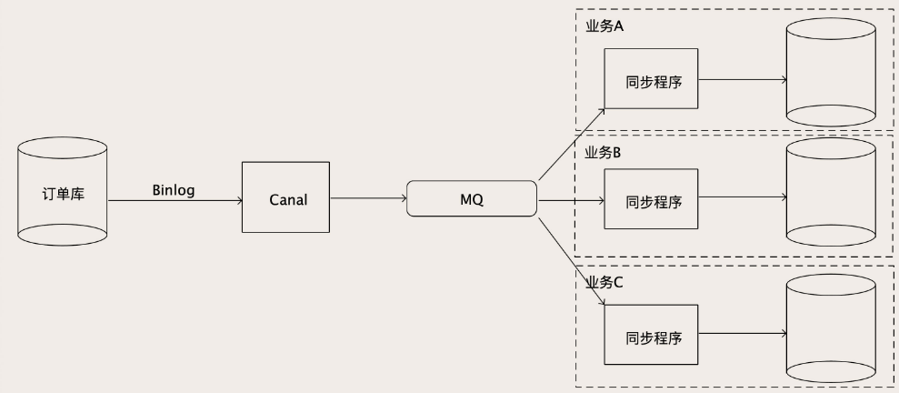

# 跨系统同步数据

当数据量太大的时候，单个存储节点存不下，就只能把数据分片存储。分片存储使得对数据的查询就没那么自由了。

如果订单表按照用户ID 作为Sharding Key 来分片，那就只能按照用户维度来查询。如果商家要查自己店铺的订单，就需要查每个分片，一般情况下会用空间换时间，再存一份订单数据到商家订单库，以店铺 ID 作为 Sharding Key 分片，专门供商家查询订单。

对于海量数据的处理原则，都是根据业务对数据查询的需求，反过来确定选择什么数据库、如何组织数据结构、如何分片数据，这样才能达到最优的查询性能。同样一份订单数据，除了在订单库保存一份用于在线交易以外，还会在各种数据库中，以各种各样的组织方式存储，用于满足不同业务系统的查询需求。像 BAT 这种大厂，它的核心业务数据，存个几十上百份是非常正常的。

## 实时同步

为了在异构的存储系统中保持数据的同步，可以使用分布式事务的本地消息表或者其他技术，如果同步的节点数量少，还可以接受，但如果太多的话，开销就会很大，并且还对在线业务有侵入性。因此可以借用实时同步MySQL到redis的思路，即**使用binlog 和 mq 构建实时数据同步系统**。

因为数据的来源大多都是在线交易系统的 MySQL 数据库，所以可以利用 MySQL 的 Binlog 来实现异构数据库之间的实时数据同步。

利用canal 可以实时获取MySQL 的binlog，为了支撑众多的下游数据库，使用MQ 存储canal 发来的binlog，每个业务通过一个同步程序订阅MQ，在同步程序中还可以做一些数据转换和过滤。

### 保证实时性

这个方法看起来不难，但是非常容易出现性能问题。有些接收 Binlog 消息的下游业务，对数据的实时性要求比较高，不能容忍太高的同步时延。而在大促的时候，数据量大、并发高、数据库中的数据变动频繁，同步的 Binlog 流量也非常大。为了保证这个同步的实时性，整个数据同步链条上的任何一个环节，它的处理速度都必须得跟得上才行。

Canal 和 MQ 这两个环节，由于没什么业务逻辑，性能都非常好。所以，**一般容易成为性能瓶颈的就是消费 MQ 的同步程序**，因为这些同步程序里面一般都会有一些业务逻辑，而且如果下游的数据库写性能跟不上，表象也是这个同步程序处理性能上不来，消息积压在 MQ 里面。

不能通过简单地增加同步程序的实例数或线程数加速他们消费MQ，因为MySQL 主从同步 Binlog，是一个单线程的同步过程，在从库执行 Binlog 的时候，必须按顺序执行，才能保证数据和主库是一样的。**为了确保数据一致性，Binlog 的顺序很重要，是绝对不能乱序的。** 严格来说，对于每一个 MySQL 实例，整个处理链条都必须是单线程串行执行，MQ 的主题也必须设置为只有 1 个分区（队列），这样才能保证数据同步过程中的 Binlog 是严格有序的，写到目标数据库的数据才能是正确的。

不过结合实际业务，还是可以加速同步过程的。对于订单库，其实并不需要对订单库所有的更新操作都严格有序地执行，比如 A 和 B 两个订单号不同的订单，这两个订单谁先更新谁后更新并不影响数据的一致性，因为这两个订单完全没有任何关系。但是同一个订单，如果更新的 Binlog 执行顺序错了，那同步出来的订单数据真的就错了。

也就是说，只要保证每个订单的更新操作日志的顺序别乱就可以了。这种一致性要求称为**因果一致性（Causal Consistency）**，有因果关系的数据之间必须要严格地保证顺序，没有因果关系的数据之间的顺序是无所谓的。基于这个理论基础，我们就可以并行地来进行数据同步，具体的做法是这样的：

- 根据下游同步程序的消费能力，计算出需要多少并发

- 设置 MQ 中主题的分区（队列）数量和并发数一致。

  因为 MQ 是可以保证同一分区内，消息是不会乱序的，所以我们需要把具有因果关系的 Binlog 都放到相同的分区中去，就可以保证同步数据的因果一致性。

  对应到订单库就是，相同订单号的 Binlog 必须发到同一个分区上。这里用到了分片算法，比如最简单的哈希算法，Binlog 中订单号除以 MQ 分区总数，余数就是这条 Binlog 消息发往的分区号。

- Canal 自带的分区策略就支持按照指定的 Key，把 Binlog 哈希到下游的 MQ 中去

### 回退binlog

在这种数据同步架构下，如果下游的某个同步程序或数据库出了问题，需要把 Binlog 回退到某个时间点然后重新同步，需要怎么做呢？

- 如果下游只有一个同步程序，那直接按照时间重置Canal实例的位点就可以了。
- 如果MQ的下游有多个消费者，这个时候就不能重置Canal里的位点了，否则会影响到其它的消费者。对这个同步程序，在它的 MQ 消费订阅上按照时间重置位点，这样只影响出问题的那个订阅。所以，这种架构下，MQ中的消息，最好将保存时间设置得长一些，比如保留3天。

