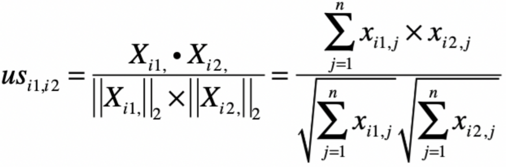
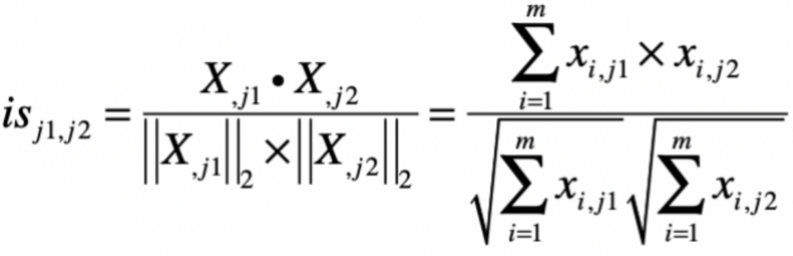
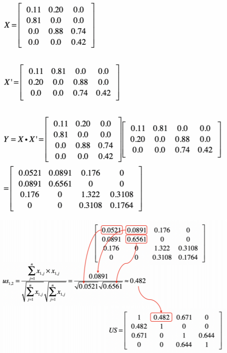
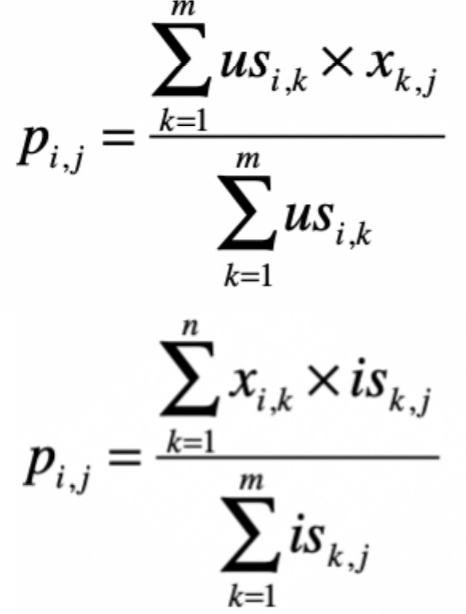
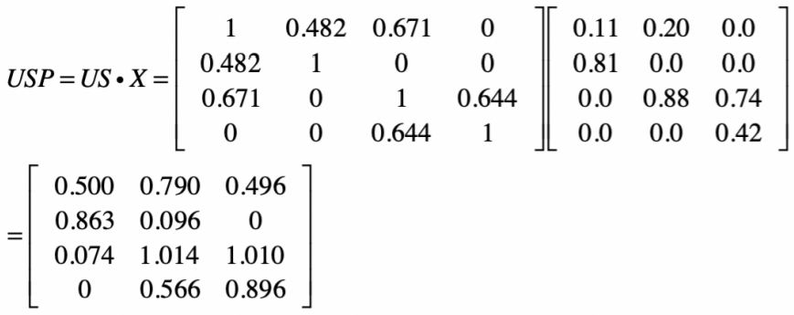
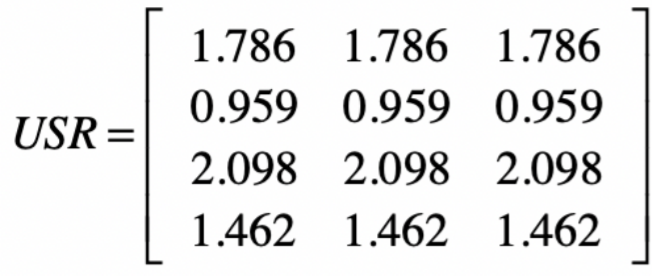
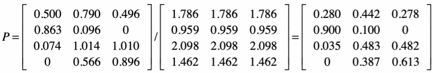

# 推荐系统

## 基于相似度的协同过滤

### 数据集介绍

以[MovieLens](http://files.grouplens.org/datasets/movielens/)数据集为例，这个数据集最核心的内容是多位用户对不同电影的评分，此外，它也包括了一些电影和用户的属性信息，便于我们研究推荐结果是不是合理。

其中一个包含了600 位用户对于 9000 部电影的约 10 万条评分的[小规模数据集](http://files.grouplens.org/datasets/movielens/mllatest-small.zip)，解压后，有 readme 文件和四个 csv 文件（ratings、movies、links 和tags）。

其中最重要的是 ratings，包含了 10 万条评分，每条记录有 4 个字段，包括 userId、movieId、rating、timestamp。userId 表示每位用户的 id，movieId 是每部电影的 ID，rating 是这位用户对这部电影的评分，取值为 0-5 分。timestamp 是时间戳。

movies 包含了电影的主要属性信息，title 和 genres 分别表示电影的标题和类型，一部电影可以属于多种类型。

links 和 tags 则包含了电影的其他属性信息。

### 设计思路

根据协同过滤算法的核心思想，整个系统可以分为三个大的步骤。

* 第一步，**用户评分的标准化**。因为有些用户的打分比较宽松，而有些用户打分则比较挑剔。所以，我们需要使用标准化或者归一化，让不同用户的打分具有可比性，这里使用**z 分数**标准化。
* 第二步，**衡量和其他用户或者物品之间的相似度**，这里的物品就是电影。

  在基于用户的过滤中，我们要找到相似的用户。

  在基于物品的过滤中，我们要找到相似的电影。

  计算用户之间相似度：

  

  物品之间相似度 的公式：

  

以基于用户的过滤为例。假设使用夹角余弦来衡量相似度，那么就可以采用用户评分的矩阵点乘自身的转置来计算余弦夹角。用户评分的矩阵$X$ 中，每一行是某位用户的行向量，每个分量表示这位用户对某部电影的打分。而矩阵$X'$ 的每一列是某个用户的列向量，每个分量表示用户对某部电影的打分。

假设$XX'$ 的结果为矩阵$Y$ ，那么$y\_{i,j}$ 就表示用户$i$ 和用户$j$ 这两者喜好度向量的点乘结果，它就是夹角余弦公式中的分子。如果$i$ 等于$j$ ，那么这个计算值也是夹角余弦公式分母的一部分。从矩阵的角度来看， $Y$中任何一个元素都可能用于夹角余弦公式的分子，而对角线上的值会用于夹角余弦公式的分母。因此，我们可以利用$Y$ 来计算任何两个用户之间的相似度。



\($us$就是公式中分母应为平方和开根号，而不是对和开根号\)

* 第三步，**根据相似的用户或物品，给出预测的得分 p**。

  

  通过第二步得到用户相似度矩阵$US$ ，$US$ 和评分矩阵$X$ 的点乘结果为矩阵$USP$ 。沿用前面的示例，结果就是下面这样。 

  归一化：对$USP$ 按行求和，获得矩阵$USR$ ，然后使用$USP$ 和$USR$ 的元素对应除法，就可以求得任意用户对任意电影的评分矩阵

  



### 代码实现

加载数据

```text
import pandas as pd
from numpy import *

# 加载⽤⼾对电影的评分数据
df = pd.read_csv("ml-latest-small/ratings.csv")

# 获取⽤⼾的数量和电影的数量
user_num = df["userId"].max()
movie_num = df["movieId"].max()

# 构造⽤⼾对电影的⼆元关系矩阵
user_rating = [[0.0] * movie_num for i in range(user_num)]

i = 0
for index, row in df.iterrows(): # 获取每⾏的 index、row
  # 由于⽤⼾和电影的 ID 都是从 1 开始，为了和 Python 的索引⼀致，减去 1
  userId = int(row["userId"]) - 1
  movieId = int(row["movieId"]) - 1

  # 设置⽤⼾对电影的评分
  user_rating[userId][movieId] = row["rating"]

  # 显⽰进度
  i += 1
  if i % 10000 == 0:
    print(i)

# 把⼆维数组转化为矩阵
x = mat(user_rating)
print(x)
```

对矩阵中的数据，以行为维度，进行标准化：

```text
# 标准化每位⽤⼾的评分数据
from sklearn.preprocessing import scale

# 对每⼀⾏的数据，进⾏标准化
x_s = scale(x, with_mean=True, with_std=True, axis=1)
print(" 标准化后的矩阵：", x_s)
```

计算表示用户之间相似度的矩阵$ US$：

```text
# 获取 XX'
y = x_s.dot(x_s.transpose())
print("XX'的结果是'：", y)

# 获得⽤⼾相似度矩阵 US
us = [[0.0] * user_num for i in range(user_num)]
for userId1 in range(user_num):
  for userId2 in range(user_num):
    # 通过矩阵 Y 中的元素，计算夹⻆余弦
    us[userId1][userId2] = y[userId1][userId2] / (sqrt(y[userId1][userId1]) * sqrt(y[userId2][userId2]))
```

求评分矩阵：

```text
# 通过⽤⼾之间的相似度，计算 USP 矩阵
usp = mat(us).dot(x_s)

# 求⽤于归⼀化的分⺟
usr = [0.0] * user_num
for userId in range(user_num):
  usr[userId] = sum(us[userId])

# 进⾏元素对应的除法，完成归⼀化
p = divide(usp, mat(usr).transpose())
```

## SVD分析用户和物品

尝试使用SVD奇异值的分解，来分解用户评分的矩阵，并找到“潜在”的电影主题。

### 代码实现

```text
import pandas as pd
from numpy import *

# 加载⽤⼾对电影的评分数据
df_ratings = pd.read_csv("ml-latest-small/ratings.csv")

# 获取⽤⼾的数量和电影的数量，这⾥我们只取前    1/10 来减⼩数据规模
user_num = int(df_ratings["userId"].max() / 10)
movie_num = int(df_ratings["movieId"].max() / 10)

# 构造⽤⼾对电影的⼆元关系矩阵
user_rating = [[0.0] * movie_num for i in range(user_num)]

i = 0
for    index,    row    in    df_ratings.iterrows():    # 获取每⾏的 index、row
  # 由于⽤⼾和电影的ID都是从1开始，为了和Python的索引⼀致，减去1
  userId = int(row["userId"]) - 1
  movieId = int(row["movieId"]) - 1

  #    只取前 1/10 来减⼩数据规模
  if (userId >= user_num) or (movieId >= movie_num):
    continue

# 设置⽤⼾对电影的评分
user_rating[userId][movieId] = row["rating"]

# 把⼆维数组转化为矩阵
x = mat(user_rating)
# 标准化每位⽤⼾的评分数据

from sklearn.preprocessing import scale
# 对每⼀⾏的数据，进⾏标准化
x_s = scale(x, with_mean=True, with_std=True, axis=1)
print(" 标准化后的矩阵：", x_s)

# 进⾏ SVD 分解
from numpy import linalg as LA

u,sigma,vt = LA.svd(x_s, full_matrices=False, compute_uv=True)
print("U 矩阵：", u)
print("Sigma 奇异值：", sigma)
print("V 矩阵：", vt)
```

验证 SVD 的效果：加载电影的元信息，包括电影的标题和类型等等

```text
# 加载电影元信息
df_movies = pd.read_csv("ml-latest-small/movies.csv")
dict_movies = {}

for index, row in df_movies.iterrows(): # 获取每⾏的 index、row
  dict_movies[row["movieId"]] = "{0},{1}".format(row["title"], row["genres"])
print(dict_movies)
```

分解之后所得到的奇异值$σ$ 对应了一个“主题”， $σ$值的大小表示这个主题在整个 电影集合中的重要程度，而 $V$ 中的右奇异向量表示每部电影和这些“主题”的关系强弱。所以，我们可以对分解后的每个奇异值，通过$V$ 中的向量，找找看哪些电影和这个奇异值所对应的主题更相关，然后看看 SVD 分解所求得的电影主题是不是合理。比如，我们可以使用下面的代码，来查看向量$VT\_1$ , 相关的电影主要有哪些。

```text
# 输出和某个奇异值⾼度相关的电影，这些电影代表了⼀个主题
print(max(vt[1,:])) #  0.173
for    i in range(movie_num):
  if (vt[1][i] > 0.1):  # 0.173,所以把阈值设置为 0.1
  print(i + 1, vt[1][i], dict_movies[i + 1]) # 向量中的电影 ID 和原始的电影 ID 差 1
```

在用户对电影评分的应用场景下，SVD 分解后的$U$ 矩阵、$V$ 矩阵和$Σ$ 矩阵各自代表的意义，其中$Σ$矩阵中的奇异值表示了 SVD 挖掘出来的电影主题， $U$矩阵中的奇异向量表示用户对这些电影主题的评分，而$V$ 矩阵中的奇异向量表示了电影和这些主题的相关程度。

SVD 分解能够找到一些“潜在的“因素，例如语义上的概念、电影的主题等等。虽然这样操作可以降低特征维度，去掉一些噪音信息，但是由于 SVD 分解本身的计算量也很大，所以从单次的执行效率来看，SVD 往往无法起到优化的作用。在这种情况下，我们可以考虑把它和一些监督式的学习相结合，使用一次分解的结果构建分类器，提升日后的执行效率。

