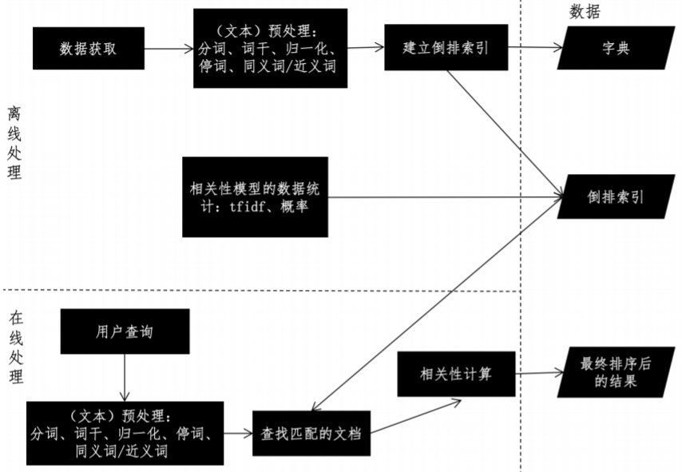
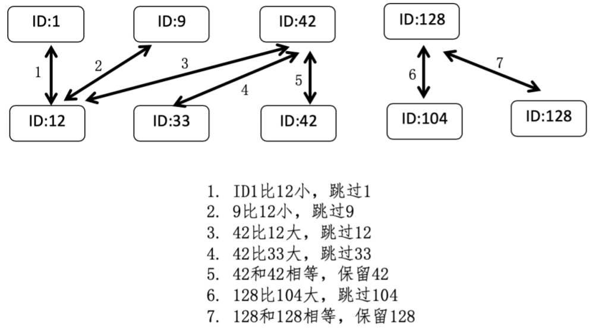
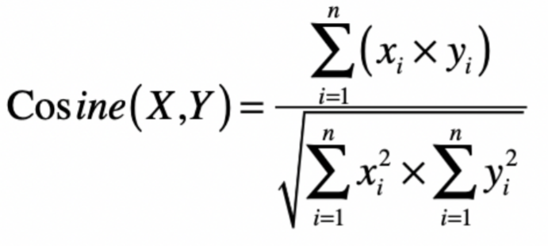
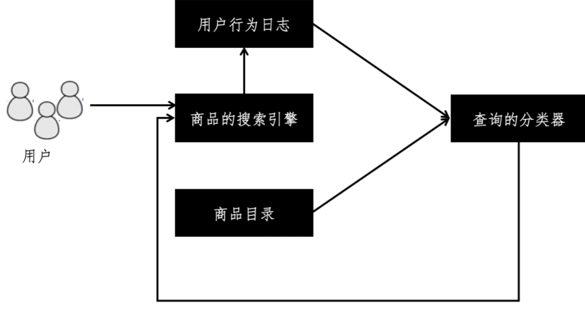

# 搜索引擎

主要介绍搜索引擎的倒排索引（检索效率）和向量空间模型（相关性）。

## 设计框架

文本搜索系统的框架通常包括 2 个重要模块：**离线的预处理**和**在线的查询**。

### 离线预处理

离线预处理也就是我们通常所说的“索引”阶段，包括数据获取、文本预处理、词典和倒排索引的构建、相关性模型的数据统计等。

数据的获取和相关性模型的数据统计这两步，根据不同的应用场景，必要性和处理方式有所不同。

文本预处理和倒排索引构建这两个步骤，无论在何种应用场景之中都是必不可少的，所以它们是离线阶段的核心。常规的文本预处理是指针对文本进行分词、移除停用词、取词干、归一化、扩充同义词和近义词等操作。

使用倒排索引，可以把文档集转换为从关键词到文档的这种查找关系。有了这种“倒排”的关系，我们可以很高效地根据给定的单词，找到出现过这个单词的文档集合。

倒排索引是典型的牺牲空间来换取时间的方法。假设文章总数是 k，每篇文章的单词数量是m，查询中平均的关键词数量是 l，那么倒排索引可以把时间复杂度从 O\(k×logm\) 降到 O\(l\)。但是，如果使用倒排索引，就意味着除了原始数据，我们还需要额外的存储空间来放置倒排索引。因此，如果我们的字典里，不同的词条总数为$n_1$ ，每个单词所对应的文章平均数为$n_2$ ，那么空间复杂度就是 O\( $n_1 × n_2$\)。

### 在线查询

查询一般都会使用和离线模块一样的预处理，词典也是沿用离线处理的结果。当然，也可能会出现离线处理中未曾出现过的新词，我们一般会忽略或给予非常小的权重。在此基础上，系统根据用户输入的查询条件，在倒排索引中快速检出文档，并进行相关性的计算。

不同的相关性模型，有不同的计算方式。最简单的布尔模型只需要计算若干匹配条件的交集，向量空间模型 VSM，则需要计算查询向量和待查文档向量的余弦夹角，而语言模型需要计算匹配条件的贝叶斯概率等等。

## 倒排索引的设计

### 倒排索引存储的内容

基于链式地址法的哈希表来实现倒排索引，哈希的键（key）就是文档词典的某一个词条，值（value）就是一个链表，链表是出现这个词条的所有文档之集合，而链表的每一个结点，就表示出现过这个词条的某一篇文档。这种最简单的设计能够帮助我们判断哪些文档出现过给定的词条，因此它可以用于布尔模型。但是，如果我们要实现向量空间模型，或者是基于概率的检索模型，就需要很多额外的信息，比如词频（tf）、词频 - 逆文档频率（tf-idf）、词条出现的条件概率等等。

有些搜索引擎需要返回匹配到的信息摘要（nippet），因此还需要记住词条出现的位置。

我们要在倒排索引中加入更多的信息。每个文档列表中，存储的不仅仅是文档的 ID，还有其他额外的信息。

其中，ID 字段表示文档的 ID，tf 字段表示词频，tfidf 字段表示词频 - 逆文档频率，而 prob 表示这个词条在这篇文档中出现的条件概率。

### 对多个关键词的查询结果取交集

借鉴归并排序的合并步骤，假设有两个词条 a 和 b，a 对应的文档列表是 A，b 对应的文档列表是 B，而 A 和 B 这两个列表中的每一个元素都包含了文档的 ID。

首先，我们根据文档的 ID，分别对这两个列表进行从小到大的排序，然后依次比较两个列表的文档 ID，如果当前的两个 ID 相等，就表示这个 ID 所对应的文档同时包含了 a 和 b 两个关键词，所以是符合要求的，进行保留，然后两个列表都拿出下一个 ID 进行之后的对比。

如果列表 A 的当前 ID 小于列表 B 的当前 ID，那么表明 A 中的这个 ID 一定不符合要求，跳过它，然后拿出 A中的下一个 ID 和 B 进行比较。

同样，如果是列表 B 的第一个 ID 更小，那么就跳过 B 中的这个ID，拿出 B 中的下一个 ID 和 A 进行比较。依次类推，直到遍历完所有 A 和 B 中的 ID。

基于这种两两比较的过程，我们可以推广到比较任意多的列表。此外，在构建倒排索引的时候，我们可以**事先对每个词条的文档列表进行排序**，从而避免了查询时候的排序过程，达到提升搜索效率的目的。

## 向量空间和倒排索引的结合

向量空间模型假设所有的对象都可以转化为向量，然后使用向量间的距离（通常是欧氏距离）或者是向量间的夹角余弦来表示两个对象之间的相似程度。

在文本搜索引擎中，我们使用向量来表示每个文档以及用户的查询，而向量的每个分量由每个词条的 tf-idf 构成，最终用户查询和文档之间的相似度或者说相关性，由文档向量和查询向量的夹角余弦确定。如果能获取这个查询和所有文档之间的相关性得分，那么我们就能对文档进行排序，返回最相关的那些。**不过，当文档集合很大的时候，这个操作的复杂度会很高。**

如果文档中词条的平均数量是 n，查询中词条的平均数量是 m，那么计算某个查询和某个文档之间的夹角余弦，时间复杂度是 O\(n×m\)。如果整个被索引的文档集合有 k 个文档，那么计算某个查询和所有文档之间的夹角余弦，时间复杂度就变为 O\(n×m×k\)。

实际上，很多文档并没有出现查询中的关键词条，所以计算出来的夹角余弦都是 0，而这些计算都是可以完全避免的，解决方案就是倒排索引。**通过倒排索引，我们挑选出那些出现过查询关键词的文档，并仅仅针对这些文档进行夹角余弦的计算**，那么计算量就会大大减少。

之前设计的倒排索引也已经保存了 tf-idf 这种信息，因此可以直接利用从倒排索引中取出的 tf-idf 值计算夹角余弦公式的分子部分。

至于分母部分，它包含了用户查询向量的和文档向量的 L2 范数。通常，查询向量所包含的非 0 分量很少，L2 范数计算是很快的。而每篇文档的L2 范数，在文档没有更新的情况下是不变的，因此我们可以在索引阶段，就计算好并保持在额外的数据结构之中。

## 查询分类

以电商的商品搜索为例，存在关键词搜索的结果非常不精准的情况。比如搜索“牛奶”，会出现很多牛奶巧克力，甚至连牛奶色的连衣裙，都跑到搜索结果的前排了，用户体验非常差。但是，巧克力和连衣裙这种商品标题里确实存在“牛奶”的字样，如果简单地把“牛奶”字眼从巧克力和服饰等商品标题里去除，又会导致搜索“牛奶巧克力”或者“牛奶连衣裙”时无法展示相关的商品，这肯定也是不行的。

这种搜索不精确的情况十分普遍，还有很多其他的例子，比如搜索“橄榄油”的时候会返回热门的“橄榄油发膜”或“橄榄油护手霜”，搜索“手机”的时候会返回热门的“手机壳”和“手机贴膜”。另外，商品的品类也在持续增加，因此也无法通过人工运营来解决。

这是因为采用类似向量空间模型的相关性模型，所以在进行相关性排序的时候，系统主要考虑的因素都是关键词的 tf-idf、文档的长短、查询的长短等因素。这种方式非常适合普通的文本检索，在各大通用搜索引擎里也被证明是行之有效的方法之一。但是，这种方式并不适合电子商务的搜索平台，主要原因包括这样几点：

* 商品的标题都非常短。电商平台上的商品描述，包含的内容太多，有时还有不少广告宣传，这些不一定是针对产品特性的信息，如果进入了索引，不仅加大了系统计算的时间和空间复杂度，还会导致较低的相关性。所以，**商品的标题、名称和主要的属性成为搜索索引关注的对象**，而这些内容一般短小精悍，不需要考虑其长短对于相关性衡量的影响。
* 关键词出现的位置、词频对相关性意义不大。正是由于商品搜索主要关注的是标题等信息浓缩的字段，因此某个关键词出现的位置、频率对于相关性的衡量影响非常小。如果考虑了这些，反而容易被别有用心的卖家利用，进行不合理的关键词搜索优化（SEO），导致最终结果的质量变差。
* 用户的查询普遍比较短。在电商平台上，顾客无需太多的关键词就能定位大概所需，因此查询的字数多少对于相关性衡量也没有太大意义。

搜索结果不准确的问题，实际上主要纠结在一个“分类”的问题上。例如，顾客搜索“牛奶”字眼的时候，系统需要清楚用户是期望找到饮用的牛奶，还是牛奶味的巧克力或饼干。从这个角度出发考虑，我们很容易就考虑到了，是不是可以首先对用户的查询，进行一个基于商品目录的分类呢？如果可以，那么我们就能知道把哪些分类的商品排在前面，从而提高返回商品的相关性。

### 朴素贝叶斯分类

**商品分类数据和朴素贝叶斯模型是关键。**电商平台通常会使用后台工具，让运营人员构建商品的类目，并在每个类目中发布相应的商品。这个商品的类目，就是我们分类所需的类别信息。由于这些商品属于哪个类目是经过人工干预和确认的，因此数据质量通常比较高。我们可以直接使用这些数据，构造朴素贝叶斯分类器。

商品文描中噪音比较多，因此通常我们只看商品的标题和重要属性。所以，公式中的$f_1,f_2,……,f_k$ ，表示来自商品标题和属性的关键词。

这种方法优势在有很多的人工标注作为参考，因此不愁没有可用的数据。可是分类的结果受到商品分布的影响太大。假设服饰类商品的数量很多，而且有很多服饰都用到了“牛奶”的字眼，那么根据朴素贝叶斯分类模型的计算公式，“牛奶”这个词属于服饰分类的概率还是很高。

### 用户行为分类

核心思想是**观察用户在搜词后的行为**，包括点击进入的详情页、把商品加入收藏或者是添加到购物车，这样我们就能知道，顾客最为关心的是哪些类目。

例如，当用户输入关键词“咖啡”，如果经常浏览和购买的品类是国产冲饮咖啡、进口冲饮咖啡和咖啡饮料，那么这 3 个分类就应该排在更前面，然后将其它虽然包含咖啡字眼，但是并不太相关的分类统统排在后面。需要注意的是，这种方法可以直接获取 $P\(C\|f\)$，而无需通过贝叶斯理论推导。

这种方法优势在于经过用户行为的反馈，可以很精准地定位到每个查询所期望的分类，甚至在一定程度上解决查询季节性和个性化的问题。但是这种方法过度依赖用户的使用，面临一个“冷启动”的问题，也就说在搜索系统投入使用的初期，无法收集足够的数据。

考虑到这两个方法的特点，我们可以把它们综合起来使用，最简单的就是线性加和。

$$P(C|query) = w_1 ⋅ P_1(C|query) + w_2 ⋅ P_2(C|query)$$

$P_1$ 和$P_2$ 分别表示根据第一种方法和第二种方法获得的概率，而权重$w_1$ 和$w_2$ 分别表示第一种方法和第二种方法的权重，可以根据需要设置。通常在一个搜索系统刚刚起步的时候，可以让$w_1$ 更大。随着用户不断的使用，我们就可以让$w_2$ 更大，让用户的参与使得系统更智能。

### 查询分类和搜索引擎结合

使用商品目录打造一个初始版本的查询分类器。随着用户不断的使用这个搜索引擎，我们收集用户的行为日志，并使用这个日志改善查询的分类器，让它变得更加精准，然后再进一步优化搜索引擎的相关性。

