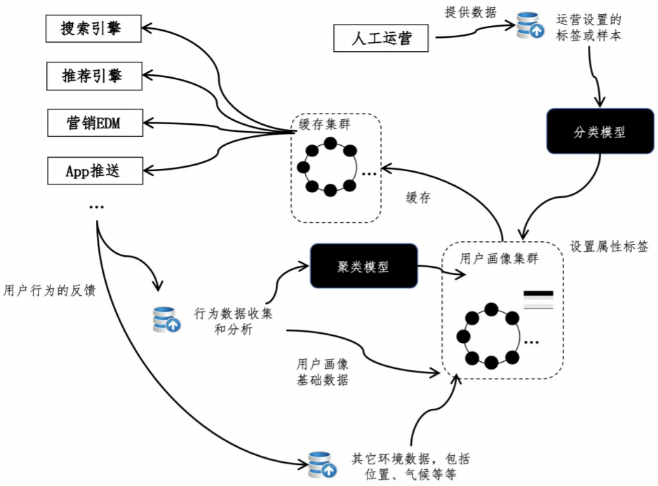

# 用户画像

如今是个性化的时代，互联网和人工智能技术正在把这点推向极致。无论是主动搜索还是进行浏览，用户都希望看到针对自己的结果。

举个例子，A 品牌的奶瓶在全网是非常畅销的，可是对于一位 5 岁儿子的妈妈来说，儿子早已过了喝奶瓶的阶段，所以在她输入 A 品牌后，返回“奶瓶”肯定不合适。同时，如果她一直在购买A 品牌的儿童洗衣液，那么返回 A 品牌的洗衣液就更合理，顾客体验也会更好，这就是**品类的个性化**。

从另一个场景来看，这位妈妈没有输入 A 品牌，而是输入了“儿童洗衣液”，如果是 A 品牌的洗衣液产品排在首页，而不是她所陌生的其他品牌，用户体验也会更好，这就是**品牌的个性化**。

在进行个性化设计之前，最关键的问题是，**如何收集和运用顾客的行为数据**。

## 如何通过数据生成用户标签？

开发用户画像，首先要解决的问题是：哪些用户数据可以收集，以及如何通过这些数据生成用户标签。

最基本的原始数据包括网站浏览、购物、位置、气候、设备等信息。除了这些原始的数据，我们还可以结合人工的运营，生成一些包含语义的用户标签。这里的用户标签，或者说属性标签，是一个具有语义的标签，用于描述一组用户的行为特征。如，“美食达人”“数码玩家”“白领丽人”“理财专家”等。对于标签的定义，既可以考虑采用监督式的分类方法，也可以采用非监督式的聚类方法。

分类的好处在于，可以让人工运营向计算机系统输入更多的先验知识，也可以让标签的制定和归类更为精准。从操作的层面考虑，又可以细分为**基于人工规则**和**基于标注数据**。

人工规则是指由运营人员指定分类的主要规则。

例如，运营人员指定最近 1 个月，至少购买过 2 次以上母婴产品，消费额在 500 元以上的为“辣妈” 标签。这里规则就相当于直接产生类似决策树的分类模型，它的优势在于**具有很强的可读** **性，便于人们的理解和沟通**。但是，如果用户的行为特征过于繁多，运营人员往往很难甄别出哪些具有代表性。这时如果仍然使用规则，那么就不容易确定规则的覆盖面或者是精准度。

另一种方法是使用标注数据，通过训练样本来构建分类器。例如，通过运营人员**挑选一些有代表性的用户，对他们的特征进行人工标注，然后输入给系统**。之后，让系统根据分类技术来学习，模型可以使用决策树、朴素贝叶斯 NB（Naive Bayes）或支持向量机 SVM（Support Vector Machine）等等。

不过，除了决策树的模型，其余模型产生的人群分组可能会缺乏可读性内容，很难向业务方解释其结果。一种缓解的办法是让系统根据数据挖掘中的特征选择技术，包括信息增益 IG（Information Gain）、开方检验 CHI 等，来确定这组人群应该有怎样的特征，并将其作为标签。

除了分类，也可以使用非监督式的聚类。这种方法中，运营人员参与最少，**完全利用用户之间的相似度来确定**，相似度同样可以基于各种用户的特征和向量空间模型来衡量。其问题也在于结果缺乏解释性，只能通过特征选择等技术来挑选具有代表性的标签。

分类的技术比较适合业务需求明确、运营人员充足、针对少量高端顾客的管理，其精准性可以提升 VIP 顾客服务的品质。

而聚类更适合大规模用户群体的管理，甚至是进行在线的 AB 测试，其对精准性要求不高，但是数据的规模比较大，对系统的数据处理能力有一定要求。

无论是哪种方法，只要能获取比较准确的用户标签，那么我们就可以给出用户的画像，刻画他们的主要行为特征。

基于用户画像，可以进行下列个性化的服务：

* **个性化的排序**，根据用户经常浏览的品类和属性，对搜索结果中的项目进行个性化的排序
* **个性化的搜索词推荐**。例如，一位体育迷搜索“足球”的时候，我们可以给出“足球新闻”“冠军杯”等相关搜索。而在一位彩票用户搜索“足球“的时候，我们可以给出”足球彩票“等相关搜索。
* **个性化的搜索下拉提示**。例如，经常购买儿童洗衣液的用户，输入儿童用品的品牌后，在搜索下拉框中优先提示该品牌的儿童洗衣液

除了搜索，个性化还可以运用在推荐系统、电子邮件营销EDM（Email Direct Marketing）、移动 App 的推送等等。对于推荐系统来说，在用户画像完善的前提下，我们能更准确地找到相似的用户和物品，从而进行效果更好的基于用户或基于物品的协同过滤。相对于传统的线下营销，电子邮件营销不再受限于印刷和人力成本，完全可以做到因人而异的精准化定向投放。

比如，系统根据品类、品牌、节日或时令，分为不同的主题进行推送。运营人员甚至只用制定模板和规则，然后让系统根据用户画像的特征，自动的填充模板并最终生成电子邮件的内容。另外，随着移动端逐渐占据互联网市场的主导地位，掌上设备的 App 推送变成了另一个重要的营销渠道。从技术层面上看，它可以采用和电子邮件营销类似的解决方案。不过，内容的运营要考虑到移动设备屏幕尺寸和交互方式的特性，并进行有针对性的优化。

## 架构

这种架构包括行为数据的收集和分析、聚类、分类、构建画像、缓存等几个主要模块。随着数据规模的不断扩大，我们可以选择一些分布式系统来存储用户画像数据，并使用缓存系统来升数据查询的效率，为前端的搜索、推荐、EDM 和 App 推送等应用提供服务。当然，我们还可以利用行为数据的跟踪，进一步分析这套画像系统的质量和效果，形成一个螺旋式上升的优化闭环。

