# 线性代数

## 向量

相对于标量，向量能表示方向。它代表一组数字，并且这些数字是有序排列的。可以用数组或者链表来表达。

### 向量的运算

标量和向量之间可以进行运算，比如标量和向量相加或者相乘时，我们直接把标量和向量中的每个元素相加或者相乘就行了。

向量和向量之间的加法或乘法应该如何进行呢？我们需要先定义向量空间。

向量空间主要有几个特性：

* 空间由无穷多个的位置点组成；
* 这些点之间存在相对的关系；
* 可以在空间中定义任意两点之间的长度，以及任意两个向量之间的角度；
* 这个空间的点可以进行移动。

两个向量之间的加法，首先它们需要维度相同，然后是对应的元素相加。

向量之间的乘法默认是**点乘**，向量x和y的点乘是这么定义的：

点乘的作用是把相乘的两个向量转换成了标量，它有具体的几何含义。我们会用点乘来计算向量的长度以及两个向量间的夹角，所以一般情况下我们会**默认向量间的乘法是点乘**。

### 矩阵的运算

矩阵由多个长度相等的向量组成，其中的每列或者每行就是一个向量。

向量其实也是一种特殊的矩阵。如果一个矩阵是n × m维，那么一个n × 1的矩阵也可以称作一个n维列向量；而一个1 × m矩阵也称为一个m维行向量。

同样，我们也可以定义标量和矩阵之间的加法和乘法，我们只需要把标量和矩阵中的每个元素相加或相乘就可以了。

矩阵和矩阵之间是如何进行加法和乘法的呢？矩阵加法比较简单，只要保证参与操作的两个矩阵具有相同的行维度和列维度，我们就可以把对应的元素两两相加。

而乘法略微繁琐一些，写成公式就是这种形式：

$$Z=XY$$

$$Z_{i,j}=\sum_k X_{i,k}Y_{k,j}$$

其中，矩阵$Z$为矩阵$X$和$Y$的乘积，$X$是形状为i x k的矩阵，而$Y$是形状为k × j的矩阵。**$X$的列数k必须和$Y$的行数k相等，两者才可以进行这样的乘法。**

两个矩阵中对应元素进行相乘，也是存在的，我们称它为元素**对应乘积**，或者Hadamard乘积。

**转置**（Transposition）是指矩阵内的元素行索引和纵索引互换，例如$X_{ij}$就变为$X_{ji}$，相应的，矩阵的形状由转置前的n × m变为转置后的m × n。从几何的角度来说，矩阵的转置就是原矩阵以对角线为轴进行翻转后的结果。

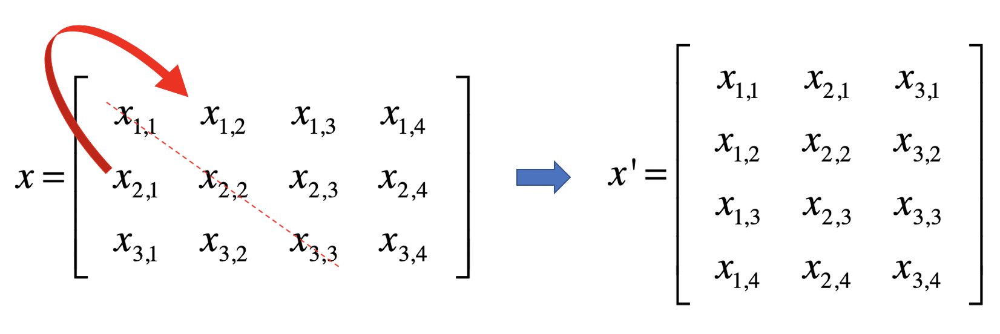

**单位矩阵**（Identity Matrix）：所有沿主对角线的元素都是1，而其他位置的所有元素都是0。常只考虑单位矩阵为方阵的情况，也就是行数和列数相等，我们把它记做$I\_{n}$，$n$表示维数。

如果有矩阵$X$，我们把它的**逆矩阵**记做$X^{-1}$，两者相乘的结果是单位矩阵：

$$X^{-1}X=I_n$$

## 向量空间

**域**：一个数的集合$F$，它满足“$F$中任意两个数的加减乘除法（除数不为零）的结果仍然在这个$F$中”。如果域$F$里的元素都为实数，那么$F$就是实数域。

如果$x_{1}，x_{2}，……，x\_{n}∈F$，那么$F$上的$n$维向量就是：

转置形式：

向量中第$i$个元素，也称为第$i$个分量。$F\_{n}$是由$F$上所有$n$维向量构成的集合。

假设$V$是$F\_{n}$的非零子集：

* $V$**对向量的加法封闭**： 如果对任意的向量$x$、向量$y∈V$，都有$(x+y)∈V$
* **$V$对标量与向量的乘法封闭**：对任意的标量$k∈V$，向量$x∈V$，都有$kx$属于$V$

如果$V$满足向量的加法和乘法封闭性，就称$V$是$F$上的向量空间。向量空间除了满足这两个封闭性，还满足基本运算法则，比如交换律、结合律、分配律等等。

### 向量间的距离

常用距离：

* **曼哈顿距离**（Manhattan Distance） 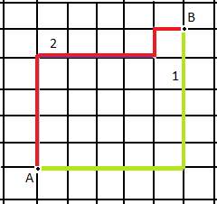

  从A点到B点有多条路径，但是无论哪条，曼哈顿距离都是一样的。

  在二维空间中，两个点（实际上就是二维向量）$x(x_{1},x_{2})$与$y(y_{1},y_{2})$间的曼哈顿距离是：

  $$MD(x,y)=\mid x_1 - y_1 \mid + \mid x_2 - y_2 \mid$$

推广到**$n$维空间，曼哈顿距离的计算公式**为：

$$MD(x,y)=\sum_{i=1}^n \mid x_i - y_i \mid$$

其中$n$表示向量维度，$x_{i}$表示第一个向量的第$i$维元素的值，$y_{i}$表示第二个向量的第$i$维元素的值。

* **欧氏距离**（Euclidean Distance）

  欧几里得距离，指在n维空间中两个点之间的真实距离，在二维空间中，两个点$x(x_{1},x_{2})$与$y(y_{1},y_{2})$间的欧氏距离是：

  

n维空间，欧氏距离的计算公式为： 

* **切比雪夫距离**（Chebyshev Distance）

  切比雪夫其实是在模拟国际象棋里国王的走法。国王可以走临近8个格子里的任何一个，那么国王从格子$(x_{1},x_{2})$走到格子$(y_{1},y_{2})$最少需要多少步呢？其实就是二维空间里的切比雪夫距离。

  一开始，为了走尽量少的步数，国王走的一定是斜线，所以横轴和纵轴方向都会减1，直到国王的位置和目标位置在某个轴上没有差距，这个时候就改为沿另一个轴每次减1。所以，国王走的最少格子数是$\|x_{1}-y_{1}\|$和$\|x_{2}-y_{2}\|$这两者的较大者。

  所以，在二维空间中，两个点$x(x_{1},x_{2})$与$y(y_{1},y_{2})$间的切比雪夫距离是：

  $$CD(x,y)=max(\mid x_1 - y_1 \mid,\mid x_2 - y_2\mid)$$

推广到n维空间，切比雪夫距离的计算公式为：

* **闵可夫斯基距离**

  也叫闵氏距离，一种通用的形式表示上述三种距离。在二维空间中，两个点$x(x_{1},x_{2})$与$y(y_{1},y_{2})$间的闵氏距离是：

  

两个$n$维变量$x(x_{1},x_{2},…,x_{n})$与$y(y_{1},y_{2},…,y_{n})$间的闵氏距离的定义为：

其中$p$是一个变参数：

* 当$p=1$时，就是曼哈顿距离；
* 当$p=2$时，就是欧氏距离；
* 当$p$趋近于无穷大的时候，就是切比雪夫距离。这是因为当$p$趋近于无穷大的时候，最大的$\|x_{i}-y_{i}\|$会占到全部的权重。

### 向量的长度

向量的长度，也叫向量的模，是向量所对应的点到空间原点的距离。通常我们使用**欧氏距离**来表示向量的长度。

**范数**常常被用来衡量某个向量空间中向量的大小或者长度。范数满足非负性、齐次性、和三角不等式。

* $L\_{1}$范数$||x||$ ，它是$x$向量各个元素绝对值之和，对应于向量$x$和原点之间的曼哈顿距离。
* $L_{2}$范数$||x||_{2}$ ，它是$x$向量各个元素平方和的$\frac{1}{2}$次方，对应于向量$x$和原点之间的欧氏距离。
* $L_{p}$范数$||x||_{p}$ ，为$x$向量各个元素绝对值$p$次方和的1/p次方，对应于向量$x$和原点之间的闵氏距离。
* $L_{∞}$范数$||x||_{∞}$ ，为$x$向量各个元素绝对值最大那个元素的绝对值，对应于向量$x$和原点之间的切比雪夫距离。

所以，在讨论向量的长度时，我们需要弄清楚是L几范数。

### 向量间的夹角

空间中两个向量所形成夹角的余弦值：

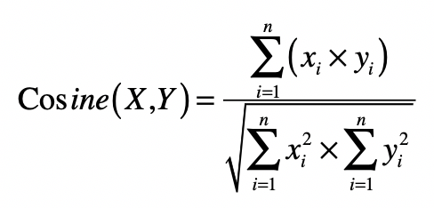

分子是两个向量的点乘，而分母是两者长度（或L2范数）的乘积，而L2范数可以使用向量点乘自身的转置来实现。

夹角余弦的取值范围在\[-1,1\]，当两个向量的方向重合时夹角余弦取最大值1，当两个向量的方向完全相反夹角余弦取最小值-1。值越大，说明夹角越小，两点相距就越近；值越小，说明夹角越大，两点相距就越远。

### 向量空间模型

向量空间模型假设所有的对象都可以转化为向量，然后使用向量间的距离（通常是欧氏距离）或者是向量间的夹角余弦来表示两个对象之间的相似程度。

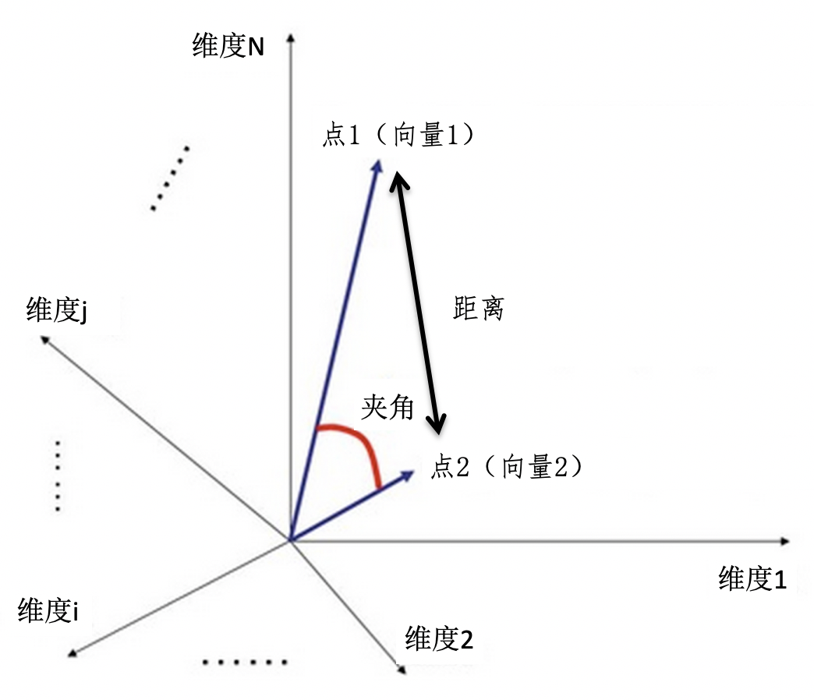

由于夹角余弦的取值范围已经在-1到1之间，而且越大表示越相似，所以可以直接作为相似度的取值。

相对于夹角余弦，欧氏距离ED的取值范围可能很大，而且和相似度呈现反比关系，所以通常要进行1/(1+ED)这种归一化。

当ED为0的时候，变化后的值就是1，表示相似度为1，完全相同。当ED趋向于无穷大的时候，变化后的值就是0，表示相似度为0，完全不同。所以，这个变化后的值，取值范围是0到1之间，而且和相似度呈现正比关系。

## 矩阵

### PageRank计算

PageRank是基于马尔科夫链的。它假设了一个“随机冲浪者”模型，冲浪者从某张网页出发，根据Web图中的链接关系随机访问。在每个步骤中，冲浪者都会从当前网页的链出网页中，随机选取一张作为下一步访问的目标。此外，PageRank还引入了随机的跳转操作，这意味着冲浪者不是按Web图的拓扑结构走下去，只是随机挑选了一张网页进行跳转。

基于之前的假设，PageRank的公式定义如下：

其中，$p_{i}$表示第$i$张网页，$M_{i}$是$p_{i}$的入链接集合，$p_{j}$是$M_{i}$集合中的第$j$张网页。$PR_{(p_{j})}$表示网页$p_{j}$的PageRank得分，$L_{(p_{j})}$表示网页$p_{j}$的出链接数量，$\frac{1}{L_{(p_{j})}}$就表示从网页$p_{j}$跳转到$p\_{i}$的概率。$α$是用户不进行随机跳转的概率，$N$表示所有网页的数量。

#### 迭代法实现的PageRank计算

一开始所有网页结点的初始PageRank值都可以设置为某个相同的数，例如1，然后通过上面这个公式，得到每个结点新的PageRank值。

每当一张网页的PageRank发生了改变，它也会影响它的出链接所指向的网页，因此我们可以再次使用这个公式，循环地修正每个网页结点的值。由于这是一个马尔科夫过程，所以能从理论上证明，所有网页的PageRank最终会达到一个稳定的数值。

#### 简化PageRank计算

先不考虑随机跳转的情况，而只考虑用户按照网页间链接进行随机冲浪。那么PageRank的公式就简化为：

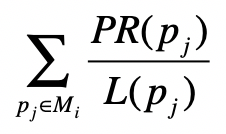

对比矩阵点乘的公式：$$Z_{i,j}=\sum_k X_{i,k}Y_{k,j}$$

以上两个公式在形式上是基本一致的。因此，我们可以把$Σ\frac{PR_{(p_{j})}}{L_{(p_{j})})}$的计算，分解为两个矩阵的点乘。

* 一个矩阵是当前每张网页的PageRank得分
* 另一个矩阵就是邻接矩阵($x_{i,j}$表示网页$p_{i}$到网页$p\_{j}$的链接。最原始的邻接矩阵所包含的元素是0(没有链接)或1(有链接))

考虑到PageRank里乘积是$\frac{1}{L_{(p_{j})}}$，我们可以对邻接矩阵的每一行进行归一化，用原始的值（0或1）除以$L_{(p_{j})}$，而$L_{(p_{j})}$表示有某张网页$p_{j}$的出链接，正好是矩阵中$p_{j}$这一行的和。所以，我们可以对原始的邻接矩阵，进行**基于行的归一化**，这样就能得到每个元素为$\frac{1}{L_{(p_{j})}}$的矩阵，其中$j$表示矩阵的第$j$行。注意，这里的归一化是指让所有元素加起来的和为1。

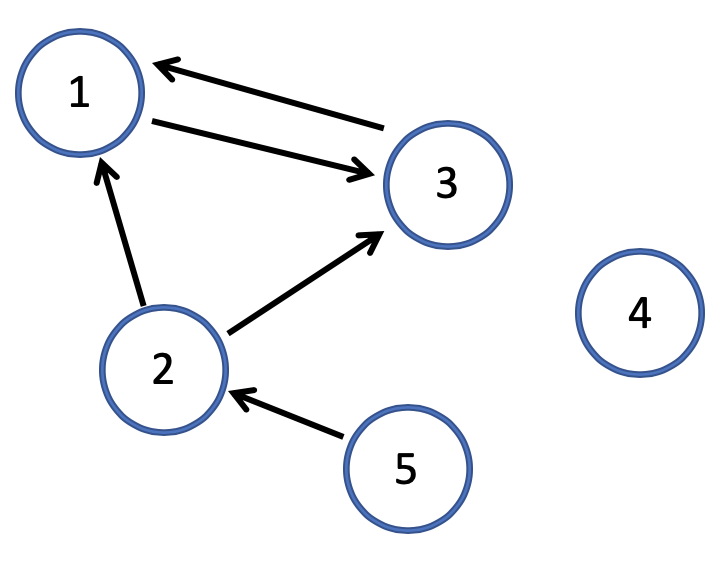

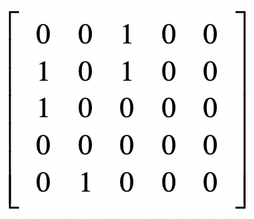

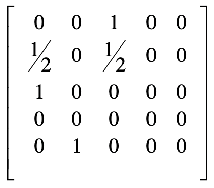

有了上述这个邻接矩阵，我们就可以开始最简单的PageRank计算。PageRank的计算是采样迭代法实现的。这里把初始值都设为1，第一次计算结果如下：

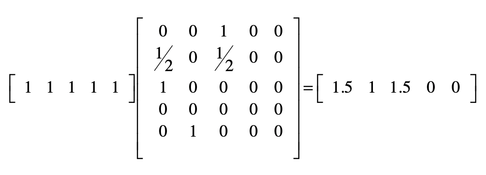

考虑随机跳转的情况，把$Σ\frac{PR_{(p_{j})}}{L_{(p_{j})})}$部分用$A$表示，那么完整的PageRank公式就可以表示为：

$PR(P\_{i})=αA+\frac{1-α}{N}$

分解为如下两个矩阵的点乘：

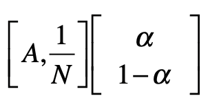

仍然使用前面的例子，看看经过随机跳转之后，PageRank值变成了多少。这里$α$取0.9。

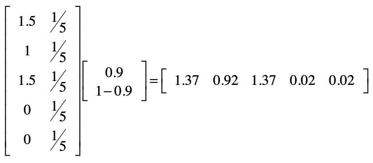

PageRank算法需要迭代式计算。为了避免计算后的数值越来越大甚至溢出，我们可以进行归一化处理，保证所有结点的数值之和为1。经过这个处理之后，我们得到第一轮的PageRank数值，也就是下面这个行向量：

\[0.37027027 0.24864865 0.37027027 0.00540541 0.00540541\]

接下来只需要再重复之前的步骤，直到每个结点的值趋于稳定就可以了。

[networkx](https://networkx.github.io/)提供了直接构建拓扑图和计算PageRank的功能，可以尝试构建样例拓扑图并计算每个结点的PageRank得分。

### 协同过滤推荐

推荐，是指为用户提供可靠的建议、并协助用户挑选物品的一种技术。一个好的推荐系统需要建立在海量数据挖掘基础之上，并根据用户所处的情景和兴趣特点，向用户推荐可能感兴趣的信息和商品。

协同过滤（Collaborative Filtering）是经典的推荐算法之一，它充分利用了用户和物品之间已知的关系，为用户提供新的推荐内容。

推荐系统会根据用户所处的场景和个人喜好，推荐他们可能感兴趣的信息和商品。比如，你在阅读一部电影的影评时，系统给你推荐了其他“你可能也感兴趣的电影”。可以看出来，推荐系统中至少有2个重要的角色：用户和物品。**用户是系统的使用者，物品就是将要被推荐的候选对象。**

一个好的推荐算法，需要充分挖掘用户和物品之间的关系。可以通过矩阵来表示这种二元关系。这里有一个例子，用矩阵$X$来表示用户对物品喜好程度。

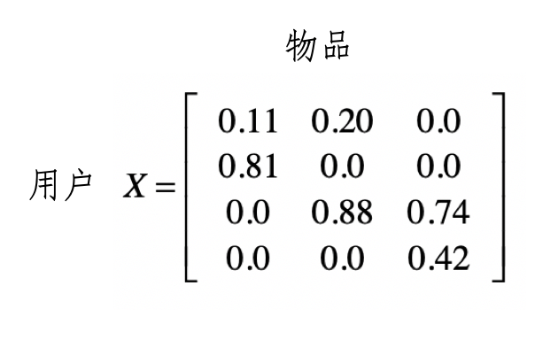

其中第$i$行是第$i$个用户的数据，而第j列是用户对第j格物品的喜好程度（可以是用户购买商品的次数、对书籍的评分等）。

> 什么是协同过滤？
>
> 可以把它理解为最直观的“口口相传”。
>
> 假设我们愿意接受他人的建议，尤其是很多人都向你建议的时候。其主要思路就是**利用已有用户群过去的行为或意见，预测当前用户最可能喜欢哪些东西**。根据推荐依据和传播的路径，又可以进一步细分为基于用户的过滤和基于物品的过滤。

#### 基于用户的过滤

给定一个用户访问（假设有访问就表示有兴趣）物品的数据集合，找出和当前用户历史行为有相似偏好的其他用户，将这些用户组成“近邻”，对于当前用户没有访问过的物品，利用其近邻的访问记录来预测。

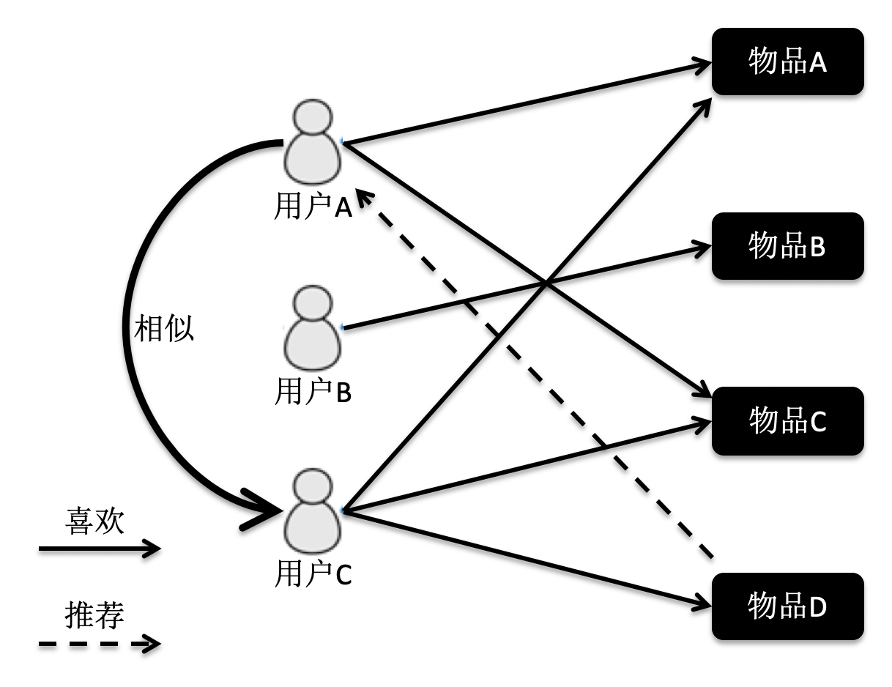

假设有m个用户，n个物品，那么就能使用一个m×n维的矩阵$X$来表示用户对物品喜好的二元关系。

**先计算用户相似度矩阵US**

$$us_{i1,i2}=\frac{X_{i1,} * X_{i2,}}{\mid\mid X_{i1,} \mid\mid_2 * \mid\mid X_{i2,} \mid\mid_2}=\frac{\sum_{j=1}^n x_{i1,j}*x_{i2,j}}{\sqrt{\sum_{j=1}^n x_{i1,j}^2} \sqrt{\sum_{j=1}^n x_{i2,j}^2}}$$

这个公式的核心思想是计算用户和用户之间的相似度。(使用了夹角余弦）完成这一步就能找到给定用户的“近邻”。

$us_{i1,i2}$表示用户$i1$和$i2$的相似度，$X_{i1}$,表示矩阵中第$i1$行的行向量，$X\_{i2}$,表示矩阵中第$i2$行的行向量。分子是两个表示用户的行向量之点乘，而分母是这两个行向量$L2$范数的乘积。

分子部分采用矩阵点乘自身的转置来实现，也就是$XX’$。矩阵$X$的每一行是某个用户的行向量，每个分量表示用户对某个物品的喜好程度。而矩阵$X’$的每一列是某个用户的列向量，每个分量表示用户对某个物品的喜好程度。

假设$XX’$的结果为矩阵$Y$，那么$y\_{i,j}$就表示用户$i$和用户$j$这两者喜好度向量的点乘结果，它就是夹角余弦公式中的分子。如果$i$等于$j$，那么这个计算值也是夹角余弦公式分母的一部分。从矩阵的角度来看，$Y$中任何一个元素都可能用于夹角余弦公式的分子，而对角线上的值会用于夹角余弦公式的分母。

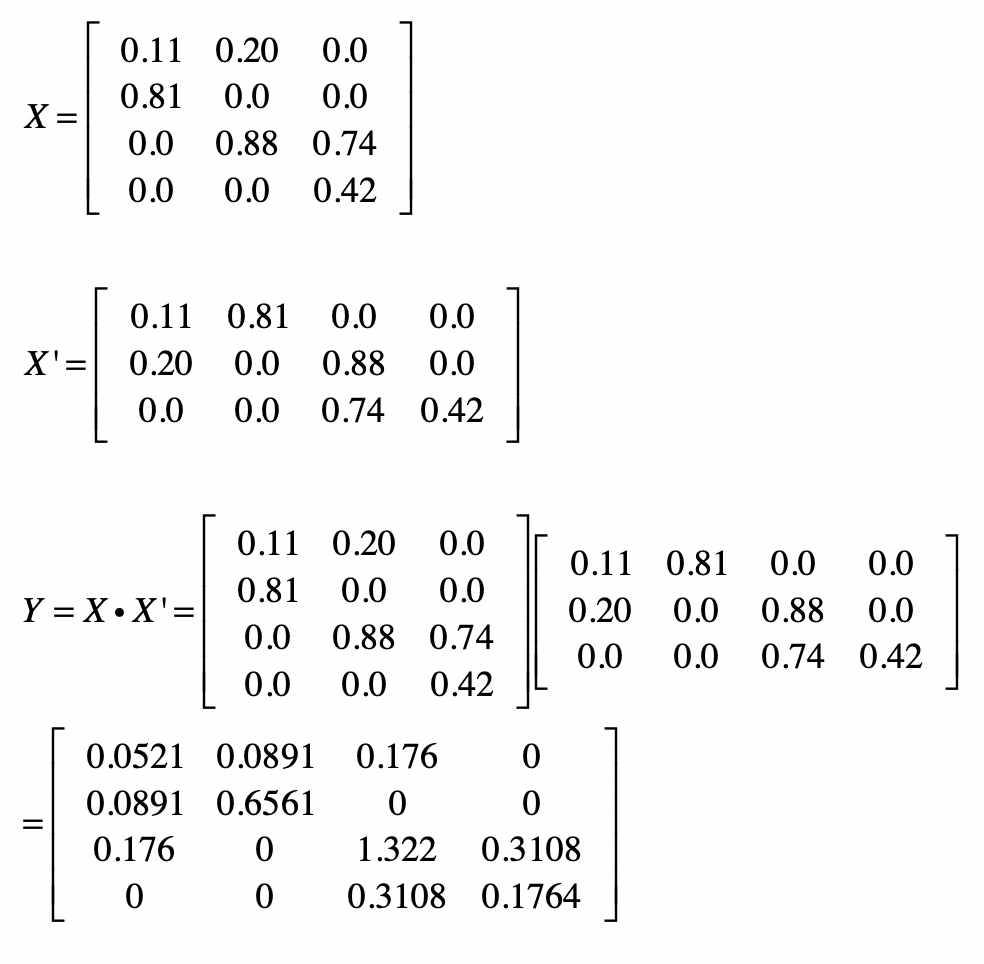

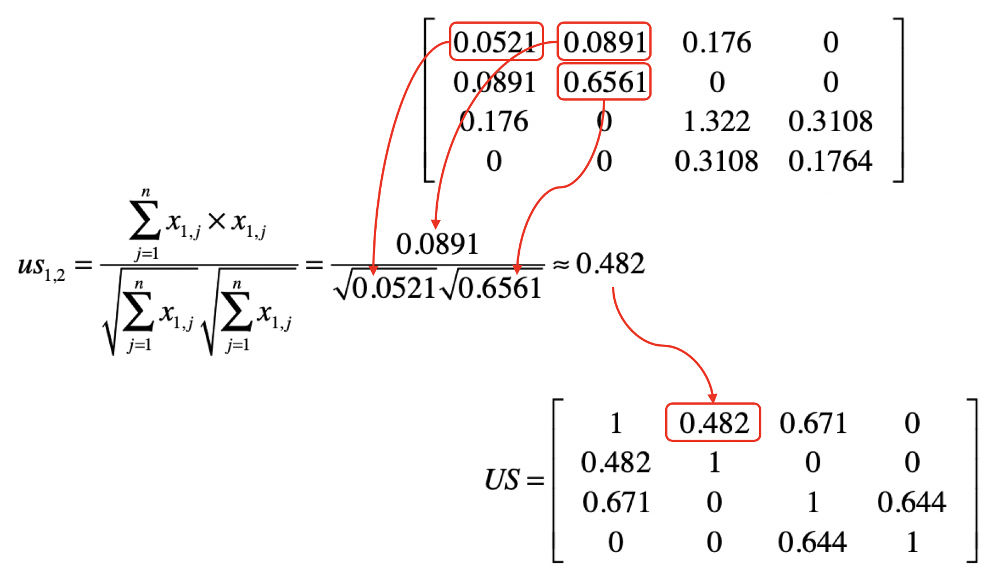

（图中分子应为$x_{1,j}\*x_{2,j}$，分母同理）

**再计算用户对物品的兴趣矩阵**

$$p_{i,j}=\frac{\sum_{k=1}^m us_{i,k}*x_{k,j}}{\sum_{k=1}^m us_{i,k}}$$

这个公式利用前一个公式所计算的用户间相似度，以及用户对物品的喜好度，预测任一个用户对任一个物品的喜好度。其中$p_{i,j}$表示第$i$用户对第$j$个物品的喜好度，$us_{i,k}$表示用户$i$和$k$之间的相似度，$x_{k,j}$表示用户$k$对物品$j$的喜好度。注意这里最终需要除以$Σus_{i,k}$，是为了进行归一化。

如果$us_{i,k}$越大，$x_{k,j}$对最终$p_{i,j}$的影响越大，反之如果$us_{i,k}$越小，$x_{k,j}$对最终$p_{i,j}$的影响越小，充分体现了“基于相似用户”的推荐。

为了实现上面这个公式的分子部分，我们可以使用$US$和$X$的点乘，假设点乘后的结果矩阵为$USP$。

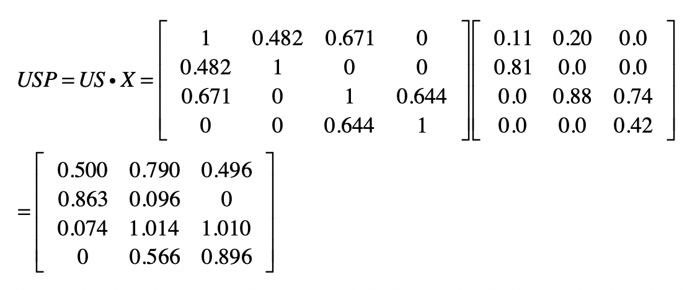

分母部分可以使用$US$矩阵的按行求和来实现，假设按行求和的矩阵为$USR$。

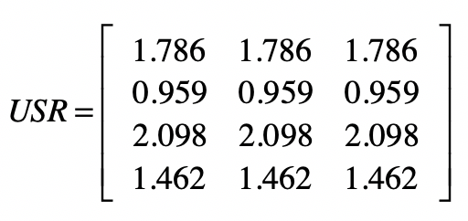

（这里算错了，对USP按行求和了，应该对US按行求和）

最终，使用$USP$和$USR$的元素对应除法，就可以求得矩阵$P$。

既然已经有$X$这个喜好度矩阵了，为什么还要计算$P$这个喜好度矩阵呢？实际上，$X$是已知的、有限的喜好度。例如用户已经看过的、购买过的、或评过分的物品。而$P$是我们使用推荐算法预测出来的喜好度。

即使一个用户对某个物品从未看过、买过、或评过分，我们依然可以通过矩阵$P$，知道这位用户对这个物品大致的喜好程度，从而根据这个预估的分数进行物品的推荐，这也是协同过滤的基本思想。从根据示例计算的结果也可以看出这点，在原始矩阵$X$中第1个用户对第3个物品的喜好度为0。可是在最终的喜好度推荐矩阵P中，第1个用户对第3个物品的喜好度为0.278，已经明显大于0了，因此我们就可以把物品3推荐给用户1。

上面这种基于用户的协同过滤有个问题，那就是没有考虑到用户的喜好程度是不是具有可比性。假设用户的喜好是根据对商品的评分来决定的，有些用户比较宽容，给所有的商品都打了很高的分，而有些用户比较严苛，给所有商品的打分都很低。分数没有可比性，这就会影响相似用户查找的效果，最终影响推荐结果。这个时候我们可以采用之前介绍的特征值变化，对于原始的喜好度矩阵，按照用户的维度对用户所有的喜好度进行归一化或者标准化处理，然后再进行基于用户的协同过滤。

#### 基于物品的过滤

基于物品的协同过滤是指利用物品相似度，而不是用户间的相似度来计算预测值。

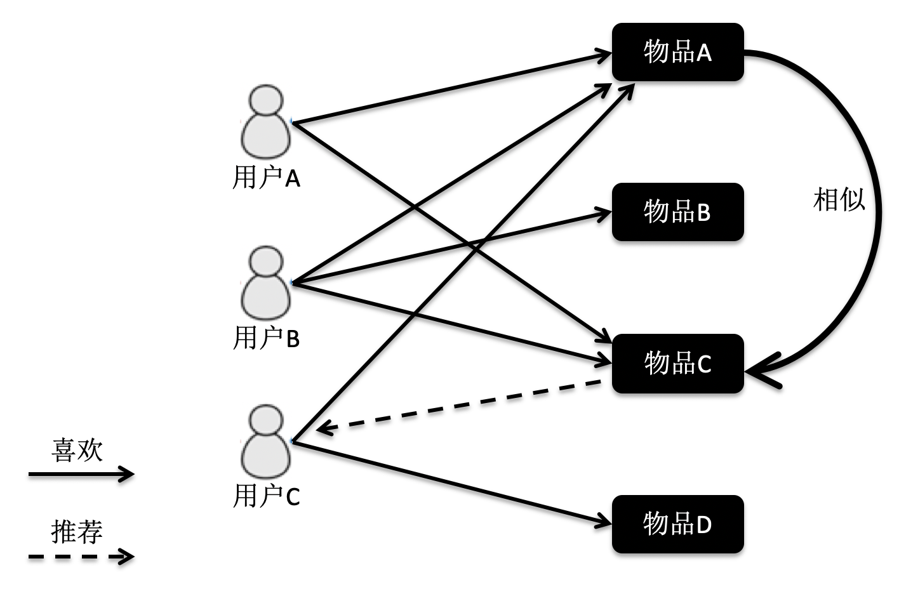

在这张图中，物品A和C因为都被用户A和B同时访问，因此它们被认为相似度更高。当用户C访问过物品A后，系统会更多地向用户推荐物品C，而不是其他物品。

$$is_{j1,j2}=\frac{X_{,j1} * X_{,j2}}{\mid\mid X_{,j1} \mid\mid_2 * \mid\mid X_{,j2} \mid\mid_2}=\frac{\sum_{i=1}^m x_{i,j1}*x_{i,j2}}{\sqrt{\sum_{i=1}^m x_{i,j1}^2} \sqrt{\sum_{i=1}^m x_{i,j2}^2}}$$

分子是两个表示物品的列向量之点乘，而分母是这两个列向量$L2$范数的乘积。

$$p_{i,j}=\frac{\sum_{k=1}^n x_{i,k}*is_{k,j}}{\sum_{k=1}^m is_{k,j}}$$

利用前一个公式所计算的物品间相似度，和用户对物品的喜好度，预测任一个用户对任一个物品的喜好度。其中$p_{i,j}$表示第$i$用户对第$j$个物品的喜好度，$x_{i,k}$表示用户$i$对物品$k$的喜好度，$is_{k,j}$表示物品$k$和$j$之间的相似度，注意这里除以$Σis_{k,j}$是为了进行归一化。从这个公式可以看出，如果$is_{k,j}$越大，$x_{i,k}$对最终$p_{i,j}$的影响越大，反之如果$is_{k,j}$越小，$x_{i,k}$对最终$p_{i,j}$的影响越小，充分体现了“基于相似物品”的推荐。

类似地，用户喜好程度的不一致性，同样会影响相似物品查找的效果，并最终影响推荐结果。我们也需要对于原始的喜好度矩阵，按照用户的维度对用户的所有喜好度，进行归一化或者标准化处理。

### 矩阵乘法的几何意义

对某个向量左乘一个矩阵，实际上是对这个向量进行了一次变换。某个矩阵的特征向量表示了这个矩阵在空间中的变换方向，这些方向都是正交或者趋于正交的，而特征值表示每个方向上伸缩的比例。

**正交向量**：两个向量的点乘结果为 0。

在酉矩阵之中，矩阵和矩阵的转置相乘为单位矩阵，只有向量自己点乘自己值为 1，而不同向量之间点乘值为 0，所以不同的向量之间是正交的。

在二维空间中，假设有一个点坐标为`(1, 2)` ，对于这个点，我们可以把从原点到它的直线投影到 $x$轴和 $y$轴，这个直线在$x$ 轴上投影的长度为 1，在 $y$ 轴上投影的长度为 2。

对于这个点，我们使用一个矩阵$X\_1$ 左乘这个点的坐标

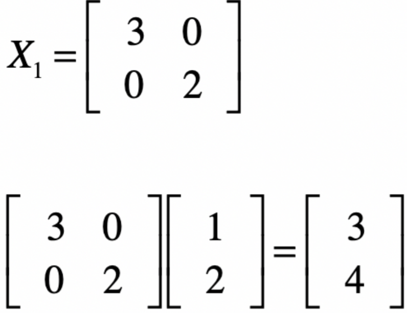

把结果转成坐标系里的点`(3, 4)`，把从原点到 `(1, 2)` 的直线，和从原点到`(3, 4)`的直线进行比较，可以发现直线发生了旋转，而且长度也发生了变化，这就是矩阵左乘所对应的几何意义。我们还可以对这个矩阵 分析一下，看看它到底表示了什么含义，以及为什么它会导致直线的旋转和长度发生变化。

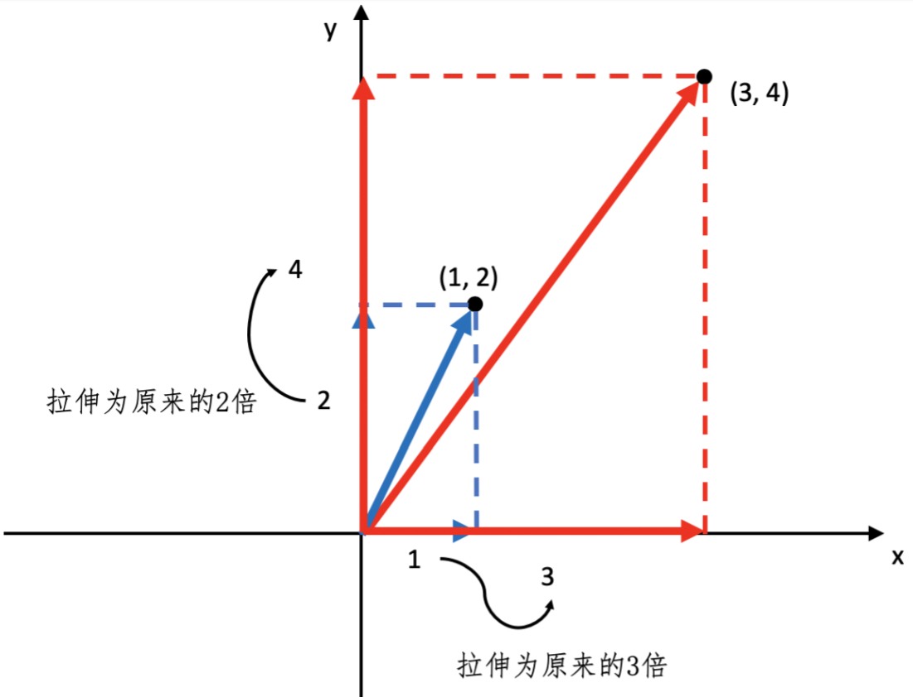

由于矩阵$X\_1$ 是一个对角矩阵，所以特征值很容易求解，分别是 3 和 2。而对应的特征向量是`[1, 0]` 和 `[0, 1]`。在二维坐标中，坐标 `[1, 0]` 实际上表示的是$x$ 轴的方向，而 `[0, 1]` 实际上表示的是$y$ 轴的方向。特征值 3对应特征向量 `[1, 0]`就表明在$x$ 轴方向拉伸为原来的 3 倍，特征值 2 对应特征向量 `[0, 1]` 就表明在$y$ 轴方向拉伸 2 倍。所以，矩阵$X\_1$ 的左乘，就表示把原有向量在$x$ 轴上拉伸为原来的 3倍，而在$y$ 轴上拉伸为原来的 2 倍。

矩阵的特征向量不一定是 轴和 轴，它们可以是二维空间中**任何相互正交的向量**。

假设有有两个向量：\[$\frac{1}{\sqrt{2}}$, $\frac{1}{\sqrt{2}}$\]和\[$\frac{1}{\sqrt{2}}$, $\frac{-1}{\sqrt{2}}$\]，它们在空间中的方向：

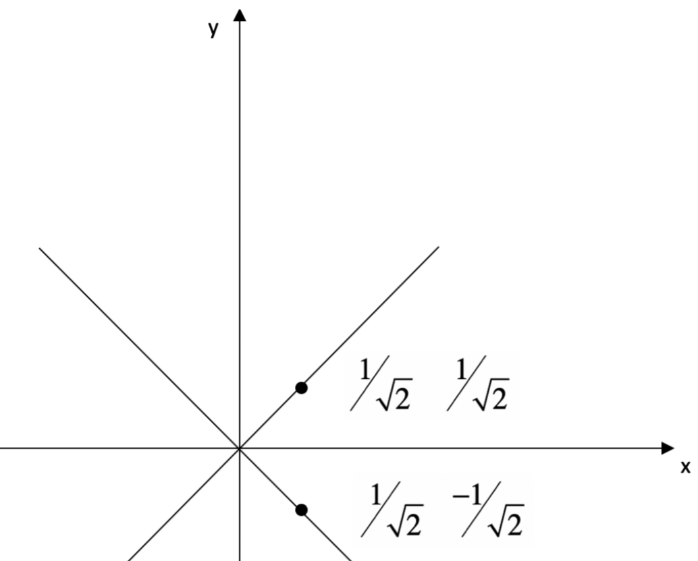

用这两个向量构建一个矩阵$V$（代表变换方向）：

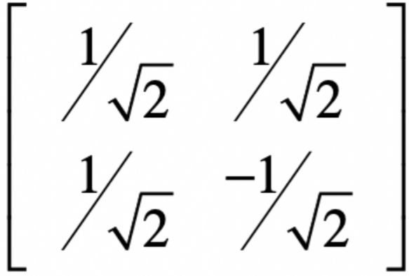

$V$ 是一个酉矩阵，也就是说 $VV'=I$，所以我们可以使用它，外加一个特征值组成的对角矩阵$Σ$ ，来构建另一个用于测试的矩阵$X\_2$ 。使用SVD对对称方阵可以进行特征值分解，我们可以通过$V$ 和 $Σ$，获得一个对称方阵$X\_2 = VΣV'$

假设两个特征值分别是 0.5 和 2（代表每个方向的变化幅度），所以有：

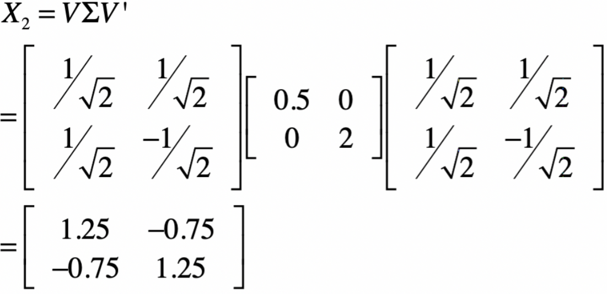

如果让这个矩阵$X_2$ 左乘任何一个向量，就是让向量沿[$\frac{1}{{\sqrt{2}}}$, $\frac{1}{{\sqrt{2}}}$] 方向压缩一半，而在[$\frac{1}{{\sqrt{2}}}$, $\frac{-1}{{\sqrt{2}}}$]  方向增加两倍。为了验证这一点，我们让$X_2$ 左乘向量`(1, 2)` ，获得新向量：

把这个新的坐标(-0.25, 1.5) 和原坐标(1, 2) 都放到二维坐标系中，并让它们分别在[$\frac{1}{{\sqrt{2}}}$, $\frac{1}{{\sqrt{2}}}$]  和[$\frac{1}{{\sqrt{2}}}$, $\frac{-1}{{\sqrt{2}}}$]  这两个方向进行投影，然后比较投影的长度。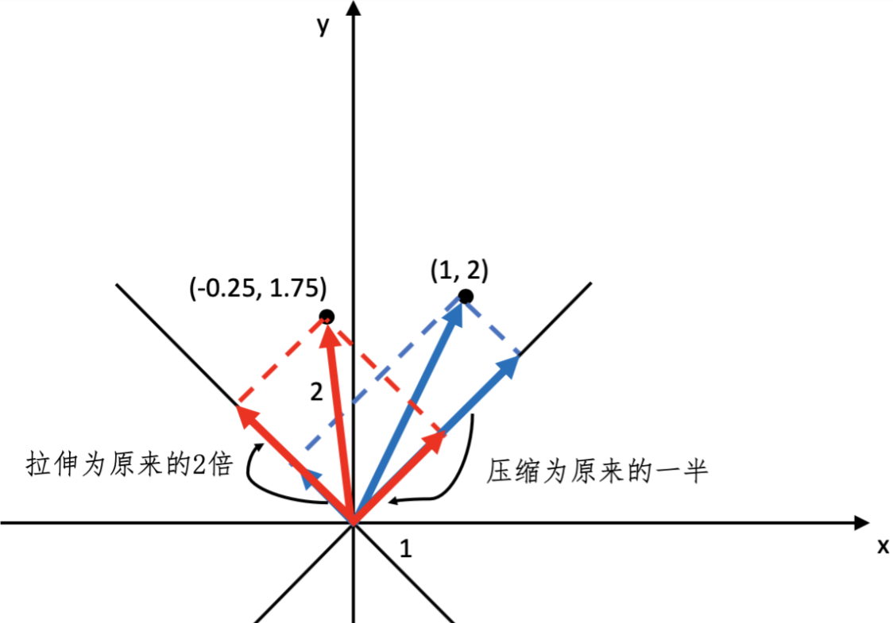

#### 总结

假设我们让矩阵$X$ 左乘矩阵$Y$ ，那么可以把右矩阵$Y$ 看作一堆列向量的集合，而左乘矩阵$X$ 就是对每个$Y$中的列向量进行变换。

三维、四维直到 n维空间也可以依此类推。

