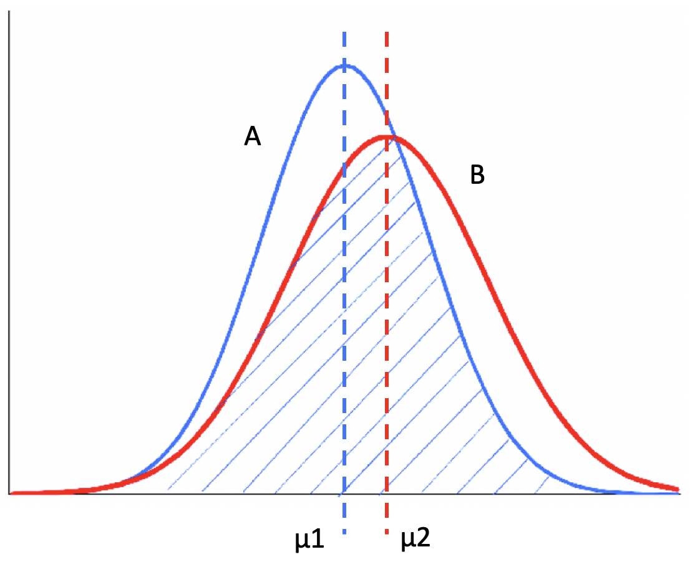
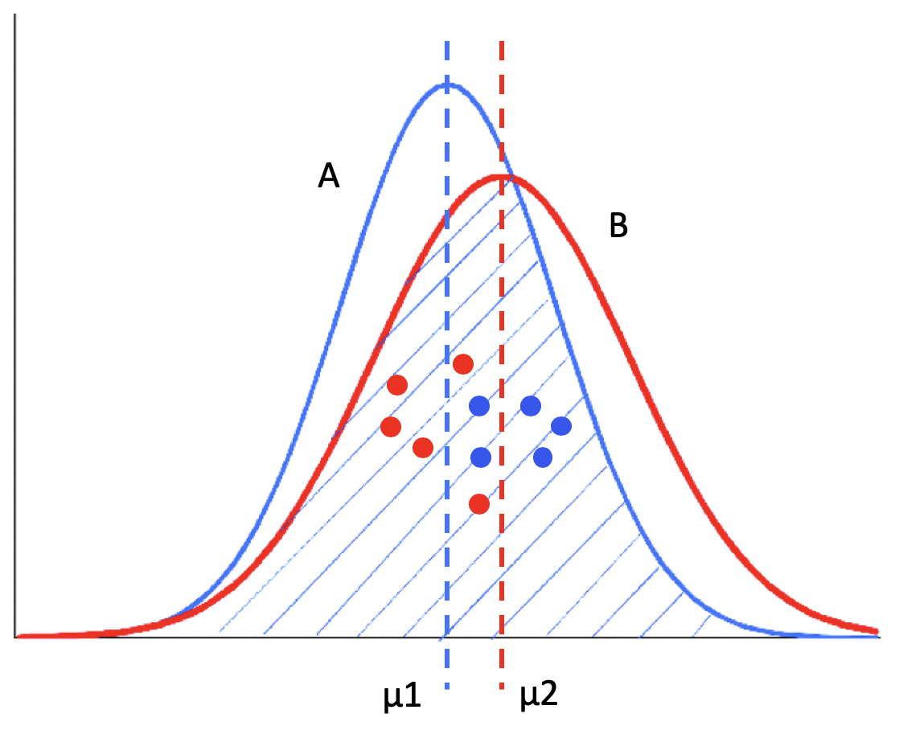
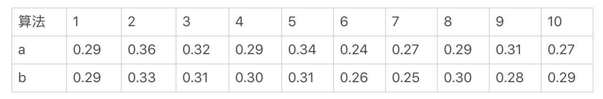
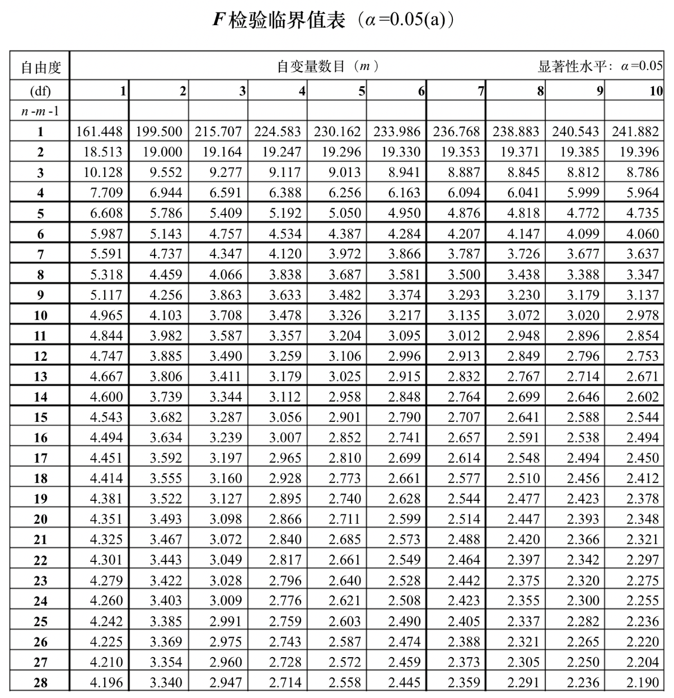

# 统计意义

**A/B测试**：简单来说，就是为同一个目标制定两个或多个方案，让一部分用户使用A方案，另一部分用户使用B方案，记录下每个部分用户的使用情况，看哪个方案产生的结果更好。这也意味着，通过A/B测试的方式，我们可以拿到使用多个不同方法之后所产生的多组结果，用于对比。

假设我们手头上有几组不同的结果，每组对应一个方案，包含了最近30天以来每天的转化率，如何判断哪个方案的效果更好呢？也许可以对每一组的30个数值取平均数，看看谁的均值大？但是，这真的就够了吗？

假设有两组结果需要比较，每一组都有5个数据，而且这两组都符合正态分布。

从这张图可以看出，左边的正态分布A均值μ1比较小，右侧的正态分布B均值μ2比较大。可是，如果我们无法观测到A和B这两个分布的全部，而只根据这两个分布的采样数据来做判断，很有可能会得出错误的结论。

比如说，在这张图的采样中，红色的点表示B的采样，它们都是来自B分布的左侧，而蓝色的点表示A的采样，它们都是来自A分布的右侧。如果我们仅仅根据这两组采样数据的均值来判断，很可能会得出“B分布的均值小于A分布均值”这样的错误结论。

A/B测试面临的就是这样的问题。我们所得到的在线测试结果，实际上只是一种采样。所以我们不能简单地根据每个组的平均值，来判断哪个组更优。

## 显著性差异

从上面两张正态分布图，可以分析得出，两组数据之间的差异可能由两个原因引起。

* **两个分布之间的差异**。假设A分布的均值小于B分布，而两者的方差一致，那么A分布随机产生的数据有更高的概率小于B分布随机产生的数据。
* **采样引起的差异**，也就是说采样数据不能完全体现整体的数据分布。

如果差异是第一个原因导致的，在统计学中我们就认为这两组“有显著性差异”。如果差异是第二种原因导致的，我们就认为这两组“无显著性差异”。

可以看出来，**显著性差异**（Significant Difference），其实就是研究多组数据之间的差异，是由于不同的数据分布导致的，还是由于采样的误差导致的。通常，我们也把“具有显著性差异”，称为“差异具有统计意义”或者“差异具有显著性”。

> “差异具有显著性”和“具有显著差异”的区别。
>
> “差异具有显著性“表示不同的组很可能来自不同的数据分布，也就是说多个组的数据来自同一分布的可能性非常小。而“具有显著差异”，是指差异的幅度很大，比如相差100倍。

**差异的显著性和显著差异没有必然联系**。举两个例子，比如说，两个不同的数据分布，它们的均值分别是1和1.2，这两个均值相差的绝对值很小，也就是没有显著差异，但是由于它们源自不同的数据分布，所以差异是具有显著性的。再比如说，来自同一个数据分布的两个采样，它们的均值分别是1和100，具有显著的差异，但是差异没有显著性。

## 统计假设检验和显著性检验

统计假设检验是指事先对随机变量的参数或总体分布做出一个假设，然后利用**样本信息**来判断这个假设是否合理。在统计学上，称这种假设为**虚无假设**（Null Hypothesis），也叫原假设或零假设，通常记作**H0**。而和虚无假设对立的假设，称为**对立假设**（Alternative Hypothesis），通常记作**H1**。也就是说，如果证明虚无假设不成立，那么就可以推出对立假设成立。

统计假设检验的**具体步骤**是，先认为原假设成立，计算其会导致什么结果。若在单次实验中产生了小概率的事件，则拒绝原假设H0，并接受对立假设H1。若不会产生小概率的事件，则不能拒绝原假设H0，从而接受它。因此，统计学中的假设是否成立，并不像逻辑数学中的绝对“真”或“假”，而是需要从概率的角度出发来看。

按照业界的约定俗成，通常我们把概率不超过0.05的事件称为“小概率事件”。当然，根据具体的应用，偶尔也会取0.1或0.01等。在假设检验中，我们把这个概率记为α，并称它为**显著性水平**。

显著性检验是统计假设检验的一种，它可以帮助我们判断多组数据之间的差异，是采样导致的“偶然”，还是由于不同的数据分布导致的“必然“。当然，这里的“偶然”和“必然”都是相对的，和显著性水平α有关。

显著性检验的假设是，多个数据分布之间没有差异。如果样本发生的概率小于显著性水平α，只要证明小概率事件发生了，就可以拒绝原假设，也就是说认为多个分布之间有差异。否则接受原假设，认为多个分布之间没有差异。换句话说，**显著性水平α即为拒绝原假设的标准**。

## P值

使用P值为多组数据计算它们之间差异的显著性。P代表Probability，就是当H0假设为真时，样本出现的概率，或者换句话说，其实就是我们所观测到的样本数据符合原假设H0的可能性有多大。

如果P值很小，说明观测值与假设H0的期望值有很大的偏离，H0发生的概率很小，我们有理由拒绝原假设，并接受对立假设。P值越小，表明结果越显著，我们越有信心拒绝原假设。反之，说明观测值与假设H0的期望值很接近，我们没有理由拒绝H0。

在显著性检验中，**原假设认为多个分组内的数据来自同一个数据分布**，如果P值足够小，我们就可以拒绝原假设，认为多个分组内的数据来自不同的数据分布，它们之间存在显著性的差异。所以说，只要能计算出P值，我们就能把P值和显著性水平α进行比较，从而决定是否接受原假设。

## 方差分析

**方差分析**（Analysis of Variance, ANOVA），也叫**F检验**。这种方法可以检验两组或者多组样本的均值是否具备显著性差异。它有四个前提假设，分别是：

* 随机性：样本是随机采样的；
* 独立性：来自不同组的样本是相互独立的；
* 正态分布性：组内样本都来自一个正态分布；
* 方差齐性：不同组的方差相等或相近。

根据第三个前提，我们假设数据是正态分布，那么分布就有两个参数，一个是平均数，一个是方差。如果我们仅仅知道两个分组的平均值，但并不知道它们的方差相差多大，那么我们所得出的两个分布是否有显著差异的结论就不可靠了。

### 例子

假设数据符合上述四个前提，使用A/B测试案例，通过方差分析来检验多种算法所产生的用户转化率有没有显著性差异。我们把“转化率”称为“因变量”，把“算法”称为“因素”。这里我们只有算法一个因素，所以所进行的方差分析是单因素方差分析。在方差分析中，因素的取值是离散型的，我们称不同的算法取值为“水平”。如果我们比较算法a和b，那么a和b就是算法这个因素的两个水平。

假设只有两种算法a和b参与了A/B测试。为了检验这些算法导致的转化率，是不是存在显著的差异，进行一个为期10天的测试，每天都为每种算法获取一个转化率。

用$Y_{ij}$来表示这种表格中的数据，$i$表示第$i$次采样（或第$i$天），$j$表示第$j$种水平（或第$j$种算法）。以上面这张表格为例，$Y_{51}=0.34$。

如果我们把每种算法导致的转化率看作一个数据分布，那么方差分析要解决的问题就是：这两个转化率分布的均值，是不是相等。如果我把两种数据分布的均值记做μ1和μ2，那么原假设H0就是μ1=μ2。而对立假设H1就是μ1 &lt;&gt; μ2。

**差异是不是显著性，关键要看这个差异是采样的偶然性引起的，还是分布本身引起的。**方差分析的核心思想也是围绕这个展开的，因此它计算了三个数值：SST、SSM和SSE。

SST表示所有采样数据的**因变量方差**（Total Sum of Squares）。

$$SS_T=\sum\sum(Y_{ij}-\overline{\overline Y})^2$$

$\overline{\overline Y}$表示了10天里，2种算法全部20个数据的平均值。

SSM表示数据分布所引起的方差，我们称它为**模型平方和**（Sum Of Squares for Model）。

$$SS_M=\sum n_j(\overline Y_{j}-\overline{\overline Y})^2$$

$n_{j}$为水平$j$下的观测数量，在案例中为10。$\overline Y_{j}$为第$j$个水平的平均值，在案例中为算法a或算法b在这10天的平均值。$\overline Y_{j}-\overline{\overline Y}$表示的是**某个算法的采样均值和所有采样均值之间的差异**，$n_{j}$是相应的权重。

这里的两个算法都被测试了10天，所以权重相同。该案例中，SSM是0.00018。

SSE表示采样引起的方差，我们称它为**误差平方和**（Sum of Squaress for Error）。

$$SS_E=\sum\sum(Y_{ij}-\overline{ Y_j})^2$$

该案例中，SSE是0.01652。

SST、SSM和SSE这三者的关系其实是这样的：

$$SS_T = SS_M + SS_E$$

如果在SST中，SSM的占比更大，那么说明因素对因变量的差异具有显著的影响；如果SSE的占比更大，那么说明采样误差对因变量的差异具有更显著的影响。我们使用这两部分的比例来衡量显著性，并把这个比例称为**F值**。

$$F = \frac{SS_M / (s-1)}{SS_E/(n-s)}$$

s是水平的个数，n为所有样本的总数量，s-1为分布的自由度，n-s为误差的自由度。

> **自由度**（degree of freedom），英文缩写是df，它是指采样中能够自由变化的数据个数。
>
> 对于一组包含n个数据的采样来说，如果方差是一个固定值，那么只有n-1个数据可以自由变化，最后一个数的取值是给定的方差和其他n-1个数据决定的，而不由它自己随意变化，所以自由度就是n-1。
>
> t检验 VS f检验
>
> t检验可以用pairwise的t检验，一般用于两组对比，而f检验可以进行多组（多个水平）的检验

对于SSM来说，如果SSM是固定的，那么对于s个水平来说，只能有s-1个组数据自由变化，而最后一组数据必须固定，所以对应于SSM的自由度为s-1。

对于SSE来说，如果SSE是固定的，那么对于n个采样、s个水平数据来说，只有n-s个数据是可以自由变化的。因为每个水平中，都要有一个数据需要保证该组的平均值$\overline Y\_{j}$而无法自由变化。

在这个案例中，s为不同算法的个数，也就是水平的个数s为2，采样数据的个数n为20，所以分布的自由度为2-1=1，误差的自由度为20-2=18。

F=\(0.00018/\(2-1\)\)/\(0.01652/\(20-2\)\)=0.196125908

有了F值，还需要根据F检验值的临界表来查找对应的P值。

通过这张表以及n和m的值，我们可以找到，在显著性水平α为0.05的时候，F值的临界值。**如果大于这个临界值，那么F检验的P值就会小于显著性水平α，证明差异具有显著性。**

n=20，m=s-1=1，所以对应的F值为4.414。而我们计算得到的F值为0.196，远远小于4.414，因此说明差异没有显著性。

虽然算法a所导致的平均转化率要比算法b的相对高出约2%（2%的相对提升在转化率中已经算很高了），但是由于差异没有显著性，所以这个提升的偶然性很大，并不意味着算法a比算法b更好。

### 总结

方差分析可以帮助我们检测差异的显著性，它分析的内容是受一个或多个因素影响的因变量在不同水平分组的差异。不过**单因素的方差分析要求因变量属于正态分布总体，并具有方差齐性。**如果因变量的分布明显的是非正态，或者方差的差异很显著，那么我们就不能直接使用这种方法。对于方差不齐的情况，我们可以选择适当的函数，例如对数、倒数等等，对原始数据进行转换，直到方差齐性变得显著，或者剔除明显属于“均值±标准差”之外的数据。

对于非正态分布的数据，我们也可以使用非参数的分析。非参数检验是在总体的方差知道很少的情况下，利用样本数据对总体分布形态等进行推断的方法。名字中的“非参数”的由来，就是因为这种检验方法在推断过程中不涉及有关总体分布的参数，而只是进行分布位置、分布形状之间的比较，因此不受总体分布的限定，适用范围比较广。常见的非参数检验包括二项分布检验、K-S检验、卡方检验等等。

