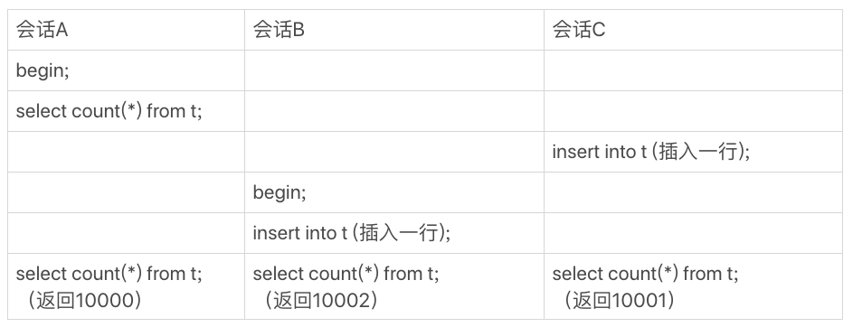

# count\(\*\)

在开发系统的时候，可能经常需要计算一个表的行数，比如一个交易系统的所有变更记录总数：

```text
mysql> select count(*) from t;
```

随着记录越来越多，这条语句执行得越来越慢，这是为什么呢？

如果应用中有这种频繁变更并需要统计表行数的需求，要怎么进行设计？

## count\(\*\)的实现方式

在不同的MySQL引擎中，`count(*)`（没有加过滤条件）有不同的实现方式。

* MyISAM引擎把一个表的总行数存在了磁盘上，因此执行`count(*)`的时候会直接返回这个数，效率很高
* InnoDB引擎因为支持事务，在执行`count(*)`的时候，需要把对于当前事务可见的数据一行一行地从引擎里面读出来，然后累积计数

对于InnoDB，即使是同一个时刻的多个查询，由于MVCC的原因，InnoDB表“应该返回多少行”也是不确定的。假设有如下三个会话：



在最后一个时刻，三个会话A、B、C会同时查询表t的总行数，但拿到的结果却不同。

这和InnoDB的事务设计有关系，可重复读是它默认的隔离级别，在代码上就是通过多版本并发控制来实现。**每一行记录都要判断自己是否对这个会话可见**，因此对于`count(*)`请求来说，InnoDB只好把数据一行一行地读出依次判断，可见的行才能够用于计算“基于这个查询”的表的总行数。

不过，对于`count(*)`，MySQL还是做了优化。InnoDB是索引组织表，主键索引树的叶子节点是数据，而普通索引树的叶子节点是主键值。所以，普通索引树比主键索引树小很多。对于`count(*)`这样的操作，遍历哪个索引树得到的结果逻辑上都是一样的。因此，MySQL优化器会找到最小的那棵树来遍历。**在保证逻辑正确的前提下，尽量减少扫描的数据量，是数据库系统设计的通用法则之一。**

用`show table status` 这个命令，也会输出一个`Rows`用于显示这个表当前有多少行，而且这个命令执行很快，但是这个`Rows`并不能代替`count(*)`。

索引统计的基数值是通过采样得到的，这个`Rows`也是通过采样估算得到的，因此它也不准，官方文档说误差可能达到40%到50%。

## 业务优化

如果有一个页面经常要显示交易系统的操作记录总数，可以自己找一个地方，将表的行数存起来。

### 缓存系统

对于更新很频繁的库来说，可以用缓存系统来支持。例如用redis保存这个表的总行数。这个表每被插入一行Redis计数就加1，每被删除一行Redis计数就减1。这种方式下，读和更新操作都很快，但是有可能出现下列问题：

* **丢失更新**，Redis的数据不能永久地留在内存里，所以需要把这个值定期地持久化存储起来。但即使这样，仍然可能丢失更新。试想如果刚刚在数据表中插入了一行，Redis中保存的值也加了1，然后Redis异常重启了，重启后从存储redis数据的地方把这个值读回来，而刚刚加1的这个计数操作却丢失了。

  不过redis异常重启的情况并不常见，可以在重启后到数据库里单独执行一次`count(*)`获取真实行数，再把这个值写回到Redis里。

* **逻辑上不准确**，假设有这么一个页面，要显示操作记录的总数，同时还要显示最近操作的100条记录。那么，这个页面的逻辑就需要先到Redis里面取出计数，再到数据表里面取数据记录。那就有可能出现这两种情况：

  1. 查到的100行结果里面有最新插入记录，而Redis的计数里还没加1

     

  2. 查到的100行结果里没有最新插入的记录，而Redis的计数里已经加了1

     

  在并发系统里面，我们是无法精确控制不同线程的执行时刻的，因为存在图中的这种操作序列，所以，即使Redis正常工作，这个计数值还是逻辑上不精确的。

### 事务

在缓存系统中，存在保存计数有丢失数据和计数不精确的问题，而且计数不精确这个问题基本无解。

对于InnoDB，具有crash-safe能力，这就解决了崩溃丢失的问题。

```text
mysql> CREATE TABLE `rows_stat` (
  `table_name` varchar(64) NOT NULL,
  `row_count` int(10) unsigned NOT NULL,
  PRIMARY KEY (`table_name`)
) ENGINE=InnoDB;
```

我们可以把表的行数存在`rows_stat`中，利用事务原子性和隔离性的特点，可以轻易解决计数不精确的问题。因为每当数据表有更新时，我们可以在一个事务内更新数据表，并修改`rows_stat`表中该数据表的行数。


会话B在读数据时，由于会话A还未提交，所以计数值加1的操作对会话B是不可见的，因此会话B看到的结果里， 查计数值和“最近100条记录”看到的结果，逻辑上就是一致的。

#### 语句执行的顺序

从并发系统性能的角度考虑，在这个事务序列里，应该先插入操作记录，还是应该先更新计数表呢？

更新计数表，需要拿到表中特定行的行锁，涉及到了锁的竞争，因此**先插入再更新**能最大程度地减少事务之间的锁等待，提升并发度。

## 不同的count\(?\)

`count()`是一个聚合函数，对于返回的结果集，一行行地判断，如果`count`函数的参数不是NULL，累计值就加1，否则不加。最后返回累计值。

在`select count(?) from t`这样的查询语句里面，`count(*)、count(主键id)、count(字段)和count(1)`等不同用法的性能是有差别的。

* `count(*)、count(主键id)和count(1)`都表示返回满足条件的结果集的总行数
* `count(字段)`，则表示返回满足条件的数据行里面，参数“字段”不为NULL的总个数

> 分析前先介绍以下原则：
>
> 1. server层要什么就给什么；
> 2. InnoDB只给必要的值；
> 3. 现在的优化器只优化了`count(*)`的语义为“取行数”，其他“显而易见”的优化并没有做。

**对于`count(主键id)`来说**，InnoDB引擎会遍历整张表，把每一行的id值都取出来，返回给server层。server层拿到id后，判断是不可能为空的，就按行累加。

**对于`count(1)`来说**，InnoDB引擎遍历整张表，但不取值。server层对于返回的每一行，放一个数字“1”进去，判断是不可能为空的，按行累加。

> 单看这两个用法的差别的话，`count(1)`执行得要比`count(主键id)`快。因为从引擎返回id会涉及到解析数据行，以及拷贝字段值的操作。

**对于`count(字段)`来说**：

1. 如果这个“字段”是定义为not null的话，一行行地从记录里面读出这个字段，判断不能为null，按行累加；
2. 如果这个“字段”定义允许为null，那么执行的时候，判断到有可能是null，还要把值取出来再判断一下，不是null才累加。

即前面的第一条原则，server层要什么字段，InnoDB就返回什么字段。

**但是count\(\*\)是例外**，并不会把全部字段取出来，而是专门做了优化，不取值。`count(*)`肯定不是null，按行累加。

按照效率排序的话，`count(字段) < count(主键id) < count(1) ≈ count(*)`。

