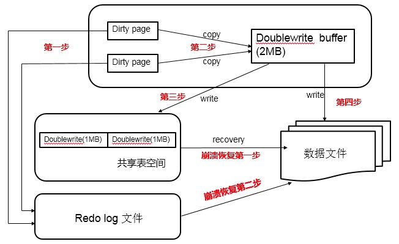

# Double Write

Double Write 是存储引擎 InnoDB的一个特性，可以提高数据页的可靠性。


## Partial page write

在 InnoDB中，page size 一般是16KB，将数据写入到磁盘是以Page 为单位的。由于文件系统对大数据页的操作，在大多数情况下不是原子操作，这意味着如果服务器宕机了，可能只做了部分写入。16K的数据，写入4K时，发生了系统断电/os crash ，只有一部分写是成功的，这种情况下就是partial page write问题。

发生写失效时，MySQL可以根据redo log进行恢复。但是必须清楚地认识到，redo log中记录的是对页的物理修改，如偏移量800，写’aaaa’记录。如果这个页本身已经发生了损坏，再对其进行重做是没有意义的。MySQL在恢复的过程中检查page的checksum，checksum就是检查page的最后事务号，发生partial page write问题时，page已经损坏，找不到该page中的事务号。在InnoDB看来，这样的数据页是无法通过checksum验证的，就无法恢复。即使强制让其通过验证，也无法从崩溃中恢复，因为当前InnoDB存在的一些日志类型，有些是逻辑操作，并不能做到幂等。

为了解决这个问题，InnoDB实现了double write buffer：在写数据页之前，先把这个数据页写到一块独立的物理文件位置（ibdata），然后再写到数据页。这样在宕机重启时，如果出现数据页损坏，那么在应用redo log之前，需要通过该页的副本来还原该页，然后再进行redo log重做，这就是double write。


## Double Buffer结构

double write由两部分组成，一部分是InnoDB内存中的double write buffer(dblwr)，大小为2M，另一部分是物理磁盘上 *ibdata* 系统表空间中大小为2MB，共128个连续的Page（2个区，一个区=64页），120个用于批量写脏，另外8个用于Single Page Flush。

- 批量刷脏是后台线程做的，不影响前台线程
- Single page flush是用户线程发起的，需要尽快的刷脏并替换出一个空闲页出来

对于批量刷脏，每次找到一个可做flush的page，对其持有S lock，然后将该page拷贝到dblwr中，当dblwr满后这一次批量刷脏结束时，将dblwr中的page全部刷到*ibdata*中，这是同步写操作；然后再唤醒后台IO线程去写数据页。当后台IO线程完成写操作后，会去更新dblwr中的计数以腾出空间，释放block上的S锁，完成写入。

对于Single Page Flush，做的是同步写操作，在挑出一个可以刷脏的page后，先加入到dblwr中，刷到ibdata，然后写到用户表空间，完成后，会对该用户表空间做一次`fsync`操作。

Single Page Flush在buffer pool中free page不够时触发，通常由前台线程发起，由于每次single page flush都会导致一次`fsync`操作，在大并发负载下，如果大量线程去做flush，很显然会产生严重的性能下降。Percona在5.6版本中做了优化，可以选择由后台线程lru manager来做预刷，避免用户线程陷入其中。


## 工作流程

如果发生了极端情况（断电），InnoDB再次启动后，发现了一个Page数据已经损坏，那么此时就可以从double write buffer中进行数据恢复了。

### 刷脏页

当一系列机制（main函数触发、checkpoint等）触发数据缓冲池中的脏页进行刷新到data file的时候，并不直接写磁盘，而是会通过`memcpy`函数将脏页先复制到内存中的double write buffer，之后通过double write buffer再分两次、每次1MB顺序写入**共享表空间的物理磁盘**上，这样子既不会直接修改数据文件，也有了页的备份。然后马上调用`fsync`函数，同步脏页进磁盘上。

由于在这个过程中，double write页的存储是连续的，因此写入共享表空间的磁盘为顺序写，性能很高；完成double write后，再将脏页写入实际的各个表空间文件，这时写入就是离散的了。各模块协作情况如下图（第一步应为脏页产生的redo记录log buffer，然后log buffer写入redo log file）：



```
# 查看 double write 统计情况
mysql> show status like "%InnoDB_dblwr%";
+----------------------------+------------+
| Variable_name | Value |
+----------------------------+------------+
| Innodb_dblwr_pages_written |61932183 |
| Innodb_dblwr_writes |15237891 |
+----------------------------+------------+
2 rows in set (0.01 sec)
```


### 崩溃恢复

如果写dblwr失败，这些数据就不会被写到磁盘，这与从内存的dblwr 写到共享表空间的double write时发生崩溃 一样，表空间数据文件还没被修改，在下次启动时通过对表空间数据文件应用redo log即可。

但如果是在写表空间数据文件时发生崩溃，在下次启动时，通过比较页面的checksum，发现受损页，从共享表空间的double write 找到该页的副本，然后将其复制到表空间文件，再应用redo log。


## 缺点

引入一次额外的写开销，每个数据页刷盘时得写两次，一次到double write，一次到表空间对应的数据文件，由于大量的`fsync`操作，会降低MySQL的整体性能。

不过， double write是一个连续的存储空间，所以硬盘在写数据的时候是顺序写，而不是随机写，这样性能更高。

并且将数据从double write buffer写到真正的segment中的时候，系统会自动合并连续空间刷新的方式，每次可以刷新多个pages。


对于提高了 部分写失效防范机制 的文件系统，可以通过`skip_innodb_doublewrite`参数禁用double write功能。


## 改进

MariaDB使用参数`innodb_use_atomic_writes`来控制原子写行为，当打开该选项时，会使用`O_DIRECT`模式打表空间，通过`posix_fallocate`来扩展文件（而不是写0扩展），当在启动时检查到支持atomic write时，即使开启了`innodb_doublewrite`，也会关闭掉。


在现实场景中，宕机是非常低概率的事件。大部分情况下dblwr都是用不上的。但如果直接关闭dblwr，如果真的发生例如掉电宕机了，就需要知道哪些page可能损坏了。

因此Facebook MySQL提供了一个选项，可以写page之前，只将对应的page number写到dblwr中（而不是写全page），在崩溃恢复时，先读出记录在dblwr中的page号，检查对应的数据页是否损坏，如果损坏了，那就需要从备库重新恢复该实例。


