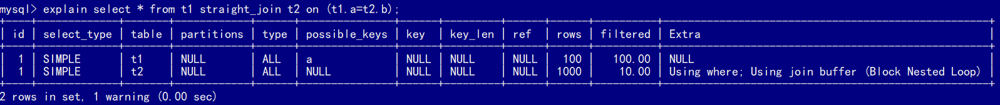

# JOIN

创建两个相同的表，有主键索引和字段`a`上的索引，`t2`有1000行，`t1`有100行，用它们进行join的实验。

```
CREATE TABLE `t2` (
  `id` int(11) NOT NULL,
  `a` int(11) DEFAULT NULL,
  `b` int(11) DEFAULT NULL,
  PRIMARY KEY (`id`),
  KEY `a` (`a`)
) ENGINE=InnoDB;

drop procedure idata;
delimiter ;;
create procedure idata()
begin
  declare i int;
  set i=1;
  while(i<=1000)do
    insert into t2 values(i, i, i);
    set i=i+1;
  end while;
end;;
delimiter ;
call idata();

create table t1 like t2;
insert into t1 (select * from t2 where id<=100);
```


## Index Nested-Loop Join

```
mysql> select * from t1 straight_join t2 on (t1.a=t2.a);
```

用`straight_join`可以让MySQL使用固定的连接方式执行查询，即`t1` 是驱动表，`t2`是被驱动表。如果直接使用`join`语句，MySQL优化器可能会选择表`t1`或`t2`作为驱动表，这样会影响分析SQL语句的执行过程。


从explain结果里可以看到，使用到了表`t2`的索引`a`，其执行流程如下：

1. 从表`t1`中读入一行数据 R；
2. 从数据行R中，取出`a`字段到表`t2`里去查找；
3. 取出表`t2`中满足条件的行，跟R组成一行，作为结果集的一部分；
4. 重复执行步骤1到3，直到表`t1`的末尾循环结束。


这个过程就跟写程序时的嵌套查询类似，并且可以用上被驱动表的索引，所以称之为“Index Nested-Loop Join”，简称NLJ。

在这个流程里，对驱动表`t1`做了全表扫描，扫描行数为100行。对于`t1`表的每一行，根据`a`字段去表`t2`查找，走的是树搜索过程。由于我们构造的数据都是一一对应的，因此每次的搜索过程都只扫描一行，也是总共扫描100行。

所以，这个流程扫描行数为200行。

如果不使用`join`，实现相同目的的流程如下：

1. 执行`select * from t1`，查出表`t1`的所有数据，这里有100行
2. 循环遍历这100行数据：
   - 从每一行R取出字段a的值`$R.a`；
   - 执行`select * from t2 where a=$R.a`；
   - 把返回的结果和R构成结果集的一行。

这个查询过程的扫描行数也是200行，但却执行了101条语句，比直接`join`多了100次交互。除此之外，客户端还要拼接SQL语句和结果。


### 驱动表选择

在上面的Index NLJ语句执行过程中，驱动表是走全表扫描，而被驱动表是走树搜索。

假设驱动表的行数是N，执行过程就要扫描驱动表N行，然后对于每一行，到被驱动表上匹配一次。

假设被驱动表的行数是M。每次在被驱动表查一行数据，要先搜索索引a，再搜索主键索引。每次搜索一棵树近似复杂度是$log_2M$，所以在被驱动表上查一行的时间复杂度是 $2*log_2M$。

因此整个执行过程，近似复杂度是 $N + N*2*log_2M$。显然，N对扫描行数的影响更大，因此应该**让小表来做驱动表**。


## Simple Nested-Loop Join

Simple NLJ相比Index NLJ，就是被驱动表上没有索引可以使用，例如下面的查询：

```
mysql> select * from t1 straight_join t2 on (t1.a=t2.b);
```

由于表`t2`的字段`b`上没有索引，因此每次到`t2`去匹配的时候，就要做一次全表扫描。因此，这条语句会对表`t2`做多达100次的全表扫描，总共扫描$100*1000=10万$行。

因此，MySQL没有使用这么笨重的算法，而是用了Block Nested-Loop Join，简称BNL。


## Block Nested-Loop Join

由于被驱动表上没有索引，BNL使用一片叫做join_buffer的内存存储驱动表的部分数据，然后取出被驱动表的每一行，看看是否与join_buffer中的数据满足join条件：

1. 把表`t1`的数据读入线程内存join_buffer中，由于这个语句用的是`select *`，因此是把整个表`t1`放入了内存
2. 扫描表`t2`，**把表`t2`中的每一行取出来，跟join_buffer中的数据做对比**，满足join条件的，作为结果集的一部分返回




在这个过程中，对表`t1`和`t2`都做了一次全表扫描，因此总的扫描行数是1100。由于join_buffer是以无序数组的方式组织的，因此对表`t2`中的每一行，都要做100次判断，总共需要在内存中做的**判断次数**是：$100*1000=10万​$次。

如果使用Simple Nested-Loop Join算法进行查询，**扫描行数**也是10万行。从时间复杂度上来说，这两个算法是一样的。但是，Block Nested-Loop Join算法的这**10万次判断**是内存操作，速度上会快很多，性能也更好。

> 在对被驱动表做全表扫描的时候，如果数据没有在Buffer Pool中，就需要等待这部分数据从磁盘读入。
>
> 从磁盘读入数据到内存中，会影响正常业务的Buffer Pool命中率，而且Simple Nested Loop Join算法天然会对被驱动表的数据做多次访问，更容易将这些数据页放到Buffer Pool的头部。
>
> 即使被驱动表数据都在内存中，每次查找“下一个记录的操作”，都是类似指针操作。而join_buffer中是数组，遍历的成本更低。


### 驱动表选择

假设小表的行数是N，大表的行数是M，那么在这个算法里：

1. 两个表都做一次全表扫描，所以总的扫描行数是M+N；
2. 内存中的判断次数是M*N。

可以看到，这两个算式中的M和N对效率没有影响，因此选择大表还是小表做驱动表，执行耗时是一样的。


### join_buffer_size

join_buffer的大小是由参数`join_buffer_size`控制的，默认是256k，如果驱动表的大小比这个值大，那就**分段放**。

把`join_buffer_size`改成1200，再执行：

```
select * from t1 straight_join t2 on (t1.a=t2.b);
```

执行过程就变成了：

1. 扫描表`t1`，顺序读取数据行放入join_buffer中，放完第88行join_buffer满了，继续第2步；
2. 扫描表`t2`，把`t2`中的每一行取出来，跟join_buffer中的数据做对比，满足join条件的，作为结果集的一部分返回；
3. 清空join_buffer；
4. 继续扫描表`t1`，顺序读取最后的12行数据放入join_buffer中，继续执行第2步。


这个流程才体现出了这个算法名字中“Block”的由来，表示“分块去join”。

由于表`t1`被分成了两次放入join_buffer中，**导致表`t2`会被扫描两次**。虽然分成两次放入join_buffer，但是判断等值条件的次数还是不变的，依然是$(88+12)*1000=10万$次。


#### 驱动表选择

假设，驱动表的数据行数是N，需要分K段才能完成算法流程，被驱动表的数据行数是M。这里的K与N成正比关系，因此把K表示为$λ*N$，显然$λ$的取值范围是$(0,1)​$。

在这个算法的执行过程中：

1. 扫描行数是$ N+λ*N*M$；
2. 内存判断 $N*M$次。

内存判断次数不受选择哪个表作为驱动表影响，只需要考虑扫描行数，在M和N大小确定的情况下，N小一些，整个算式的结果会更小。所以还是**应该让小表当驱动表**。

N越大，分段数K越大。而N固定的时候，参数`join_buffer_size`会影响K的大小。`join_buffer_size`越大，一次可以放入的行越多，分成的段数也就越少，对被驱动表的全表扫描次数就越少。

因此，某些情况下如果`join`语句很慢，就把`join_buffer_size`改大。


## 能不能使用join？

在判断要不要使用`join`语句时，先看explain结果里面，Extra字段里面有没有出现“Block Nested Loop”字样。

- 如果可以使用Index Nested-Loop Join算法，也就是可以用上被驱动表上的索引，就没问题。
- 如果使用Block Nested-Loop Join算法，扫描行数就会过多。尤其是在大表上的join操作，这样可能要扫描被驱动表很多次，会占用大量的系统资源。所以这种join尽量不要用。

如果要使用join，总是应该使用小表做驱动表。

### 小表

```
select * from t1 straight_join t2 on (t1.b=t2.b) where t2.id<=50;
select * from t2 straight_join t1 on (t1.b=t2.b) where t2.id<=50;
```

上面两条语句都没有使用索引，第一个语句的join_buffer需要放`t1`的所有行，而第二个语句的join_buffer只需要放入`t2`的前50行。所以这里，“t2的前50行”是那个相对小的表，也就是“小表”。


```
select t1.b,t2.* from  t1  straight_join t2 on (t1.b=t2.b) where t2.id<=100;
select t1.b,t2.* from  t2  straight_join t1 on (t1.b=t2.b) where t2.id<=100;
```

表`t1 `和 `t2`都是只有100行参加join。但是，这两条语句每次查询**放入join_buffer中的数据是不一样的**：

- 表`t1`只查字段b，如果把`t1`放到join_buffer中，则join_buffer中只需要放入b的值
- 表`t2`需要查所有的字段，如果把表`t2`放到join_buffer中的话，就需要放入三个字段id、a和b。

这里“只需要一列参与`join`的表`t1`”是那个相对小的表。

**在决定哪个表做驱动表的时候，应该是两个表按照各自的条件过滤，过滤完成之后，计算参与join的各个字段的总数据量，数据量小的那个表，就是“小表”，应该作为驱动表。**


## join语句优化

在表`t1`里，插入1000行数据，每一行的`a = 1001 - id`，即表`t1`中字段a是逆序的。在表`t2`中插入100万行数据。

```
create table t1(id int primary key, a int, b int, index(a));
create table t2 like t1;
drop procedure idata;
delimiter ;;
create procedure idata()
begin
  declare i int;
  set i=1;
  while(i<=1000)do
    insert into t1 values(i, 1001-i, i);
    set i=i+1;
  end while;
  
  set i=1;
  while(i<=1000000)do
    insert into t2 values(i, i, i);
    set i=i+1;
  end while;

end;;
delimiter ;
call idata();
```


### Multi-Range Read优化

MRR的主要目的是尽量使用**顺序读盘**，例如对于回表的读盘。

回表是指 InnoDB在普通索引a上查到主键id的值后，再根据一个个主键id的值到主键索引上去查整行数据的过程。例如下面的查询语句。

```
mysql> select * from t1 where a>=1 and a<=100;
```

主键索引是一棵B+树，在这棵树上，每次只能根据一个主键id查到一行数据。因此，回表是一行行搜索主键索引的。


如果随着a的值递增顺序查询，id的值变成随机的，那么就会出现**随机访问**，性能相对较差。虽然“按行查”这个机制不能改，但是调整查询的顺序，还是能够加速的。

> 因为大多数的数据都是按照主键递增顺序插入得到的，所以可以认为，如果按照主键的递增顺序查询的话，对磁盘的读比较接近顺序读，能够提升读性能。这也是MRR的设计思路。

使用MRR执行上面的查询语句时，流程变成了：

1. 根据索引a，定位到满足条件的记录，将`id`值放入read_rnd_buffer中;
2. 将read_rnd_buffer中的`id`进行递增排序；
3. 排序后的`id`数组，依次到主键`id`索引中查记录，并作为结果返回。

read_rnd_buffer的大小是由`read_rnd_buffer_size`参数控制的。如果步骤1中，read_rnd_buffer放满了，就会先执行完步骤2和3，然后清空read_rnd_buffer。之后继续找索引a的下个记录，并继续循环。

如果想要稳定地使用MRR优化的话，需要设置`set optimizer_switch="mrr_cost_based=off"`。因为现在的优化器策略，判断消耗的时候，会更倾向于不使用MRR，把`mrr_cost_based`设置为off，就是固定使用MRR了。


Extra字段多了`Using MRR`，表示用上了MRR优化。由于MRR在read_rnd_buffer中按照id做了排序，所以最后得到的结果集也是按照主键id递增顺序的，也就是与没有MRR优化时的结果集中行的顺序相反。

**MRR能够提升性能的核心**在于，这条查询语句在索引a上做的是一个范围查询（多值查询），可以得到足够多的主键id。这样通过排序以后，再去主键索引查数据，才能体现出“顺序性”的优势。


### Batched Key Access

MySQL在5.6版本后引入Batched Key Acess(BKA)算法，对NLJ算法进行了优化。

NLJ算法执行的逻辑是：从驱动表`t1`，**一行行地**取出a的值，再到被驱动表`t2`去做join。也就是说，对于表`t2`来说，每次都是匹配一个值。这时，MRR的优势就用不上了。


为了让`t2`回表的时候用上MRR，从表`t1`里一次性地多拿些行出来，放到一个临时内存join_buffer，然后一起传给表`t2`。


从`t1`取数据放入join_buffer时，只会取查询需要的字段。如果join buffer放不下R1~R100的所有数据，就会把这100行数据分成多段执行上图的流程。

因为BKA算法的优化要依赖于MRR，要使用BKA，也需要进行如下设置：

```
set optimizer_switch='mrr=on,mrr_cost_based=off,batched_key_access=on';
```


### BNL算法的性能问题

如果被驱动表是一个大表，并且是一个冷数据表，除了查询过程中可能会导致IO压力大以外，还会导致BP内存数据页的淘汰，内存命中率降低等问题。

由于InnoDB对Bufffer Pool的LRU算法做了优化，即：第一次从磁盘读入内存的数据页，会先放在old区域。如果1秒之后这个数据页不再被访问了，就不会被移动到LRU链表头部，这样对Buffer Pool的命中率影响就不大。

如果被驱动表是一个大表，并且是一个**冷数据表**，除了查询过程中可能会导致IO压力大以外，还会导致BP内存数据页的淘汰，内存命中率降低等问题。那么，这种语句应该怎么优化呢？

但是，如果一个使用BNL算法的join语句，多次扫描一个冷表，而且这个语句执行时间超过1秒，就会在再次扫描冷表的时候，把冷表的数据页移到LRU链表头部。

这种情况对应的，是冷表的数据量小于整个Buffer Pool的3/8，能够完全放入old区域的情况。

如果这个冷表很大，就会出现另外一种情况：业务正常访问的数据页，没有机会进入young区域。

由于优化机制的存在，一个正常访问的数据页，要进入young区域，需要隔1秒后再次被访问到。但是，由于join语句在循环读磁盘和淘汰内存页，进入old区域的数据页，很可能在1秒之内就被淘汰了。这样，就会导致这个MySQL实例的Buffer Pool在这段时间内，young区域的数据页没有被合理地淘汰。

这两种情况都会影响Buffer Pool的正常运作。**大表join操作虽然对IO有影响，但是在语句执行结束后，对IO的影响也就结束了。但是，对Buffer Pool的影响就是持续性的，需要依靠后续的查询请求慢慢恢复内存命中率。**

为了减少这种影响，可以考虑增大`join_buffer_size`的值，减少对被驱动表的扫描次数。也就是说，BNL算法对系统的影响主要包括三个方面：

1. 可能会多次扫描被驱动表，占用磁盘IO资源；
2. 判断join条件需要执行$M*N$次对比（M、N分别是两张表的行数），如果是大表就会占用非常多的CPU资源；
3. 可能会导致Buffer Pool的热数据被淘汰，影响内存命中率。

执行语句之前，需要通过理论分析和查看explain结果的方式，确认是否要使用BNL算法。如果确认优化器会使用BNL算法，就需要做优化。**优化的常见做法是，给被驱动表的join字段加上索引，把BNL算法转成BKA算法。**


#### BNL转BKA

对于经常访问的表或者表数据不多，可以直接在被驱动表上建索引，这时就可以直接转成BKA算法了。但是有些情况直接建索引就比较浪费，例如`t2`有100万行数据，假如下面的语句是个低频语句，为表`t2`建立字段`b`上的索引就不合适了。

```
mysql> select * from t1 join t2 on (t1.b=t2.b) where t2.b>=1 and t2.b<=2000;
```

使用BNL算法来join的话，这个语句的执行流程是这样的：

1. 把表`t1`的所有字段取出来，存入join_buffer中。这个表只有1000行，`join_buffer_size`默认值是256k，可以完全存入。
2. 扫描表`t2`，取出每一行数据跟join_buffer中的数据进行对比，
   - 如果不满足`t1.b=t2.b`，则跳过；
   - 如果满足`t1.b=t2.b`, 再判断其他条件，也就是是否满足`t2.b`处于`[1,2000]`的条件，如果是，就作为结果集的一部分返回，否则跳过。

对于表`t2`的每一行，判断join是否满足的时候，都需要遍历join_buffer中的所有行。因此判断等值条件的次数是$1000*100万=10亿$次，这个判断的工作量很大。


explain结果里`Extra`字段显示使用了BNL算法，这条语句需要执行52秒。

在表`t2`的字段`b`上创建索引会浪费资源，但是不创建索引的话这个语句的等值条件要判断10亿次。这时候，可以考虑使用临时表：

1. 把表`t2`中满足条件的数据放在临时表`tmp_t`中；
2. 为了让join使用BKA算法，给临时表`tmp_t`的字段`b`加上索引；
3. 让表`t1`和`tmp_t`做join操作。

对应的SQL语句如下：

```
create temporary table temp_t(id int primary key, a int, b int, index(b))engine=innodb;
insert into temp_t select * from t2 where b>=1 and b<=2000;
select * from t1 join temp_t on (t1.b=temp_t.b);
```


整个过程3个语句执行时间的总和还不到1秒，相比于前面的52秒，性能得到了大幅提升。

执行`insert`语句构造`temp_t`表并插入数据的过程中，对表t2做了全表扫描，这里扫描行数是100万。

之后的`join`语句，扫描表`t1`，这里的扫描行数是1000；join比较过程中，做了1000次带索引的查询。相比于优化前的join语句需要做10亿次条件判断来说，这个优化效果还是很明显的。

总体来看，不论是在原表上加索引，还是用有索引的临时表，思路都是**让join语句能够用上被驱动表上的索引**，来触发BKA算法，提升查询性能。


假设有三个表如下：

```
CREATE TABLE `t1` (
 `id` int(11) NOT NULL,
 `a` int(11) DEFAULT NULL,
 `b` int(11) DEFAULT NULL,
 `c` int(11) DEFAULT NULL,
  PRIMARY KEY (`id`)
) ENGINE=InnoDB;

create table t2 like t1;
create table t3 like t2;
insert into ... //初始化三张表的数据
```

现在有下面查询语句的需求，三个大表进行join操作。

```
select * from t1 join t2 on(t1.a=t2.a) join t3 on (t2.b=t3.b) where t1.c>=X and t2.c>=Y and t3.c>=Z;
```

为了得到最快的执行速度，改写成`straight_join`，要怎么指定连接顺序，如何设计表t1、t2、t3上的索引？

第一原则是要尽量使用BKA算法。需要注意的是，使用BKA算法的时候，并不是“先计算两个表join的结果，再跟第三个表join”，而是直接嵌套查询的。

具体实现是：在`t1.c>=X、t2.c>=Y、t3.c>=Z`这三个条件里，选择一个经过过滤以后，数据最少的那个表，作为第一个驱动表。此时，可能会出现如下两种情况。

- 如果选出来是表t1或者t3，那剩下的部分就固定了。

  - 如果驱动表是`t1`，则连接顺序是`t1->t2->t3`，要在被驱动表字段创建上索引，也就是`t2.a` 和` t3.b`上创建索引；
  - 如果驱动表是`t3`，则连接顺序是`t3->t2->t1`，需要在`t2.b` 和` t1.a`上创建索引。

  同时，我们还需要在第一个驱动表的字段c上创建索引。

- 如果选出来的第一个驱动表是表t2的话，则需要评估另外两个条件的过滤效果。

整体的思路就是，尽量让每一次参与join的驱动表的数据集，越小越好，因为这样驱动表就会越小。


## hash join

上面的比较操作，如果join_buffer里面维护的不是一个无序数组，而是一个哈希表，那么就不是10亿次判断，而是100万次hash查找。整条语句的执行速度就可以更快了。

但MySQL并没有使用hash join，这个优化思路，我们可以自己实现在业务端：

1. `select * from t1;`取得表`t1`的全部1000行数据，在业务端存入一个hash结构
2. `select * from t2 where b>=1 and b<=2000;` 获取表`t2`中满足条件的2000行数据
3. 把这2000行数据，一行一行地取到业务端，到hash结构的数据表中寻找匹配的数据。满足匹配的条件的这行数据，就作为结果集的一行。


## 思考题

1. 如果用`left join`的话，左边的表一定是驱动表吗？
2. 如果两个表的join包含多个条件的等值匹配，是都要写到on里面呢，还是只把一个条件写到on里面，其他条件写到where部分？


构造两个表a和b：

```
create table a(f1 int, f2 int, index(f1))engine=innodb;
create table b(f1 int, f2 int)engine=innodb;
insert into a values(1,1),(2,2),(3,3),(4,4),(5,5),(6,6);
insert into b values(3,3),(4,4),(5,5),(6,6),(7,7),(8,8);
```

表`a`和`b`都有两个字段`f1`和`f2`，不同的是表`a`的字段`f1`上有索引。往两个表中都插入了6条记录，其中在表a和b中同时存在的数据有4行。

```
select * from a left join b on(a.f1=b.f1) and (a.f2=b.f2); /*Q1*/
select * from a left join b on(a.f1=b.f1) where (a.f2=b.f2);/*Q2*/
```

这两条语句的结果并不相同：


- 语句Q1返回的数据集是6行，表a中即使没有满足匹配条件的记录，查询结果中也会返回一行，并将表b的各个字段值填成NULL。
- 语句Q2返回的是4行。从逻辑上可以这么理解，最后的两行，由于表b中没有匹配的字段，结果集里面b.f2的值是空，不满足where 部分的条件判断，因此不能作为结果集的一部分。

通过explain看看实际执行这两条语句时，MySQL是怎么做的。


对于Q1，驱动表是表a，被驱动表是表b，由于表b的`f1`和`f2`字段上没有索引，所以使用的是Block Nested Loop Join（简称BNL） 算法。执行流程如下：

1. 把表a的内容读入join_buffer 中。因为是`select *` ，所以字段`f1`和`f2`都被放入join_buffer了。
2. 顺序扫描表b，对于每一行数据，判断join条件是否满足，满足条件的记录，作为结果集的一行返回。如果语句中有where子句，需要先判断where部分满足条件后，再返回。
3. 表b扫描完成后，对于没有被匹配的表a的行（(1,1)、(2,2)这两行），把剩余字段补上NULL，再放入结果集中。


而Q2是以表b为驱动表的。如果一条join语句的Extra字段什么都没写的话，就表示使用的是Index Nested-Loop Join（NLJ）算法。语句Q2的执行流程是这样的：顺序扫描表b，每一行用`b.f1`到表a中去查，匹配到记录后判断`a.f2=b.f2`是否满足，满足条件的话就作为结果集的一部分返回。

语句Q1和Q2这两个查询的执行流程差距这么大，是因为优化器基于Q2这个查询的语义做了优化。语句Q2里面`where a.f2=b.f2`就表示，查询结果里面不会包含`b.f2`是NULL的行，这样这个`left join`的语义就是“找到这两个表里面，f1、f2对应相同的行。对于表a中存在，而表b中匹配不到的行，就放弃”。

> 在MySQL里，NULL跟任何值执行等值判断和不等值判断的结果，都是NULL。这里包括， `select NULL = NULL `的结果，也是返回NULL。

优化器就把这条语句的`left join`改写成了`join`，因为表a的`f1`上有索引，就把表b作为驱动表，这样就可以用上NLJ 算法。在执行explain之后，再执行show warnings，就能看到这个改写的结果：

```
mysql> show warnings\G
*************************** 1. row ***************************
  Level: Note
   Code: 1003
Message: /* select#1 */ select `test`.`a`.`f1` AS `f1`,`test`.`a`.`f2` AS `f2`,`test`.`b`.`f1` AS `f1`,`test`.`b`.`f2` AS `f2` from `test`.`a` join `test`.`b` where ((`test`.`a`.`f1` = `test`.`b`.`f1`) and (`test`.`a`.`f2` = `test`.`b`.`f2`))
```

Q2说明即使在SQL语句中写成`left join`，执行过程还是有可能不是从左到右连接的。也就是说，**使用left join时，左边的表不一定是驱动表。**

**如果需要left join的语义，就不能把被驱动表的字段放在where条件里面做等值判断或不等值判断，必须都写在on里面。**

如果不使用`left join`，只是用`join`的话，使用`on`和`where`就没有什么区别了：

```
select * from a join b on(a.f1=b.f1) and (a.f2=b.f2); /*Q3*/
select * from a join b on(a.f1=b.f1) where (a.f2=b.f2);/*Q4*/
```

上面两条语句的explain如下，它们都被改写为`select * from a join b where (a.f1=b.f1) and (a.f2=b.f2);`，执行计划也都是一样的。在这种情况下，join将判断条件是否全部放在on部分就没有区别了。


