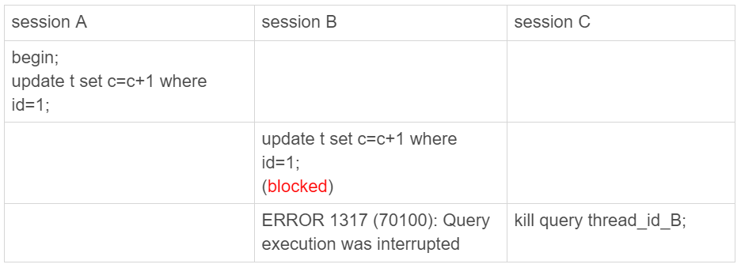
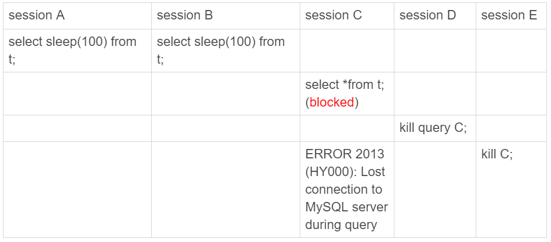
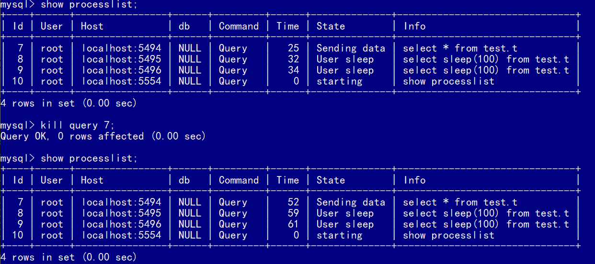
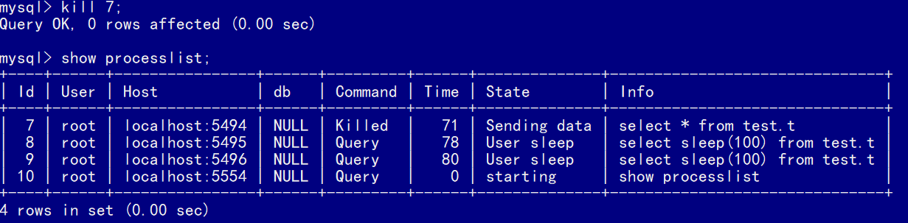

# KILL

在MySQL中有两个kill命令：

- `kill query + 线程id`，表示**终止这个线程中正在执行的语句**
- `kill connection + 线程id`，这里connection可缺省，表示**断开这个线程的连接**，如果这个线程有语句正在执行，也是要先停止正在执行的语句的。

执行一个查询的过程中，发现执行时间太久，要放弃查询，这时就可以用kill query命令，终止这条查询语句。

语句处于锁等待的时候，使用kill命令也是有效的。




## 收到kill后，线程做什么

上面的session B，在收到kill信号后，并不能够直接退出，因为该线程可能占有一些资源，需要先释放资源。

当对一个表做增删改查操作时，会给这个表加MDL读锁，所以，session B虽然处于blocked状态，但还是拿着一个MDL读锁的。如果线程被kill的时候，就直接终止，那之后这个MDL读锁就没机会被释放了。

因此，kill的目的是告诉执行线程，这条语句已经不需要继续执行了，可以开始**执行停止的逻辑**了。

> 跟Linux的kill命令类似，`kill -N pid`并不是让进程直接停止，而是给进程发一个信号，然后进程处理这个信号，进入终止逻辑。只是对于MySQL的kill命令来说，不需要传信号量参数，就只有“停止”这个命令。

**实现上，当用户执行`kill query thread_id_B`时，MySQL里处理kill命令的线程做了两件事：**

1. 把session B的运行状态改成`THD::KILL_QUERY`(将变量killed赋值为`THD::KILL_QUERY`)；
2. 给session B的执行线程发一个信号。session B处于锁等待状态，如果只是把session B的线程状态设置`THD::KILL_QUERY`，线程B并不知道这个状态变化，还是会继续等待。发一个信号的目的，就是让session B退出等待，来处理这个`THD::KILL_QUERY`状态。

可以发现：

- 一个语句执行过程中有多处“埋点”，在这些“埋点”的地方判断线程状态，如果发现线程状态是`THD::KILL_QUERY`，才开始进入语句终止逻辑；
- 如果处于等待状态，必须是一个可以被唤醒的等待，否则根本不会执行到“埋点”处；
- 语句从开始进入终止逻辑，到终止逻辑完全完成，是有一个过程的。


## kill不掉的线程

先执行`set global innodb_thread_concurrency=2`，将InnoDB的并发线程上限数设置为2；然后，执行下面的序列：



由于innodb并发线程最多两个，所以session C被堵住了；在session D执行的`kill query`命令没有效果：



在session E执行的`kill connection`命令虽然有效果，但7号线程仍然在`show processlist`的结果里，只是`Command`变为了`Killed`。客户端虽然断开了连接，但实际上服务端上这条语句还在执行过程中。



上一个例子`update`语句等锁的时候，使用的是`pthread_cond_timedwait`函数，这个等待状态可以被唤醒。

在这个例子里，7号线程的等待逻辑是这样的：每10毫秒判断一下是否可以进入InnoDB执行，如果不行，就调用`nanosleep`函数进入sleep状态。这样做导致，即使7号线程的状态已经被设置成了`KILL_QUERY`，但是**在这个等待进入InnoDB的循环过程中，并没有去判断线程的状态**，因此根本不会进入终止逻辑阶段。

而session E执行`kill connection` 命令时，是这么做的：

1. 把7号线程状态设置为`KILL_CONNECTION`；
2. 关掉7号线程的网络连接。因为有这个操作，所以才会看到，这时候session C收到了断开连接的提示。

那为什么在`show processlist`的结果中，Command列显示为killed呢？这是因为在执行`show processlist`的时候，有一个特别的逻辑：

```
如果一个线程的状态是KILL_CONNECTION，就把Command列显示成Killed。
```

实际上，即使是客户端退出了，这个线程的状态仍然是在等待中。只有等到满足进入InnoDB的条件后，session C的查询语句继续执行，然后才有可能判断到线程状态已经变成了`KILL_QUERY`或者`KILL_CONNECTION`，再进入终止逻辑阶段。


### KILL 无效的情况

- **线程没有执行到判断线程状态的逻辑**，例如上面的这个例子，以及由于IO压力过大，读写IO的函数一直无法返回，导致不能及时判断线程的状态。
- **终止逻辑耗时较长**，这时候，从`show processlist`结果上看也是`Command=Killed`，需要等到终止逻辑完成，语句才算真正完成。例如：
  - 超大事务执行期间被kill。这时候，回滚操作需要对事务执行期间生成的所有新数据版本做回收操作，耗时很长。
  - 大查询回滚。如果查询过程中生成了比较大的临时文件，加上此时文件系统压力大，删除临时文件可能需要等待IO资源，导致耗时较长。
  - DDL命令执行到最后阶段，如果被kill，需要删除中间过程的临时文件，也可能受IO资源影响耗时较久。


如果碰到一个被killed的事务一直处于回滚状态，应该直接把MySQL进程强行重启，还是应该让它自己执行完成呢？

因为重启之后该做的回滚动作还是不能少的，所以从恢复速度的角度来说，应该让它自己结束。

当然，如果这个语句可能会占用别的锁，或者由于占用IO资源过多，从而影响到了别的语句执行的话，就需要先做主备切换，切到新主库提供服务。切换之后别的线程都断开了连接，自动停止执行。接下来还是等它自己执行完成。这个操作可以减少系统压力，加速终止逻辑。


## 客户端

直接在客户端通过`Ctrl+C`命令，并不可以直接终止服务端的线程。因为在客户端的操作只能影响到客户端的线程，客户端和服务端只能通过网络交互，是不可能直接操作服务端线程的。

而由于MySQL是停等协议，所以这个客户端线程执行的语句还没有返回的时候，再往这个连接里面继续发命令也是没有用的。实际上，**执行`Ctrl+C`的时候，是MySQL客户端另外启动一个连接，然后发送一个`kill query `命令**。


### 常见误解

- **如果库里面的表特别多，连接就会很慢。**

  有些库包含很多表，每次用客户端连接都会卡在下面这个界面上。

  

  而如果db1这个库里表很少的话，连接起来就会很快，可以很快进入输入命令的状态。

  但是在客户端建立与服务端连接的时候，需要做的事情就是TCP握手、用户校验、获取权限，这几个操作，显然跟库里面表的个数无关。

  实际上，当使用默认参数连接的时候，MySQL客户端会读取表信息，以提供一个本地库名和表名补全的功能。为了实现这个功能，客户端在连接成功后，需要多做一些操作：

  1. 执行`show databases`；
  2. 切到db1库，执行`show tables`；
  3. 把这两个命令的结果用于构建一个本地的哈希表。

  在这些操作中，最花时间的就是第三步在本地构建哈希表的操作。所以，当一个库中的表个数非常多的时候，这一步就会花比较长的时间。

  也就是说，**我们感知到的连接过程慢，其实并不是连接慢，也不是服务端慢，而是客户端慢。**

  图中的提示也说了，如果在连接命令中加上`-A`，就可以关掉这个自动补全的功能，然后客户端就可以快速返回了。

- 客户端的`quick`参数，并不能加速服务端，相反，可能会降低服务端性能。

  MySQL客户端发送请求后，接收服务端返回结果的方式有两种：

  1. 一种是本地缓存，也就是在本地开一片内存，先把结果存起来。对应`mysql_store_result `这个API。
  2. 另一种是不缓存，读一个处理一个。对应`mysql_use_result`这个API。

  MySQL客户端默认采用第一种方式，而如果加上`–quick`参数，就会使用第二种不缓存的方式。

  采用不缓存的方式时，如果本地处理得慢，就会导致服务端发送结果被阻塞，因此会让服务端变慢。

  这个参数是让客户端变得更快，可以达到如下效果：

  - 跳过表名自动补全功能
  - `mysql_store_result`需要申请本地内存来缓存查询结果，如果查询结果太大，会耗费较多的本地内存，可能会影响客户端本地机器的性能
  - 不会把执行命令记录到本地的命令历史文件


