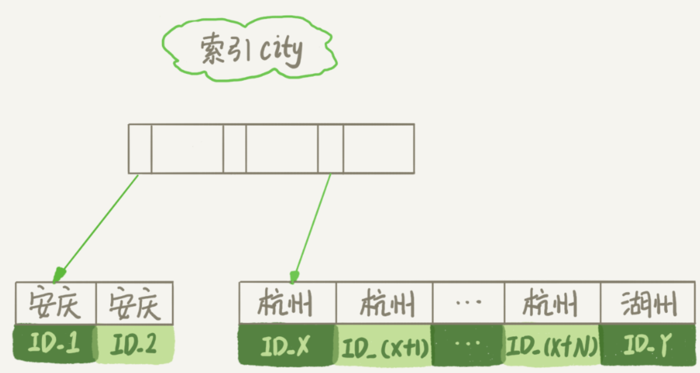
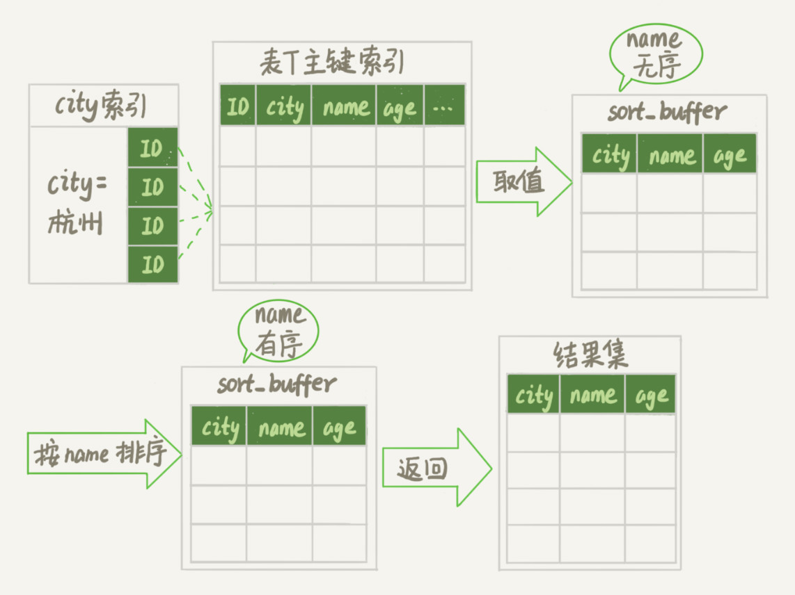
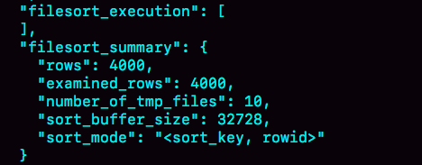
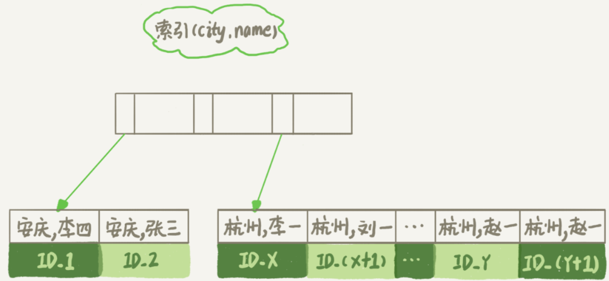
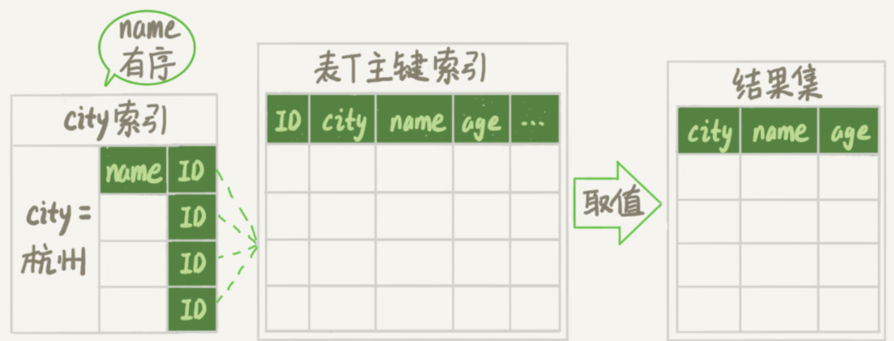
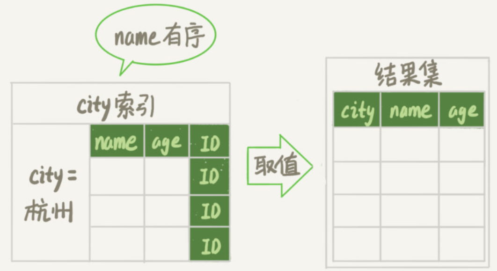

# order by

以市民表为例，假设要查询城市是“杭州”的所有人名字，并且按照姓名排序返回**前1000**个人的姓名、年龄。

表定义及查询语句如下，它的执行流程是怎样的呢？

```text
mysql> CREATE TABLE `t` (
  `id` int(11) NOT NULL,
  `city` varchar(16) NOT NULL,
  `name` varchar(16) NOT NULL,
  `age` int(11) NOT NULL,
  `addr` varchar(128) DEFAULT NULL,
  PRIMARY KEY (`id`),
  KEY `city` (`city`)
) ENGINE=InnoDB;

mysql> select id, name, age from t order by name limit 1000;
```

## 全字段排序

为避免全表扫描，需要在city字段加上索引，之后用`explain`查看该语句执行的信息：


`Extra`这个字段中的`“Using filesort”`表示的就是需要排序，MySQL会给每个线程分配一块内存用于排序，称为`sort_buffer`。



满足`city='杭州’`条件的行，是从`ID_X`到`ID_(X+N)`的这些记录。

通常情况下，这个语句执行流程如下所示 ：



1. 初始化`sort_buffer`，确定放入`name`、`city`、`age`这三个字段；
2. 从索引`city`找到第一个满足`city='杭州’`条件的主键`id`，也就是图中的`ID_X`；
3. 到主键`id`索引取出整行，取`name`、`city`、`age`三个字段的值，存入`sort_buffer`中；
4. 从索引`city`取下一个记录的主键`id`；
5. 重复步骤3、4直到`city`的值不满足查询条件为止，对应的主键`id`也就是图中的`ID_Y`；
6. 对`sort_buffer`中的数据按照字段`name`做快速排序；
7. 按照排序结果取前1000行返回给客户端。

其中第6步排序，可能在内存中完成，也可能需要使用外部排序，这取决于排序所需的内存和参数`sort_buffer_size`。

`sort_buffer_size`，就是MySQL为排序开辟的内存（`sort_buffer`）的大小。如果要排序的数据量小于`sort_buffer_size`，排序就在内存中完成。但如果排序数据量太大，内存放不下，则不得不利用磁盘临时文件辅助排序。

可以通过下面的语句确定一个排序语句是否使用了临时文件。

```text
/* 打开optimizer_trace，只对本线程有效 */
SET optimizer_trace='enabled=on'; 

/* @a保存Innodb_rows_read的初始值 */
select VARIABLE_VALUE into @a from  performance_schema.session_status where variable_name = 'Innodb_rows_read';

/* 执行语句 */
select city, name,age from t where city='杭州' order by name limit 1000; 

/* 查看 OPTIMIZER_TRACE 输出 */
SELECT * FROM `information_schema`.`OPTIMIZER_TRACE`\G

/* @b保存Innodb_rows_read的当前值 */
select VARIABLE_VALUE into @b from performance_schema.session_status where variable_name = 'Innodb_rows_read';

/* 计算Innodb_rows_read差值 */
select @b-@a;
```


* `number_of_tmp_files`表示使用了多少个临时文件。

  当内存不够时，就需要使用外部排序，外部排序一般使用归并排序算法。这个例子里，**MySQL将需要排序的数据分成12份，每一份单独排序后存在这些临时文件中。然后把这12个有序文件再合并成一个有序的大文件。**

  如果`sort_buffer_size`超过了需要排序的数据量的大小，`number_of_tmp_files`就是0，表示排序可以直接在内存中完成。

  否则就需要放在临时文件中排序。`sort_buffer_size`越小，需要分成的份数越多，`number_of_tmp_files`的值就越大。

* `examined_rows`表示参与排序的行数是4000行
* `sort_mode`里面的`packed_additional_fields`的意思是，排序过程对字符串做了“紧凑”处理。即使`name`字段的定义是`varchar(16)`，在排序过程中还是要**按照实际长度来分配空间**的。

最后一个查询语句`select @b-@a` 的返回结果是4000，表示整个执行过程只扫描了4000行。

> 在执行前把`internal_tmp_disk_storage_engine`设置成MyISAM了。否则，`select @b-@a`的结果会显示为4001。
>
> 这是因为查询`OPTIMIZER_TRACE`这个表时，需要用到临时表，而`internal_tmp_disk_storage_engine`的默认值是InnoDB。如果使用的是InnoDB引擎的话，把数据从临时表取出来的时候，会让`Innodb_rows_read`的值加1。

## rowid排序

在全字段排序中，只需要从存储引擎读一次原表的数据，之后的排序等操作都是在`sort_buffer`和临时文件中执行。对于字段较多的查询，这会消耗大量的内存，降低效率，因为`sort_buffer`里放的字段变多了，导致相同大小的文件存储的数据行数变少，需要更多的临时文件。

`max_length_for_sort_data`，是MySQL中专门控制用于排序的行数据的长度的一个参数，如果单行的长度超过这个值，MySQL就认为单行太大，要换一个算法。

`city`、`name`、`age`这三个字段的定义总长度是36，把`max_length_for_sort_data`设置为16，再来看看计算过程有什么改变。

**新的算法放入`sort_buffer`的字段，只有要排序的列（即name字段）和主键id。**但这时，排序的结果就因为少了`city`和`age`字段的值，不能直接返回了。


1. 始化`sort_buffer`，确定放入两个字段，即`name`和`id`；
2. 从索引city找到第一个满足`city='杭州’`条件的主键id，也就是图中的`ID_X`；
3. 到主键`id`索引取出整行，取`name`、`id`这两个字段，存入`sort_buffer`中；
4. 从索引`city`取下一个记录的主键`id`；
5. 重复步骤3、4直到不满足`city='杭州’`条件为止，也就是图中的`ID_Y`；
6. 对`sort_buffer`中的数据按照字段`name`进行排序；
7. 遍历排序结果，取前1000行，并按照`id`的值回到原表中取出`city`、`name`和`age`三个字段返回给客户端。

rowid排序多访问了一次表`t`的主键索引，即步骤7。

> 最后的“结果集”是一个逻辑概念，实际上MySQL服务端从排序后的`sort_buffer`中依次取出`id`，然后到原表查到city、name和age这三个字段的结果，不需要在服务端再耗费内存存储结果，是直接返回给客户端的。



* 图中的`examined_rows`的值还是4000，表示用于排序的数据是4000行。但是`select @b-@a`这个语句的值变成5000了。
* `number_of_tmp_files`变成了10，因为这时候参与排序的行数虽然仍然是4000行，但是每一行都变小了，因此需要排序的总数据量就变小了，需要的临时文件也相应地变少了。
* `sort_mode`变成了`<sort_key, rowid>`，表示参与排序的只有`name`和`id`这两个字段。
* `select @b-@a`这个语句的值变成5000了，因为在排序完成后，还要根据`id`去原表取值。由于语句是`limit 1000`，因此会多读1000行。

## 全字段排序 VS rowid排序

如果MySQL实在是担心排序内存太小，会影响排序效率，才会采用rowid排序算法，这样排序过程中一次可以排序更多行，但是需要再回到原表去取数据。

如果MySQL认为内存足够大，会优先选择全字段排序，把需要的字段都放到sort\_buffer中，这样排序后就会直接从内存里面返回查询结果了，不用再回到原表去取数据。

这也体现了MySQL的一个设计思想：**如果内存够，就要多利用内存，尽量减少磁盘访问。**

## 不用排序的order by

并不是所有的order by语句，都需要排序操作的。MySQL之所以需要生成临时表，并且在临时表上做排序操作，**其原因是原来的数据都是无序的。**

如果能够保证从`city`这个索引上取出来的行，天然就是按照`name`递增排序的话，那就不需要再排序了。这可以通过添加一个`(city, name)`的联合索引实现：

```text
mysql> alter table t add index city_user(city, name);
```



在这个索引里面，我们依然可以用树搜索的方式定位到第一个满足`city='杭州’`的记录，并且额外确保了，接下来按顺序取“下一条记录”的遍历过程中，只要`city`的值是杭州，`name`的值就一定是有序的。



1. 从索引`(city,name)`找到第一个满足`city='杭州’`条件的主键`id`；
2. 到主键`id`索引取出整行，取`name`、`city`、`age`三个字段的值，作为结果集的一部分直接返回；
3. 从索引`(city,name)`取下一个记录主键`id`；
4. 重复步骤2、3，直到查到第1000条记录，或者是不满足`city='杭州’`条件时循环结束。


从`explain`输出来看，`Extra`字段中没有`Using filesort`了，也就是不需要排序了。而且由于`(city,name)`这个联合索引本身有序，所以这个查询也不用把4000行全都读一遍，只要找到满足条件的前1000条记录就可以退出了。也就是说，在这个例子里，只需要扫描1000次。

利用**覆盖索引**，还可以对这个查询语句进一步优化，即创建`city`、`name`和`age`的联合索引：

```text
mysql> alter table t add index city_user_age(city, name, age);
```



1. 从索引`(city,name,age)`找到第一个满足`city='杭州’`条件的记录，取出其中的`city`、`name`和`age`这三个字段的值，作为结果集的一部分直接返回；
2. 从索引`(city,name,age)`取下一个记录，同样取出这三个字段的值，作为结果集的一部分直接返回；
3. 重复执行步骤2，直到查到第1000条记录，或者是不满足`city='杭州’`条件时循环结束。


从`explain`的输出来看，`Extra`字段里面多了`“Using index”`，表示的就是使用了覆盖索引，性能上会快很多。

不过，并不是要为了每个查询能用上覆盖索引，就把语句中涉及的字段都建上联合索引，毕竟索引还是有维护代价的。这是一个需要权衡的决定。

## 思考题

假设表里面已经有了`city_name(city, name)`这个联合索引，然后要查杭州和苏州两个城市中所有的市民的姓名，并且按名字排序，显示前100条记录。如果SQL查询语句是这么写的 ：

```text
mysql> select * from t where city in ('杭州',"苏州") order by name limit 100;
```

那么，这个语句执行的时候会有排序过程吗？

如果要实现一个在数据库端不需要排序的方案，要怎么实现呢？

进一步地，如果有分页需求，要显示第101页，也就是说语句最后要改成 “`limit 10000,100`”， 又要怎么实现？

`select`语句需要排序，因为同时查了"杭州"和" 苏州 "两个城市，因此所有满足条件的`name`就不是递增的了。可以将一条`select`语句拆分为两条，这里有两种做法：

* 各取100条记录后在客户端排序
  1. `select * from t where city=“杭州” order by name limit 100;`这个语句是不需要排序的，客户端用一个长度为100的内存数组A保存结果。
  2. `select * from t where city=“苏州” order by name limit 100;`用相同的方法，假设结果被存进了内存数组B。
  3. 现在A和B是两个有序数组，利用归并排序得到name最小的前100值
* 各取100条记录后在数据端排序，可以减少一次客户端与数据库的网络交互

  ```text
  mysql> select * from (
  select * from t where city = '杭州' limit 100
  union all
  select * from t where city = '苏州' limit 100
  ) as tt order by name limit 100
  ```

如果把这条SQL语句里“`limit 100`”改成“`limit 10000,100`”的话，可以把上面的SQL语句改成：

```text
mysql> select * from t where city="杭州" order by name limit 10100; 
mysql> select * from t where city="苏州" order by name limit 10100。
```

这时候数据量较大，可以同时起两个连接一行行读结果，用归并排序算法拿到这两个结果集里，按顺序取第10001~10100的name值，就是需要的结果了。

但是从数据库返回给客户端的数据量变大了，对网络带宽不友好。

如果数据的单行比较大的话，可以考虑rowid排序的思想，先返回`(id, name)`，排序后再取满足条件的`id`去回表：

```text
mysql> select id, name from t where city="杭州" order by name limit 10100; 
mysql> select id, name from t where city="苏州" order by name limit 10100。
```

