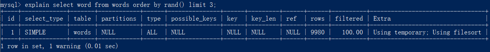
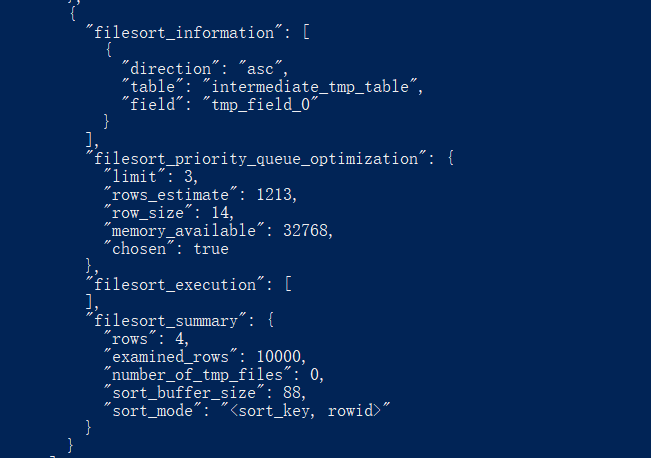

# rand

假设有一个单词表，每次要从中随机取3个单词，随着单词表中的单词数量越来越大，随机取单词需要的时间也跟着变大，为什么会这样呢？

下面是创建单词表及插入10000条数据的语句：

```text
mysql> CREATE TABLE `words` (
  `id` int(11) NOT NULL AUTO_INCREMENT,
  `word` varchar(64) DEFAULT NULL,
  PRIMARY KEY (`id`)
) ENGINE=InnoDB;

mysql> delimiter ;;
create procedure idata()
begin
  declare i int;
  set i=0;
  while i<10000 do
    insert into words(word) values(concat(char(97+(i div 1000)), char(97+(i % 1000 div 100)), char(97+(i % 100 div 10)), char(97+(i % 10))));
    set i=i+1;
  end while;
end;;
delimiter ;

mysql> call idata();
```

## 内存临时表

可以通过MySQL的`order by rand()`实现：

```text
mysql> select word from words order by rand() limit 3;
```

但是，该语句的执行流程比较复杂，先通过`explain`命令查看其执行情况：



`Extra`字段显示`Using temporary`，表示的是需要使用临时表；`Using filesort`，表示的是需要执行排序操作。

对于**临时内存表**的排序，MySQL会选择rowid排序，而不是全字段排序。因为全字段排序的优势在于减少访问磁盘的次数，而对于临时内存表，数据都是在内存中，**回表过程只是简单地根据数据行的位置，直接访问内存得到数据，根本不会导致多访问磁盘**。而且rowid排序需要的空间更小。

这条语句执行流程如下：


1. 创建一个临时表。这个临时表使用的是memory引擎，表里有两个字段，第一个字段是double类型，记为字段R，第二个字段是`varchar(64)`类型，记为字段W。并且，这个表没有建索引。
2. 从words表中，按主键顺序取出所有的word值。对于每一个word值，调用`rand()`函数生成一个大于0小于1的随机小数，并把这个随机小数和word分别存入临时表的R和W字段中，到此，扫描行数是10000。
3. 现在临时表有10000行数据了，接下来在这个没有索引的内存临时表上，按照字段R排序。
4. 初始化 `sort_buffer`。`sort_buffer`中有两个字段，一个是double类型，另一个是整型。
5. 从内存临时表中一行一行地取出R值和**位置信息**，分别存入`sort_buffer`中的两个字段里。这个过程要对内存临时表做全表扫描，此时扫描行数增加10000，变成了20000。
6. 在`sort_buffer`中根据R的值进行排序。这个过程没有涉及到表操作，所以不会增加扫描行数。
7. 排序完成后，取出前三个结果的位置信息，依次到内存临时表中取出word值，返回给客户端。这个过程中，访问了表的三行数据，总扫描行数变成了20003。

> 位置信息是 **MySQL的表用来定位“一行数据”的属性，**每个引擎用来唯一标识数据行的信息。
>
> * 对于有主键的InnoDB表来说，这个rowid就是主键ID
> * 对于没有主键的InnoDB表来说，InnoDB会自己生成一个长度为6字节的rowid来作为主键。所以即使把表的主键删了，还是可以回表的。
> * MEMORY引擎不是索引组织表。在这个例子里面，可以认为它就是一个数组。因此，这个rowid其实就是数组的下标

通过slow log验证：

```text
mysql> set long_query_time=0;
mysql> select word from words order by rand() limit 3;

# 慢查询日志
# Query_time: 0.005655  Lock_time: 0.000116 Rows_sent: 3  Rows_examined: 20003
SET timestamp=1587357446;
select word from words order by rand() limit 3;
```

其中`Rows_examined`就为20003，说明上述分析是正确的。

## 磁盘临时表

并不是所有的临时表都是内存表，`tmp_table_size`这个配置限制了内存临时表的大小，默认值是16M。如果临时表大小超过了`tmp_table_size`，那么内存临时表就会转成磁盘临时表。

磁盘临时表使用的引擎由参数`internal_tmp_disk_storage_engine`控制，默认引擎是InnoDB。

当使用磁盘临时表的时候，对应的就是一个没有显式索引的InnoDB表的排序过程。

为了让查询语句使用磁盘临时表，把`tmp_table_size`和`sort_buffer_size`分别设置成1024和 32768（单位是Byte），把 `max_length_for_sort_data`设置成16。

```text
set tmp_table_size=1024;
set sort_buffer_size=32768;
set max_length_for_sort_data=16;
/* 打开 optimizer_trace，只对本线程有效 */
SET optimizer_trace='enabled=on'; 

/* 执行语句 */
select word from words order by rand() limit 3;

/* 查看 OPTIMIZER_TRACE 输出 */
SELECT * FROM `information_schema`.`OPTIMIZER_TRACE`\G
```



因为将`max_length_for_sort_data`设置成16，小于`word`字段的长度定义，所以`sort_mode`里面显示的是`rowid`排序，这个是符合预期的，参与排序的是随机值R字段和rowid字段组成的行。

但是`number_of_tmp_files`是0，即没有使用临时文件进行排序，但是10000行数据，每行大小为14字节（double类型8字节，rowid6字节），总共1400000字节，大于`sort_buffer_size`的32768。这是因为MySQL使用一个大小为3个元素的大顶堆进行排序，即`filesort_priority_queue_optimization`的`chosen`值为true，并没有对这10000条数据完全排序。

经过堆排序后，依次取堆中元素的rowid去临时表中拿`word`字段。

如果随机取的元素数量比较大，例如`limit 1000`，那就可能不会使用优先级队列排序了，因为维护一个大小为1000的堆需要的内存超过了`sort_buffer_size`，那就只能使用归并排序了。

## 随机排序优化

不论是使用哪种类型的临时表，`order by rand()`这种写法都会让计算过程非常复杂，需要大量的扫描行数，因此排序过程的资源消耗也会很大。

### 随机算法1

可以自定义随机算法，而不是用MySQL的`rand`，例如随机取一个值时：

1. 取得这个表的主键`id`的最大值M和最小值N;
2. 用随机函数生成一个最大值到最小值之间的数 $X = (M-N)*rand() + N$;
3. 取不小于X的第一个ID的行。

```text
mysql> select max(id),min(id) into @M,@N from t;
set @X= floor((@M-@N+1)*rand() + @N);
select * from t where id >= @X limit 1;
```

这个方法效率很高，因为取`max(id)`和`min(id)`都是不需要扫描索引的，而第三步的`select`也可以用索引快速定位，可以认为就只扫描了3行。但实际上，这个算法本身并不严格满足随机要求，因为ID中间可能有空洞，因此选择不同行的概率不一样，不是真正的随机。

比如有4个id，分别是1、2、4、5，如果按照这个方法，那么取到`id=4`的这一行的概率是取得其他行概率的两倍。

如果这四行的id分别是1、2、40000、40001，那这个算法基本就能当bug来看待了。

### 随机算法2

1. 取得整个表的行数，并记为C。
2. 取得$ Y = floor(C * rand())$。 floor函数在这里的作用，就是取整数部分。
3. 再用`limit Y,1` 取得一行。

```text
mysql> select count(*) into @C from t;
set @Y = floor(@C * rand());
set @sql = concat("select * from t limit ", @Y, ",1");
prepare stmt from @sql;
execute stmt;
DEALLOCATE prepare stmt;
```

由于`limit`后面的参数不能直接跟变量，所以使用了`prepare + execute`的方法。

MySQL处理`limit Y,1` 的做法就是按顺序一个一个地读出来，丢掉前Y个，然后把下一个记录作为返回结果，因此这一步需要扫描Y+1行。再加上，第一步`count(*)`扫描的C行，总共需要扫描C+Y+1行，执行代价比随机算法1的代价要高，但跟`order by rand()`相比，执行代价还是小很多的。

即使是生成的Y很大，接近C，其效率相比`order by rand()`还是很高，因为随机算法2进行`limit`获取数据的时候是根据主键排序获取的，主键天然索引排序，获取到第最后一条的数据也远比`order by rand()`方法的组成临时表R字段排序再获取rowid代价小的多。

### 随机算法3

按照随机算法2的思想，随机取三个值时，可以这么做：

1. 取得整个表的行数，记为C；
2. 根据相同的随机方法得到Y1、Y2、Y3；
3. 再执行三个`limit Y, 1`语句得到三行数据。

```text
mysql> select count(*) into @C from t;
set @Y1 = floor(@C * rand());
set @Y2 = floor(@C * rand());
set @Y3 = floor(@C * rand());
select * from t limit @Y1，1； //在应用代码里面取Y1、Y2、Y3值，拼出SQL后执行
select * from t limit @Y2，1；
select * from t limit @Y3，1；
```

这样子扫描行数为$C + (Y1 + 1) + (Y2 + 1) + (Y3 + 1)$，还能进一步优化：

取Y1、Y2和Y3里面最大的一个数，记为M，最小的一个数记为N，然后执行下面这条SQL语句：

```text
mysql> select * from t limit N, M-N+1;
```

从结果集里取出第1条、第\(Y2 - Y1\)条和最后一条条记录即可。（假设Y1 &lt; Y2 &lt; Y3）

扫描行数为C+M+1行。

但是返回的结果集如果比较大，可以考虑先拿到id集，然后计算三个id，再利用主键索引取这三个id对应的记录。

