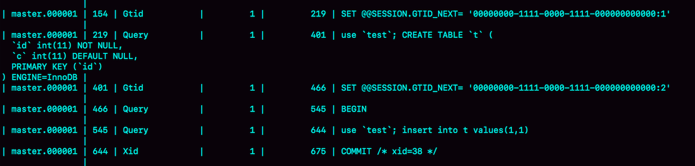

# 主从架构

大多数的互联网应用场景都是**读多写少**，业务在发展过程中很可能先会遇到读性能的问题。而在数据库层解决读性能问题，可以使用一主多从的架构。

## 切换正确性


虚线箭头表示的是主备关系，也就是`A`和`A’`互为主备。从库B、C、D指向的是主库A。一主多从的设置，一般用于读写分离，主库负责所有的写入和一部分读，其他的读请求则由从库分担。

> **备库 VS 从库**
>
> 备库是用来在主库出问题时切换为主库的，从库是面向客户的，但只提供读功能。

在一主多从架构下，主库故障后是如何进行主备切换的？


相比于一主一备的切换流程，一主多从结构在切换完成后，A’会成为新的主库，从库B、C、D也要改接到A’。正是由于多了从库B、C、D重新指向的这个过程，所以主备切换的复杂性也相应增加了。

### 基于位点的主备切换

当我们把节点B设置成节点A’的从库的时候，需要执行一条`change master`命令：

```
mysql> CHANGE MASTER TO 
MASTER_HOST=$host_name 
MASTER_PORT=$port 
MASTER_USER=$user_name 
MASTER_PASSWORD=$password 
MASTER_LOG_FILE=$master_log_name 
MASTER_LOG_POS=$master_log_pos  
```

最后两个参数`MASTER_LOG_FILE`和`MASTER_LOG_POS`表示，要从主库的`master_log_name`文件的`master_log_pos`这个位置的日志继续同步。这个位置就是我们所说的**同步位点**，也就是主库对应的文件名和日志偏移量。要如何确定这两个参数的值呢？

原来节点B是A的从库，本地记录的也是A的位点。但是**相同的日志，A的位点和A’的位点是不同的**。因此，从库B要切换的时候，就需要先经过“找同步位点”这个逻辑。这个位点很难精确取到，只能取一个大概位置。

考虑到切换过程中不能丢数据，所以我们找位点的时候，总是要找一个“稍微往前”的，然后再通过判断跳过那些在从库B上已经执行过的事务。

一种取同步位点的方法是这样的：

1. 等待新主库A’把中转日志（relay log）全部同步完成；
2. 在A’上执行`show master status`命令，得到当前A’上最新的File 和 Position；
3. 取原主库A故障的时刻T；
4. 用mysqlbinlog工具解析A’的File，得到T时刻的位点。

```
mysql> mysqlbinlog $File --stop-datetime=$T --start-datetime=$T
```


`end_log_pos`后面的值“123”，表示的就是A’这个实例，在T时刻写入新的binlog的位置。然后，我们就可以把123这个值作为`$master_log_pos` ，用在节点B的`change master`命令里。

不过这个值并不精确。假设在T这个时刻，主库A已经执行完成了一个`insert` 语句插入了一行数据R，并且已经将binlog传给了A’和B，然后在传完的瞬间主库A的主机就掉电了。那么，这时候系统的状态是这样的：

1. 在从库B上，由于同步了binlog， R这一行已经存在

2. 在新主库A’上， R这一行也已经存在，**日志是写在123这个位置之后的**

3. 在从库B上执行`change master`命令，指向A’的File文件的123位置，就会把插入R这一行数据的binlog又同步到从库B去执行。

   这时候，从库B的同步线程就会报告 `Duplicate entry ‘id_of_R’ for key ‘PRIMARY’` 错误，提示出现了主键冲突，然后停止同步。

所以，**通常情况下，我们在切换主备的时候，要先主动跳过这些错误，有两种常用的方法：**

- 主动跳过一个事务：

```
mysql> set global sql_slave_skip_counter=1;
mysql> start slave;
```

因为切换过程中，可能会不止重复执行一个事务，所以我们需要在从库B刚开始接到新主库A’时，持续观察，每次碰到这些错误就停下来，执行一次跳过命令，直到不再出现停下来的情况，以此来跳过可能涉及的所有事务。

> **`sql_slave_skip_counter`跳过的是一个event**，由于MySQL不能执行一半的事务，所以既然跳过了一个event，就会跳到这个事务的末尾，因此`set global sql_slave_skip_counter=1;start slave`是可以跳过一整个事务的。 

- 通过设置`slave_skip_errors`参数，直接设置跳过指定的错误。在执行主备切换时，有这么两类错误，是经常会遇到的：

  - 1062错误：插入数据时唯一键冲突
  - 1032错误：删除数据时找不到行

  把`slave_skip_errors `设置为 “1032,1062”，这样中间碰到这两个错误时就直接跳过。

  这种直接跳过指定错误的方法，针对的是主备切换时，由于找不到精确的同步位点，所以只能采用这种方法来创建从库和新主库的主备关系。等到主备间的同步关系建立完成，并稳定执行一段时间之后，我们还需要把这个参数设置为空，以免之后真的出现了主从数据不一致，也跳过了。
  
  

### 基于GTID的主备切换

#### GTID

通过`sql_slave_skip_counter`跳过事务和通过`slave_skip_errors`忽略错误的方法，虽然都最终可以建立从库B和新主库A’的主备关系，但这两种操作都很复杂，而且容易出错。

MySQL 5.6版本引入的GTID(Global Transaction Identifier)，彻底解决了这个困难。GTID是**一个事务在提交的时候生成的**，是这个事务的唯一标识。它由两部分组成，格式是`GTID=server_uuid:gno`其中：

- `server_uuid`是一个MySQL实例第一次启动时自动生成的，是一个全局唯一的值；
- `gno`是一个整数，初始值是1，每次**提交事务的时候**分配给这个事务，并加1。

> 在MySQL的官方文档里，GTID格式是这么定义的：
>
> ```
> GTID=source_id:transaction_id
> ```
>
> 这里的`source_id`就是`server_uuid`；而后面的这个`transaction_id`，容易造成误导，所以改成了`gno`。
>
> 在MySQL里面`transaction_id`就是指事务id，**事务id是在事务执行过程中分配的，如果这个事务回滚了，事务id也会递增，而gno是在事务提交的时候才会分配**。
>
> 从效果上看，**GTID往往是连续的**，因此用gno来表示更容易理解。

GTID模式的启动也很简单，只需要在启动一个MySQL实例的时候，加上参数`gtid_mode=on`和`enforce_gtid_consistency=on`就可以了。

在GTID模式下，每个事务都会跟一个GTID一一对应。GTID有两种生成方式，取决于session变量`gtid_next`的值。

- `gtid_next=automatic`：使用默认值，MySQL就会把`server_uuid:gno`分配给这个事务。

  a. 记录binlog的时候，先记录一行 `SET @@SESSION.GTID_NEXT=‘server_uuid:gno’`;

  b. 把这个GTID加入本实例的GTID集合。

- 指定`gtid_next`的值，比如通过`set gtid_next='current_gtid’`指定为`current_gtid`，那么就有两种可能：

  a. 如果`current_gtid`已经存在于实例的GTID集合中，**接下来执行的这个事务会直接被系统忽略**；

  b. 如果`current_gtid`没有存在于实例的GTID集合中，就将这个current_gtid分配给接下来要执行的事务，也就是说系统不需要给这个事务生成新的GTID，因此gno也不用加1。

  一个`current_gtid`只能给一个事务使用。这个事务提交后，如果要执行下一个事务，就要执行`set `命令，把`gtid_next`设置成另外一个gtid或者automatic。

每个MySQL实例都维护了一个GTID集合，用来对应“这个实例执行过的所有事务”。

在实例X中创建一个表`t`：

```
CREATE TABLE `t` (
  `id` int(11) NOT NULL,
  `c` int(11) DEFAULT NULL,
  PRIMARY KEY (`id`)
) ENGINE=InnoDB;

insert into t values(1,1);
```



事务的`BEGIN`之前有一条`SET @@SESSION.GTID_NEXT`命令。这时，如果实例X有从库，那么将`CREATE TABLE`和`insert`语句的binlog同步过去执行的话，执行事务之前就会先执行这两个`SET`命令， 这样被加入从库的GTID集合的，就是图中的这两个GTID。

假设，现在这个实例X是另外一个实例Y的从库，并且此时在实例Y上执行了下面这条插入语句（该语句在实例Y上的GTID是 “aaaaaaaa-cccc-dddd-eeee-ffffffffffff:10”）：

```
mysql> insert into t values(1,1);
```

实例X作为Y的从库，就要同步这个事务过来执行，显然会出现主键冲突，导致实例X的同步线程停止。可以这么处理：

```
set gtid_next='aaaaaaaa-cccc-dddd-eeee-ffffffffffff:10';
begin;
commit;
set gtid_next=automatic;
start slave;
```

前三条语句的作用，是通过提交一个空事务，把这个GTID加到实例X的GTID集合中。下图是执行完这个空事务之后的`show master status`的结果：


实例X的`Executed_Gtid_set`里面，已经加入了这个GTID。之后再执行`start slave`命令让同步线程执行起来的时候，虽然实例X上还是会继续执行实例Y传过来的事务，但是由于`“aaaaaaaa-cccc-dddd-eeee-ffffffffffff:10”`已经存在于实例X的GTID集合中了，所以实例X就会直接跳过这个事务，也就不会再出现主键冲突的错误。

`start slave`命令之前还有一句`set gtid_next=automatic`，这句话的作用是“恢复GTID的默认分配行为”，也就是说如果之后有新的事务再执行，就还是按照原来的分配方式，继续分配`gno=3`。


#### 切换流程

在GTID模式下，备库B要设置为新主库A’的从库的语法如下：

```
mysql> CHANGE MASTER TO 
MASTER_HOST=$host_name 
MASTER_PORT=$port 
MASTER_USER=$user_name 
MASTER_PASSWORD=$password 
master_auto_position=1 
```

`master_auto_position=1`就表示这个主备关系使用的是GTID协议，不需要指定log文件和偏移量了。

把现在这个时刻，实例A’的GTID集合记为`set_a`，实例B的GTID集合记为`set_b`。接下来，在实例B上执行`start slave`命令，取binlog的逻辑是这样的：

1. 实例B指定主库A’，基于主备协议建立连接。

2. 实例B把`set_b`发给主库A’。

3. 实例A’算出`set_a`与`set_b`的差集，也就是所有存在于`set_a`，但是不存在于`set_b`的GITD的集合，判断A’本地是否包含了这个差集需要的所有binlog事务。

   a. 如果不包含，表示A’已经把实例B需要的binlog给删掉了，直接返回错误；

   b. 如果确认全部包含，A’从自己的binlog文件里面，找出第一个不在`set_b`的事务，发给B；

4. 之后就从这个事务开始，往后读文件，按顺序取binlog发给B去执行。

> 在GTID模式下设置主从关系的时候，从库执行`start slave`命令后，主库发现需要的binlog已经被删除掉了，导致主备创建不成功。这种情况下，应该怎么处理呢？
>
> 1. 如果业务允许主从不一致的情况，
>    1. 先在主库上执行`show global variables like ‘gtid_purged’`，得到主库已经删除的GTID集合，假设是`gtid_purged1`
>    2. 在从库上执行`reset master`，再执行`set global gtid_purged =‘gtid_purged1’`
>    3. 执行`start slave`，就会从主库现存的binlog开始同步。binlog缺失的那一部分，数据在从库上就可能会有丢失，造成主从不一致。
> 2. 如果需要主从数据一致的话，最好通过重新搭建从库来做。
> 3. 如果有其他的从库保留有全量的binlog的话，可以把新的从库先接到这个保留了全量binlog的从库，追上日志以后，如果有需要，再接回主库。
> 4. 如果binlog有备份的情况，可以先在从库上应用缺失的binlog，然后再执行`start slave`。

在基于GTID的主备关系里，系统认为**只要建立主备关系，就必须保证主库发给备库的日志是完整的。**因此，如果实例B需要的日志已经不存在，A’就拒绝把日志发给B。

这跟基于位点的主备协议不同。基于位点的协议，是由备库决定的，备库指定哪个位点，主库就发哪个位点，不做日志的完整性判断。

使用GTID时，一主多从的切换场景下，主备切换只需要在从库执行`change master`命令指向实例A’即可，不需要找位点了。严谨地说，主备切换不是不需要找位点，而是找位点这个工作，在实例A’内部就已经自动完成了。

之后这个系统就由新主库A’写入，主库A’的自己生成的binlog中的GTID集合格式是：`server_uuid_of_A’:1-M`。

如果之前从库B的GTID集合格式是 `server_uuid_of_A:1-N`， 那么切换之后GTID集合的格式就变成了`server_uuid_of_A:1-N, server_uuid_of_A’:1-M`。

当然，主库A’之前也是A的备库，因此主库A’和从库B的GTID集合是一样的。


### GTID和在线DDL

在业务高峰期由于索引缺失引起慢查询性能问题时，可以通过在线加索引来解决。但是，考虑到要避免新增索引对主库性能造成的影响，可以先在备库加索引，然后再切换。

在双M结构下，备库执行的DDL语句也会传给主库，为了避免传回后对主库造成影响，要通过`set sql_log_bin=off`关掉binlog。这样操作的话，数据库里面是加了索引，但是binlog并没有记录下这一个更新，就会导致数据和日志不一致。

假设，这两个互为主备关系的库还是实例X和实例Y，且当前主库是X，并且都打开了GTID模式。这时的主备切换流程可以变成下面这样：

- 在实例X上执行`stop slave`，暂时不做实例Y的从库。
- 在实例Y上执行DDL语句，**这里并不需要关闭binlog**。
- 执行完成后，查出这个DDL语句对应的GTID，并记为 `server_uuid_of_Y:gno`。
- 到实例X上执行以下语句序列：

```
set GTID_NEXT="server_uuid_of_Y:gno";
begin;
commit;
set gtid_next=automatic;
start slave;
```

这样做的目的在于，既可以让实例Y的更新有binlog记录，同时也可以**确保不会在实例X上执行这条更新**。

- 接下来，执行完主备切换，然后照着上述流程再执行一遍即可。


## 读写分离

### 两种架构


读写分离的主要目标就是分摊主库的压力。上图的结构是client主动做负载均衡，这种模式下一般会把数据库的连接信息放在客户端的连接层，由客户端来选择后端数据库进行查询。

另一种架构是在MySQL和客户端之间有一个中间代理层proxy，客户端只连接proxy， 由proxy根据请求类型和上下文决定请求的分发路由。


**两种架构的对比**

- 客户端直连方案，因为少了一层proxy转发，所以查询性能稍微好一点儿，并且整体架构简单，排查问题更方便。但是这种方案，由于要了解后端部署细节，所以在出现主备切换、库迁移等操作的时候，客户端都会感知到，并且需要调整数据库连接信息。

  一般采用这样的架构，一定会伴随一个负责管理后端的组件，比如Zookeeper，尽量让业务端只专注于业务逻辑开发。

- 带proxy的架构，对客户端比较友好。客户端不需要关注后端细节，连接维护、后端信息维护等工作，都是由proxy完成的。但这样的话，对后端维护团队的要求会更高。而且，proxy也需要有高可用架构。因此，带proxy架构的整体就相对比较复杂。

不论使用哪种架构，由于主从可能存在延迟，客户端执行完一个更新事务后马上发起查询，如果查询选择的是从库的话，就有可能读到刚刚的事务更新之前的状态。这种“在从库上会读到系统的一个过期状态”的现象，称之为“**过期读**”。

### 处理过期读

#### 强制走主库方案

对查询请求做分类：

1. 对于必须要拿到最新结果的请求，强制将其发到主库上。比如，在一个交易平台上，卖家发布商品以后，马上要返回主页面，看商品是否发布成功。
2. 对于可以读到旧数据的请求，才将其发到从库上。在这个交易平台上，买家来逛商铺页面，就算晚几秒看到最新发布的商品，也是可以接受的。

这个方案最大的问题在于，碰到“所有查询都不能是过期读”的需求时，比如一些金融类的业务，就要放弃读写分离，所有读写压力都在主库，等同于放弃了扩展性。

> 接下来讨论的其他方案，都是在可以支持读写分离的场景下使用的。


#### sleep方案

主库更新后，读从库之前先sleep一下，即执行`select sleep(1)`命令。

这个方案的假设是，大多数情况下主备延迟在1秒之内，做一个sleep可以有很大概率拿到最新的数据。

从严格意义上来说，这个方案存在的问题就是不精确。这个不精确包含了两层意思：

1. 如果这个查询请求本来0.5秒就可以在从库上拿到正确结果，也会等1秒；
2. 如果延迟超过1秒，还是会出现过期读。


#### 判断主备无延迟方案

要确保备库无延迟，通常有三种做法。

`show slave status`结果里的`seconds_behind_master`参数的值，可以用来衡量主备延迟时间的长短。因此，第一种方法是：在每次从库执行查询请求前，先判断`seconds_behind_master`是否已经等于0。如果还不等于0 ，那就必须等到这个参数变为0才能执行查询请求。

利用对比位点和GTID的方法，精度会更高。下图为`show slave status`的输出，看看具体如何通过对比位点和GTID来确保主备无延迟。


对比位点确保主备无延迟：

- `Master_Log_File`和`Read_Master_Log_Pos`，表示的是**读到的主库的最新位点**；
- `Relay_Master_Log_File`和`Exec_Master_Log_Pos`，表示的是**备库执行的最新位点**。

如果`Master_Log_File`和`Relay_Master_Log_File`、`Read_Master_Log_Pos`和`Exec_Master_Log_Pos`这两组值完全相同，就表示接收到的日志已经同步完成。

对比GTID集合确保主备无延迟：

- `Auto_Position=1` ，表示这对主备关系使用了GTID协议。
- `Retrieved_Gtid_Set`，是备库收到的所有日志的GTID集合；
- `Executed_Gtid_Set`，是备库所有已经执行完成的GTID集合。

如果这两个集合相同，也表示备库接收到的日志都已经同步完成。

不过这几种方法仍达不到精确的程度，因为这里判断主备无延迟的逻辑，是“备库**收到的日志**都执行完成了”。但是，从binlog在主备之间状态的分析中，不难看出还有一部分日志，处于客户端已经收到提交确认，而备库还没收到日志的状态。对应状态如图：


如果这时候在从库B上执行查询请求，按照上面的逻辑，从库认为已经没有同步延迟，但还是查不到trx3。严格地说，就是出现了过期读。

> 一个事务的binlog在主备库之间的状态：
>
> 1. 主库执行完成，写入binlog，并反馈给客户端；
> 2. binlog被从主库发送给备库，备库收到；
> 3. 在备库执行binlog完成。


#### 配合semi-sync方案

半同步复制（semi-sync replication），可以解决上一种方案的问题，设计如下：

1. 事务提交的时候，主库把binlog发给从库；
2. 从库收到binlog以后，发回给主库一个ack，表示收到了；
3. 主库收到这个ack以后，才能给客户端返回“事务完成”的确认。

如果启用了semi-sync，就表示所有给客户端发送过确认的事务，都确保了备库已经收到了这个日志。

但是，**semi-sync+位点判断的方案，只对一主一备的场景是成立的**。在一主多从场景中，主库只要等到**一个从库的ack**，就开始给客户端返回确认。这时，在从库上执行查询请求，就有两种情况：

1. 如果查询是落在这个响应了ack的从库上，是能够确保读到最新数据；
2. 如果是查询落到其他从库上，它们可能还没有收到最新的日志，就会产生过期读的问题。

判断同步位点的方案还有另外一个潜在的问题：在业务更新的高峰期，主库的位点或者GTID集合更新很快，那么上面的两个位点等值判断就会一直不成立，很可能出现从库上迟迟无法响应查询请求的情况。


从状态1 到状态4，一直处于延迟一个事务的状态。备库B一直到状态4都和主库A存在延迟，如果必须等到无延迟才能查询，`select`语句直到状态4都不能被执行。

但是，其实客户端是在发完trx1更新后发起的`select`语句，所以只需要确保trx1已经执行完成就可以执行`select`语句了。也就是说，如果在状态3执行查询请求，得到的就是预期结果了。

因此，当发起一个查询请求以后，要得到准确的结果，其实并不需要等到“主备完全同步”。


#### 等主库位点方案

> ```
> select master_pos_wait(file, pos[, timeout]);
> ```
>
> 这条命令是在从库执行的，参数`file`和`pos`指的是主库上的文件名和位置，`timeout`可选，设置为正整数N表示这个函数最多等待N秒。
>
> 这个命令正常返回的结果是一个正整数M，表示从命令开始执行，到应用完`file`和`pos`表示的binlog位置，执行了多少事务。除了正常返回一个正整数M外，这条命令还会返回一些其他结果，包括：
>
> 1. 如果执行期间，备库同步线程发生异常，则返回NULL；
> 2. 如果等待超过N秒，就返回-1；
> 3. 如果刚开始执行的时候，就发现已经执行过这个位置了，则返回0。

对于上一种方案中主备持续延迟一个事务的场景，先执行trx1，再执行一个查询请求的逻辑，要保证能够查到正确的数据，可以使用这个逻辑：

1. trx1事务更新完成后，马上执行`show master status`得到当前主库执行到的`File`和`Position`；
2. 选定一个从库执行查询语句；
3. 在从库上执行`select master_pos_wait(File, Position, 1)`；
4. 如果返回值是>=0的正整数，表明已经应用完这些binlog了，则在这个从库执行查询语句；
5. 否则，到主库执行查询语句。


#### 等GTID方案

> ```
> select wait_for_executed_gtid_set(gtid_set, timeout);
> ```
>
> 执行这条命令后会等待，直到这个库执行过的事务中包含传入的`gtid_set`，返回0；超时返回1。
>
> 在等位点的方案中，执行完事务后，还要主动去主库执行`show master status`。而MySQL 5.7.6版本开始，允许在执行完更新类事务后，把这个事务的GTID返回给客户端，这样等GTID的方案就可以减少一次查询。

**执行流程**：

1. trx1事务更新完成后，从返回包直接获取这个事务的GTID，记为`gtid1`；
2. 选定一个从库执行查询语句；
3. 在从库上执行 `select wait_for_executed_gtid_set(gtid1, 1)`；
4. 如果返回值是0，则在这个从库执行查询语句；
5. 否则，到主库执行查询语句。


在第一步中，trx1事务更新完成后，为了从返回包直接获取这个事务的GTID，需要将参数`session_track_gtids`设置为`OWN_GTID`，然后通过API接口`mysql_session_track_get_first`从返回包解析出GTID的值。

> MySQL提供了多种语言的API接口，例如[C语言的API接口](https://dev.mysql.com/doc/refman/5.7/en/c-api.html)。
>
> 为了让客户端在事务提交后，返回的GITD能够在客户端显示出来，修改MySQL客户端的代码，如下所示：
>
> 
>
> 这样，就可以在语句执行完成时，显示出GITD的值。
>
> 


如果要对主库的一张大表做DDL，可能会出现什么情况呢？

假设这条语句在主库上要执行10分钟，提交后传到备库就要10分钟（典型的大事务）。那么，在主库DDL之后再提交的事务的GTID，去备库查的时候，就会等10分钟才出现。

这样，这个读写分离机制在这10分钟之内都会超时，然后走主库。

这种预期内的操作，应该在业务低峰期的时候，确保主库能够支持所有业务查询，然后把读请求都切到主库，再在主库上做DDL。等备库延迟追上以后，再把读请求切回备库。