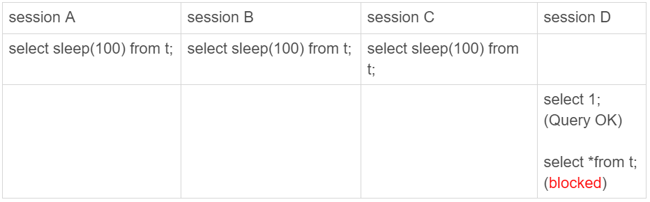
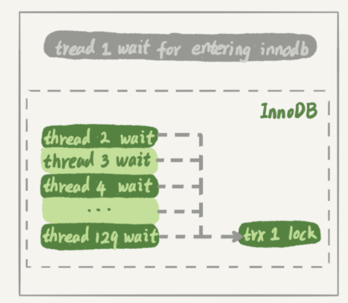
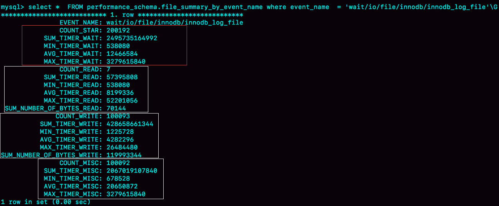

# 健康检查

主备切换有两种场景，一种是主动切换，一种是被动切换。而其中被动切换，往往是因为主库出问题了，由HA系统发起的。如何判断主库出问题了？

## select 1 判断

实际上，`select 1`成功返回，只能说明这个库的进程还在，并不能说明主库没问题。

```
mysql> set global innodb_thread_concurrency=3;

mysql> CREATE TABLE `t` (
  `id` int(11) NOT NULL,
  `c` int(11) DEFAULT NULL,
  PRIMARY KEY (`id`)
) ENGINE=InnoDB;

mysql> insert into t values(1,1)
```



设置`innodb_thread_concurrency`参数的目的是，控制InnoDB的并发线程上限。一旦并发线程数达到这个值，InnoDB在接收到新请求的时候，就会进入等待状态，直到有线程退出。

`innodb_thread_concurrency`值为3，表示InnoDB只允许3个线程并行执行。在这个例子中，前三个session 中的`sleep(100)`，使得这三个语句都处于“执行”状态，以此来模拟大查询。

session D里面，`select 1`是能执行成功的，因为不需要进入到InnoDB里面去执行，但是查询表`t`的语句会被堵住。也就是说，这时候用`select 1`来检测实例是否正常的话，是检测不出问题的。


### innodb_thread_concurrency

该参数默认值为0，表示不限制并发线程数量。但是，不限制并发线程数肯定是不行的。因为，一个机器的CPU核数有限，线程全冲进来，上下文切换的成本就会太高。建议把`innodb_thread_concurrency`设置为64~128之间的值。

这个参数限制的是并发查询，而不是并发连接。

**在线程进入锁等待以后，并发线程的计数会减一**，即等行锁（也包括间隙锁）的线程是不算在128里面的。因为，进入锁等待的线程已经不吃CPU了；更重要的是，必须这么设计，才能避免整个系统锁死。

假设处于锁等待的线程也占并发线程的计数：

1. 线程1执行`begin; update t set c=c+1 where id=1`, 启动了事务trx1， 然后保持这个状态。这时候，线程处于空闲状态，不算在并发线程里面。
2. 线程2到线程129都执行 `update t set c=c+1 where id=1`，由于等行锁，进入等待状态。这样就有128个线程处于等待状态；
3. 如果处于锁等待状态的线程计数不减一，InnoDB就会认为线程数用满了，会阻止其他语句进入引擎执行，这样线程1不能提交事务。而另外的128个线程又处于锁等待状态，整个系统就堵住了。



这时候InnoDB不能响应任何请求，整个系统被锁死。而且，由于所有线程都处于等待状态，此时占用的CPU却是0，而这明显不合理。所以，InnoDB在设计时，遇到进程进入锁等待的情况时，将并发线程的计数减1的设计，是合理而且是必要的。


## 查表判断

为了能够检测**InnoDB并发线程数过多导致的系统不可用情况**，我们需要找一个访问InnoDB的场景。一般的做法是，在系统库（mysql库）里创建一个表，比如命名为`health_check`，里面只放一行数据，然后定期执行：

```
mysql> select * from mysql.health_check; 
```

这是一个查询语句，如果系统空间满了，仍然可以正常查询，但是对于更新和插入语句，它们的`commit`语句都会被堵住。

## 更新判断

常见做法是放一个timestamp字段，用来表示最后一次执行检测的时间：

```
mysql> update mysql.health_check set t_modified=now();
```

节点可用性的检测都应该包含主库和备库。如果用更新来检测主库的话，那么备库也要进行更新检测。

但备库的检测也是要写binlog的。由于我们一般会把数据库A和B的主备关系设计为双M结构，所以在备库B上执行的检测命令，也要发回给主库A。

但是，如果主库A和备库B都用相同的更新命令，就可能出现行冲突，也就是可能会导致主备同步停止。比如在A和B上，该库刚开始是个空表，然后执行`insert into mysql.health_check(id, t_modified) values (1, now()) on duplicate key update t_modified=now();`，此时都是`insert`行为，记录到binlog中的是一个`Write rows event`，当binlog传到另一个库上执行时，就会出现主键冲突，使主备同步停止。

所以，`mysql.health_check` 这个表就不能只有一行数据，我们可以在`mysql.health_check`表上存入多行数据，并用A、B的`server_id`做主键。

```
mysql> CREATE TABLE `health_check` (
  `id` int(11) NOT NULL,
  `t_modified` timestamp NOT NULL DEFAULT CURRENT_TIMESTAMP,
  PRIMARY KEY (`id`)
) ENGINE=InnoDB;

/* 检测命令 */
mysql> insert into mysql.health_check(id, t_modified) values (@@server_id, now()) on duplicate key update t_modified=now();
```

由于MySQL规定了主库和备库的`server_id`必须不同（否则创建主备关系的时候就会报错），这样就可以保证主、备库各自的检测命令不会发生冲突。

### 判定慢

首先，所有的检测逻辑都需要一个超时时间N。执行一条update语句，超过N秒后还不返回，就认为系统不可用。

假设一个日志盘的IO利用率已经是100%，这时候，整个系统响应非常慢，已经需要做主备切换了。

但是你要知道，IO利用率100%表示系统的IO是在工作的，每个请求都有机会获得IO资源，执行自己的任务。而检测用的update命令，需要的资源很少，所以可能在拿到IO资源的时候就可以提交成功，并且在超时时间N秒未到达之前就返回给了检测系统。

检测系统一看，update命令没有超时，于是就得到了“系统正常”的结论。

也就是说，这时候在业务系统上正常的SQL语句已经执行得很慢了，但是健康检查还是正常的，就会认为主库现在处于可用状态。

之所以会出现这个现象，根本原因是上面说的所有方法，都是基于**外部检测**的。外部检测天然有一个问题，就是随机性。

因为，外部检测都需要定时轮询，所以系统可能已经出问题了，但是却需要等到下一个检测发起执行语句的时候，我们才有可能发现问题。而且，如果你的运气不够好的话，可能第一次轮询还不能发现，这就会导致切换慢的问题。


## 内部统计

MySQL 5.6版本以后提供的`performance_schema`库，就在`file_summary_by_event_name`表里统计了**每次IO请求的时间**。

`file_summary_by_event_name`表里有很多行数据，先看看`event_name='wait/io/file/innodb/innodb_log_file’`这一行，它记录的是redo log的相关统计信息。



- 第一部分共五列，是所有IO类型的统计。其中，`COUNT_STAR`是所有IO的总次数，接下来四列是具体的统计项， 单位是皮秒（1000皮秒=1纳秒）；前缀SUM、MIN、AVG、MAX，顾名思义指的就是总和、最小值、平均值和最大值。
- 第二部分六列，是读操作的统计。`SUM_NUMBER_OF_BYTES_READ`统计的是，总共从redo log里读了多少个字节。
- 第三部分六列，是写操作的统计。
- 第四部分是对其他类型数据的统计。在redo log里，可以认为它们就是对`fsync`的统计。

`file_summary_by_event_name`表中event_name为`wait/io/file/sql/binlog`的行，记录了binlog相关的统计信息，格式与redo log相同。

因为每一次操作数据库，`performance_schema`都需要额外地统计这些信息，所以打开这个统计功能是有性能损耗的。如果打开所有的`performance_schema`项，性能大概会下降10%左右。所以，建议只打开需要的项进行统计。可以通过下面的方法打开或者关闭某个具体项的统计：

```
# 打开redo log的时间监控
mysql> update setup_instruments set ENABLED='YES', Timed='YES' where name like '%wait/io/file/innodb/innodb_log_file%';
```

如何通过redo log和binlog这两个统计信息，进行实例状态诊断呢？

可以通过`MAX_TIMER`的值来判断数据库是否出问题了。比如，可以设定阈值，单次IO请求时间超过200毫秒属于异常，然后使用类似下面这条语句作为检测逻辑。

```
mysql> select event_name,MAX_TIMER_WAIT  FROM performance_schema.file_summary_by_event_name where event_name in ('wait/io/file/innodb/innodb_log_file','wait/io/file/sql/binlog') and MAX_TIMER_WAIT>200*1000000000;
```

发现异常后，取到你需要的信息，再通过下面这条语句把之前的统计信息清空，这样如果后面的监控中，再次出现这个异常，就可以加入监控累积值了。

```
mysql> truncate table performance_schema.file_summary_by_event_name;
```


