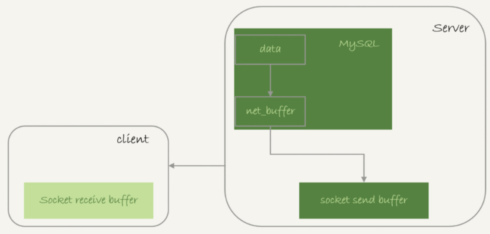
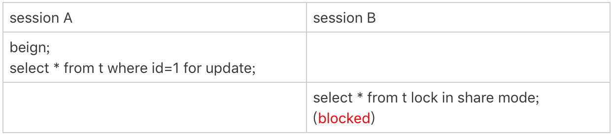

# 全表扫描

主机内存只有16G，现在要对一个200G的大表做全表扫描，会不会把数据库主机的内存用光了，导致OOM？

逻辑备份的时候，做的是**整库扫描**，并不会把内存都用完，所以对大表做全表扫描，也不会有内存问题。

## 全表扫描对server层的影响

假设现在要对一个200G的InnoDB表`db1.t`，执行一个全表扫描，使用下面的命令把扫描结果保存在客户端：

```
$ mysql -h$host -P$port -u$user -p$pwd -e "select * from db1.t" > $target_file
```

InnoDB的数据是保存在主键索引上的，所以全表扫描实际上是直接扫描表`t`的主键索引。这条查询语句由于没有其他的判断条件，所以查到的每一行都可以直接放到**结果集**里面，然后返回给客户端。

这个结果集并不是等到存放扫描的全部结果后才返回给客户端，而是：

1. 获取一行，写到net_buffer中。这块内存的大小是由参数`net_buffer_length`定义的，默认是16k。
2. 重复获取行，直到net_buffer写满，调用网络接口发出去。
3. 如果发送成功，就清空net_buffer，然后继续取下一行，并写入net_buffer。
4. 如果发送函数返回`EAGAIN`或`WSAEWOULDBLOCK`，就表示本地网络栈（socket send buffer）写满了，进入等待。直到网络栈重新可写，再继续发送。



因此，**一个查询在发送过程中，占用的MySQL内部的内存最大就是`net_buffer_length`这么大**，并不会达到200G；

socket send buffer 也不可能达到200G（默认定义`/proc/sys/net/core/wmem_default`），如果socket send buffer被写满，就会暂停读数据的流程。

可以看出，**MySQL是“边读边发的”**，这就意味着，如果客户端接收得慢，会导致MySQL服务端由于结果发不出去，这个事务的执行时间变长。

比如下面这个状态，故意让客户端不去读socket receive buffer中的内容，然后在服务端`show processlist`看到的结果。


如果State的值一直处于**“Sending to client”**，就表示服务器端的网络栈写满了。

> **Sending to client VS Sending data**
>
> 一个查询语句的状态变化是这样的（这里略去了其他无关的状态）：
>
> - MySQL查询语句进入**执行阶段**后，首先把状态设置成“Sending data”；
> - 然后，发送执行结果的列相关的信息（meta data) 给客户端；
> - 再继续执行语句的流程；
> - 执行完成后，把状态设置成空字符串。
>
> 也就是说，**“Sending data”并不一定是指“正在发送数据”，而可能是处于执行器过程中的任意阶段**。
>
> 
>
> 
>
> 这里session B还处于等待锁的状态，但也显示“Sending data”状态。
>
> 仅当一个线程处于**等待客户端接收结果**的状态，才会显示"Sending to client"；而如果显示成“Sending data”，它的意思只是“正在执行”。

如果客户端使用`–quick`参数，会使用`mysql_use_result`方法。这个方法是读一行处理一行，如果有一个业务的逻辑比较复杂，每读一行数据以后要处理的逻辑如果很慢，就会导致客户端要过很久才会去取下一行数据，可能就会出现服务端发送阻塞的情况。

**对于正常的线上业务来说，如果一个查询的返回结果不会很多的话，建议使用mysql_store_result这个接口，直接把查询结果保存到本地内存。**

如果在MySQL里看到很多个线程都处于“Sending to client”这个状态，就意味着要让业务开发同学优化查询结果，并评估这么多的返回结果是否合理。如果要快速减少处于这个状态的线程的话，可以考虑将`net_buffer_length`参数设置为一个更大的值。`net_buffer_length `的最大值是 1G，socket send buffer一般只有几M，将结果写到net_buffer后，执行器就认为“写出去”了，因此可以减少”Sending to client“状态。

> 如果客户端由于压力过大，迟迟不能接收数据，会对服务端造成什么严重的影响？
>
> 这个问题的核心是造成了“**长事务**”。
>
> - 如果前面的语句有更新，意味着它们在占用着行锁，会导致别的语句更新被锁住；
> - 读的事务也有问题，会导致undo log不能被回收，导致回滚段空间膨胀。


## 全表扫描对innoDB的影响

内存中的数据页在Buffer Pool(BP)中管理，InnoDB Buffer Pool的大小是由参数 `innodb_buffer_pool_size`确定的，一般建议设置成可用物理内存的60%~80%。因为BP的内存是有上限的，所以全表扫描不会用光内存。

BP可以加速查询，因为当要查询的数据页已经在内存中时，直接从内存返回数据就可以了，不用去读磁盘。BP对查询的加速效果，依赖于一个重要的指标：**内存命中率**。在`show engine innodb status`结果中的`Buffer pool hit rate`，就是当前的BP命中率。一般情况下，一个稳定服务的线上系统，要保证响应时间符合要求的话，内存命中率要在99%以上。


如果所有查询需要的数据页都能够直接从内存得到，那是最好的，对应的命中率就是100%。但这在实际生产上是很难做到的。

`innodb_buffer_pool_size`小于磁盘的数据量是很常见的。如果一个 Buffer Pool满了，而又要从磁盘读入一个数据页，就需要淘汰一个旧数据页。InnoDB使用LRU算法淘汰最久未使用的数据，不过用的是**优化后的LRU算法**。

如果使用没有优化的LRU，当对一个不常用的大表全表扫描时，由于每一页都只需要访问一次，会把大部分本来业务需要的数据页给淘汰掉。之后Buffer Pool的内存命中率会急剧下降，磁盘压力增加，SQL语句响应变慢。

优化后的LRU**按照5:3的比例把整个LRU链表分成了young区域和old区域**。下图LRU_old指向的就是old区域的第一个位置，是整个链表的5/8处。也就是说，靠近链表头部的5/8是young区域，靠近链表尾部的3/8是old区域。


改进后的LRU算法执行流程如下：

1. 状态1，要访问数据页P3，由于P3在young区域，因此和优化前的LRU算法一样，将其移到链表头部，变成状态2。
2. 之后要访问一个**新的不存在于当前链表的数据页**，这时候依然是淘汰掉末尾的数据页Pm，但是**新插入的数据页Px，是放在LRU_old处**。
3. 处于old区域的数据页，每次被访问的时候都要做下面这个判断：
   - 若这个数据页在LRU链表中存在的时间超过了1秒，就把它移动到链表头部；
   - 如果这个数据页在LRU链表中存在的时间短于1秒，位置保持不变。1秒这个时间，是由参数`innodb_old_blocks_time`控制的。其默认值是1000，单位毫秒。

这个策略，就是为了处理类似全表扫描的操作量身定制的。现在对200G的历史数据表进行全表扫描：

1. 扫描过程中，需要新插入的数据页，都被放到old区域;
2. 一个数据页里面有多条记录，这个数据页会被多次访问到，但由于是顺序扫描，这个数据页第一次被访问和最后一次被访问的时间间隔不会超过1秒，因此还是会被保留在old区域；
3. 再继续扫描后续的数据，之前的这个数据页之后也不会再被访问到，于是始终没有机会移到链表头部（young区域），很快就会被淘汰出去。

可以看到，这个策略最大的收益，就是在扫描这个大表的过程中，虽然也用到了Buffer Pool，但是对young区域完全没有影响，从而保证了Buffer Pool响应正常业务的查询命中率。


