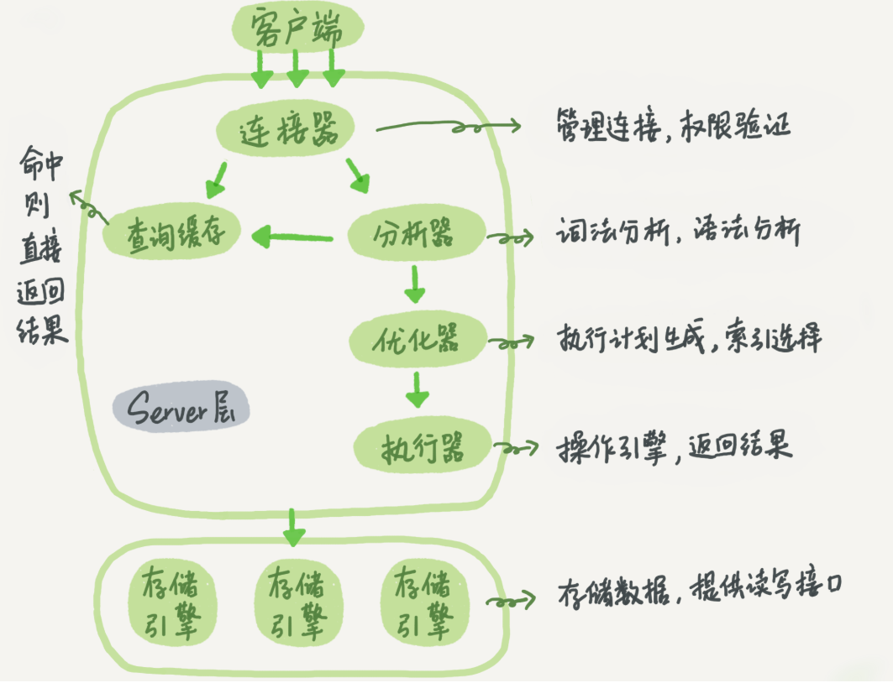
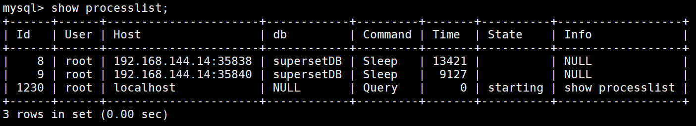
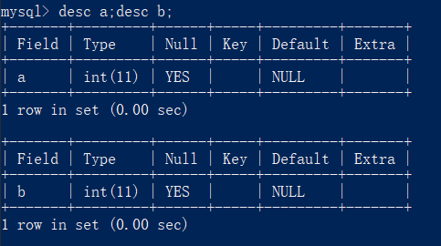
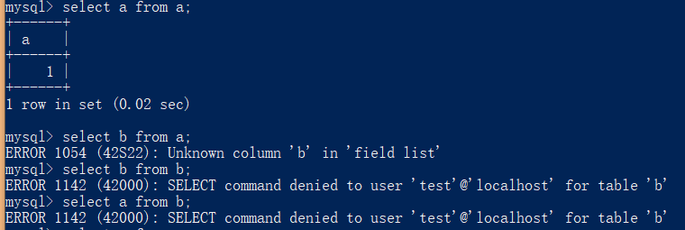

# 基础架构



从上图可以发现，MySQL可以分为**Server层**和**存储引擎层**两部分，不同的存储引擎共用一个**Server层**。

## Server层

Server层包括连接器、查询缓存、分析器、优化器、执行器等，涵盖MySQL的大多数核心服务功能，以及所有的内置函数（如日期、时间、数学和加密函数等），所有跨存储引擎的功能都在这一层实现，比如存储过程、触发器、视图等。

### 连接器

连接器负责跟客户端建立连接、获取权限、维持和管理连接。

```text
$ mysql -h$ip -P$port -u$user -p
```

命令中的`mysql`为客户端工具，在经过TCP握手后，服务端的连接器就会通过用户名和密码验证用户身份：

* 如果用户名或密码不对，就会收到一个"Access denied for user"的错误，然后客户端程序结束执行。
* 如果用户名密码认证通过，连接器会到权限表里面查出你拥有的权限。之后，这个连接里面的权限判断逻辑，都将依赖于**此时**读到的权限。

  > 一个用户成功建立连接后，即使用管理员账号对这个用户的权限做了修改，也不会影响已经存在连接的权限。修改完成后，只有在新建的连接才会使用新的权限设置。

连接之后，可以通过`show processlist`查看当前的连接：



`Command`为`Sleep`的行，表示有一个空闲连接，客户端长时间（`wait_timeout`，默认8小时）不操作数据库时，连接器就会将其自动断开。在连接被断开之后，客户端再次发送请求，就会收到一个错误提醒： `Lost connection to MySQL server during query`。这时候只能重连，然后再执行请求了。

数据库里面，建立连接的过程通常是比较复杂的，所以尽量使用长连接。

* **长连接**：连接成功后，如果客户端持续有请求，则一直使用同一个连接
* **短连接**：每次执行完很少的几次查询就断开连接，下次查询再重新建立一个

但是全部使用长连接后，有些时候MySQL占用内存涨得特别快，这是因为MySQL在执行过程中临时使用的内存是管理在连接对象里面的。这些资源会**在连接断开的时候才释放**。所以如果长连接累积下来，可能导致内存占用太大，被系统强行杀掉（OOM），从现象看就是MySQL异常重启了。

两种处理方法：

* 定期断开长连接。使用一段时间，或者程序里面判断执行过一个占用内存的大查询后，断开连接，之后要查询再重连。
* 在MySQL 5.7或更新版本，可以在每次执行一个比较大的操作后，通过执行 `mysql_reset_connection`来重新初始化连接资源。**这个过程不需要重连和重新做权限验证，但是会将连接恢复到刚刚创建完时的状态。**


### 查询缓存

对于每个**查询请求**，MySQL会以`key-value`对（key是查询的语句，value是查询的结果）的形式将其缓存在内存中。

当有新的**查询请求**到来时，会先到查询缓存看看，之前是否有执行过这条语句。

* 如果查询能够直接在这个缓存中命中，那么相应的value就会被直接返回给客户端。
* 如果语句不在查询缓存中，就会继续后面的执行阶段。执行完成后，执行结果会被存入查询缓存中。

如果查询命中缓存，MySQL不需要执行后面的复杂操作，就可以直接返回结果，这个效率会很高。

**但是大多数情况下查询缓存往往弊大于利**。因为查询缓存的失效非常频繁，只要有对一个表的更新，这个表上所有的查询缓存都会被清空。对于更新压力大的数据库来说，查询缓存的命中率会非常低。

查询缓存适合用在静态表上，这种表很长时间才会更新一次，比如系统配置表。

MySQL提供了“按需使用”的方式：将参数`query_cache_type`设置成`DEMAND`，这样对于默认的SQL语句都不使用查询缓存。而对于确定要使用查询缓存的语句，可以用`SQL_CACHE`显式指定：

```text
mysql> select SQL_CACHE * from T where ID=10;
```

> **在MySQL 8.0版本，查询缓存的整块功能被删掉了。**

### 分析器

MySQL为了知道SQL语句要做什么，首先对SQL语句做**词法分析**。SQL语句是由多个字符串和空格组成的一条SQL语句，MySQL需要识别出里面的字符串分别是什么，代表什么。

以`select ID from t`为例，识别到`select`，说明这是一个查询语句，所以会把`ID`识别为列名，把`t`识别为表名。

接下来做**语法分析**，判断该语句是否满足MySQL语法规则。

### 优化器

在执行前，还需要进行优化，例如表里面有多个索引的时候，决定使用哪个索引；或者在一个语句有多表关联`join`的时候，决定各个表的连接顺序。

以下面的`join`语句为例：

```text
mysql> select * from t1 join t2 using(ID)  where t1.c=10 and t2.d=20;
```

* 既可以先从表`t1`里面取出`c=10`的记录的ID值，再根据`ID`值关联到表`t2`，再判断`t2`里面`d`的值是否等于20。
* 也可以先从表`t2`里面取出`d=20`的记录的ID值，再根据`ID`值关联到`t1`，再判断`t1`里面`c`的值是否等于10。

这两种执行方法的逻辑结果是一样的，但是执行的效率会有不同，而优化器的作用就是决定选择使用哪一个方案。

### 执行器

**开始执行的时候，要先判断一下当前用户对这个表`T`有没有执行查询的权限**，如果没有，就会返回没有权限的错误。

如果有权限，就打开表继续执行。打开表的时候，执行器就会根据表的引擎定义，去使用这个引擎提供的接口。

```text
mysql> select * from T where ID=10;
```

上面的语句，表`T`的`ID`字段没有索引，执行流程如下：

1. 调用InnoDB引擎接口取这个表的第一行，判断ID值是不是10，如果不是则跳过，如果是则将这行存在结果集中；
2. 调用引擎接口取“下一行”，重复相同的判断逻辑，直到取到这个表的最后一行。
3. 执行器将上述遍历过程中所有满足条件的行组成的记录集作为结果集返回给客户端。

对于有索引的表，执行的逻辑也差不多。第一次调用的是“取满足条件的第一行”这个接口，之后循环取“满足条件的下一行”这个接口，这些接口都是引擎中已经定义好的。

> 在数据库的慢查询日志中看到一个`rows_examined`的字段，表示这个语句执行过程中扫描了多少行。这个值就是在执行器每次调用引擎获取数据行的时候累加的（**执行器累加的**）。
>
> 在有些场景下，执行器调用一次，在引擎内部则扫描了多行，因此**引擎扫描行数跟rows\_examined并不是完全相同的。**

### 问题

如果表`T`中没有字段`k`，执行语句 `select * from T where k=1`, 肯定是会报“不存在这个列”的错误：“`Unknown column ‘k’ in ‘where clause’`。这个错误是在上面提到的哪个阶段报出来的呢？

* 分析阶段

《高性能mysql》里提到解析器和预处理器。

解析器处理语法和解析查询, 生成一颗对应的解析树。

预处理器进一步检查解析树的合法。比如: **数据表和数据列是否存在**, 别名是否有歧义等。如果通过则生成新的解析树，再提交给优化器。

* 执行阶段

创建两张表如下，用户test只有表`a`的`SELECT`权限：



让用户test去`SELECT`这两张表，分别查存在和不存在的字段。



对于表`a`的不存在的`b`字段，报了`Unknown column 'b' in 'field list'`的错误。

而对于表`b`，不管是存在和不存在的字段，都报了权限问题，而权限问题是在执行的时候检查的。

## 存储引擎层

存储引擎层负责数据的存储和提取。其架构模式是**插件式**的，支持InnoDB、MyISAM、Memory等多个存储引擎。现在最常用的存储引擎是InnoDB，它从MySQL 5.5.5版本开始成为了默认存储引擎。`create table`建表的时候，如果不指定引擎类型，默认使用的就是InnoDB，如果指定`engine=memory`，则可以使用内存引擎。

**不同存储引擎的表数据存取方式不同，支持的功能也不同。**

