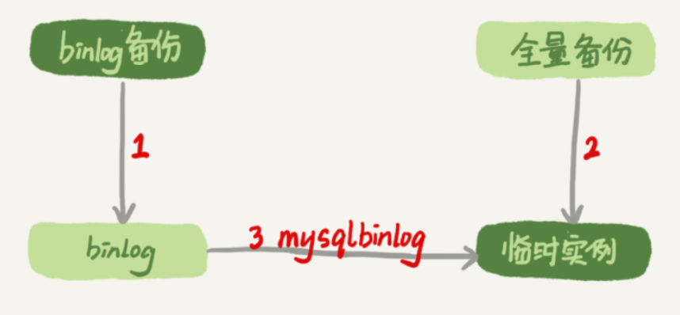
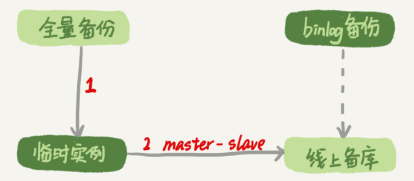

# 恢复数据

即使是高可用架构，也不能预防误删数据，因为主库的一个`drop table`命令，会通过binlog传给所有从库和级联从库，进而导致整个集群的实例都会执行这个命令。根据误删数据的规模，有相应的处理方案。

## 误删行

如果是使用`delete`语句误删了数据行，可以用Flashback工具通过闪回把数据恢复回来。

Flashback恢复数据的原理，是读取并修改binlog的内容，拿回原库重放。使用这个方案的前提是，需要确保`binlog_format=row `和` binlog_row_image=FULL`。具体恢复数据时，对单个事务做如下处理：

1. 对于`insert`语句，对应的binlog event类型是`Write_rows event`，把它改成`Delete_rows event`即可
2. 对于`delete`语句，也是将`Delete_rows event`改为`Write_rows event`
3. 如果是`Update_rows`的话，binlog里面记录了数据行修改前和修改后的值，对调这两行的位置即可

如果误操作不是一个，而是多个，比如下面三个事务：

```
(A)delete ...
(B)insert ...
(C)update ...
```

现在要把数据库恢复回这三个事务操作之前的状态，用Flashback工具解析binlog后，写回主库的命令是：

```
(reverse C)update ...
(reverse B)delete ...
(reverse A)insert ...
```

**误删数据涉及到了多个事务的话，需要将事务的顺序调过来再执行。**

**不建议直接在主库上执行这些操作。**一个在执行线上逻辑的主库，数据状态的变更往往是有关联的。可能由于发现数据问题的时间晚了一点儿，就导致已经在之前误操作的基础上，业务代码逻辑又继续修改了其他数据。所以，如果这时候单独恢复这几行数据，而又未经确认的话，就可能会出现对数据的二次破坏。

恢复数据比较安全的做法，是恢复出一个备份，或者找一个从库作为临时库，在这个临时库上执行这些操作，然后再将确认过的临时库的数据，恢复回主库。

**除了误删数据的事后处理办法，更重要是要做到事前预防**：

1. 把`sql_safe_updates`参数设置为on，如果忘记在`delete`或者`update`语句中写`where`条件，或者`where`条件里面没有包含索引字段的话，这条语句的执行就会报错。
2. 代码上线前，必须经过SQL审计。

> 设置了`sql_safe_updates=on`，如果真的要把一个小表的数据**全部**删掉，可以在`delete`语句中加上`where`条件，比如`where id>=0`。

`delete`全表是很慢的，需要生成回滚日志、写redo、写binlog。所以，从性能角度考虑，应该优先考虑使用`truncate table`或者`drop table`命令。

使用`delete`命令删除的数据，你还可以用Flashback来恢复。而使用`truncate/drop table`和`drop database`命令删除的数据，就没办法通过Flashback来恢复了。因为即使配置了`binlog_format=row`，在执行这几个命令时，记录的binlog还是statement格式。


## 误删库/表

这种情况下，要想恢复数据，就需要使用**全量备份加增量日志**的方式了。这个方案要求线上有定期的全量备份，并且实时备份binlog。

### mysqlbinlog

在这两个条件都具备的情况下，假如有人中午12点误删了一个库，恢复数据的流程如下：

1. 取最近一次全量备份，假设这个库是一天一备，上次备份是当天0点；
2. 用备份恢复出一个临时库；
3. 从日志备份里面，取出凌晨0点之后的日志；
4. 把这些日志，除了误删除数据的语句外，全部应用到临时库。跳过12点误操作的那个语句的binlog的方法：
   - 如果原实例没有使用GTID模式，只能在应用到包含12点的binlog文件的时候，先用`–stop-position`参数执行到误操作之前的日志，然后再用`–start-position`从误操作之后的日志继续执行；
   - 如果实例使用了GTID模式，假设误操作命令的GTID是gtid1，那么只需要执行`set gtid_next=gtid1;begin;commit; `先把这个GTID加到临时实例的GTID集合，之后按顺序执行binlog的时候，就会自动跳过误操作的语句。



为了加速数据恢复，如果这个临时库上有多个数据库，可以在使用`mysqlbinlog`命令时，加上一个`–database`参数，用来指定误删表所在的库。这样，就避免了在恢复数据时还要应用其他库日志的情况。

不过，使用`mysqlbinlog`方法恢复数据还是不够快，主要原因有两个：

1. 如果是误删表，最好就是只恢复出这张表，也就是只重放这张表的操作，但是**mysqlbinlog工具并不能指定只解析一个表的日志**，至少要一个库
2. 用mysqlbinlog解析出日志应用，**应用日志的过程就只能是单线程**，用不上并行复制的方法。


### master-slave

在用备份恢复出临时实例之后，将这个临时实例设置成线上备库的从库

1. 在`start slave`之前，先通过执行
   `change replication filter replicate_do_table = (tbl_name) `命令，就可以让临时库只同步误操作的表
2. 这样做也可以用上并行复制技术，来加速整个数据恢复过程。



图中binlog备份系统到线上备库有一条虚线，是指如果由于时间太久，备库上已经删除了临时实例需要的binlog的话，可以从binlog备份系统中找到需要的binlog，再放回备库中。

假设当前临时实例需要的binlog是从`master.000005`开始的，但是在备库上执行`show binlogs` 显示的最小的binlog文件是`master.000007`，意味着少了两个binlog文件。这时，我们就需要去binlog备份系统中找到这两个文件，然后把之前删掉的binlog放回备库：

1. 从备份系统下载`master.000005`和`master.000006`这两个文件，放到备库的日志目录下
2. 打开日志目录下的`master.index`文件，在文件开头加入两行，内容分别是 `./master.000005`和`./master.000006`
3. 重启备库，目的是要让备库重新识别这两个日志文件；
4. 现在这个备库上就有了临时库需要的所有binlog了，建立主备关系，就可以正常同步了。

不论是把mysqlbinlog工具解析出的binlog文件应用到临时库，还是把临时库接到备库上，这两个方案的共同点是：误删库或者表后，恢复数据的思路主要就是**通过备份，再加上应用binlog的方式**。


### 延迟复制备库

上面两种方法存在**恢复时间不可控**的问题，如果一个库的备份特别大，或者误操作的时间距离上一个全量备份的时间较长，比如一周一备的实例，在备份之后的第6天发生误操作，那就需要恢复6天的日志，这个恢复时间可能是要按天来计算的。

如果有非常核心的业务，不允许太长的恢复时间，可以考虑**搭建延迟复制的备库**，这个功能是MySQL 5.6版本引入的。

一般的主备复制结构存在的问题是，如果主库上有个表被误删了，这个命令很快也会被发给所有从库，进而导致所有从库的数据表也都一起被误删了。

延迟复制的备库是一种特殊的备库，通过 `CHANGE MASTER TO MASTER_DELAY = N`命令，可以指定这个备库持续保持跟主库有N秒的延迟。比如把N设置为3600，这就代表了如果主库上有数据被误删了，并且在1小时内发现了这个误操作命令，这个命令就还没有在这个延迟复制的备库执行。这时候到这个备库上执行`stop slave`，再通过之前介绍的方法，跳过误操作命令，就可以恢复出需要的数据。

这样的话，就随时可以得到一个，只需要最多再追1小时，就可以恢复出数据的临时实例，也就缩短了整个数据恢复需要的时间。


### 预防误删库/表的方法

- 账号分离，可以避免写错命令。比如：

  - 只给业务开发人员DML权限，而不给`truncate/drop`权限。而如果业务开发人员有DDL需求的话，也可以通过开发管理系统得到支持。
  - 即使是DBA团队成员，日常也都规定只使用只读账号，必要的时候才使用有更新权限的账号。

- 制定操作规范，避免写错要删除的表名。比如：

  - 在删除数据表之前，必须先对表做改名操作。然后，观察一段时间，确保对业务无影响以后再删除这张表。
  - 改表名的时候，要求给表名加固定的后缀（比如加`_to_be_deleted`)，然后删除表的动作必须通过管理系统执行。并且，管理系删除表的时候，只能删除固定后缀的表。

- 编写脚本方法

  修改生产的数据，或者添加索引优化，都要先写好四个脚本：备份脚本、执行脚本、验证脚本和回滚脚本。

  - 备份脚本是对需要变更的数据备份到一张表中，固定需要操作的数据行，以便误操作或业务要求进行回滚
  - 执行脚本就是对数据变更的脚本，为防Update错数据，一般对备份表进行Update操作
  - 验证脚本是验证数据变更或影响行数是否达到预期要求效果
  - 回滚脚本就是将数据回滚到修改前的状态。


## rm删除数据

对于一个有高可用机制的MySQL集群来说，并不怕`rm`删除数据。只要不是恶意地把整个集群删除，而只是删掉了其中某一个节点的数据的话，HA系统就会开始工作，选出一个新的主库，从而保证整个集群的正常工作。

这时，只需要在这个节点上把数据恢复回来，再接入整个集群。


