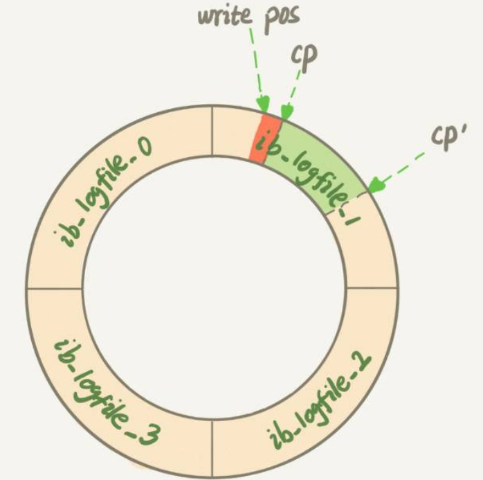
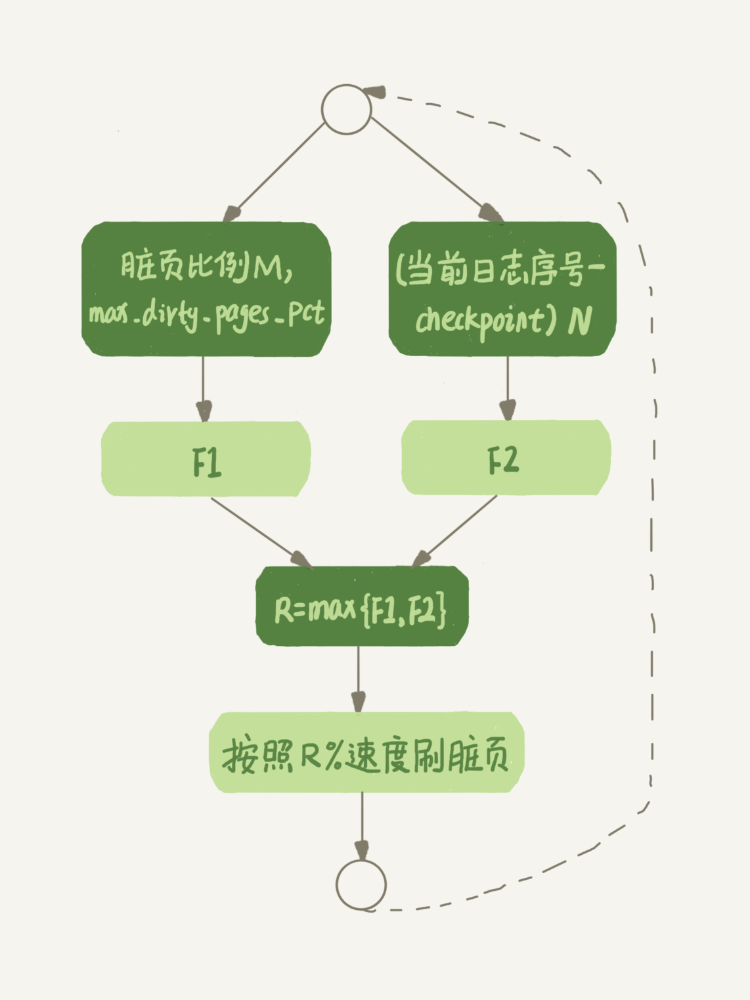

# 抖动的原因

一条SQL语句，正常执行的时候特别快，但是有时也不知道怎么回事，它就会变得特别慢，并且这样的场景很难复现，它不只随机，而且持续时间还很短。

## SQL语句变慢的原因

InnoDB在执行更新语句时，在更新内存写完redo log后，就返回给客户端，本次更新成功。MySQL之后会在某个时间点把内存里的数据写入磁盘，即执行`flush`过程。在`flush`前，内存和磁盘上的数据是不一致的。

**当内存数据页跟磁盘数据页内容不一致的时候，称这个内存页为“脏页”。**

**内存数据写入到磁盘后，内存和磁盘上的数据页的内容就一致了，称为“干净页”**。

不论是脏页还是干净页，都在内存中。

平时执行很快的更新操作，其实就是在写内存和日志，而MySQL偶尔“抖”一下的那个瞬间，可能就是在刷脏页（flush）。

### 触发flush的场景

* **redo log写满**了，这时候系统会停止所有更新操作，把checkpoint往前推进，redo log留出空间可以继续写。 
   checkpoint在往前推移时，同时将cp与cp’两个点之间的日志（浅绿色部分），对应的所有脏页都flush到磁盘上。之后，图中从write pos到CP’之间就是可以再写入的redo log的区域。
* **系统内存不足**。当需要新的内存页，而内存不够用的时候，就要淘汰一些数据页，空出内存给别的数据页使用。如果淘汰的是“脏页”，就要先将脏页写到磁盘。

  这时候并不能直接把内存淘汰掉，然后等到下次需要请求的时候，从磁盘读入数据页，再拿redo log出来应用。这里其实是从性能考虑的。如果刷脏页一定会写盘，就保证了每个数据页有两种状态：

  * 一种是内存里存在，内存里就肯定是正确的结果，直接返回；
  * 另一种是内存里没有数据，就可以肯定数据文件上是正确的结果，读入内存后返回。

  这样的效率最高。

* **MySQL认为系统“空闲”的时候**
* **shutdown的时候**

第三种情况是属于MySQL空闲时的操作，这时系统没什么压力，而第四种场景是数据库本来就要关闭了。这两种情况下，不会太关注“性能”问题。接下来主要分析前两种场景。

redo log写满了，要flush脏页，这种情况是InnoDB要尽量避免的。因为出现这种情况的时候，整个系统就不能再接受更新了，所有的更新都必须堵住。如果你从监控上看，这时候更新数会跌为0。

内存不够用了，要先将脏页写到磁盘，这种情况其实是常态。**InnoDB用缓冲池（buffer pool）管理内存，缓冲池中的内存页有三种状态：**

* 还没有使用的
* 使用了并且是干净页
* 使用了并且是脏页

**InnoDB的策略是尽量使用内存**，因此对于一个长时间运行的库来说，未被使用的页面很少。

而当要读入的数据页没有在内存的时候，就必须到缓冲池中申请一个数据页。这时候只能把最久不使用的数据页从内存中淘汰掉：如果要淘汰的是一个干净页，就直接释放出来复用；但如果是脏页呢，就必须将脏页先刷到磁盘，变成干净页后才能复用。

> 一旦一个查询请求需要在执行过程中先flush掉一个脏页时，这个查询就可能要比平时慢了。而MySQL中的**连坐机制**，可能让查询会更慢：在准备刷一个脏页的时候，如果这个数据页旁边的数据页刚好是脏页，就会把这个“邻居”也带着一起刷掉；而且这个把“邻居”拖下水的逻辑还可以继续蔓延，也就是对于每个邻居数据页，如果跟它相邻的数据页也还是脏页的话，也会被放到一起刷。
>
> 在InnoDB中，`innodb_flush_neighbors`参数就是用来控制这个行为的，值为1的时候会有上述的“连坐”机制，值为0时表示不找邻居，自己刷自己的。
>
> 找“邻居”这个优化在机械硬盘时代是很有意义的，可以减少很多随机IO。机械硬盘的随机IOPS一般只有几百，相同的逻辑操作减少随机IO就意味着系统性能的大幅度提升。
>
> 而如果使用的是SSD这类IOPS比较高的设备的话，建议把`innodb_flush_neighbors`的值设置成0。因为这时候IOPS往往不是瓶颈，而“只刷自己”，就能更快地执行完必要的刷脏页操作，减少SQL语句响应时间。
>
> 在MySQL 8.0中，`innodb_flush_neighbors`参数的默认值已经是0了。

所以，刷脏页虽然是常态，但是出现以下这两种情况，都是会明显影响性能的：

1. 一个查询要淘汰的脏页个数太多，会导致查询的响应时间明显变长；
2. 日志写满，更新全部堵住，写性能跌为0，这种情况对敏感业务来说，是不能接受的。

所以，InnoDB需要有控制脏页比例的机制，来尽量避免上面的这两种情况。

## InnoDB刷脏页的策略

首先，要正确地设置`innodb_io_capacity`这个参数，以告诉InnoDB所在主机的IO能力，这样InnoDB才能知道需要全力刷脏页的时候，可以刷多快。

这个值建议设置成磁盘的IOPS。磁盘的IOPS可以通过fio这个工具来测试：

```text
$ fio -filename=$filename -direct=1 -iodepth 1 -thread -rw=randrw -ioengine=psync -bs=16k -size=500M -numjobs=10 -runtime=10 -group_reporting -name=mytest
```

> 如果没有正确设置这个参数，可能会导致MySQL的写入速度很慢，TPS很低，但是数据库主机的IO压力并不大。

**控制刷脏页的速度，参考的因素：**

* 平时不能一直处于全力刷，毕竟磁盘能力不能只用来刷脏页，还需要服务用户请求。
* 脏页比例。参数`innodb_max_dirty_pages_pct`是脏页比例上限，默认值是75%。InnoDB会根据当前的脏页比例（M），算出一个范围在0到100之间的数字，计算这个数字的伪代码类似这样：

  ```text
  F1(M) {
    if M >= innodb_max_dirty_pages_pct then
        return 100;
    return 100*M/innodb_max_dirty_pages_pct;
  }
  ```

* redo log写盘速度。InnoDB每次写入的日志都有一个序号，假设当前写入的序号跟checkpoint对应的序号之间的差值为N。InnoDB会根据这个N算出一个范围在0到100之间的数字，这个计算公式可以记为$F2\(N\)$。$F2\(N\)$算法比较复杂，不过N越大，算出来的值就越大。

**根据上述算得的F1\(M\)和F2\(N\)两个值，取其中较大的值记为R，之后引擎就可以按照innodb\_io\_capacity定义的能力乘以R%来控制刷脏页的速度。**



## 预防抖动

InnoDB会在后台刷脏页，而刷脏页的过程是要将内存页写入磁盘。所以，无论是你的查询语句在需要内存的时候可能要求淘汰一个脏页，还是由于刷脏页的逻辑会占用IO资源并可能影响到了你的更新语句，都可能是造成MySQL“抖”了一下的原因。

要尽量避免这种情况，就要合理地设置`innodb_io_capacity`的值，并且**平时要多关注脏页比例，不要让它经常接近75%**。脏页比例计算：

```text
mysql> select VARIABLE_VALUE into @a from global_status where VARIABLE_NAME = 'Innodb_buffer_pool_pages_dirty';
select VARIABLE_VALUE into @b from global_status where VARIABLE_NAME = 'Innodb_buffer_pool_pages_total';
select @a/@b;
```

## 思考题

一个内存配置为128GB、innodb\_io\_capacity设置为20000的大规格实例，正常会将redo log设置成4个1GB的文件。

但如果在配置的时候不慎将redo log设置成了1个100M的文件，会发生什么情况呢？又为什么会出现这样的情况呢？

每次事务提交都要写redo log，如果设置太小，很快就会被写满，这个“环”将很快被写满，write pos一直追着CP。


这时候系统不得不停止所有更新，去推进checkpoint。

这时，你看到的现象就是**磁盘压力很小，但是数据库出现间歇性的性能下跌。**

在这种情况下，连change buffer的优化也失效了。因为checkpoint一直要往前推，这个操作就会触发merge操作，然后又进一步地触发刷脏页操作。

