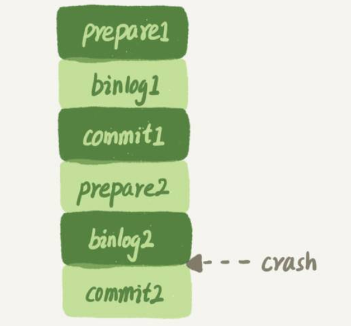
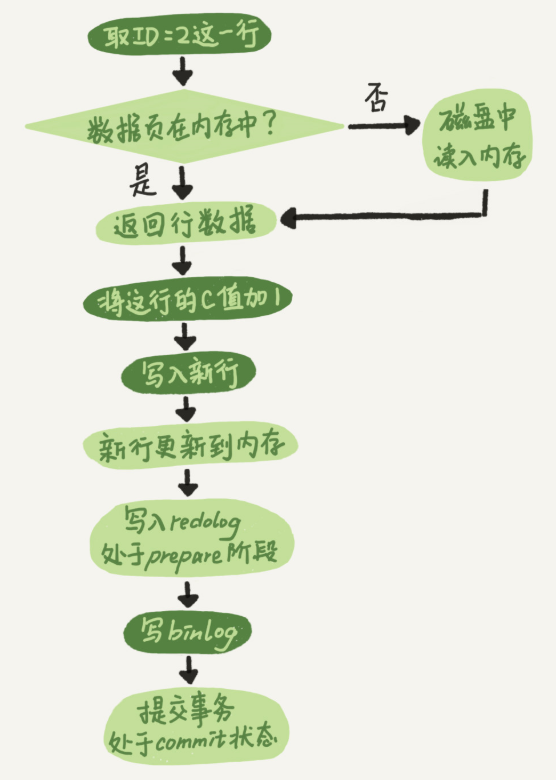
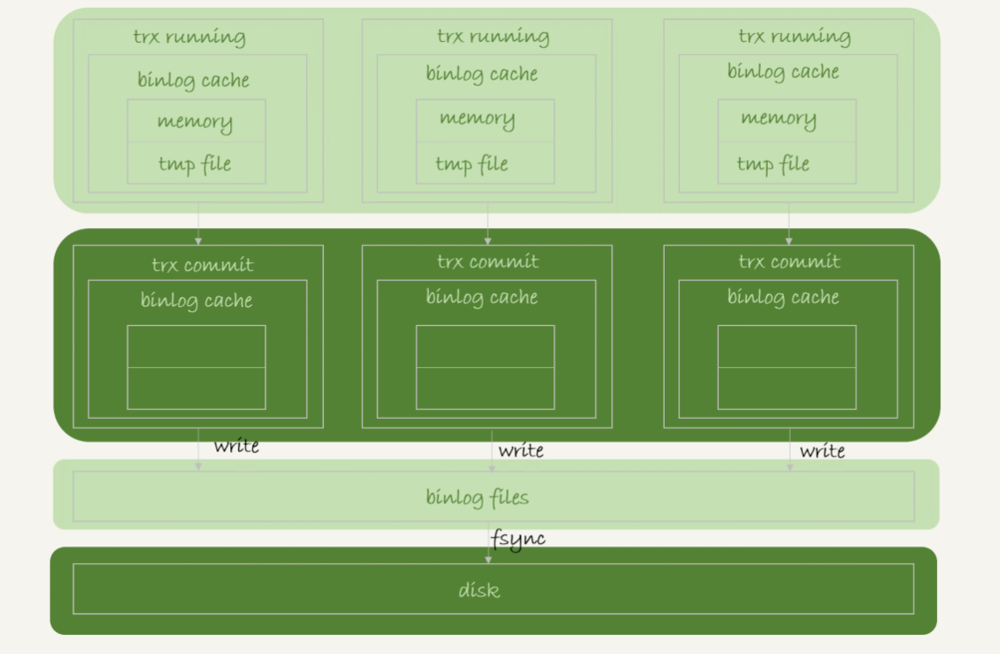
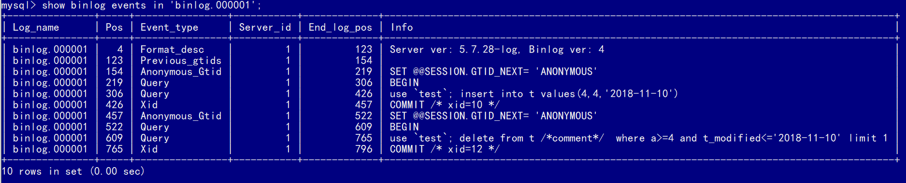
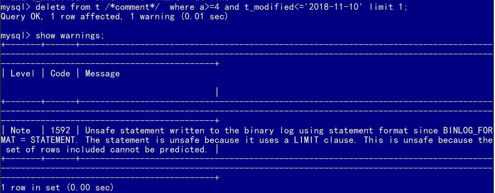

# binlog

MySQL整体来看，由Server层和存储引擎层组成。`redo log`是InnoDB引擎特有的日志，而Server层也有自己的日志，称为binlog。

> 之所以会有两份日志，是因为最开始MySQL没用InnoDB引擎，MySQL自带的引擎是MyISAM，而MyISAM没有crash-safe的能力，binlog日志也只能用于归档。
>
> InnoDB是另一个公司以插件形式引入MySQL的，以实现crash-safe能力，即通过redo log实现。

`sync_binlog`这个参数设置成1的时候，表示每次事务的`binlog`都持久化到磁盘，设置成1可以保证MySQL异常重启之后`binlog`不丢失。

## 不支持崩溃恢复



假设只用binlog通过两阶段提交来实现崩溃恢复，这是不可行的，因为binlog没有能力恢复“数据页”。

如果在图中标的位置，也就是binlog2写完了，但是整个事务还没有commit的时候，MySQL发生了crash。

重启后，引擎内部事务2会回滚，然后应用binlog2可以补回来；但是对于事务1来说，系统已经认为提交完成了，不会再应用一次binlog1。

因为InnoDB引擎使用的是WAL技术，执行事务的时候，写完内存和日志，可能还没写磁盘，事务就算完成了。如果之后崩溃，要依赖于日志来恢复数据页。

也就是说在图中这个位置发生崩溃的话，事务1也是可能丢失了的，而且是数据页级的丢失。此时，binlog里面并没有记录数据页的更新细节，是补不回来的。而redo log会有checkpoint和write pos，两者间的操作都是未写入磁盘的。

如果优化一下binlog的内容，让它记录数据页的更改，其实这就是又做了一个redo log出来。

## 存在的必要性

如果只从崩溃恢复的角度来讲是可以把binlog关掉的，这样就没有两阶段提交了，但系统依然是crash-safe的。

不过，binlog有着redo log无法替代的功能。

* 归档。redo log是循环写，写到末尾是要回到开头继续写的。这样的历史日志没法保留，redo log也就起不到归档的作用。
* MySQL系统依赖于binlog。binlog作为MySQL一开始就有的功能，被用在了很多地方。其中，MySQL系统高可用的基础，就是binlog复制。
* 一些公司有异构系统（比如一些数据分析系统），这些系统就靠消费MySQL的binlog来更新自己的数据。关掉binlog的话，这些下游系统就没法输入了。

## 与redo log的区别

* `redo log`是InnoDB引擎特有的；
* `binlog`是MySQL的Server层实现的，所有引擎都可以使用。
* `redo log`是物理日志，记录的是“在某个**数据页**上做了什么修改”
* `binlog`是逻辑日志，记录的是这个语句的原始逻辑，比如“给`ID=2`这一行的c字段加1 ”
* `redo log`是循环写的，空间固定会用完
* `binlog`是可以追加写入的。“追加写”是指`binlog`文件写到一定大小后会切换到下一个，并不会覆盖以前的日志。

在执行更新语句`update T set c=c+1 where ID=1;`时，流程如下：

1. 执行器先找引擎取`ID=1`这一行。ID是主键，引擎直接用树搜索找到这一行。如果`ID=1`这一行所在的数据页本来就在内存中，就直接返回给执行器；否则，需要先从磁盘读入内存，然后再返回。
2. 执行器拿到引擎给的行数据，把这个值加上1，比如原来是N，现在就是N+1，得到新的一行数据，再调用引擎接口写入这行新数据。
3. 引擎将这行新数据更新到内存中，同时将这个更新操作记录到`redo log`里面，此时`redo log`处于prepare状态。然后告知执行器执行完成了，随时可以提交事务。
4. 执行器生成这个操作的`binlog`，并把`binlog`写入磁盘。
5. 执行器调用引擎的提交事务接口，引擎把刚刚写入的`redo log`改成提交（commit）状态，更新完成。



图中浅色框表示是在InnoDB内部执行的，深色框表示是在执行器中执行的。

最后三步将`redo log`的写入拆成了两个步骤：prepare和commit，这就是"两阶段提交"。

> `commit`语句是MySQL语法中，用于提交一个事务的命令。一般跟`begin/start transaction`配对使用。
>
> 图中最后一步的`commit`步骤，指的是事务提交过程中的一个小步骤，也是最后一步。当这个步骤执行完成后，这个事务就提交完成了。
>
> 因此，`commit`语句执行的时候，会包含这个`commit`步骤。
>
> 这个例子里，没有显式地开启事务，因此这个`update`语句自己就是一个事务，在执行完成后提交事务时，就会用到这个“commit步骤“。

## 写入机制

binlog的写入逻辑比较简单：事务**执行过程中**，先把日志写到binlog cache，事务**提交的时候**，再把binlog cache写到binlog文件中。

**一个事务的binlog是不能被拆开的**，因此不论这个事务多大，也要确保一次性写入。这就涉及到了binlog cache的保存问题。

系统给binlog cache分配了一片内存，**每个线程一个**，参数 `binlog_cache_size`用于控制单个线程内binlog cache所占内存的大小。如果超过了这个参数规定的大小，就要暂存到磁盘。

事务提交的时候，执行器把binlog cache里的完整事务写入到binlog中，并清空binlog cache。



每个线程有自己binlog cache，但是共用同一份binlog文件。

* 图中的`write`，是指把日志写入到文件系统的page cache，并没有把数据持久化到磁盘，所以速度比较快。
* 图中的`fsync`，才是将数据持久化到磁盘的操作。一般情况下，我们认为`fsync`才占磁盘的IOPS。

`write`和`fsync`的时机，是由参数`sync_binlog`控制的：

1. `sync_binlog=0`的时候，表示每次提交事务都只`write`，不`fsync`；
2. `sync_binlog=1`的时候，表示每次提交事务都会执行`fsync`；
3. `sync_binlog=N(N>1)`的时候，表示每次提交事务都`write`，但累积N个事务后才`fsync`。

在出现IO瓶颈的场景里，将`sync_binlog`设置成一个比较大的值，可以提升性能。在实际的业务场景中，考虑到丢失日志量的可控性，一般不建议将这个参数设成0，比较常见的是将其设置为100~1000中的某个数值。

将`sync_binlog`设置为N的风险是：如果主机发生异常重启，会丢失最近N个事务的binlog日志。

## 三种格式

通过下面的语句对三种格式进行介绍。

```
mysql> CREATE TABLE `t` (
  `id` int(11) NOT NULL,
  `a` int(11) DEFAULT NULL,
  `t_modified` timestamp NOT NULL DEFAULT CURRENT_TIMESTAMP,
  PRIMARY KEY (`id`),
  KEY `a` (`a`),
  KEY `t_modified`(`t_modified`)
) ENGINE=InnoDB;

mysql> insert into t values(1,1,'2018-11-13');
insert into t values(2,2,'2018-11-12');
insert into t values(3,3,'2018-11-11');
insert into t values(4,4,'2018-11-10');
insert into t values(5,5,'2018-11-09');
```

### STATEMENT

先设置binlog的格式：

```
mysql> SET SESSION binlog_format = 'STATEMENT';
```

> ```
> mysql> show global variables like 'log_bin';
> ```
>
> 如果是OFF，那么就需要修改`my.ini`文件，在`[mysqld]`部分加入下面的语句：
>
> ```
> log_bin=C:/ProgramData/MySQL/MySQL Server 5.7/Data/binlog
> log_bin_index=C:/ProgramData/MySQL/MySQL Server 5.7/Data/binlog.index
> expire_logs_days=7
> server_id=0001
> binlog_format=STATEMENT
> ```

```
mysql> delete from t /*comment*/  where a>=4 and t_modified<='2018-11-10' limit 1;
```

> 用MySQL客户端执行该语句时，要记得加`-c`参数，否则客户端会自动去掉注释。

查看binlog中的内容：



可以发现，**binlog里面记录的是SQL语句的原文**。

- 第七行`SET @@SESSION.GTID_NEXT='ANONYMOUS’`
- 第八行是一个`BEGIN`，跟第四行的`COMMIT`对应，表示中间是一个事务；
- 倒数第二行就是真实执行的语句了。
  在真实执行的`delete`命令之前，还有一个`use ‘test’`命令。这条命令不是我们主动执行的，而是MySQL根据当前要操作的表所在的数据库，自行添加的。这样做可以保证日志传到备库去执行的时候，不论当前的工作线程在哪个库里，都能够正确地更新到`test`库的表`t`。
  `use 'test’`命令之后的`delete `语句，就是我们输入的SQL原文了。可以看到，binlog“忠实”地记录了SQL命令，甚至连注释也一并记录了。
- 最后一行是一个`COMMIT`，里面写着`xid=12`。

其实在`delete`语句执行后，出现了一个warning：



当前binlog设置的是`statement`格式，并且语句中有`limit`，所以这个命令可能是unsafe的。因为`delete `带`limit`，很可能会出现**主备数据不一致**的情况。

1. 如果`delete`语句使用的是索引`a`，那么会根据索引`a`找到第一个满足条件的行，也就是说删除的是`a=4`这一行；
2. 但如果使用的是索引`t_modified`，那么删除的就是` t_modified='2018-11-09’`也就是`a=5`这一行。

由于`statement`格式下，记录到binlog里的是语句原文，因此可能会出现这样一种情况：在主库执行这条SQL语句的时候，用的是索引`a`；而在备库执行这条SQL语句的时候，却使用了索引`t_modified`。因此，MySQL认为这样写是有风险的。

### ROW

```
mysql> SET SESSION binlog_format = 'ROW';
mysql> delete from t /*comment*/  where a>=4 and t_modified<='2018-11-10' limit 1;
mysql> show binlog events in 'binlog.000001';
+---------------+------+----------------+-----------+-------------+---------------------------------+
| Log_name      | Pos  | Event_type     | Server_id | End_log_pos | Info                            |
+---------------+------+----------------+-----------+-------------+---------------------------------+
| binlog.000001 | 1709 | Anonymous_Gtid |         1 |        1774 | SET @@SESSION.GTID_NEXT=    
                                                                                    'ANONYMOUS'     |
| binlog.000001 | 1774 | Query          |         1 |        1854 | BEGIN                           |
| binlog.000001 | 1854 | Table_map      |         1 |        1901 | table_id: 108 (test.t)          |
| binlog.000001 | 1901 | Delete_rows    |         1 |        1949 | table_id: 108 flags: STMT_END_F |
| binlog.000001 | 1949 | Xid            |         1 |        1980 | COMMIT /* xid=23 */             |
```

与`statement`格式的binlog相比，前后的`BEGIN`和`COMMIT`是一样的。但是，`row`格式的binlog里没有了SQL语句的原文，而是替换成了两个event：

- `Table_map`：用于说明接下来要操作的表是`test`库的表`t`
- ``Delete_rows`：用于定义删除的行为

要看到详细的信息，还需要借助`mysqlbinlog`工具：

```
# -vv：把内容都解析出来
C:\ProgramData\MySQL\MySQL Server 5.7\Data>mysqlbinlog -vv binlog.000001 --start-position=1709
/*!50530 SET @@SESSION.PSEUDO_SLAVE_MODE=1*/;
/*!50003 SET @OLD_COMPLETION_TYPE=@@COMPLETION_TYPE,COMPLETION_TYPE=0*/;
DELIMITER /*!*/;
# at 4
#200425 21:53:26 server id 1  end_log_pos 123 CRC32 0x28979ce5  Start: binlog v 4, server v 5.7.28-log created 200425 21:53:26 at startup
# Warning: this binlog is either in use or was not closed properly.
ROLLBACK/*!*/;
BINLOG '
1kCkXg8BAAAAdwAAAHsAAAABAAQANS43LjI4LWxvZwAAAAAAAAAAAAAAAAAAAAAAAAAAAAAAAAAA
AAAAAAAAAAAAAAAAAADWQKReEzgNAAgAEgAEBAQEEgAAXwAEGggAAAAICAgCAAAACgoKKioAEjQA
AeWclyg=
'/*!*/;
# at 1709
#200425 22:16:47 server id 1  end_log_pos 1774 CRC32 0xbb30a40c         Anonymous_GTID  last_committed=5    sequence_number=6       rbr_only=yes
/*!50718 SET TRANSACTION ISOLATION LEVEL READ COMMITTED*//*!*/;
SET @@SESSION.GTID_NEXT= 'ANONYMOUS'/*!*/;
# at 1774
#200425 22:16:47 server id 1  end_log_pos 1854 CRC32 0x810e2139         Query   thread_id=2     exec_time=0 error_code=0
SET TIMESTAMP=1587824207/*!*/;
SET @@session.pseudo_thread_id=2/*!*/;
SET @@session.foreign_key_checks=1, @@session.sql_auto_is_null=0, @@session.unique_checks=1, @@session.autocommit=1/*!*/;
SET @@session.sql_mode=1344274432/*!*/;
SET @@session.auto_increment_increment=1, @@session.auto_increment_offset=1/*!*/;
/*!\C gbk *//*!*/;
SET @@session.character_set_client=28,@@session.collation_connection=28,@@session.collation_server=8/*!*/;
SET @@session.time_zone='SYSTEM'/*!*/;
SET @@session.lc_time_names=0/*!*/;
SET @@session.collation_database=DEFAULT/*!*/;
BEGIN
/*!*/;
# at 1854
#200425 22:16:47 server id 1  end_log_pos 1901 CRC32 0x6cb95e95         Table_map: `test`.`t` mapped to number 108
# at 1901
#200425 22:16:47 server id 1  end_log_pos 1949 CRC32 0x5211c9d9         Delete_rows: table id 108 flags: STMT_END_F

BINLOG '
T0akXhMBAAAALwAAAG0HAAAAAGwAAAAAAAEABHRlc3QAAXQAAwMDEQEAApVeuWw=
T0akXiABAAAAMAAAAJ0HAAAAAGwAAAAAAAEAAgAD//gEAAAABAAAAFvlrwDZyRFS
'/*!*/;
### DELETE FROM `test`.`t`
### WHERE
###   @1=4 /* INT meta=0 nullable=0 is_null=0 */
###   @2=4 /* INT meta=0 nullable=1 is_null=0 */
###   @3=1541779200 /* TIMESTAMP(0) meta=0 nullable=0 is_null=0 */
# at 1949
#200425 22:16:47 server id 1  end_log_pos 1980 CRC32 0x496f1327         Xid = 23
COMMIT/*!*/;
SET @@SESSION.GTID_NEXT= 'AUTOMATIC' /* added by mysqlbinlog */ /*!*/;
DELIMITER ;
# End of log file
/*!50003 SET COMPLETION_TYPE=@OLD_COMPLETION_TYPE*/;
/*!50530 SET @@SESSION.PSEUDO_SLAVE_MODE=0*/;
```

- `server id 1`，表示这个事务是在`server_id=1`的数据库上执行的

- 每个event都有CRC32的值，这是因为参数`binlog_checksum`设置成了CRC32。

- `Table_map event`显示了接下来要打开的表，map到数字108。

  这条SQL语句只操作了一张表，如果要操作多张表，每个表都有一个对应的`Table_map event`、都会map到一个单独的数字，用于区分对不同表的操作。

- `binlog_row_image`的默认配置是FULL，因此`Delete_event`里面，包含了删掉的行的所有字段的值。如果把`binlog_row_image`设置为MINIMAL，则只会记录必要的信息，在这个例子里，就是只会记录`id=4`这个信息。

- 最后的`Xid = 23`，表示事务被正确地提交了。

当`binlog_format`使用`row`格式的时候，binlog里面记录了真实删除行的主键`id`，这样binlog传到备库去的时候，就肯定会删除`id=4`的行，不会有主备删除不同行的问题。

### MIXED

这种格式是前两种格式的混合，它存在的意义是什么呢？

因为有些`statement`格式的binlog可能会导致主备不一致，所以要使用`row`格式。但**`row`格式的缺点是，很占空间。**

比如用一个`delete`语句删掉10万行数据，用`statement`的话就是一个SQL语句被记录到binlog中，占用几十个字节的空间。但如果用`row`格式的binlog，就要把这10万条记录都写到binlog中。这样做，不仅会占用更大的空间，同时写binlog也要耗费IO资源，影响执行速度。

所以，MySQL就取了个折中方案，也就是有了`mixed`格式的binlog，MySQL自己会判断这条SQL语句是否可能引起主备不一致，如果有可能，就用`row`格式，否则就用`statement`格式。

**mixed格式可以利用statment格式的优点，同时又避免了数据不一致的风险。**因此，线上MySQL的binlog的格式至少得设置为mixed。

对于上面的`delete`语句，设置为mixed后，就会记录为row格式；而如果执行的语句去掉`limit 1`，就会记录为statement格式。

在`mixed`格式来执行下面的SQL语句，MySQL会把它记录为哪种格式呢？

```
mysql> insert into t values(10,10, now());
mysql> show binlog events;
+---------------+------+----------------+-----------+-------------+---------------------------------+
| Log_name      | Pos  | Event_type     | Server_id | End_log_pos | Info                            |
+---------------+------+----------------+-----------+-------------+---------------------------------+
| binlog.000001 | 1980 | Anonymous_Gtid |         1 |        2045 | SET @@SESSION.GTID_NEXT= 
                                                                                       'ANONYMOUS'  |
| binlog.000001 | 2045 | Query          |         1 |        2132 | BEGIN                           |
| binlog.000001 | 2132 | Query          |         1 |        2248 | use `test`; insert into t 
                                                                               values(10,10, now()) |
| binlog.000001 | 2248 | Xid            |         1 |        2279 | COMMIT /* xid=26 */             |
+---------------+------+----------------+-----------+-------------+---------------------------------+
```

MySQL用的是`statement`格式，那如果这个binlog过了1分钟才传给备库的话，那主备的数据不就不一致了吗？

用`mysqlbinlog`工具看看详细的日志：

```
C:\ProgramData\MySQL\MySQL Server 5.7\Data>mysqlbinlog -vv binlog.000001 --start-position=1980
......
BEGIN
/*!*/;
# at 2132
#200425 22:56:37 server id 1  end_log_pos 2248 CRC32 0x192851dd         Query   thread_id=2     exec_time=0     error_code=0
use `test`/*!*/;
SET TIMESTAMP=1587826597/*!*/;
insert into t values(10,10, now())
/*!*/;
# at 2248
#200425 22:56:37 server id 1  end_log_pos 2279 CRC32 0xb0fbe544         Xid = 26
COMMIT/*!*/;
......
```

原来binlog在记录event的时候，多记了一条命令：`SET TIMESTAMP=1546103491`。它用 `SET TIMESTAMP`命令约定了接下来的`now()`函数的返回时间。

通过这条`SET TIMESTAMP`命令，MySQL就确保了主备数据的一致性。不论这个binlog是1分钟之后被备库执行，还是3天后用来恢复这个库的备份，这个`insert`语句插入的行，值都是固定的。

因此，在重放binlog数据的时候，用`mysqlbinlog`解析出日志，之后不能只拷贝里面的statement语句出来执行。因为有些语句的执行结果是依赖于上下文命令的，直接执行的结果很可能是错误的。

用binlog来恢复数据的标准做法是，用 `mysqlbinlog`工具解析出来，然后把解析结果整个发给MySQL执行：

```
mysql> mysqlbinlog binlog.000001  --start-position=1980 --stop-position=2279 | mysql -h127.0.0.1 -P3306 -u$user -p$pwd;
```


### 完整性判断

一个事务的binlog是有完整格式的：

- statement格式的binlog，最后会有COMMIT；
- row格式的binlog，最后会有一个XID event。

在MySQL 5.6.2版本以后，还引入了`binlog-checksum`参数，用来验证binlog内容的正确性。对于binlog日志由于磁盘原因，可能会在日志中间出错的情况，MySQL可以通过校验checksum的结果来发现。所以，MySQL还是有办法验证事务binlog的完整性的。


