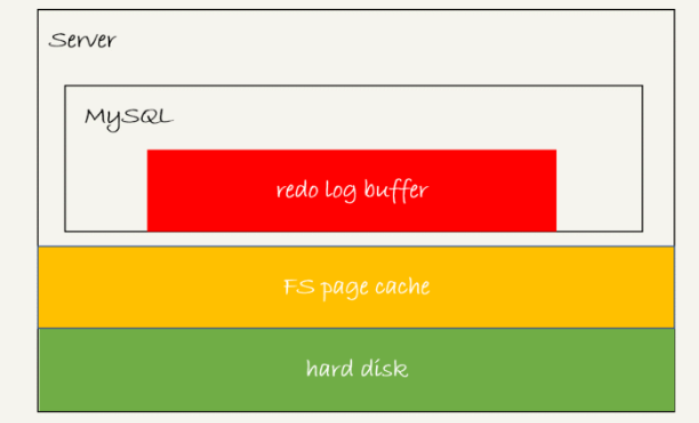

# redo log

当执行更新语句时，如果要同时写入磁盘，那么磁盘需要找到对应的记录，然后更新，对于单个更新操作，这个过程IO成本、查找成本比较高，降低了MySQL的运行效率。

因此，可以先将更新语句写入日志（追加方式比较快，且不需要打开日志文件的开销，日志文件句柄应该已经由某些线程控制了），（不忙的时候）再写磁盘，即**WAL技术**（Write-Ahead Logging）。

具体来说，当有一条记录需要更新的时候，InnoDB引擎就会先把记录写到`redo log`里面，并更新内存，这个时候更新就算完成了。同时，InnoDB引擎会在适当的时候，将这个操作记录更新到磁盘里面，而这个更新往往是在系统比较空闲的时候做。

不过，`redo log`的大小是有限制的，例如，可以配置为一组4个文件，每个文件大小为1GB，那么最多可以记录4GB的操作。写的方式是**从头开始写，写到末尾就又回到开头循环写**。


* `write pos`是当前记录的位置，一边写一边后移，写到第3号文件末尾后就回到0号文件开头。
* `checkpoint`是还未写入磁盘的操作的起点，也是往后推移并且循环的，后移时需要将该记录更新到磁盘。

`write pos`和`checkpoint`之间的空间可以用来记录新的操作，如果`write po`追上了 `checkpoint`，即当MySQL负载一直很高时，没空后移`checkpoint`，导致`redo log`写满了，那么这时就只能先停止对外的服务，先将`redo log`中的一部分更新到磁盘上，推进`checkpoint`，为接下来的更新腾出空间。

有了redo log，InnoDB就可以保证即使数据库发生异常重启，之前提交的记录都不会丢失，这个能力称为**crash-safe**。

`innodb_flush_log_at_trx_commit`这个参数设置成1的时候，表示每次事务的`redo log`都直接持久化到磁盘，设置成1可以保证MySQL异常重启之后数据不丢失。

## 大小设置

redo log太小的话，会导致很快就被写满，然后不得不强行刷redo log，这样WAL机制的能力就发挥不出来了。

所以，如果是现在常见的几个TB的磁盘的话，那就直接将redo log设置为4个文件、每个文件1GB。

## redo log buffer

在一个事务的更新过程中，日志是要写多次的。比如下面这个事务：

```text
mysql> begin;
mysql> insert into t1 ...
mysql> insert into t2 ...
mysql> commit;
```

这个事务要往两个表中插入记录，插入数据的过程中，生成的日志都得先保存起来，但又不能在还没commit的时候就直接写到redo log文件里。

因此这个阶段的日志都是写到redo log buffer，它是一块内存，用来先存redo日志。也就是说，在执行第一个`insert`的时候，数据的内存被修改了\(change buffer\)，相应的日志写入到了redo log buffer。

但是，真正把日志写到redo log磁盘文件（文件名是 ib\_logfile+数字），是在执行`commit`语句的时候做的。就算在`commit`执行前crash了，也没有关系，因为之前修改的数据页都是内存中的，redo log也没有写入到redo log磁盘文件，崩溃了就没了，磁盘的数据并没有被修改。

> 这里说的事务执行过程中不会“主动去刷盘”，以减少不必要的IO消耗。
>
> 但是可能会出现“被动写入磁盘”，比如内存不够、其他事务提交等情况。这种情况下是否会将包含未提交事务的数据变更的数据页写入磁盘？

单独执行一个更新语句的时候，InnoDB会自己启动一个事务，在语句执行完成的时候提交。过程跟上面是一样的，只不过是“压缩”到了一个语句里面完成。

## 写入机制

事务在执行过程中，生成的redo log是要先写到redo log buffer的，等到**事务提交时才持久化到磁盘**。**所有线程共享同一个redo log buffer。**

redo log buffer里的内容，不需要每次在生成时就持久化，因为此时事务还未提交，如果这时MySQL异常重启，这部分log丢失并不会带来影响。

但是在事务还没提交的时候，redo log buffer中的部分日志有可能被持久化到磁盘。

> **redo log的三种状态**
>
> 
>
> * 红色部分：存在redo log buffer中，物理上是在MySQL进程内存中
> * 黄色部分：写到磁盘\(`write`\)，但是没有持久化（`fsync`\)，物理上是在文件系统的page cache里面
> * 绿色部分：持久化到磁盘，对应的是hard disk

日志写到redo log buffer是很快的，`wirte`到page cache也差不多，但是持久化到磁盘的速度就慢多了。

为了控制redo log的写入策略，InnoDB提供了`innodb_flush_log_at_trx_commit`参数，它有三种可能取值：

* `0`：每次事务提交时都只是把redo log留在redo log buffer中;
* `1`：表示每次事务提交时都将redo log直接持久化到磁盘；
* `2`：表示每次事务提交时都只是把redo log写到page cache。

InnoDB有一个后台线程，每隔1秒，就会把redo log buffer中的日志，调用`write`写到文件系统的page cache，然后调用`fsync`持久化到磁盘。

事务执行中间过程的redo log也是直接写在redo log buffer中的，这些redo log也会被后台线程一起持久化到磁盘。也就是说，一个没有提交的事务的redo log，也是可能已经持久化到磁盘的。

除了后台线程每秒一次的轮询操作外，还有两种场景会让一个没有提交的事务的redo log写入到磁盘中。

1. **redo log buffer占用的空间即将达到 `innodb_log_buffer_size`一半的时候，后台线程会主动写盘。**注意，由于这个事务并没有提交，所以这个写盘动作只是`write`，而没有调用`fsync`，也就是只留在了文件系统的page cache。
2. **并行的事务提交的时候，顺带将这个事务的redo log buffer持久化到磁盘。**假设一个事务A执行到一半，已经写了一些redo log到buffer中，这时候有另外一个线程的事务B提交，如果`innodb_flush_log_at_trx_commit`设置的是1，那么按照这个参数的逻辑，事务B要把redo log buffer里的日志全部持久化到磁盘。这时候，就会带上事务A在redo log buffer里的日志一起持久化到磁盘。

两阶段提交的时候，时序上redo log先prepare， 再写binlog，最后再把redo log commit。

如果`innodb_flush_log_at_trx_commit`设置成1，那么redo log在prepare阶段就要持久化一次，因为有一个崩溃恢复逻辑是要依赖于prepare 的redo log，再加上binlog来恢复的。

每秒一次后台轮询刷盘，再加上崩溃恢复这个逻辑，InnoDB就认为redo log在commit的时候就不需要`fsync`了，只会write到文件系统的page cache中就够了。

## 数据更新到磁盘

正常运行中的实例，数据写入后的最终落盘，是从redo log更新过来的还是从buffer pool更新过来的呢？

1. 如果是正常运行的实例的话，数据页被修改以后，跟磁盘的数据页不一致，称为脏页。最终数据落盘，就是把内存中的数据页写盘。这个过程，甚至与redo log毫无关系。
2. 在崩溃恢复场景中，InnoDB如果判断到一个数据页可能在崩溃恢复的时候丢失了更新，就会将它读到内存，然后让redo log更新内存内容。更新完成后，内存页变成脏页，就回到了第一种情况的状态。