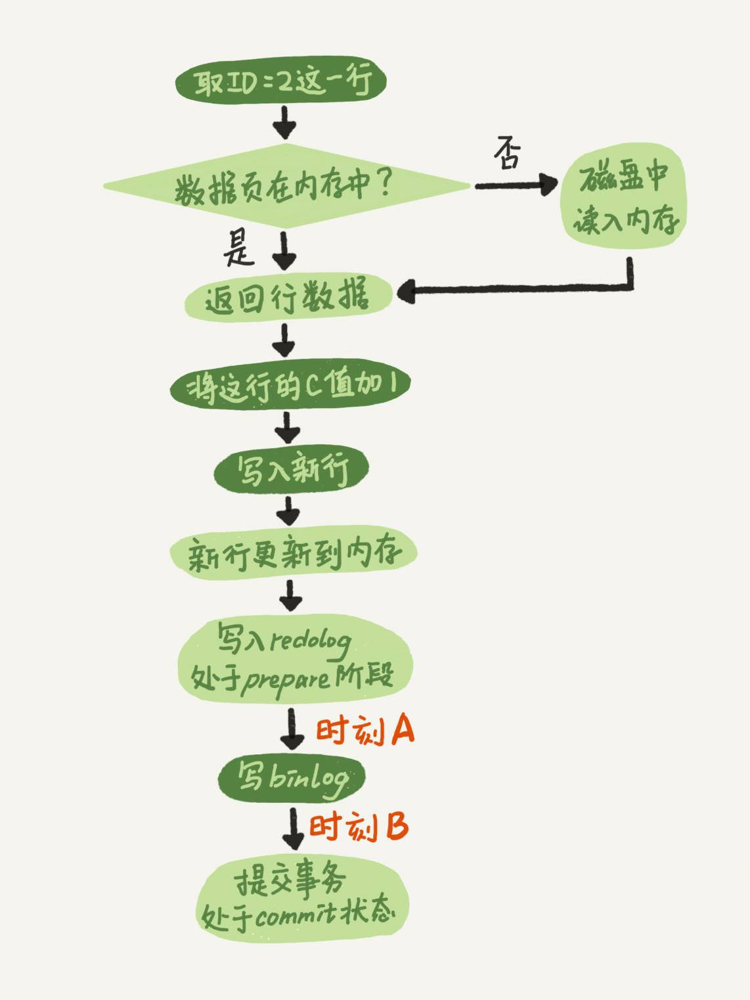

# 两阶段提交

为什么要采用两阶段提交？

如果日志不采用两阶段提交，由于`redo log`和`binlog`是两个独立的逻辑，一个是Server层，一个是存储引擎层。考虑先写`redo log`再写`binlog`，或者相反的顺序，假设当前有一条更新语句，将`ID=1`的行的字段`c`加一（0-&gt;1），如果写完第一个日志后，第二个日志还没写完就发生了crash，这两种顺序的写法会产生什么后果呢？

- **先写redo log后写binlog**。假设在`redo log`写完，`binlog`还没有写完的时候，MySQL进程异常重启。由于`redo log`提供了crash-safe的能力，系统即使崩溃，仍然能够把数据恢复回来，所以恢复后这一行`c`的值是1。

  但是由于`binlog`没写完就crash了，这时候`binlog`里面就没有记录这个语句。因此，之后备份日志的时候，存起来的`binlog`里面就没有这条语句。

  然后你会发现，如果需要用这个`binlog`来恢复临时库的话，由于备份恢复只与`binlog`相关，而这个语句的`binlog`丢失，这个临时库就会少了这一次更新，恢复出来的这一行`c`的值就是0，与原库的值不同。

- **先写binlog后写redo log**。如果在`binlog`写完之后crash，由于`redo log`还没写，而崩溃恢复读的是`redo log`，而不是`binlog`，导致崩溃恢复后这个事务无效，所以这一行`c`的值是0。但是`binlog`里面已经记录了“把c从0改成1”这个日志。所以，在之后用`binlog`来恢复的时候就多了一个事务出来，恢复出来的这一行`c`的值就是1，与原库的值不同。

因此，如果不使用“两阶段提交”，那么数据库的状态就有可能和用它的日志恢复出来的库的状态不一致。

## 异常重启的现象

崩溃恢复时的判断规则：

1. 如果redo log里面的事务是完整的，也就是已经有了prepare和commit**标识**，则直接提交；

2. 如果redo log里面的事务只有完整的prepare，则判断对应的事务binlog是否存在并完整：

   a. 如果是，则提交事务。因为已经存在binlog里了，会被从库使用，所以必须提交以保证主备数据一致性。

   b. 否则，回滚事务。

> **redo log与binlog如何建立关联？**
>
> 它们有一个共同的数据字段，叫XID。崩溃恢复的时候，会按顺序扫描redo log，如果碰到只有prepare、而没有commit的redo log，就拿着XID去binlog找对应的事务。

- 在时刻A，即写入redo log 处于prepare阶段之后、写binlog之前，发生了崩溃\(crash\)，由于此时binlog还没写，redo log也还没提交，所以崩溃恢复的时候，这个事务会回滚。这时候，binlog还没写，所以也不会传到备库。
- 在时刻B，即binlog写完，redo log还没commit前发生crash。根据恢复规则的2\(a\)，该事务会被提交。

