# 备份与恢复

对数据库备份和恢复是通过`binlog`实现的，`binlog`会记录所有的逻辑操作，并且是采用“追加写”的形式。备份系统中会保存最近的`binlog`，同时系统会定期做整库备份。这里的“定期”取决于系统的重要性，可以是一天一备，也可以是一周一备。

当需要恢复到指定的某一秒时，比如某天下午两点发现中午十二点有一次误删表，需要找回数据，那你可以这么做：

- 首先，找到最近的一次全量备份，如果运气好，可能就是昨天晚上的一个备份，从这个备份恢复到**临时库**
- 然后，从备份的时间点开始，将备份的`binlog`依次取出来，重放到中午误删表之前的那个时刻

这样临时库就跟误删之前的线上库一样了，然后就可以把表数据从临时库取出来，按需要恢复到线上库去。

## 备份周期的选择

一天一备与一周一备的对比：

- 在一天一备的模式里，最坏情况下只需要应用一天的`binlog`。
- 一周一备最坏情况就要应用一周的`binlog`了。

对应的系统指标是RTO（恢复目标时间）。

不过，更频繁全量备份需要消耗更多存储空间，所以这个RTO是成本换来的，需要根据业务重要性来评估了。


## 主备架构

### 基本原理

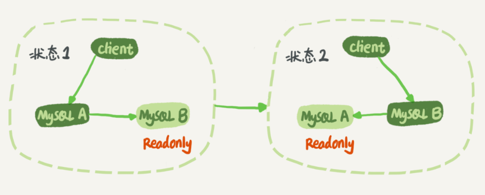

在状态1中，客户端的读写都直接访问节点A，而节点B是A的备库，只是将A的更新都同步过来，到本地执行。这样可以保持节点B和A的数据是相同的。

当需要切换的时候，就切成状态2。这时候客户端读写访问的都是节点B，而节点A是B的备库。

在状态1中，虽然节点B没有被直接访问，但是依然建议把节点B（也就是备库）设置成只读（readonly）模式。这样做，有以下几个考虑：

1. 有时候一些运营类的查询语句会被放到备库上去查，设置为只读可以防止误操作
2. 防止切换逻辑有bug，比如切换过程中出现双写，造成主备不一致
3. 可以用readonly状态，来判断节点的角色

> 备库设置为readonly了，还怎么执行主库传来的SQL语句？
>
> **readonly设置对超级(super)权限用户是无效的**，而用于同步更新的线程，就拥有超级权限。

以一个update语句在节点A的执行，看看**节点A到B这条线的内部流程**。

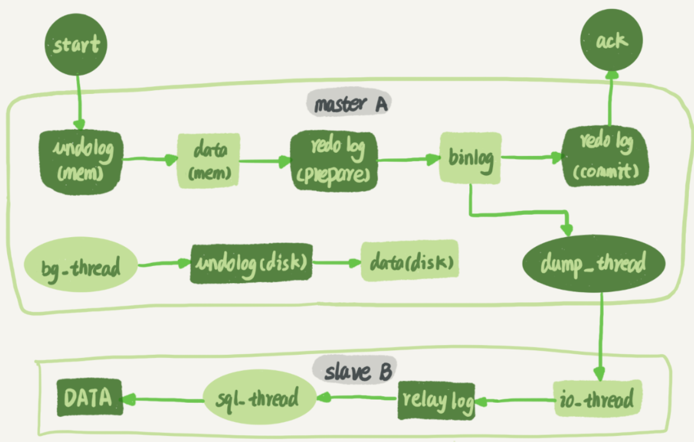

主库接收到客户端的更新请求后，执行内部事务的更新逻辑，同时写binlog。

备库B跟主库A之间维持了一个长连接。主库A内部有一个线程，专门用于服务备库B的这个长连接。一个事务日志同步的完整过程是这样的：

1. 在备库B上通过`change master`命令，设置主库A的IP、端口、用户名、密码，以及要从哪个位置开始请求binlog，这个位置包含文件名和日志偏移量。
2. 在备库B上执行`start slave`命令，这时候备库会启动两个线程：
   - `io_thread`：负责与主库建立连接
   - `sql_thread`
3. 主库A校验完用户名、密码后，开始按照备库B传过来的位置，从本地读取binlog，发给B。
4. 备库B拿到binlog后，写到本地文件，称为中转日志（relay log）。
5. sql_thread读取中转日志，解析出日志里的命令，并执行。后来引入了多线程复制方案，sql_thread演化成为了多个线程。


### binlog格式的选择

现在越来越多的场景要求把MySQL的binlog格式设置成`row`。最直观的理由是便于**恢复数据**，接下来分别从`delete`、`insert`和`update`这三种SQL语句的角度，来看看数据恢复的问题。

- 如果执行的是`delete`语句，`row`格式的binlog会把**被删行的整行信息**保存起来。所以，如果你在执行完一条`delete`语句以后，发现删错数据了，可以直接把binlog中记录的`delete`语句转成`insert`，把被错删的数据插入回去就可以恢复了。
- 如果执行错了`insert`语句，在`row`格式下，`insert`语句的binlog里会记录**所有的字段信息**，这些信息可以用来精确定位刚刚被插入的那一行。这时，直接把`insert`语句转成`delete`语句，删除掉这被误插入的一行数据就可以了。
- 如果执行的是`update`语句，binlog里面会记录**修改前整行的数据和修改后的整行数据**。所以，如果你误执行了`update`语句的话，只需要把这个event前后的两行信息对调一下，再去数据库里面执行，就能恢复这个更新操作了。

### 循环复制问题

上面介绍了M-S结构，在实际生产中使用比较多的是双M结构：

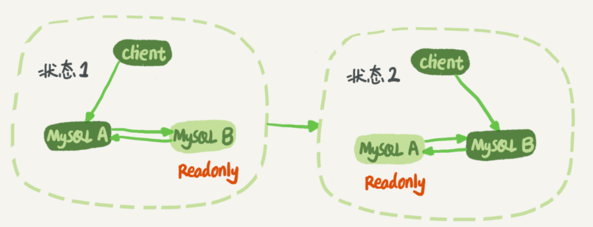

双M结构和M-S结构的区别只是多了一条线，即：节点A和B之间总是互为主备关系。这样在切换的时候就不用再修改主备关系。

但是，双M结构还有一个问题需要解决。

业务逻辑在节点A上更新了一条语句，然后再把生成的binlog 发给节点B，节点B执行完这条更新语句后也会生成binlog。（把参数`log_slave_updates`设置为on，表示备库执行relay log后生成binlog）。

那么，如果节点A同时是节点B的备库，相当于又把节点B新生成的binlog拿过来执行了一次，然后节点A和B间，会不断地循环执行这个更新语句，也就是循环复制了。

从前面binlog的详细信息中可以看到，MySQL在binlog中记录了这个命令第一次执行时所在实例的server id，可以利用它来解决两个节点间的循环复制的问题：

1. 规定两个库的server id必须不同，如果相同，则它们之间不能设定为主备关系；
2. 一个备库接到binlog并在重放的过程中，**生成与原binlog的server id相同的新的binlog**；
3. 每个库在收到从自己的主库发过来的日志后，先判断server id，如果跟自己的相同，表示这个日志是自己生成的，就直接丢弃这个日志。

按照这个逻辑，如果我们设置了双M结构，日志的执行流就会变成这样：

1. 从节点A更新的事务，binlog里面记的都是A的server id；
2. 传到节点B执行一次以后，节点B生成的binlog 的server id也是A的server id；
3. 再传回给节点A，A判断到这个server id与自己的相同，就不会再处理这个日志。所以，死循环在这里就断掉了。

#### 双M结构

在某些场景下，双M结构还是会发生循环复制：

- 在一个主库更新事务后，用命令`set global server_id=x`修改了server_id。等日志再传回来的时候，发现server_id跟自己的server_id不同，就只能执行了。
- 有三个节点的时候，trx1是在节点 B执行的，因此binlog上的server_id就是B，binlog传给节点 A，然后A和A’搭建了双M结构，就会出现循环复制。
  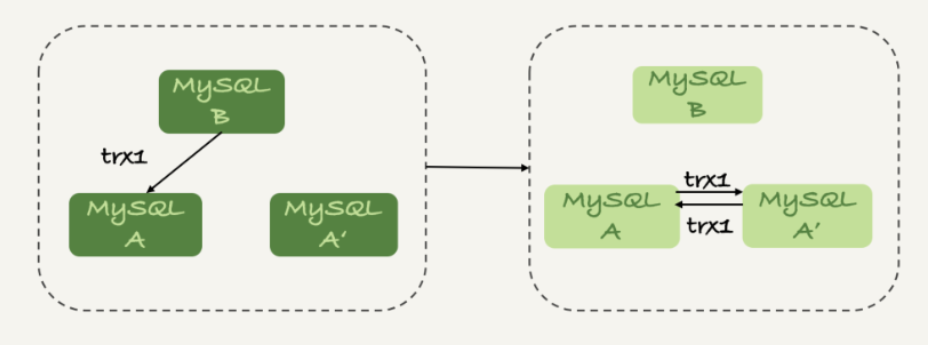

这种三节点复制的场景，做数据库迁移的时候会出现。如果出现了循环复制，可以在A或者A’上，执行如下命令：

```
stop slave；
CHANGE MASTER TO IGNORE_SERVER_IDS=(server_id_of_B);
start slave;
```

这样这个节点收到日志后就不会再执行。过一段时间后，再执行下面的命令把这个值改回来。

```
stop slave；
CHANGE MASTER TO IGNORE_SERVER_IDS=();
start slave;
```


## 高可用

正常情况下，只要主库执行更新生成的所有binlog，都可以传到备库并被正确地执行，备库就能达到跟主库一致的状态，这就是最终一致性。但是，MySQL要提供高可用能力，只有最终一致性是不够的。

### 主备延迟

与数据同步有关的时间点主要有三个：

1. 主库A执行完成一个事务，写入binlog，把这个时刻记为T1;
2. 之后传给备库B，把备库B接收完这个binlog的时刻记为T2;
3. 备库B执行完成这个事务，把这个时刻记为T3。

所谓主备延迟，就是同一个事务，**在备库执行完成的时间和主库执行完成的时间之间的差值**，也就是T3-T1。

> 在网络正常的时候，日志从主库传给备库所需的时间是很短的，即T2-T1的值是非常小的。
>
> 网络正常情况下，主备延迟的主要来源是备库接收完binlog和执行完这个事务之间的时间差。

备库上执行`show slave status`命令，结果里面的`seconds_behind_master`，就表示当前备库延迟了多少秒。

`seconds_behind_master`计算的就是T3 - T1，它的计算方法是这样的：

1. 每个事务的binlog 里面都有一个时间字段，用于记录主库上写入的时间；
2. 备库取出当前正在执行的事务的时间字段的值，计算它与当前系统时间的差值，得到`seconds_behind_master`。

> 如果主备库机器的系统时间设置不一致，会不会导致主备延迟的值不准？
>
> 不会。因为，备库连接到主库的时候，会通过执行`SELECT UNIX_TIMESTAMP()`函数来获得当前主库的系统时间。如果这时候发现主库的系统时间与自己不一致，备库在执行`seconds_behind_master`计算的时候会自动扣掉这个差值。

### 主备延迟的来源

主备切换可能是一个主动运维动作，比如软件升级、主库所在机器按计划下线等，也可能是被动操作，比如主库所在机器掉电。

主备延迟最直接的表现是，**备库消费中转日志（relay log）的速度，比主库生产binlog的速度要慢**。

- **备库所在机器的性能要比主库所在的机器性能差**。

  多个主库用多台机器，而备库集中在同一台机器上。

  更新请求对IOPS的压力，在主库和备库上是无差别的。所以，做这种部署时，一般都会将备库设置为“非双1”的模式。但实际上，更新过程中也会触发大量的读操作。所以，当备库主机上的多个备库都在争抢资源的时候，就可能会导致主备延迟了。

  因为主备可能发生切换，备库随时可能变成主库，所以主备库选用相同规格的机器，并且做对称部署，是现在比较常见的情况。

- **备库的压力大**。

  主库既然提供了写能力，那么备库可以提供一些读能力。或者一些运营后台需要的分析语句，不能影响正常业务，所以只能在备库上跑。

  由于主库直接影响业务，大家使用起来会比较克制，反而忽视了备库的压力控制。结果就是，备库上的查询耗费了大量的CPU资源，影响了同步速度，造成主备延迟。

  **解决方法**：

  - 一主多从。除了备库外，可以多接几个从库，让这些从库来分担读的压力。而且从库还适合用来做备份。
  - 通过binlog输出到外部系统，比如Hadoop这类系统，让外部系统提供统计类查询的能力。

- **大事务**

  因为主库上必须等事务执行完成才会写入binlog，再传给备库。所以，如果一个主库上的语句执行10分钟，那这个事务很可能就会导致从库延迟10分钟。

  例如**一次性地用delete语句删除太多数据**。分成多次删除即可。

- **大表DDL。**计划内的DDL，建议使用gh-ost方案。

- **备库的并行复制能力**

### 可靠性优先策略

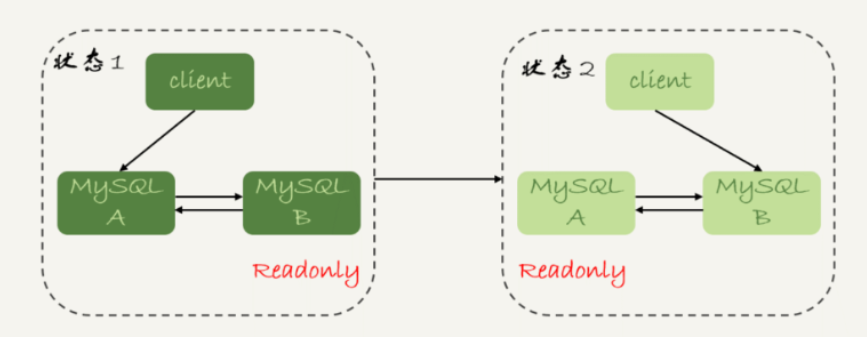

从状态1到状态2切换的详细过程是这样的：

1. 判断备库B现在的`seconds_behind_master`，如果小于某个值（比如5秒）继续下一步，否则持续重试这一步；
2. 把主库A改成只读状态，即把readonly设置为true；
3. 判断备库B的`seconds_behind_master`的值，直到这个值变成0为止；
4. 把备库B改成可读写状态，也就是把readonly 设置为false；
5. 把业务请求切到备库B。

这个切换流程，一般是由专门的HA系统来完成的。这个切换流程中是有不可用时间的，因为在步骤2之后，主库A和备库B都处于readonly状态，也就是说这时系统处于不可写状态，直到步骤5完成后才能恢复。

在这个不可用状态中，比较耗费时间的是步骤3，可能需要耗费好几秒的时间。这也是为什么需要在步骤1先做判断，确保`seconds_behind_master`的值足够小。

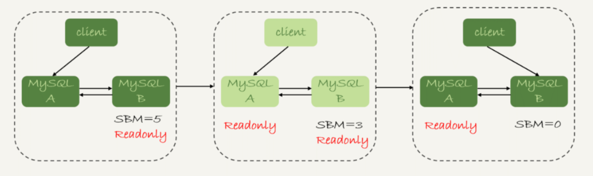


### 可用性优先策略

如果强行把可靠性优先策略的步骤4、5调整到最开始执行，即不等主备数据同步，直接把连接切到备库B，并且让备库B可以读写，那么系统几乎就没有不可用时间了。带来的问题是**可能出现数据不一致的情况**。

假设有表`t`如下，其主键`id`是自增的。

```
mysql> CREATE TABLE `t` (
  `id` int(11) unsigned NOT NULL AUTO_INCREMENT,
  `c` int(11) unsigned DEFAULT NULL,
  PRIMARY KEY (`id`)
) ENGINE=InnoDB;

mysql> insert into t(c) values(1),(2),(3);
```

这时在表`t`上执行两条插入语句的命令：

```
mysql> insert into t(c) values(4);
mysql> insert into t(c) values(5);
```

假设，现在主库上其他的数据表有大量的更新，导致主备延迟达到5秒。在插入一条`c=4`的语句后，发起了主备切换。

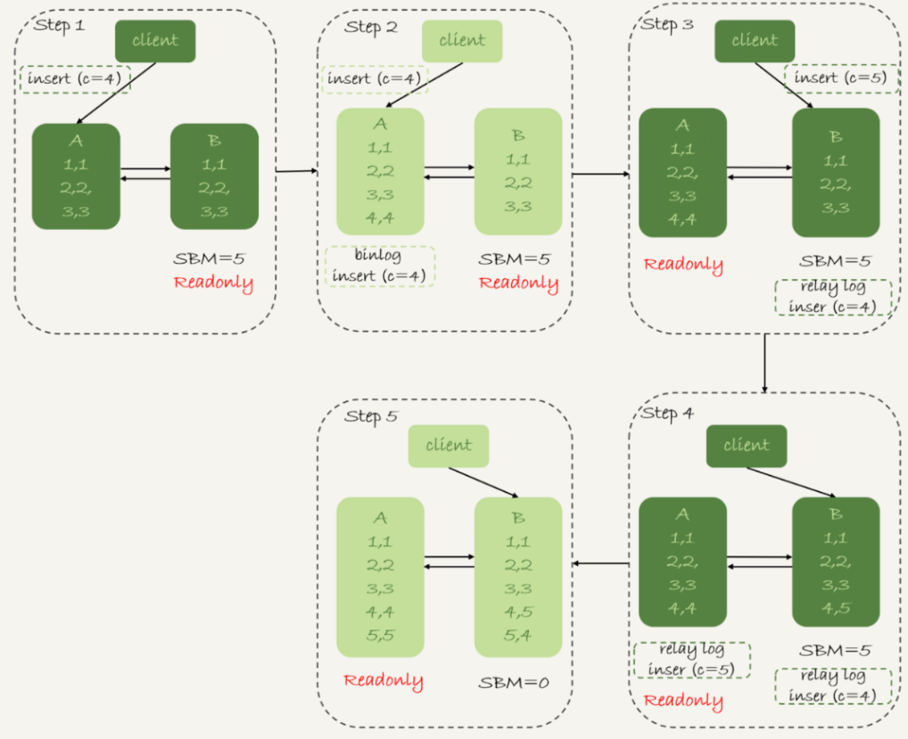

上图展示了**可用性优先策略，且binlog_format=mixed**时的切换流程和数据结果。

- 在step 2，主库A插入了`(4,4)`的数据行后，开始进行主备切换。
- 在step 3，由于主备延迟比较大，有5秒，所以备库B还没来得及应用“插入c=4”这个中转日志，就开始接收客户端“插入 c=5”的命令。
- 由于是自增主键，所以B插入的数据行是`(4, 5)`,并且把这个binlog发给主库A。
- 在step 5，备库B执行“插入c=4”这个中转日志，插入了一行数据`(5,4)`。而直接在备库B执行的“插入c=5”这个语句，传到主库A，就插入了一行新数据`(5,5)`。

这时候，主库A和备库B上出现了两行不一致的数据，这个数据不一致，就是由可用性优先流程导致的。

如果还是用**可用性优先策略，但设置binlog_format=row**，情况又会怎样呢？

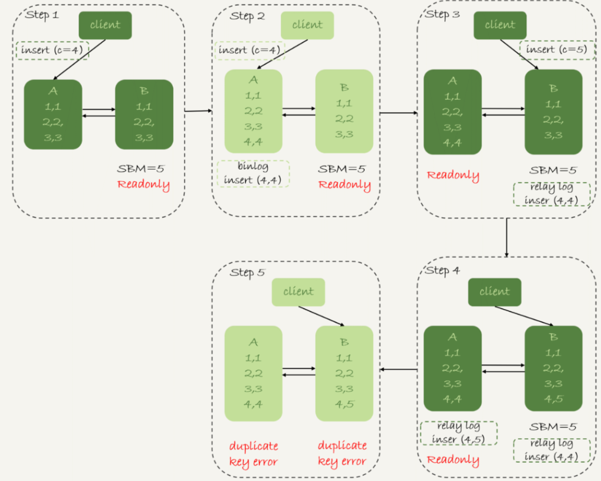

因为row格式在记录binlog的时候，会记录新插入的行的**所有字段值**，所以最后只会有一行不一致。而且，两边的主备同步的应用线程会报错duplicate key error并停止。这种情况下，备库B的`(4,5)`和主库A的`(4,4)`这两行数据，都不会被对方执行。

可以得到下面的结论：

1. **使用row格式的binlog时，数据不一致的问题更容易被发现**。而使用mixed或者statement格式的binlog时，数据很可能悄悄地就不一致了。如果过了很久才发现数据不一致的问题，很可能这时的数据不一致已经不可查，或者连带造成了更多的数据逻辑不一致。
2. 主备切换的可用性优先策略会导致数据不一致。因此，大多数情况下，建议使用**可靠性优先策略**。毕竟对数据服务来说的话，数据的可靠性一般还是要优于可用性的。

#### 优先使用可用性的场景

- 记录操作日志。这时候，如果数据不一致可以通过binlog来修补，而这个短暂的不一致也不会引发业务问题。
- 同时，业务系统依赖于这个日志写入逻辑，如果这个库不可写，会导致线上的业务操作无法执行。

这时候，就选择先强行切换，事后再补数据的策略。

当然，还有其他改进措施：让业务逻辑不要依赖于这类日志的写入。也就是说，日志写入这个逻辑模块应该可以降级，比如写到本地文件，或者写到另外一个临时库里面。


### 异常分析

假如一个备库的延迟监控的图像类似下图，是一个45°斜向上的线段，可能是什么原因导致呢？

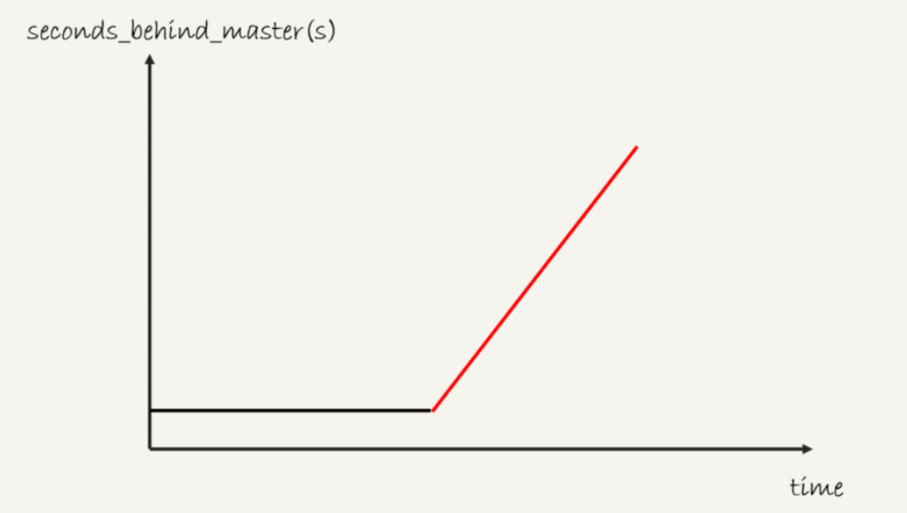

备库的同步在这段时间完全被堵住了，产生这种现象典型的场景主要包括两种：

- 一种是大事务（包括大表DDL、一个事务操作很多行）；

- 还有一种情况比较隐蔽，就是备库起了一个长事务，然后就不动了：

  ```
  begin; 
  select * from t limit 1;
  
  ```

  这时候主库对表`t`做了一个加字段操作，即使这个表很小，这个DDL在备库应用的时候也会被堵住。


## 备库并行复制

如果**备库执行日志的速度持续低于主库生成日志的速度**，那么主备延迟就有可能达到小时级别。而且对于一个压力持续比较高的主库来说，备库很可能永远都追不上主库的节奏。

对应的就是下图中的两个黑色箭头。一个箭头代表了客户端写入主库，另一箭头代表的是备库上sql_thread执行中转日志（relay log）。如果用箭头的粗细来代表并行度的话，第一个箭头要明显粗于第二个箭头。

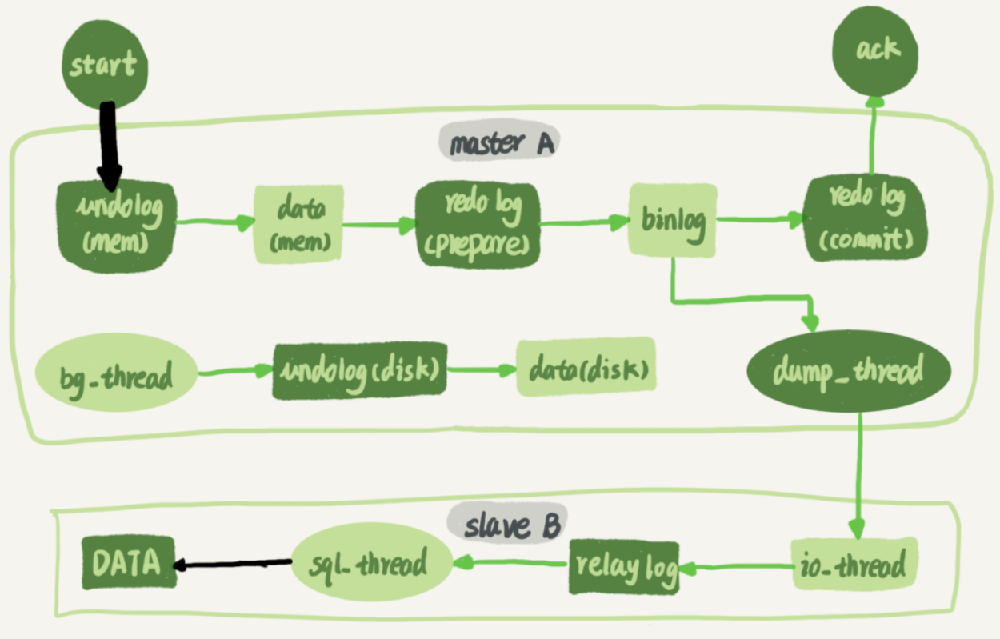

在主库上，影响并发度的原因就是各种锁了。由于InnoDB引擎支持行锁，除了所有并发事务都在更新同一行（热点行）这种极端场景外，它对业务并发度的支持还是很友好的。所以，在性能测试的时候会发现，并发压测32个线程就比单线程时，总体吞吐量高。

而日志在备库上的执行，就是图中备库上sql_thread更新数据(DATA)的逻辑。如果是用单线程的话，就会导致备库应用日志不够快，造成主备延迟。

> 在官方的5.6版本之前，MySQL只支持单线程复制，由此在主库并发高、TPS高时就会出现严重的主备延迟问题。

而多线程复制机制，就相当于把一个sql_thread拆分为多个线程，包括一个coordinator和多个worker线程，由coordinator读取中转日志和分发事务，由worker更新数据库。**worker线程的个数，由参数`slave_parallel_workers`决定**，对于32核物理机，可以设置为8~16之间，因为备库还有可能要提供读查询，不能把CPU都吃光了。

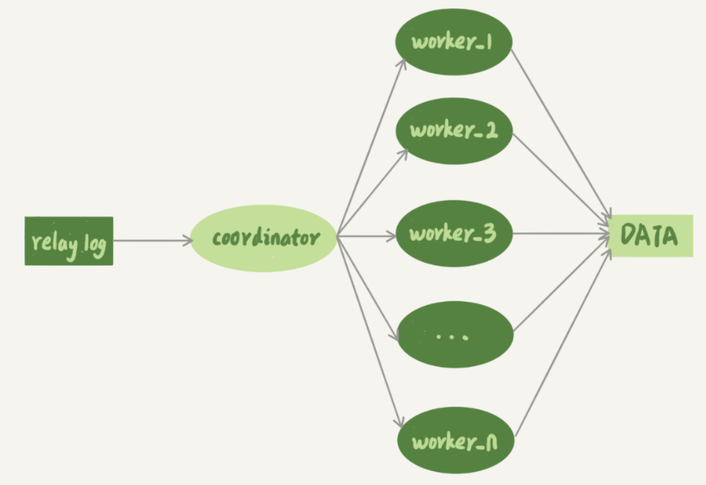

### 事务分发机制

事务不能按照轮询的方式分发给各个worker，因为事务被分发给worker以后，不同的worker就独立执行了。但是，由于CPU的调度策略，很可能第二个事务最终比第一个事务先执行。而如果这时候刚好这两个事务更新的是同一行，也就意味着，同一行上的两个事务，在主库和备库上的执行顺序相反，会导致主备不一致的问题。

同一个事务的多个更新语句，也不能分给不同的worker执行。假如一个事务更新了表t1和表t2中的各一行，如果这两条更新语句被分到不同worker的话，虽然最终的结果是主备一致的，但如果表t1执行完成的瞬间，备库上有一个查询，就会看到这个事务“更新了一半的结果”，破坏了事务逻辑的隔离性。

所以，coordinator在分发的时候，需要满足以下这两个基本要求：

1. 不能造成更新覆盖。这就要求**更新同一行的两个事务，必须被分发到同一个worker中**。
2. 同一个事务不能被拆开，必须放到同一个worker中。

#### 按表分发（非官方）

如果两个事务更新不同的表，它们就可以并行。因为数据是存储在表里的，所以按表分发，可以保证两个worker不会更新同一行。

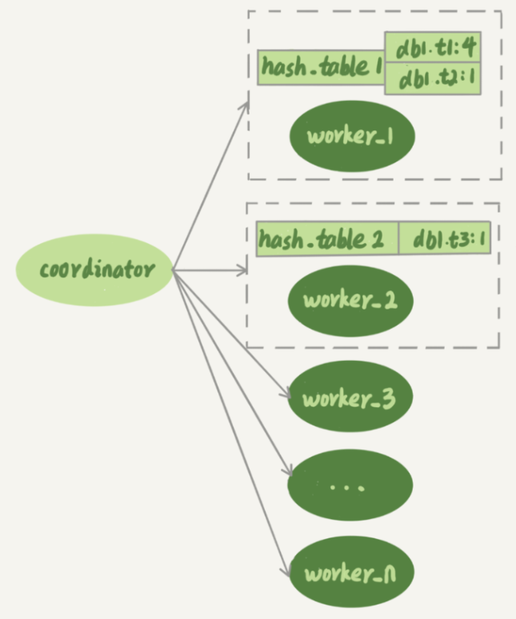

每个worker线程对应一个hash表，用于保存当前正在这个worker的“执行队列”里的事务所涉及的表。hash表的key是“库名.表名”，value是一个数字，表示队列中有多少个事务修改这个表。在有事务分配给worker时，事务里面涉及的表会被加到对应的hash表中。worker执行完成后，会去掉hash表中的这个表。

上图中，hash_table_1表示，现在worker_1的“待执行事务队列”里，有4个事务涉及到db1.t1表，有1个事务涉及到db2.t2表；hash_table_2表示，现在worker_2中有一个事务会更新到表t3的数据。

对于跨表的事务，需要把涉及到的所有表放在一起考虑的。假设在图中的情况下，coordinator从中转日志中读入一个新事务T，这个事务修改的行涉及到表t1和t3。

通过描述事务T的分配流程，介绍分配规则：

1. 由于事务T中涉及修改表t1，而worker_1队列中有事务在修改表t1，事务T和队列中的某个事务要修改同一个表的数据，即事务T和worker_1是冲突的。
2. 按照这个逻辑，顺序判断事务T和每个worker队列的冲突关系，会发现事务T跟worker_2也冲突。
3. 事务T跟多于一个worker冲突，coordinator线程就进入等待。
4. 每个worker继续执行，同时修改hash_table。假设hash_table_2里面涉及到修改表t3的事务先执行完成，就会从hash_table_2中把db1.t3这一项去掉。
5. 这样coordinator会发现跟事务T冲突的worker只有worker_1了，因此就把它分配给worker_1。
6. coordinator继续读下一个中转日志，继续分配事务。

也就是说，每个事务在分发的时候，跟所有worker的冲突关系包括以下三种情况：

1. 如果跟所有worker都不冲突，coordinator线程就会把这个事务分配给最空闲的woker;
2. 如果跟多于一个worker冲突，coordinator线程就进入等待状态，直到和这个事务存在冲突关系的worker只剩下1个；
3. 如果只跟一个worker冲突，coordinator线程就会把这个事务分配给这个存在冲突关系的worker。

这个按表分发的方案，在多个表负载均匀的场景里应用效果很好。但是，如果碰到热点表，比如所有的更新事务都会涉及到某一个表的时候，所有事务都会被分配到同一个worker中，就变成单线程复制了。

#### 按行分发（非官方）

要解决热点表的并行复制问题，就需要一个按行并行复制的方案。如果两个事务没有更新相同的行，它们在备库上可以并行执行。显然，这个模式要求binlog格式必须是row。

判断一个事务T和worker是否冲突，看的是它们是不是“修改同一行”。

按行复制和按表复制的数据结构差不多，也是为每个worker，分配一个hash表。只是要实现按行分发，这时候的key，变成了“库名+表名+唯一键的值”。不过，仅靠主键id还是不够的，还需要唯一索引的场景：

```
mysql> CREATE TABLE `t1` (
  `id` int(11) NOT NULL,
  `a` int(11) DEFAULT NULL,
  `b` int(11) DEFAULT NULL,
  PRIMARY KEY (`id`),
  UNIQUE KEY `a` (`a`)
) ENGINE=InnoDB;

mysql> insert into t1 values(1,1,1),(2,2,2),(3,3,3),(4,4,4),(5,5,5);
```

表t1中除了主键，还有唯一索引a，在主库执行下面两个事务。


这两个事务要更新的行的主键值不同，但是如果它们被分到不同的worker，就有可能session B的语句先执行。这时候`id=1`的行的a的值还是1，就会报唯一键冲突。

因此，**基于行的策略，事务hash表中还需要考虑唯一键**，即还有“库名+表名+唯一索引a的名字+a的值”的key。

在表t1上执行`update t1 set a=1 where id=2`语句，在binlog里面记录了整行的数据修改前和修改后各个字段的值。

因此，coordinator在解析这个语句的binlog的时候，这个事务的hash表就有三个项:

1. `key=hash_func(db1+t1+“PRIMARY”+2),` value=2; 这里value=2是因为修改前后的行id值不变，出现了两次。
2. `key=hash_func(db1+t1+“a”+2), value=1`，表示会影响到这个表a=2的行。
3. `key=hash_func(db1+t1+“a”+1), value=1`，表示会影响到这个表a=1的行。

**相比于按表并行分发策略，按行并行策略在决定线程分发的时候，需要消耗更多的计算资源。**这两个方案其实都有一些约束条件：

1. 要能够从binlog里面解析出表名、主键值和唯一索引的值。即主库的binlog格式必须是row；
2. 表必须有主键；
3. 不能有外键。表上如果有外键，级联更新的行不会记录在binlog中，这样冲突检测就不准确。

对比按表分发和按行分发这两个方案的话，按行分发策略的并行度更高。不过，如果是要操作很多行的大事务的话，按行分发的策略有两个问题：

1. 耗费内存。比如一个语句要删除100万行数据，这时候hash表就要记录100万个项。
2. 耗费CPU。解析binlog，然后计算hash值，对于大事务，这个成本还是很高的。

可以设置一个阈值，单个事务如果超过设置的行数阈值（比如，如果单个事务更新的行数超过10万行），就暂时退化为单线程模式，退化过程的逻辑大概是这样的：

1. coordinator暂时先hold住这个事务；
2. 等待所有worker都执行完成，变成空队列；
3. coordinator直接执行这个事务；
4. 恢复并行模式。


#### 按库分发

官方MySQL5.6版本，支持了按库并行的并行复制。用于决定分发策略的hash表里，key就是数据库名。

这个策略的并行效果，取决于压力模型。如果在主库上有多个DB，并且各个DB的压力均衡，使用这个策略的效果会很好。相比于按表和按行分发，这个策略有两个优势：

1. 构造hash值的时候很快，只需要库名；而且一个实例上DB数也不会很多，不会出现需要构造100万个项这种情况。
2. 不要求binlog的格式。因为statement格式的binlog也可以很容易拿到库名。

但是，如果主库上的表都放在同一个DB里面，这个策略就没有效果了；或者不同DB的热点不同，比如一个是业务逻辑库，一个是系统配置库，那也起不到并行的效果。

#### MariaDB的并行复制策略

MariaDB的并行复制策略利用了组提交的特性：

1. 能够在同一组里提交的事务，一定不会修改同一行；
2. 主库上可以并行执行的事务，备库上也一定是可以并行执行的。

具体实现如下：

1. 在一组里面一起提交的事务，有一个相同的`commit_id`，下一组就是`commit_id+1`；
2. `commit_id`直接写到binlog里面；
3. 传到备库应用的时候，相同`commit_id`的事务分发到多个worker执行；
4. 这一组全部执行完成后，coordinator再去取下一批。

不过，这个策略有一个问题，它并没有实现“真正的模拟主库并发度”这个目标：在主库上，一组事务在commit的时候，下一组事务是同时处于“执行中”状态的。

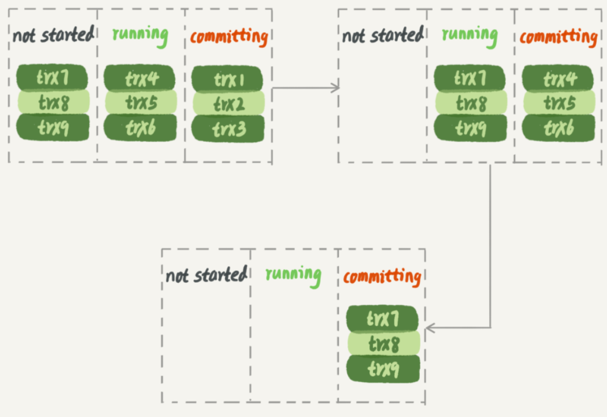

上图假设三组事务在主库的执行情况，在trx1、trx2和trx3提交的时候，trx4、trx5和trx6是在执行的。这样，在第一组事务提交完成的时候，下一组事务很快就会进入commit状态。

而按照MariaDB的并行复制策略，在备库上执行的时候，要等第一组事务完全执行完成后，第二组事务才能开始执行，这样系统的吞吐量就不够。

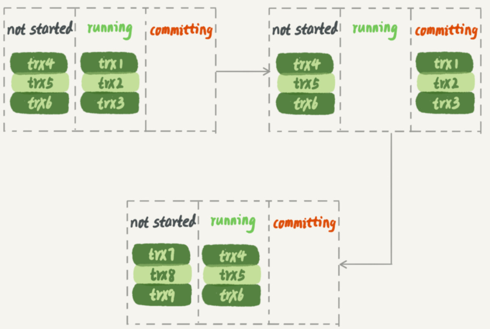

另外，这个方案很容易被大事务拖后腿。假设trx2是一个超大事务，那么在备库应用的时候，trx1和trx3执行完成后，就只能等trx2完全执行完成，下一组才能开始执行。这段时间，只有一个worker线程在工作，是对资源的浪费。

#### MySQL 5.7的并行复制策略

在MySQL5.7中，由参数`slave-parallel-type`来控制并行复制策略：

1. 配置为`DATABASE`，表示使用MySQL 5.6版本的按库并行策略；
2. 配置为 `LOGICAL_CLOCK`，表示的就是类似MariaDB的策略。不过，MySQL 5.7这个策略，针对并行度做了优化。

同时处于“执行状态”的所有事务，可能是不可以并行的。因为，这里面可能有由于锁冲突而处于锁等待状态的事务。如果这些事务在备库上被分配到不同的worker，就会出现备库跟主库不一致的情况。

而MariaDB策略的核心，是**“所有处于commit”状态的事务可以并行**。事务处于commit状态，表示已经通过了锁冲突的检验了。

在两阶段提交，只要能够到达redo log prepare阶段，就表示事务已经通过锁冲突的检验了。因此，MySQL 5.7并行复制策略的思想是：

1. 同时处于prepare状态的事务，在备库执行时是可以并行的；
2. 处于prepare状态的事务，与处于commit状态的事务之间，在备库执行时也是可以并行的。

> 在binlog组提交中，有这两个参数
>
> 1. `binlog_group_commit_sync_delay`参数，表示延迟多少微秒后才调用fsync;
> 2. `binlog_group_commit_sync_no_delay_count`参数，表示累积多少次以后才调用fsync。
>
> 这两个参数是用于故意拉长binlog从`write`到`fsync`的时间，以此减少binlog的写盘次数。在MySQL 5.7的并行复制策略里，它们可以用来制造更多的“同时处于prepare阶段的事务”。这样就增加了备库复制的并行度。
>
> 即这两个参数，既可以“故意”让主库提交得慢些，又可以让备库执行得快些。在MySQL 5.7处理备库延迟的时候，可以考虑调整这两个参数值，来达到提升备库复制并发度的目的。

> 如果从库也开启binlog，有可能主从的binlog event的写入顺序是不一样的。

#### MySQL 5.7.22的并行复制策略

在这个版本中，新增加了一个基于WRITESET的并行复制策略，通过参数`binlog-transaction-dependency-tracking`控制是否启用这个新策略。这个参数的可选值有以下三种：

1. `COMMIT_ORDER`：根据同时进入prepare和commit来判断是否可以并行的策略。
2. `WRITESET`：表示的是对于事务涉及更新的每一行，计算出这一行的hash值，组成集合writeset。如果两个事务没有操作相同的行，也就是说它们的writeset没有交集，就可以并行。
3. `WRITESET_SESSION`：是在WRITESET的基础上多了一个约束，即在主库上同一个线程先后执行的两个事务，在备库执行的时候，要保证相同的先后顺序。

为了唯一标识，这个hash值是通过“库名+表名+索引名+值”计算出来的。如果一个表上除了有主键索引外，还有其他唯一索引，那么对于每个唯一索引，insert语句对应的writeset就要多增加一个hash值。

1. **writeset是在主库生成后直接写入到binlog里面的**，这样在备库执行的时候，不需要解析binlog内容（event里的行数据），节省了很多计算量；
2. 不需要把整个事务的binlog都扫一遍才能决定分发到哪个worker，更省内存；
3. 由于备库的分发策略不依赖于binlog内容，所以binlog是statement格式也是可以的。

> 对于“表上没主键”和“外键约束”的场景，WRITESET策略也是没法并行的，也会暂时退化为单线程模型。

假设一个MySQL 5.7.22版本的主库，单线程插入了很多数据，过了3个小时后，要给这个主库搭建一个相同版本的备库，这时候，为了更快地让备库追上主库，要开并行复制。在`binlog-transaction-dependency-tracking`参数的三个取值中，应该选择哪一个呢？

- `COMMIT_ORDER`：没有同时到达redo log的prepare 状态的事务，备库退化为单线程
- `WRITESET`：通过对比更新的事务是否存在冲突的行，可以并发执行
- `WRITE_SESSION`：在WRITESET的基础上增加了线程的约束，则退化为单线程


