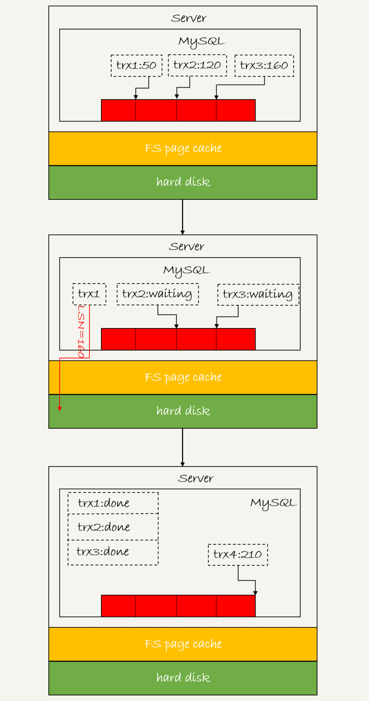
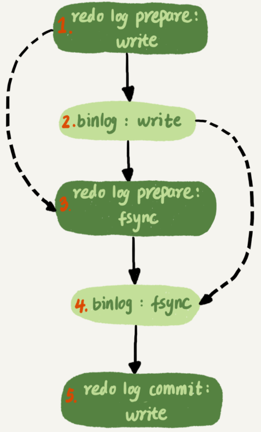

## 日志更新到磁盘

通常说的MySQL“双1”配置，指的就是`sync_binlog`和`innodb_flush_log_at_trx_commit`都设置成 1。也就是说，一个事务完整提交前，需要等待两次刷盘，一次是redo log（prepare 阶段），一次是binlog。

那么，如果从MySQL看到的TPS是每秒两万的话，每秒就会写四万次磁盘。但是磁盘能力也就两万左右，怎么能实现两万的TPS？

## 日志逻辑序列号

log sequence number，LSN是单调递增的，用来对应redo log的一个个写入点。每次写入长度为length的redo log， LSN的值就会加上length。

LSN也会写到InnoDB的数据页中，来确保数据页不会被多次执行重复的redo log。

## 组提交

下图是三个并发事务`(trx1, trx2, trx3)`在prepare 阶段，都写完redo log buffer，持久化到磁盘的过程，对应的LSN分别是50、120 和160。

1. trx1是第一个到达的，会被选为这组的 leader；
2. 等trx1要开始写盘的时候，这个组里面已经有了三个事务，这时候LSN也变成了160；
3. trx1去写盘的时候，带的就是`LSN=160`，因此等trx1返回时，所有LSN小于等于160的redo log，都已经被持久化到磁盘；
4. 这时候trx2和trx3就可以直接返回了。

一次组提交里面，组员越多，节约磁盘IOPS的效果越好。但如果只有单线程压测，那就只能老老实实地一个事务对应一次持久化操作了。

在并发更新场景下，第一个事务写完redo log buffer以后，接下来这个`fsync`越晚调用，组员可能越多，节约IOPS的效果就越好。

为了让一次`fsync`带的组员更多，MySQL有一个很有趣的优化：拖时间。

两阶段提交中，”写binlog“其实是分成两步的：

1. 先把binlog从binlog cache中`write`到磁盘上的binlog文件；
2. 调用fsync持久化。

MySQL为了让组提交的效果更好，把redo log做`fsync`的时间拖到了步骤1之后：

这么一来，binlog也可以组提交了。在执行第4步把binlog `fsync`到磁盘时，如果有多个事务的binlog已经写完了，也是一起持久化的，这样也可以减少IOPS的消耗。

通常情况下第3步执行得会很快，所以binlog的`write`和`fsync`间的间隔时间短，导致能集合到一起持久化的binlog比较少，因此binlog的组提交的效果通常不如redo log的效果那么好。

如果想提升binlog组提交的效果，可以通过设置 `binlog_group_commit_sync_delay`和 `binlog_group_commit_sync_no_delay_count`来实现。

1. `binlog_group_commit_sync_delay`：延迟多少微秒后才调用`fsync`
2. `binlog_group_commit_sync_no_delay_count`：累积多少次以后才调用`fsync`

这两个条件是或的关系，只要有一个满足条件就会调用`fsync`。所以当`binlog_group_commit_sync_delay`设置为0的时候，`binlog_group_commit_sync_no_delay_count`也无效了。

> WAL机制主要得益于两个方面：
>
> 1. redo log 和 binlog都是**顺序写**，磁盘的顺序写比随机写速度要快；
> 2. 组提交机制，可以大幅度降低磁盘的IOPS消耗。

**如果MySQL出现了性能瓶颈，而且瓶颈在IO上，可以考虑下面的方法：**

- 设置 `binlog_group_commit_sync_delay`和 `binlog_group_commit_sync_no_delay_count`参数，减少binlog的写盘次数。这个方法是基于“额外的故意等待”来实现的，因此可能会增加语句的响应时间，但没有丢失数据的风险。
- 将`sync_binlog`设置为大于1的值（比较常见是100~1000）。这样做的风险是，主机掉电时会丢binlog日志。
- 将`innodb_flush_log_at_trx_commit`设置为2。redo log写到文件系统的page cache的速度也是很快的，将这个参数设置成2跟设置成0其实性能差不多。这样做的风险是，主机掉电的时候会丢数据。

## 常见问题

Q：执行一个`update`语句以后，再去执行`hexdump`命令直接查看ibd文件内容，为什么没有看到数据有改变呢？

A：可能是因为WAL机制的原因。`update`语句执行完成后，InnoDB只保证写完了redo log、内存，可能还没来得及将数据写到磁盘。

