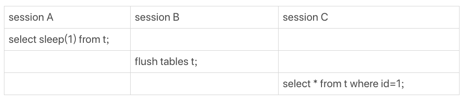

# 查询变慢的原因

查询慢，有可能是因为需要返回大量数据，但有些情况下，只查一行也会执行得特别慢。

> 如果MySQL数据库本身就有很大的压力，导致数据库服务器CPU占用率很高或ioutil（IO利用率）很高，这种情况下所有语句的执行都有可能变慢，不属于本文的讨论范围。

构建一个有10万行数据的表：

```text
mysql> CREATE TABLE `t` (
  `id` int(11) NOT NULL,
  `c` int(11) DEFAULT NULL,
  PRIMARY KEY (`id`)
) ENGINE=InnoDB;

mysql> delimiter ;;
create procedure idata()
begin
  declare i int;
  set i=1;
  while(i<=100000)do
    insert into t values(i,i);
    set i=i+1;
  end while;
end;;
delimiter ;

mysql> call idata();
```

## 查询长时间不返回

### 等MDL锁

执行下面的查询语句：

```text
mysql> select * from t where id=1;
```

结果查询长时间不返回，一般遇到这种情况，大概率是这个表被锁住了。这时候，可以执行`show processlist`命令，看看当前语句的状态。针对每种状态，分析产生的原因、如何处理。


出现**这个状态表示的是，现在有一个线程正在表t上请求或者持有MDL写锁，把select语句堵住了。**


session A 通过`lock table`命令持有表t的MDL写锁，而session B的查询需要获取MDL读锁。所以，session B进入等待状态。

这类问题的处理方式，就是**找到谁持有MDL写锁，然后把它kill掉**。

但是，在`show processlist`的结果中，session A的Command列是“Sleep”，导致查找起来很不方便。不过有了`performance_schema`和`sys`系统库以后，就方便多了。

> MySQL启动时需要设置`performance_schema=on`，相比于设置为off会有10%左右的性能损失。
>
> 如果返回empty set，还需要执行下面这句：
>
> ```text
> mysql> UPDATE performance_schema.setup_instruments SET ENABLED = 'YES' WHERE NAME ='wait/lock/metadata/sql/mdl';
> ```

```text
mysql> select blocking_pid from sys.schema_table_lock_waits;
+--------------+
| blocking_pid |
+--------------+
|            5 |
+--------------+
1 row in set (0.00 sec)
```

这时候只要执行`kill 5;`将该连接断开即可，执行完查询语句马上就返回了，而连接5再执行任意命令时会报`Lost connection to MySQL server during query`错。


### 等flush

同样执行相同的查询语句，同样被堵住了。

```text
mysql> select * from t where id=1;
```

首先用`show processlist`查看这个语句的状态，这次是`Waiting for table flush`。


这个状态表示的是，现在有一个线程正要对表`t`做`flush`操作。MySQL里面对表做flush操作的用法，一般有以下两个：

```text
mysql> flush tables t with read lock; # 关闭表t
mysql> flush tables with read lock; # 关闭MySQL里所有打开的表
```

>  - **FLUSH TABLES**
>   关闭所有的表，包括正在使用的表，并且会flush query cache。如果有正处于活动状态的` LOCK TABLES ... READ `命令，则不允许 `FLUSH TABLES` 命令
>  - **FLUSH TABLES tbl_name [, tbl_name] ...**
>   只FLUSH 指定表
>  - **FLUSH TABLES WITH READ LOCK**
>   关闭所有的表，并给所有数据库的所有表加上一个global read lock。这对于backup操作来说很有用，加锁之后，可以防止应用修改数据库。这个是全局级别的锁，而非表锁。
>  - **FLUSH TABLES tbl_name [, tbl_name] ... WITH READ LOCK**
>   同上，但只针对部分表
>  - **FLUSH TABLES tbl_name [, tbl_name] ... FOR EXPORT**
>   只针对 InnoDB 表，可以确保对表的修改被刷新到磁盘上，MySQL可以通过直接拷贝底层文件的方式来复制表

但是正常情况下这两个语句执行起来都很快，除非它们也被别的线程堵住了。



在session A中，故意每行都调用一次`sleep(1)`，这样这个语句默认要执行10万秒，在这期间表`t`一直是被session A“打开”着。然后，session B的`flush tables t`命令再要去关闭表`t`，就需要等session A的查询结束。这样，session C要再次查询的话，就会被`flush`命令堵住了。

因此，只要执行`kill 9;`就可以了。


### 等行锁

```text
mysql> select * from t where id=1 lock in share mode;
```

这条语句访问`id=1`的记录时要加读锁，如果这时候已经有一个事务在这行记录上持有一个写锁，这个`select`语句就会被堵住。


这时候执行`show processlist`：


因为session A启动了事务，占有这一行的行锁，还不提交，导致session B被堵住。这时候的**关键是找出哪个线程占用这个写锁**。可以通过`sys.innodb_lock_waits`表查到。

```text
mysql> select * from sys.innodb_lock_waits\G
*************************** 1. row ***************************
                wait_started: 2020-04-21 20:09:20
                    wait_age: 00:00:02
               wait_age_secs: 2
                locked_table: `test`.`t`
                locked_index: PRIMARY
                 locked_type: RECORD
              waiting_trx_id: 283522825084416
         waiting_trx_started: 2020-04-21 20:09:20
             waiting_trx_age: 00:00:02
     waiting_trx_rows_locked: 1
   waiting_trx_rows_modified: 0
                 waiting_pid: 10
               waiting_query: select * from t where id=1 lock in share mode
             waiting_lock_id: 283522825084416:63:4:2
           waiting_lock_mode: S
             blocking_trx_id: 412679
                blocking_pid: 7
              blocking_query: NULL
            blocking_lock_id: 412679:63:4:2
          blocking_lock_mode: X
        blocking_trx_started: 2020-04-21 20:04:57
            blocking_trx_age: 00:04:25
    blocking_trx_rows_locked: 1
  blocking_trx_rows_modified: 1
     sql_kill_blocking_query: KILL QUERY 7
sql_kill_blocking_connection: KILL 7
1 row in set, 3 warnings (0.00 sec)
```

`blocking_pid`是7号线程，`blocking_lock_mode`当前占有的是排他锁\(X\)，解决方案是`KILL 7`或`KILL QUERY 7`。

不过，在这里`KILL QUERY 7`并没有用，这个命令表示停止7号线程当前正在执行的语句，而占有行锁的`update`语句已经是之前执行完成了的，现在执行`KILL QUERY 7`，无法让这个事务去掉`id=1`上的行锁。

`KILL 7`才有效，也就是说直接断开这个连接。这里隐含的一个逻辑就是，连接被断开的时候，会自动回滚这个连接里面正在执行的线程，也就释放了`id=1`上的行锁。


## 查询慢

```text
mysql> select * from t where c=50000 limit 1;
```

由于字段`c`上没有索引，所以这条语句走全表扫描，慢查询日志如下（执行前先把`long_query_time`设为0）：

```text
# Query_time: 0.017006  Lock_time: 0.000087 Rows_sent: 1  Rows_examined: 50000
SET timestamp=1587471378;
select * from t where c=50000 limit 1;
```

`Rows_examined`显示扫描了50000行。虽然17毫秒可能不是很慢，但**坏查询不一定是慢查询**。这个表目前只有10万行记录，数据量大起来的话，执行时间就线性涨上去了。

但是，下面的这个简单的查询语句，却执行很慢：

```text
mysql> select * from t where id=1;
```

慢查询日志：

```text
# Query_time: 0.807006  Lock_time: 0.000287 Rows_sent: 1  Rows_examined: 1
SET timestamp=1587971378;
select * from t where id=1;
```

但如果执行下面的查询语句，`lock in share mode`是指**当前读**。

```text
mysql> select * from t where id=1 lock in share mode;
```

慢查询日志：

```text
# Query_time: 0.000326  Lock_time: 0.000137 Rows_sent: 1  Rows_examined: 1
SET timestamp=1597971378;
select * from t where id=1 lock in share mode;
```

这个语句要加锁，但是执行得却更快。再结合两个语句的结果看

```text
mysql> select * from t where id=1;
+----+------+
| id | c    |
+----+------+
|  1 |    1 |
+----+------+

mysql> select * from t where id=1 lock in share mode;
+----+---------+
| id | c       |
+----+---------+
|  1 | 1000001 |
+----+---------+
```


由于session A启动的事务是一致性读，且视图是在事务启动时创建的，之后session B才开始执行`update`语句。session B执行完100万次`update`语句后，`id=1`这一行状态如下：


\(undo log里记录的其实是“把2改成1”，“把3改成2”这样的操作逻辑，画成减1的目的是方便看图。\)

生成了100万个回滚日志\(undo log\)，导致`select * from t where id=1`这个一致性读语句，需要从1000001开始，依次执行undo log，执行了100万次以后，才将1这个结果返回。

